# ENECloud EMS OpenAPI 説明書 v2

**バージョン**: 2.2
**ステータス**: **正式版（Released）**
**最終更新日**: 2026年7月25日
**作成者**: 株式会社ナピル ソリューション事業部 EMS開発担当
**ライセンス**: [CC BY 4.0](https://creativecommons.org/licenses/by/4.0/) — 出典表示のもと、引用・再配布・本仕様に準拠した実装が可能です。
**OpenAPI 定義**: <a href="../openapi/ems-openapi-v2.yaml" download="ems-openapi-v2.yaml"><code>ems-openapi-v2.yaml</code></a>（ダウンロード）

> ### 本書の位置づけ
>
> 本書は **EMS OpenAPI v2**（パスプレフィックス `/v2/ems/{id}/`）の仕様であり、**新規開発の推奨版**です。
> 1 サイト = 1 連系点単位の制御・計測 API です。複数 EMS を束ねる場合は [VPP API v1](vpp-api-v1.md) を併用してください（**v2.2 ↔ VPP v1.4** の組み合わせで運用）。
>
> 旧版の [EMS OpenAPI v1](ems-openapi-v1.md) は既存互換のために維持されています。

---

## 目次

1. [概要](#1-概要)
2. [基本情報](#2-基本情報)
3. [リソース構成とサイト分類](#3-リソース構成とサイト分類)
4. [符号規則・関係式](#4-符号規則関係式)
5. [データ形式・レートリミット](#5-データ形式レートリミット)
6. [API 一覧](#6-api-一覧)
7. [市場応札 SKU 一覧](#7-市場応札-sku-一覧)
8. [パラメータ範囲仕様](#8-パラメータ範囲仕様)
9. [API 仕様](#9-api-仕様)
   - 9.1 [認証](#91-認証-authrefresh)
   - 9.2 [リアルタイム状態取得 `/status` `/status/details`](#92-リアルタイム状態取得-status-statusdetails)
   - 9.3 [仕様情報 `/specifications`](#93-仕様情報-specifications)
   - 9.4 [有効電力制御 `/control/active_power`](#94-有効電力制御-controlactive_power)
   - 9.5 [有効電力スケジュール管理 `/control/active_power/schedules`](#95-有効電力スケジュール管理-controlactive_powerschedules)
   - 9.6 [ベースライン管理 `/baseline`](#96-ベースライン管理-baseline)
   - 9.7 [瞬時電力履歴 `/measurements/active_power`](#97-瞬時電力履歴-measurementsactive_power)
   - 9.8 [電力量履歴 `/measurements/energy`](#98-電力量履歴-measurementsenergy)
   - 9.9 [運転計画 `/serviceplan`](#99-運転計画-serviceplan)
10. [市場別利用フロー](#10-市場別利用フロー)
    - 10.0 [アクター（主体）定義](#100-アクター主体定義)
    - 10.1 [市場別フロー早見表](#101-市場別フロー早見表)
    - 10.2 [JEPX スポット市場（jepx-da）](#102-jepx-スポット市場jepx-da前日約定)
    - 10.3 [JEPX 時間前市場（jepx-ttv）](#103-jepx-時間前市場jepx-ttv)
    - 10.4 [一次調整力（fcr）](#104-一次調整力fcr)
    - 10.5 [二次〜三次調整力（s-frr / frr / rr / rr-fit）](#105-二次三次調整力s-frr--frr--rr--rr-fit)
    - 10.6 [ネガワット・スポット（DR）](#106-ネガワットスポット市場negawatt-spotdr)
    - 10.7 [非市場応札の運用指令（sku: null）](#107-非市場応札の運用指令sku-null)
    - 10.8 [SKU 切替を伴う複合運用](#108-sku-切替を伴う複合運用)
11. [エラーコード体系](#11-エラーコード体系)
12. [変更履歴](#12-変更履歴)
13. [付録 A: 移行ガイド](#付録-a-移行ガイド)
14. [サンプル集（別ファイル）](ems-openapi-v2-samples.md)

---

## 1. 概要

ENECloud EMS OpenAPI v2 は、複数種別のエネルギーリソース（蓄電池・発電所・需要家、およびそれらを組み合わせたサイト）を統一インターフェースで操作するための REST API 仕様です。

> **v1.x からの主要変更点**: 後段 [§12 変更履歴](#12-変更履歴) を参照。

### スコープ

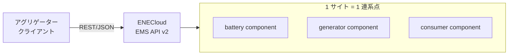
```mermaid
graph LR
    AGG[アグリゲーター<br/>クライアント]
    API[ENECloud<br/>EMS API v2]

    subgraph SITE[1 サイト = 1 連系点]
        BAT[battery component]
        GEN[generator component]
        CON[consumer component]
    end

    AGG -->|REST/JSON| API
    API --> SITE
```

> 各サイトは `components[]` 配列で 1 つ以上の component を保持する（[§3.1](#31-統一リソースモデルcomponents-ベース) 参照）。

> 本仕様は **系統連系点 (PCC) を計測基準** とする設計です。系統連系がない完全オフグリッドサイト（マイクログリッド独立運用、移動式蓄電池の屋外単独運用等）は対象外ですが、系統連系契約済みかつ一時的に解列している状態の「孤立島運転型サイト」（[§3.3](#33-サイトの典型構成) 参照）は登録可能です。

### アグリゲーター向け推奨パターン

> **VPP API を唯一のインターフェースとして使用することを推奨**。EMS が 1 台のみの場合も VPP に 1 メンバーとして登録することで、将来の複数 EMS 化（蓄電所追加・需要家追加等）に対応可能。本 EMS API は **EMS 運用担当が直接保守・診断する場合のみ** 使用想定。詳細は [`vpp-api-v1.md`](vpp-api-v1.md) を参照。

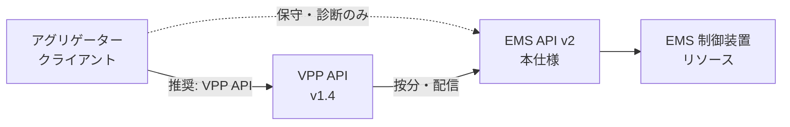
```mermaid
graph LR
    AGG[アグリゲーター<br/>クライアント]
    VPP[VPP API<br/>v1.4]
    EMS[EMS API v2<br/>本仕様]
    DEV[EMS 制御装置<br/>リソース]

    AGG -->|推奨: VPP API| VPP
    AGG -.保守・診断のみ.-> EMS
    VPP -->|按分・配信| EMS
    EMS --> DEV
```

> リソース（EMS 制御装置）側は **EMS API の形式しか意識しない**（VPP の存在は透過的）。VPP API は本 EMS API と**同じ JSON 構造・同じフィールド名**を採用し、差分は members 関連フィールド（`vpp_id` / `members[]` / `member_baselines[]` / `dispatched_members[]` / `uncovered_kw`）の有無のみ。VPP top-level の電力値（`current_kw` / `baseline_kw` 等）は配下メンバーの稼働中合算、メンバー要素は EMS top-level と同形式（[vpp-api-v1.md §用語対応表](vpp-api-v1.md#14-用語フィールド対応表vpp-api--物理-ems-api) 参照）。

---

## 2. 基本情報

### Base URL

> **Base URL について**: 本番／テスト環境のホスト名は公開仕様には含めません。ご契約時に個別提供します。
> 以下ではパスプレフィックス以降を記述します。

| 区分 | ホスト | パス |
|------|--------|------|
| 通常API | `{APIホスト}` | `/v2/ems/{id}/` |
| 認証API | **`{認証ホスト}`（別ホスト）** | `/auth/refresh` |

`{id}` には EMS ID（16バイトUUID = 32文字hex）を指定します。

**例**: `/status` を呼び出す場合 → `{APIホスト}/v2/ems/{id}/status`

> ⚠️ **`/auth/refresh` のみ URL 体系が異なります**: `/v2/ems/{id}/` プレフィックスを**使用せず**、かつ **`{APIホスト}` とは別の `{認証ホスト}`** で提供されます（`{認証ホスト}/auth/refresh`）。`{APIホスト}/v2/ems/{id}/auth/refresh` ではありません。
> 本書ではこの 2 つのホストを `{APIホスト}` / `{認証ホスト}` と表記します（[§9.1 認証](#91-認証-authrefresh) でも同じ表記を使用）。いずれもご契約時に個別提供します。
> OpenAPI 定義では、`{APIホスト}` をトップレベルの `servers`（`baseUrl`）、`{認証ホスト}` を `/auth/refresh` オペレーション側の `servers`（`authBaseUrl`）として表現しています。

### 認証方式

2 種類のトークンで認証します。

| トークン | 用途 | 使用 API | 有効期限 |
|---------|------|---------|---------|
| **Refresh Token** | Access Token 取得用 | `/auth/refresh` のみ | 原則無期限。ただし以下のいずれかで無効化される: ①EMS運用担当による明示的な無効化、②**最終使用時刻から 90 日間 `/auth/refresh` が呼ばれなかった場合の自動無効化** |
| **Access Token** | API 呼び出し用 | `/auth/refresh` 以外の全 API | 30 日 |

認証ヘッダー形式: `Authorization: Bearer {token}`

1 つのトークンセットは 1 つの EMS ID に紐付きます。複数 EMS を操作する場合は EMS ID ごとに取得・管理してください。

#### Refresh Token のライフサイクル管理

| 項目 | 仕様 |
|------|------|
| **最終使用時刻** | サーバー側で各 Refresh Token の `last_used_at`（最後に `/auth/refresh` が成功した時刻）を記録 |
| **自動無効化条件** | `now - last_used_at >= 90 日` で自動無効化（次回使用時 `498 Unauthorized` を返却）|
| **EMS運用担当による明示的無効化** | 紛失・流出疑いの申告等で EMS運用担当が即時無効化可能 |
| **無効化時の通知** | EMS運用担当の登録メールアドレス宛に通知（Webhook 通知は将来対応予定）|
| **再発行** | 無効化後の再発行は EMS運用担当への申請（オンボーディング時と同じフロー）|

> **クライアント実装ガイド**: 30 日有効の Access Token を更新する都度 `/auth/refresh` が呼ばれるため、通常運用では Refresh Token は 30 日以内に必ず使用される。90 日間の未使用は「クライアントシステムが長期停止していた状態」を示唆するため、**復帰時には EMS運用担当への確認・必要に応じて再発行依頼**を推奨。

### 認証フロー

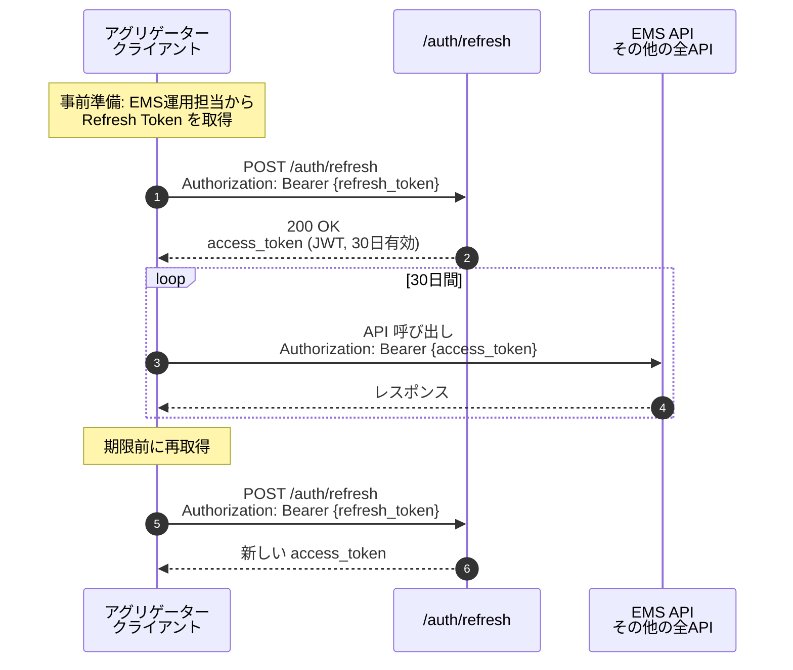
```mermaid
sequenceDiagram
    autonumber
    participant AGG as アグリゲーター<br/>クライアント
    participant AUTH as /auth/refresh
    participant API as EMS API<br/>その他の全API

    Note over AGG: 事前準備: EMS運用担当から<br/>Refresh Token を取得
    AGG->>AUTH: POST /auth/refresh<br/>Authorization: Bearer {refresh_token}
    AUTH-->>AGG: 200 OK<br/>access_token (JWT, 30日有効)

    loop 30日間
        AGG->>API: API 呼び出し<br/>Authorization: Bearer {access_token}
        API-->>AGG: レスポンス
    end

    Note over AGG: 期限前に再取得
    AGG->>AUTH: POST /auth/refresh<br/>Authorization: Bearer {refresh_token}
    AUTH-->>AGG: 新しい access_token
```

### HTTP ヘッダー規約

#### リクエストヘッダー

| ヘッダー | 必須 | 説明 |
|---------|:----:|------|
| `Authorization` | ○ | `Bearer {token}` 形式 |
| `Content-Type` | POST/PUT/PATCH 時 | `application/json; charset=utf-8` |
| `Accept` | 任意 | `application/json`（デフォルト） |
| `Idempotency-Key` | 任意 | `/control/active_power` 等で冪等性担保（最大 128 文字） |
| `X-Request-Id` | 任意 | クライアント側追跡用 ID（レスポンスにも返却） |

#### レスポンスヘッダー（共通）

| ヘッダー | 説明 |
|---------|------|
| `Content-Type` | `application/json; charset=utf-8` |
| `X-RateLimit-Limit` / `X-RateLimit-Remaining` / `X-RateLimit-Reset` / `X-RateLimit-Reset-After` | レートリミット情報 |
| `X-Request-Id` | リクエスト時指定があれば返却 |

---

## 3. リソース構成とサイト分類

### 3.1 統一リソースモデル（components[] ベース）

本仕様 v2.0 では、すべてのリソースを **「1 連系点 + 1 つ以上の component」** という統一モデルで表現します。リソースは以下の **2 階層** で分類されます。

#### 第 1 階層: 調整可否（`adjustable`）

EMS API からの能動指令（`/control/active_power`、FCR / DR / 需給調整市場応動）の対象になるか否か:

| `adjustable` | 意味 | 主な制御インターフェース |
|---|---|---|
| `true` | EMS 制御装置を介して連系点 Δ 電力を能動的に制御できる | `/control/active_power`（`delta_kw` / `fcr_response_kw` / DR 等）、市場 SKU 応札 |
| `false` | 連系点の電力サイズを計測するのみ。能動指令は不可 | `/measurements/active_power` / `/measurements/energy`（計測のみ）。出力制御は TSO 由来の `output_control_limit` のみ反映 |

#### 第 2 階層: 潮流の方向（`component_type`）

物理的なエネルギー潮流の向きで分類:

| `component_type` | 潮流の方向 | 代表例 |
|---|---|---|
| `battery` | 双方向（受電 = 充電 / 送電 = 放電）| 蓄電池 |
| `generator` | 送電のみ（連系点 → 系統）| PV、風力、火力、揚水、バイオマス、水力 |
| `consumer` | 受電のみ（系統 → 連系点）| 工場、商業施設、データセンター 等の負荷 |

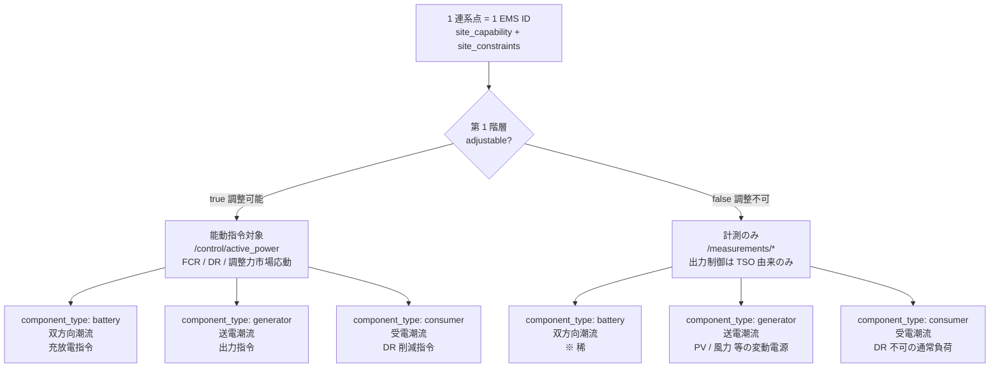
```mermaid
graph TB
    SITE[1 連系点 = 1 EMS ID<br/>site_capability + site_constraints]
    SITE --> ADJ{第 1 階層<br/>adjustable?}

    ADJ -->|true 調整可能| ADJT[能動指令対象<br/>/control/active_power<br/>FCR / DR / 調整力市場応動]
    ADJ -->|false 調整不可| ADJF[計測のみ<br/>/measurements/*<br/>出力制御は TSO 由来のみ]

    ADJT --> CB1[component_type: battery<br/>双方向潮流<br/>充放電指令]
    ADJT --> CG1[component_type: generator<br/>送電潮流<br/>出力指令]
    ADJT --> CC1[component_type: consumer<br/>受電潮流<br/>DR 削減指令]

    ADJF --> CB2[component_type: battery<br/>双方向潮流<br/>※ 稀]
    ADJF --> CG2[component_type: generator<br/>送電潮流<br/>PV / 風力 等の変動電源]
    ADJF --> CC2[component_type: consumer<br/>受電潮流<br/>DR 不可の通常負荷]
```

#### 2 階層の組み合わせと典型例

| `component_type` | `adjustable: true`（調整可能）| `adjustable: false`（調整不可）|
|---|---|---|
| `battery` | 通常の蓄電所（典型）| ほぼ存在しない（バッテリーは原理的に調整可能）|
| `generator` | 火力、揚水、調整可能型バイオマス / 水力 | PV、風力、流れ込み式水力（変動電源、出力制御のみ）|
| `consumer` | DR 対応需要家（`dr_capable: true`）| DR 不可需要家（消費計測のみ、純粋な負荷）|

#### サイト構成の例

| 概念 | 説明 |
|------|------|
| **1 EMS ID = 1 連系点** | 1 物理 EMS が 1 つの系統連系点（PCC）を持ち、その下に 1 つ以上の component を含む |
| **components.length == 1** | 「単機サイト」相当（例: 単独 battery、単独 PV、単独 consumer）|
| **components.length >= 2** | 複数 component を組み合わせたサイト（例: PV+battery、battery+consumer、PV+battery+consumer）|

> **本モデルへの移行**: v1.x（battery 固定スキーマ、resource_type なし）は **`components: [{ component_type: "battery" }]`** の単 component サイトに対応する（v1.x の battery は概念上「調整可能」）。**ラベルとして「battery サイト」「発電所」等の表記は引き続き運用上使われるが、API スキーマでは `components[]` のみで判別する**。

> **調整可否とサイト応札可否の関係**: サイト内に調整可能な component が 1 つも存在しない場合、能動応動系 SKU（`fcr` / `s-frr` / `frr` / `rr` / `rr-fit` / `compound` / `negawatt-spot`）への応札は不可。ただし予測投函型 SKU（`jepx-da` / `jepx-ttv`）は調整不可な PV / 風力等のサイトでも応札可能（市場には予測値を投函するのみで、物理応動は不要）。API 上は `site_capability.marketable` 配列でこの判定結果を表現する（[§3.5](#35-サイト分類フラグsite_capability--site_constraints) 参照）。

### 3.2 サイト構造（1 連系点モデル）

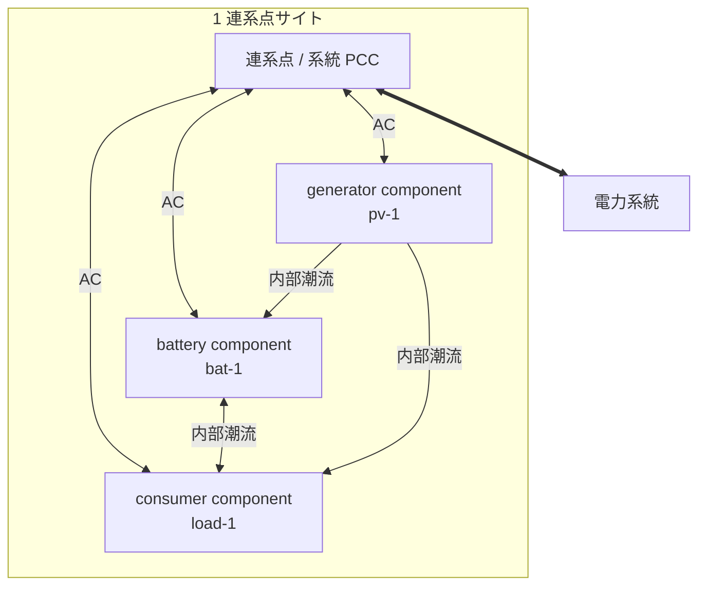
```mermaid
graph TB
    subgraph SITE[1 連系点サイト]
        direction TB
        CP[連系点 / 系統 PCC]
        CP <-->|AC| BAT[battery component<br/>bat-1]
        CP <-->|AC| GEN[generator component<br/>pv-1]
        CP <-->|AC| LOAD[consumer component<br/>load-1]
        BAT <-->|内部潮流| LOAD
        GEN -->|内部潮流| LOAD
        GEN -->|内部潮流| BAT
    end
    GRID[電力系統]
    CP <==> GRID
```

| 概念 | 説明 |
|------|------|
| `component_id` | サイト内で一意のコンポーネント識別子（例: `"bat-1"`, `"pv-1"`, `"load-1"`）|
| `component_type` | コンポーネント種別（`battery` / `generator` / `consumer`）|
| サイトレベル | 連系点視点の集約値（`active_power.current_kw` 等）+ サイト分類フラグ（`site_capability` / `site_constraints`）|
| コンポーネントレベル | 個別機器の動的状態（`active_power.current_kw` 等）+ 機器仕様（`/specifications` の component 個別フィールド）|

**物理法則の整合**:

```
site.active_power.current_kw = Σ component[i].active_power.current_kw  （連系点キルヒホッフ則）
site.import_kwh / export_kwh は連系点での実測（自家消費分は含まない）
```

### 3.3 サイトの典型構成

「代表的な制度区分」列は登録時の EMS運用台帳で確定する想定。本 API では `site_capability.marketable` で応札可否のみを返却し、制度区分の生値は返却しない（[§9.3](#93-仕様情報-specifications) 参照）。

| サイト種類 | components 構成 | 代表的な制度区分 | 逆潮流 | 需給調整<br>(fcr/s-frr/frr/rr) | rr-fit | compound | JEPX<br>(jepx-da/ttv) | negawatt-spot |
|-----------|----------|:----:|:-----:|:--:|:--:|:--:|:--:|:--:|
| **単独蓄電所**（系統側蓄電池）| battery × 1 | non_subsidized | 可 | ✓ | ✓ | ✓ | ✓ | – |
| **FIP-PV+蓄電（発電事業者）**| battery + generator(PV) | **FIP** | 可 | ✓ | ✓ | ✓ | ✓ | – |
| **non_sub-PV+蓄電（卒FIT 等）**| battery + generator(PV) | non_subsidized | 可 | ✓ | ✓ | ✓ | ✓ | – |
| **FIP 余剰売電型 自家消費** | battery + generator(PV) + consumer + 余剰送電契約 | **FIP**（余剰分）| 可（余剰のみ）| ✓ | ✓ | ✓ | ✓ (余剰量制約) | ✓ |
| **完全自家消費型** | battery + generator + consumer | n/a（系統送電なし）| **不可** | △ (下げ方向 + battery 内部応動) | – | – | **✗** | ✓ |
| **工場+蓄電** | battery + consumer | n/a | **不可** | ✓ (双方向、battery 充放電で吸収) | ✓ | – | **✗** | ✓ |
| **工場+自家発電** | generator + consumer | non_subsidized（余剰なし）| 通常不可 | △ (限定的、generator 出力制御 + DR) | – | – | **✗** | ✓ |
| **FIP 単独 PV** | generator(PV) × 1 | **FIP** | 可 | △ (PV は限定的、計画値同時同量) | – | – | ✓ | – |
| **単独 FIT-PV** | generator(PV) × 1 | FIT | 可 | **✗** | **✗** | – | **✗** | – |
| **単独需要家（DR）**| consumer × 1 | n/a | **不可** | △ (下げ方向のみ、消費削減) | ✓ | – | – | ✓ |
| **火力発電所** | generator(thermal) × 1 | non_subsidized | 可 | ✓ | ✓ | ✓ | ✓ | – |
| **揚水発電所** | generator(pumped_storage) × 1 | non_subsidized | 可 | ✓ | ✓ | ✓ | ✓ | – |
| **孤立島運転型** | battery + generator（consumer なし、`site_*_max_kw=0`）| n/a | **送受電なし** | – | – | – | – | – |

凡例: **✓** = 応札可能 / **△** = 制約あり（詳細は注記参照）/ **✗** = 応札不可（明示的に制限される）/ **–** = 該当しない（component 構成上適用外）

> **JEPX 売電が「✗」となる条件**: `site_capability.reverse_flow_allowed: false` のサイトは **`jepx-da` / `jepx-ttv` への応札は不可**。これは JEPX が「卸電力市場で送電する」性質であるため。これらのサイトでも需給調整市場・ネガワット市場には参加可能性がある（受電方向の調整、消費削減等）。

> **需給調整市場 (fcr/s-frr/frr/rr) の上げ・下げ方向**:
> - **上げ調整** = 系統への送電増 or 系統からの受電減 → 逆潮流可能サイトは送電増、不可サイトは受電減（battery 充電量増/DR 緩和）で対応
> - **下げ調整** = 系統からの受電増 or 系統への送電減 → 逆潮流不可サイトでも消費削減（DR）で参加可能
> - 「△ (下げ方向のみ)」のサイトは典型的に DR 中心の参加形態となる

> **FIP 関連サイトの精算**: FIP 区分は API では明示的なフィールドとして返却しないが、`/measurements/energy` に **`fip_export_kwh`**（PV → 連系点直接送電）と **`battery.from_generator_kwh`**（PV → 蓄電池充電量）が個別に集計される。これによりプレミアム交付対象量はクライアント側で算出可能。`balancing_responsible: true` と `imbalance_kwh` でインバランス精算が完結。

> **FIT 電源の `marketable`**: 単独 FIT-PV サイトでは `site_capability.marketable` は **空配列 `[]`**（全市場 SKU で応札不可）。FIT サイトは買取電力会社に固定価格で売電するのみで、本 API 経由の市場応札・指令対象にはならない。

### 3.4 逆潮流可否の判定

逆潮流可否は `/specifications.site_capability.reverse_flow_allowed`（boolean）で表現されます。物理制約値（最大送電電力 kW）は `site_constraints.site_export_max_kw` で別途返却されますが、**可否判定そのものは `reverse_flow_allowed` 1 つで完結**します。

#### サイト種類の分類（EMS 運用担当が登録時に判定）

| サイト種類 | components 構成 | `site_export_max_kw` | `reverse_flow_allowed` | 備考 |
|---|---|:--:|:--:|---|
| **発電事業者連系** | generator / battery のみ（consumer なし）| > 0 | `true` | 逆潮流可・全 SKU 応札可能 |
| **余剰売電型自家消費** | consumer 含む + 余剰送電契約 | > 0 | `true` | 余剰量まで送電可能、JEPX 売電は余剰量制約付き |
| **完全自家消費型** | consumer 含む + 余剰送電契約なし | 0 | `false` | 需要家連系、JEPX 売電不可、`battery.to_grid_kwh = 0` |
| **孤立島運転型** | consumer なし、`site_*_max_kw = 0` | 0 | `false` | 系統解列状態、応札 SKU は `marketable: []`、`sku: null` 運用のみ |

> **クライアントの利用**: 上記の分類結果は `reverse_flow_allowed` に反映される。**クライアントは `reverse_flow_allowed` の真偽だけで送電方向の指令可否を判定**できる（components 構成や `site_export_max_kw` を直接参照する必要はない）。

#### §3.3 典型構成との対応

[§3.3 サイトの典型構成](#33-サイトの典型構成) で挙げた 12 個の具体ケースと、上記 4 種類のサイト種類との対応を以下に示す:

| サイト種類 | `reverse_flow_allowed` | §3.3 の該当ケース |
|---|:--:|---|
| **発電事業者連系** | `true` | 単独蓄電所、FIP-PV+蓄電、non_sub-PV+蓄電、FIP 単独 PV、単独 FIT-PV、火力発電所、揚水発電所 |
| **余剰売電型自家消費** | `true` | FIP 余剰売電型 自家消費 |
| **完全自家消費型** | `false` | 完全自家消費型、工場+蓄電、工場+自家発電、単独需要家（DR）|
| **孤立島運転型** | `false` | 孤立島運転型 |

> **単独 FIT-PV の扱い**: 物理的には逆潮流が発生する（FIT 制度上、発電全量を系統送電）ため `reverse_flow_allowed: true` となるが、`site_capability.marketable` が空配列のため本 API を経由した市場応札・指令の対象にはならない（[§3.3](#33-サイトの典型構成)「FIT 電源の marketable」注記を参照）。

### 3.5 サイト分類フラグ（`site_capability` / `site_constraints`）

`/specifications` のサイトレベルブロックで、市場応札可否・物理制約等のサイト分類情報を返却します。

#### `site_capability`（サイトレベル能力フラグ）

| フィールド | 型 | 説明 |
|---|---|---|
| `fcr_capable` | boolean | 一次調整力応動可能か（components 内に `fcr_capable: true` を 1 つ以上含む場合 `true`）|
| `dr_capable` | boolean | DR 応動可能か（consumer component を含み、その component の `dr_capable: true` の場合 `true`）|
| `reverse_flow_allowed` | boolean | 逆潮流可否（`site_export_max_kw > 0` で `true`）|
| `marketable` | array<string> | 市場応札適格 SKU の配列（応札可能な SKU のみを含む。下記参照）|
| `balancing_responsible` | boolean | 計画値同時同量責任の有無（generator を含むサイトで FIP/non_subsidized 該当時に `true`、登録時に EMS運用担当が判定）|
| `non_firm_connection` | boolean | ノンファーム連系（抑制補償なし）か |

> **将来追加予定の能力フラグ**: `reactive_power_capable`（無効電力応動可否）・`tso_dispatch_capable`（TSO 個別指令受信可否）。詳細は [§9.3](#93-仕様情報-specifications) と [§9.2.2](#922-statusdetails-詳細) を参照。

#### `site_capability.marketable`（市場応札適格 SKU の配列）

| 配列に含まれうる値 | 説明 |
|---|---|
| `"fcr"` | 一次調整力 |
| `"s-frr"` | 二次調整力① |
| `"frr"` | 二次調整力② |
| `"rr"` | 三次調整力① |
| `"rr-fit"` | 三次調整力② |
| `"compound"` | 複合商品 |
| `"jepx-da"` | JEPX スポット |
| `"jepx-ttv"` | JEPX 時間前 |
| `"negawatt-spot"` | ネガワット・スポット |

> **判定根拠**: `marketable` 配列の内容は、components 構成・契約上の制度区分（FIT/FIP/non_subsidized）・連系区分（firm/non_firm）・容量要件等を EMS運用担当が**サイト登録時に総合判定**して設定する。本 API では**応札可能な SKU のみを配列に含める**（応札不可な SKU は配列に出現しない）形で結果のみを公開する。

> **精算ラベルとの関係**: 制度別の精算出力（`fit_export_kwh` / `fip_export_kwh` / `non_subsidized_export_kwh` 等の分割集計フィールド）は `/measurements/energy` で**維持される**。これらの分割集計フィールドの非ゼロ有無で、各サイトの制度区分は事後的に判別可能。

#### `site_constraints`（サイト物理制約）

| フィールド | 型 | 説明 |
|---|---|---|
| `voltage_class` | string | 連系点電圧階級（`low` / `high` / `extra_high`）|
| `measurement_point` | string | 計測点（`grid` / `device`、[§3.6](#36-計測点受電点--機器点) 参照）|
| `site_import_max_kw` | number | 連系点最大受電電力 |
| `site_export_max_kw` | number | 連系点最大送電電力（`0` で逆潮流不可）|

### 3.6 計測点（受電点 / 機器点）

電力値・電力量フィールドの計測位置を表す属性。`/specifications` の `measurement_point` フィールドで指定する。

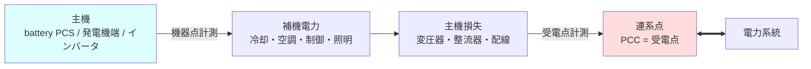
```mermaid
graph LR
    DEV[主機<br/>battery PCS / 発電機端 / インバータ]
    AUX[補機電力<br/>冷却・空調・制御・照明]
    LOSS[主機損失<br/>変圧器・整流器・配線]
    PCC[連系点<br/>PCC = 受電点]
    GRID[電力系統]

    DEV -->|機器点計測| AUX
    AUX --> LOSS
    LOSS -->|受電点計測| PCC
    PCC <==> GRID

    style DEV fill:#dff
    style PCC fill:#fdd
```

| 計測点 | 値 | 計測位置 | 含まれない損失 |
|--------|----|---------|--------------|
| **受電点（PCC）** | `"grid"` | 連系点（系統との境界）| なし。系統への送電量・系統からの受電量の純額 |
| **機器点** | `"device"` | 主機の出力端（battery: PCS、generator: 発電機端／インバータ、consumer: 主装置端）| 補機電力消費・主機損失（変圧器・配線等）が含まれる |

**関係式**:
```
受電点送電量 = 機器点発電量 − 主機損失 − 補機電力（発電方向）
受電点受電量 = 機器点充電量 + 主機損失 + 補機電力（充電方向）
```

#### 選択ルール

- **1 リソース 1 計測点**: 機器点と受電点を**同時に評価することはできない**。リソース登録時または応札開始前に確定する
- **デフォルト**: `"grid"`（受電点）。後方互換のため、`measurement_point` を未指定のリソースは `"grid"` として扱う
- **切替**: 運用中の途中切替は不可。新規応札サイクル開始前に EMS運用担当へ申請して `/specifications` を更新
- **影響範囲**: `current_kw` / `delta_kw` / `import_kwh` / `export_kwh` 等のすべての電力・エネルギーフィールドが指定された計測点の値で返却される

#### EMS運用担当による審査ポイント（参考、2026 年 4 月時点）

クライアントが `/specifications` で `measurement_point: "device"` を申請した場合、EMS運用担当は制度・運用ルールに照らして以下を確認する:

- 制度上、機器点計測が認められる組み合わせか（voltage_class × 想定 SKU）
- 機器点計測機能を持つハードウェア（PCS / 計量器）が設置されているか
- `/specifications` で承認された計測点と整合する SKU での応札に限定されているか

> **VPP 配下メンバー**: VPP `/status` `/status/details` は静的属性を返却しないため、各メンバーの `measurement_point` は物理 EMS API `/specifications` で取得・キャッシュする。VPP配下に機器点計測のメンバーと受電点計測のメンバーが混在する場合、配下個別の計測点で応動評価され、VPP top-level 集約値は単純合算となる。

---

## 4. 符号規則・関係式

### 4.1 連系点基準の符号規則

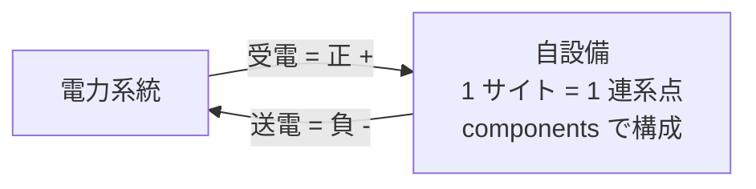
```mermaid
graph LR
    GRID[電力系統]
    SITE["自設備<br/>1 サイト = 1 連系点<br/>components で構成"]
    
    GRID -->|受電 = 正 +| SITE
    SITE -->|送電 = 負 -| GRID
```

| 方向 | 符号 | 例 |
|------|:----:|-----|
| 連系点から**受電**（系統→自設備）| **正 (+)** | 蓄電所充電、需要家消費 |
| 連系点へ**送電**（自設備→系統）| **負 (-)** | 蓄電所放電、発電所発電 |

| リソース | 連系点電力（`current_kw`）の取りうる範囲 |
|---------|--------------------------|
| `battery` | 負〜正の両方向（充放電）|
| `generator` | **常に負（または0）**|
| `consumer` | **常に正（または0）**|

### 4.2 電力フィールドの関係式

| フィールド | 文脈 | 意味 |
|----------|------|------|
| `current_kw` | `/status`, `/measurements/active_power`（全種別）| **連系点での絶対電力**（実測値、受電+/送電-）|
| `delta_kw` | `/control/active_power`（全 component または `component_id` 指定、リクエスト=指令値）、`/control/active_power/schedules`（予定指令値）、`/status`（**実測差分** = `current_kw - baseline_kw`）、`/measurements/active_power`（実測差分の履歴）| **連系点基準の単方向Δ電力**。文脈により 2 つの意味を持つ:<br>・**指令時** (`/control/active_power` リクエスト・`/control/active_power/schedules`): 市場約定量＝指令された目標Δ電力<br>・**実測時** (`/status`, `/measurements/active_power`): `current_kw - baseline_kw` の実測差分（実応動結果）<br>FCR を除く全 SKU で使用。連系点目標 = `baseline_kw + delta_kw` |
| `dispatched_delta_kw` | `/status`（全種別、現在配信中の指令値） | **直近の `/control/active_power` から配信された指令Δ電力**（指令時の `delta_kw` のスナップショット）。`/status` の `delta_kw`（実測）と並列で返し、達成度 = `delta_kw / dispatched_delta_kw` を即算出可能。指令未配信時または `duration_minutes` 終了後は `null`。FCR 時も `null`（FCR は `fcr_response_kw` で応動量を表現） |
| `fcr_response_kw` | `/control/active_power`（FCR 応動時のみ、サイト全体または `component_id` 指定）、`/status`、`/measurements/active_power` | **FCR 応動可能量（双方向幅、絶対値・正値）**。±`fcr_response_kw` の範囲で周波数偏差に応じて自動応動（応動レンジ = `baseline_kw ± fcr_response_kw`）|
| `baseline_kw` | 全体 | **基準電力**（精算・履行評価用）|
| `output_control_limit` | `/status`, `/measurements/active_power`（battery / generator）| **EMS制御装置が TSO から取得した出力制御指令値**（%、`rated_output_kw` に対する比率）。アグリゲーターは EMS API 経由で参照のみ（指令値そのものは EMS API では設定不可、TSO → EMS制御装置 の経路で配信される）|

#### 関係式

```
FCR以外（単方向Δ指令）:
  連系点目標電力（概念値）    = baseline_kw + delta_kw    （指令時、/control/active_power リクエストの delta_kw を使用）
  delta_kw（実測）            = current_kw - baseline_kw  （/status, /measurements/active_power）
  dispatched_delta_kw         = 直近 /control/active_power からの配信値（/status のみ、指令未配信時 null）
  達成度（参考）              = delta_kw / dispatched_delta_kw   （クライアント側で算出）

FCR（双方向応動幅）:
  応動レンジ                  = [baseline_kw - fcr_response_kw, baseline_kw + fcr_response_kw]
  fcr_response_kw は常に正値（絶対値）。FCR 時 dispatched_delta_kw は null
```

> 「連系点目標電力」は概念値であり、API 上のフィールドとしては返却しない（クライアント側で `baseline_kw + delta_kw` から導出する）。

> 市場応札ワークフロー（応札 → 約定 → 指令 → 実行 → 精算）の詳細は [§10 市場別利用フロー](#10-市場別利用フロー) を参照。

#### 約定 kW の符号と種別別の典型（FCR 以外）

| リソース | baseline_kw（典型）| 約定内容 | delta_kw 値 | 物理意味 |
|---------|:----------------:|---------|:------------:|----------|
| `battery` | 0 | 1200kW 放電（下げ調整約定）| **−1200** | 送電方向 |
| `battery` | 0 | 800kW 充電（上げ調整約定）| **+800** | 受電方向 |
| `consumer` | +1000（消費中）| 200kW DR削減（下げ調整約定）| **−200** | 受電減（消費削減）|
| `consumer` | +1000（消費中）| 300kW 受電増（上げ調整約定、battery 併設等）| **+300** | 受電増 |
| `generator` | −1500（発電中）| 出力制御 800kW へ（下げ調整）| **+700** | 送電減（発電抑制）|

#### FCR の応動可能量の典型

| リソース | baseline_kw（典型）| 約定内容 | fcr_response_kw 値 | 応動レンジ |
|---------|:----------------:|---------|:------------------:|-----------|
| `battery` | 0 | ±1999kW 双方向応動可 | **1999** | -1999 〜 +1999 |
| `generator` (thermal) | -1000（発電中）| ±500kW 双方向応動可 | **500** | -1500 〜 -500 |
| `consumer` (高速応答DR) | +1000（消費中）| ±300kW 双方向応動可 | **300** | +700 〜 +1300 |

**選択ルール（指令時）**:

| リソース | 使用可能フィールド |
|---------|------------------|
| `battery` component | `delta_kw`（FCR以外）/ `fcr_response_kw`（FCR時）|
| `consumer` component | `delta_kw`（負値で DR 削減指令、FCR以外）/ `fcr_response_kw`（FCR時）|
| `generator` component | `delta_kw`（baseline_kw は負値で計画発電量を表現。正値の `delta_kw` で発電抑制、負値で発電増）/ `fcr_response_kw`（FCR時）|
| `components.length ≥ 2` で `component_id` 指定 | 指定した component_type に応じたフィールド |

> **`delta_kw` と `fcr_response_kw` の必須・禁止ルール**:
> - **FCR の場合（`sku: "fcr"`）**: `fcr_response_kw` が **必須**、`delta_kw` は **指定不可**
> - **複合商品の場合（`sku: "compound"`）**: `delta_kw` が **必須**、`fcr_response_kw` は **複合に FCR を含む場合のみ指定可**（[§7.4](#74-複合商品-compound) 参照）
> - **上記以外の SKU**: `delta_kw` が **必須**、`fcr_response_kw` は **指定不可**
> 違反時は 400 エラー（[§9.4 バリデーション](#94-有効電力制御-controlactive_power) 参照）。

> **互換性に関する注意**: v1.x の `power_kw`（充電+/放電-）は v2 で **`delta_kw` にリネーム**された。値の符号方向は連系点基準（受電+/送電-）と**同一**。v2 では `delta_kw` を battery 限定から **全種別の市場約定指令フィールド**（連系点基準Δ電力）に拡張した。詳細は [§A.2 移行ガイド](#a2-既存蓄電所クライアントの差分破壊的変更含む) 参照。

---

## 5. データ形式・レートリミット

### 5.1 データ形式

| 項目 | 説明 |
|------|------|
| **電力種別** | **本仕様の電力・電力量フィールドはすべて有効電力 (Active Power, kW) ベース**。無効電力 (Reactive Power, kvar)・皮相電力 (Apparent Power, kVA)・力率 (Power Factor) は本 API のスコープ外（EMS制御装置（PCS）側で自律管理）。需給調整市場・JEPX・容量市場・ネガワット市場はすべて有効電力 kW で取引されるため、本仕様で十分カバーされる。電圧調整サービス等で無効電力対応が必要になった場合は将来バージョンで拡張検討 |
| **単位** | 電力値: kW（有効電力）、電力量値: kWh（有効電力量）、周波数: Hz |
| **数値精度** | **kW 値および kWh 値は小数点以下 1 桁まで**（例: `1500.0`、`-45.2`）。リクエスト・レスポンス・JSON 例は全て 1 桁の小数表記で統一。送信側が整数値（`1500`）を送っても受理（サーバー側で `1500.0` として正規化）。% 値・周波数値の精度は本仕様では規定しない |
| **日時形式** | ISO 8601 形式、**全て UTC**（末尾 `Z` 必須）。例: `2025-06-13T10:30:00Z`。本書のサンプルは **`2025-06-13` を基準日**として記述しています（VPP API 仕様書は `2026-04-04` を基準日とします）|
| **EMS ID** | 16 バイト（128bit）UUID を 32 文字 hex で表記（ハイフン無し）。文字種: 0-9, a-f（小文字）|
| **冪等性キー** | `/control/active_power` リクエストヘッダー `Idempotency-Key`（任意、最大 128 文字、24 時間保持）|

### 5.2 レートリミット

| 制限回数 | 期間 | 適用範囲 |
|---------|------|----------|
| **1000 回** | **1 時間** | EMS ID 単位、スライディングウィンドウ |

> **単一バケットである点に注意**: 物理 EMS API は参照系・制御系を区別せず、`/auth/refresh` を除く全エンドポイントで **1 つのバケット**（1000 回/時）を共有します。参照ポーリングを高頻度で回すと市場応動時の `/control/active_power` が枯渇し得るため、クライアント側で参照系の呼び出し予算を確保してください。
> 複数サイトを束ねる運用では、参照系（1000 回/時）と制御系（200 回/時）を**独立したバケット**で管理する [VPP API](vpp-api-v1.md#24-レートリミット) の利用を推奨します。

> **`/auth/refresh` のレートリミット**: 認証エンドポイント（`{認証ホスト}`）は API 本体とは別ホストのため上記バケットには含まれず、**Refresh Token 単位の独立したバケット**が適用されます（物理 EMS API・VPP API 共通）。上限値は API 本体と同じ **1000 回 / 1 時間**（スライディングウィンドウ）で、カウント単位のみ EMS ID / VPP ID ではなく Refresh Token になります。Access Token の有効期限は 30 日のため、通常運用でこの上限に達することはありません。

レスポンスヘッダー:

| ヘッダー | 説明 |
|---------|------|
| `X-RateLimit-Limit` | 上限リクエスト数（1000）|
| `X-RateLimit-Remaining` | 残りリクエスト数 |
| `X-RateLimit-Reset` | カウントリセット時刻（Unix 時刻、秒）|
| `X-RateLimit-Reset-After` | リセットまでの残り秒数 |

超過時は `429 Too Many Requests`（[サンプル集 B.10](ems-openapi-v2-samples.md#b10-エラーレスポンス)）。

---

## 6. API 一覧

| No. | カテゴリ | エンドポイント | メソッド | 対象種別 | 概要 |
|-----|----------|---------------|----------|----------|------|
| 1 | **認証** | `/auth/refresh` | POST | 全 | Access Token 取得 |
| 2 | **リアルタイム状態（概要）** | `/status` | GET | 全 | **概要レベル**（一覧監視用、最小限のフィールド：状態、`current_kw` / `baseline_kw` / `delta_kw` / `dispatched_delta_kw`、`fcr_active`、能力可用量（`import/export_*_available`）、`output_control_limit`、`has_warning`、計測時刻）|
| 2-1 | **リアルタイム状態（詳細）** | `/status/details` | GET | 全 | **詳細レベル**（ドリルダウン分析用、概要 + `active_sku` / `last_dispatch_status` / `fcr_response_kw` / `soc` / `dr_target/actual_reduction_kw` / `output_control_reason` / `irradiance_w_m2` / `components[]` 等。将来の無効電力系フィールドもこちらに集約。静的属性（`fcr_capable` / `dr_capable` 等）は `/specifications` で取得）|
| 3 | **仕様情報** | `/specifications` | GET | 全 | 定格仕様 |
| 4 | **有効電力制御** | `/control/active_power` | POST | 全 | 即座/スケジュール指示（kW 系の指令、無効電力は将来 `/control/reactive_power` で別途追加予定）|
| 5 | **有効電力スケジュール管理** | `/control/active_power/schedules` | GET/DELETE | 全 | 取得（**過去 30 日 〜 未来 90 日**）・削除。kW 系スケジュールのみ管理（無効電力スケジュールは将来 `/control/reactive_power/schedules` で別途追加予定）|
| 6 | **ベースライン管理** | `/baseline` | GET/POST | `consumer` component を含むサイト | DR 履行評価・計画値同時同量精算用の **30 分粒度ベースライン値**（kW）の登録・取得。算定ロジックはアグリゲーター側、API は値ストア（[§9.6](#96-ベースライン管理-baseline) 参照）|
| 7 | **瞬時電力履歴** | `/measurements/active_power` | POST | 全 | 時系列電力値（kW）。**保管 60 日 / サンプリング間隔 `1` / `60` / `1800` / `3600` / `86400` 秒の 5 値（デフォルト 60）/ 取得期間 最大 31 日**。共通: `current_kw` / `delta_kw` / `dispatched_delta_kw` / `fcr_response_kw` / `baseline_kw` / `actual_frequency`。種別固有: `soc`（battery）/ `irradiance_w_m2`（generator PV）/ `output_control_limit`（battery / generator）/ `dr_active` / `dr_target_reduction_kw` / `dr_actual_reduction_kw` / `active_sku`（consumer）/ `components`（`components.length ≥ 2` のサイト）。**最大時系列ポイント数 44,640 件**（31日 × 24時間 × 60ポイント/時 = 60秒間隔基準。期間と `interval_seconds` の組み合わせで決まる） |
| 8 | **電力量履歴** | `/measurements/energy` | POST | 全 | 期間内累積電力量（kWh）。**保管 12 か月（365 日）/ 最小集計単位 60 秒 / レスポンスは常に `data[]` 形式（省略時は期間全体 1 レコード、`interval_seconds`（`1800` / `3600` / `86400`）指定でコマ別・日次の時系列）**。共通: `import_kwh` / `export_kwh` / `baseline_kwh`。助成区分別: `fit_export_kwh` / `fip_export_kwh` / `non_subsidized_export_kwh`。抑制量内訳: `curtailed_kwh` / `fit_curtailed_kwh` / `non_firm_curtailed_kwh` / `manual_curtailed_kwh`。インバランス: `imbalance_kwh`（FIP/non_sub）。DR 履行: `dr_delivered_kwh` / `dr_dispatched_count` / `dr_total_dispatched_minutes`。経路追跡（`components.length ≥ 2` のサイト）: `self_consumed_kwh` / `from_generator_kwh` / `from_grid_kwh` / `to_grid_kwh` / `to_load_kwh` / `to_battery_kwh` / `to_load_kwh`。集計ルールは [§9.8 集計ルール](#集計ルール) 参照 |
| 9 | **運転計画** | `/serviceplan` | GET | 全 | 30 分刻み 48 件運転計画 |

> **FCR パラメータについて**: 一次調整力（FCR）応動の動作パラメータ（基準周波数、不感帯、調定率）は **EMS運用担当による事前設定のみ** で、API からの変更はサポートしません。FCR 応動状態の確認は `/status` の `fcr_active` および `active_sku: "fcr"` で参照してください（v1.x の `/fcr/config` は廃止）。

---

## 7. 市場応札 SKU 一覧

> **「入札」と「応札」の使い分け**: 業界慣行として JEPX（kWh 市場）では「**入札**」、需給調整市場・容量市場・ネガワット市場では「**応札**」を使用します。本仕様では市場主催側の動作（応札受付）と、自発的な提案行為（応札）の両方を**「応札」**で表記しますが、§10.2/§10.3 の JEPX 関連シーケンス図のみ「入札」を用います。意味的には同義です。

| SKU | 正式名称 | 日本語名 | battery component | generator component※ | consumer component (DR) |
|-----|----------|----------|:-------:|:----------:|:-------------:|
| `fcr` | Frequency Containment Reserve | 一次調整力 | ○ | △ | ○ ※高速応答可能DR |
| `s-frr` | Slow Frequency Restoration Reserve | 二次調整力① | ○ | △ | ○ |
| `frr` | Frequency Restoration Reserve | 二次調整力② | ○ | △ | ○ |
| `rr` | Replacement Reserve | 三次調整力① | ○ | △ | ○ |
| `rr-fit` | Replacement Reserve FIT | 三次調整力② | ○ | △ | ○ |
| `compound` | Compound Balancing Product | **複合商品**（一次調整力 / 二次調整力① / 二次調整力② / 三次調整力①の最大 4 商品を 1 約定で兼ねる前日商品。**`rr-fit`（三次調整力②）は FIT 予測誤差吸収用の別建て市場のため複合対象外**）| ○ | △ | ○ |
| `jepx-da` | JEPX Day Ahead | JEPXスポット | ○ | ○ FIP/non-sub | - |
| `jepx-ttv` | JEPX TTV | JEPX時間前 | ○ | ○ FIP/non-sub | - |
| `negawatt-spot` | Negawatt Spot | ネガワット・スポット | - | - | ○ |
| `null`（省略可）| なし | 市場応札なし | ○ | ○ | ○ |

> 表の縦軸は **component_type 単位** の応札可否を示す。`components.length ≥ 2` のサイトは各 component の能力の OR 集約として応札可能 SKU が決まる（[§3.1](#31-統一リソースモデルcomponents-ベース) 参照）。

> ※ **generator は `generator_kind` × `incentive_type` で参加可否が決定**。`△` は条件付き可（[§7.3 SKU × generator_kind 対応表](#73-sku--generator_kind-対応表) 参照）。**`incentive_type: "fit"` の電源は需給調整市場・JEPX 全 SKU で応札不可**（FIT制度で売電先固定のため）。

> **複合商品（`compound`）について**: 不等時性を考慮した需給調整市場の前日商品。**一次調整力 (`fcr`) / 二次調整力① (`s-frr`) / 二次調整力② (`frr`) / 三次調整力① (`rr`)** の中から **2 商品以上の組み合わせ** を 1 つの約定で兼ねる。応動制御は `delta_kw`（複合 ΔkW 約定量）と `fcr_response_kw`（FCR 部分の双方向応動幅、FCR を含む場合）で行い、**最大値（絶対値）が `delta_kw`（絶対値）と一致する内数ロジック**で運用される。内訳の記録には `compound_breakdown`（任意の参考情報）を利用できる（[§7.4 複合商品](#74-複合商品-compound) 参照）。**`rr-fit`（三次調整力②）は FIT 電源の予測誤差吸収のための別建て市場（応札主体は調整力供出者であり FIT 電源自体は応札しない）で、複合商品の対象外**。

> **`sku: null` の用途**: **市場応札を伴わない運用指令**全般で使用（充電・放電・待機・自家消費・テスト運転等）。`sku` フィールドの省略も `null` と同等に扱われます。`active_sku: null`（応動状態フィールド）の表現と整合。詳細は [§10.7](#107-非市場応札の運用指令sku-null) 参照。

### 7.1 voltage_class と SKU の関係

電圧階級と SKU の組み合わせは **直接の制約はありません**（FCR の低圧アグリゲート対応など、近年の制度改正で全 SKU が全 voltage_class で参加可能）。実用上の制約は **市場ごとの最低応札量（kW）** であり、低圧の単機リソースでは応札量が不足するため、**アグリゲート（VPP）経由の応札**が必要になります。

| voltage_class | 単独応札の現実的可否 | アグリゲート経由 |
|---------------|:-------------------:|:---------------:|
| `low`（低圧）| 通常は応札量不足（単機 50 kVA 未満）| **○ 全 SKU 可能**（VPP で複数サイトを束ねる）|
| `high`（高圧）| 中〜大規模なら可（応札量による）| ○ 全 SKU 可能 |
| `extra_high`（特別高圧）| ○ 全 SKU 単独可 | ○ |

応札量集計と最低応札量チェックは `vpp-api-v1.md` を参照してください。

### 7.2 SKU フィールドの命名規則

文脈ごとに SKU を表すフィールド名が異なります:

| フィールド名 | 文脈 | 意味 |
|-----------|------|------|
| `sku` | `/control/active_power` リクエスト、`/control/active_power/schedules` 各要素 | 指令時に指定する応札商品（**意図値**）|
| `active_sku` | `/status/details`（全種別）、`/measurements/active_power` | **現在応動中の SKU**（非応動時 `null`）。**複合商品応動中は `"compound"`** を返す。複合商品の内訳（`compound_breakdown`）は `/status` には含まないため、必要に応じて `/control/active_power/schedules` GET または直近の `/control/active_power` レスポンスで参照する |
| `scheduled_sku` | `/serviceplan` plans 各要素 | 当該 30 分スロットで**予定されている SKU**（未予定時 `null`）|

### 7.3 SKU × generator_kind 対応表

**generator component を含むサイト**の参加可否は `generator_kind` と契約上の制度区分（FIT/FIP/non_subsidized）の組み合わせで EMS運用担当が登録時に判定し、結果は `site_capability.marketable` 配列に反映される（§7 SKU 一覧の `△` の詳細）。

| generator_kind | fcr | s-frr | frr | rr | rr-fit | compound | jepx-da | jepx-ttv | 備考 |
|---------------|:---:|:-----:|:---:|:--:|:------:|:--------:|:-------:|:--------:|------|
| `thermal` | ○ | ○ | ○ | ○ | ○ | ○ | ○ FIP/non-sub | ○ FIP/non-sub | ディスパッチ可能・調整力主力 |
| `pumped_storage` | ○ | ○ | ○ | ○ | ○ | ○ | ○ FIP/non-sub | ○ FIP/non-sub | 双方向（発電/ポンプ運転）|
| `biomass` | △ | ○ | ○ | ○ | ○ | ○ | ○ FIP/non-sub | ○ FIP/non-sub | FCR は応答速度要件次第 |
| `hydro` | △ | △ | ○ | ○ | ○ | △ | ○ FIP/non-sub | ○ FIP/non-sub | 調整可能型のみ調整力可 |
| `pv` | - | - | - | - | - | - | ○ FIP/non-sub | ○ FIP/non-sub | 変動電源・出力制御のみ |
| `wind` | - | - | - | - | - | - | ○ FIP/non-sub | ○ FIP/non-sub | 変動電源・出力制御のみ |
| `other` | 個別判定 | 個別判定 | 個別判定 | 個別判定 | 個別判定 | 個別判定 | 個別判定 | 個別判定 | 設備特性により判定 |

> **`incentive_type: "fit"` 制約**: FIT 認定電源は売電先・売電価格が固定されているため、**全ての市場応札 SKU で参加不可**（[§9.4 バリデーション](#94-有効電力制御-controlactive_power) 参照）。`generator_kind` に関わらず適用される。

> **「個別判定」の運用**: `generator_kind: "other"` および `△` 判定は、設備の応答速度・最低出力・運用制約により、EMS運用担当・市場運営機関との事前協議で参加可否を決定する。本 API ではバリデーション対象外（応札時に上流で判定済みとみなす）。

### 7.4 複合商品 (`compound`)

需給調整市場における**不等時性を考慮した前日商品**。一次調整力 / 二次調整力① / 二次調整力② / 三次調整力① の **必要量がピークとなるタイミングが各商品で異なる**ことを利用し、1 つのリソースに複数商品を入札させて調達コストを低減する仕組み（取引規程別冊（複合約定）準拠、複合約定の導入により調達量を約 4 割低減できることが確認されている）。

#### 対象商品

| 商品 | SKU | 複合対象 |
|---|---|:---:|
| 一次調整力 | `fcr` | ✅ |
| 二次調整力① | `s-frr` | ✅ |
| 二次調整力② | `frr` | ✅ |
| 三次調整力① | `rr` | ✅ |
| 三次調整力② | `rr-fit` | ❌ FIT 予測誤差吸収用の別建て市場のため複合対象外 |

複合商品応札時は、上記 4 商品から **2 つ以上** を組み合わせる。参考情報として `compound_breakdown` で内訳を記録できる（任意）。

#### 内数ロジック（取引規程別冊「複合約定」準拠）

複合商品は **「最大量を入札した商品」+「他商品はその内数として包含」** という構造を取る。

```
リソース能力:    1,000 kW/分の出力上昇可能な発電機
複合応札:        一次  5MW  + 二次①  8MW + 二次② 10MW + 三次① 15MW
                ↓ 各商品の必要応動タイミングが異なる
複合ΔkW約定量:  max(5, 8, 10, 15) = 15 MW   ← 三次①が最大、これを供出可能状態に維持
有効ΔkW約定量:  三次① 15 MW  （=複合ΔkW約定量）
無効ΔkW約定量:  一次 5 MW + 二次① 8 MW + 二次② 10 MW  （内数として 15MW に包含）
```

**重要**:
- リソースが供出するのは **複合ΔkW約定量（最大値）のみ**（合計 38 MW ではない）
- 「無効ΔkW約定量」となった商品区分は、リソース出力でその商品区分の応動要件を満たす必要なし
- 複合ΔkW約定量を供出可能状態に維持すれば、すべての商品の約定義務を満たす

#### 複合商品のリクエストフィールド構成

複合商品では **応動制御に実際に使うフィールドはトップレベルに昇格** し、`compound_breakdown` は全 SKU 内訳の参考情報として扱う:

| フィールド | 必須 / 任意 | 意味 |
|------|:--:|------|
| `delta_kw` | **必須** | 複合 ΔkW 約定量（FCR 以外の SKU の単方向 Δ の最大値 = リソースが供出可能状態で維持する容量）|
| `fcr_response_kw` | FCR を含む場合のみ指定 | FCR 部分の双方向応動幅（正値・絶対値、スタンドアロン FCR と同じ意味）|
| `compound_breakdown` | **任意（参考情報）** | 複合に含まれる**全 SKU の内訳**（FCR を含む場合は `fcr_response_kw` キーも含む）。実際の内訳は EMS 運用台帳で管理され、本フィールドはアグリゲーター側の記録・参照用 |

```json
{
  "sku": "compound",
  "delta_kw": -15000.0,              // 複合 ΔkW 約定量（最大値 15 MW 放電方向）
  "fcr_response_kw": 5000.0,         // FCR 双方向応動幅 ±5 MW（複合に FCR を含むとき）
  "compound_breakdown": {           // 参考情報（任意）、全 SKU の内訳
    "fcr_response_kw": 5000.0,        // FCR ±5 MW（トップレベル `fcr_response_kw` と同値）
    "s-frr": -8000.0,                 // 二次① 8 MW 放電方向（内数）
    "frr":  -10000.0,                 // 二次② 10 MW 放電方向（内数）
    "rr":   -15000.0                  // 三次① 15 MW 放電方向（= delta_kw・最大値）
  },
  "baseline_kw": 0.0
}
```

`compound_breakdown` 内の各キーの意味:

| キー | 値の型・意味 | 符号 |
|------|------|------|
| `fcr_response_kw` | number、FCR 双方向応動幅 | **正値のみ**（絶対値）、トップレベル `fcr_response_kw` と同値 |
| `s-frr` / `frr` / `rr` | number、各市場の Δ電力（`delta_kw` 同等）| `delta_kw` と**同符号** |

**位置づけ**: `compound_breakdown` は **参考情報** であり、`sku: "compound"` 指令時の必須フィールドではない。応動制御に実際に使われるのは **トップレベルの `delta_kw` / `fcr_response_kw`** であり、`compound_breakdown` は応札内訳の透明性確保（アグリゲーター側の記録・監査用）が目的。

**バリデーションルール（指定された場合のみ）**:
- キー数 ≥ 2（単一商品なら `compound` を使わず単独 SKU で応札）
- 許可されるキーは `fcr_response_kw` / `s-frr` / `frr` / `rr` のみ（`rr-fit` 等は不可）
- `compound_breakdown.fcr_response_kw` を含む場合、**トップレベル `fcr_response_kw` と一致**
- **`fcr_response_kw` の値は正値**（双方向応動幅のため絶対値）
- **`s-frr` / `frr` / `rr` の値は `delta_kw` と同符号**（指令方向が一致）
- **各値の絶対値 ≤ `\|delta_kw\|`**（内数ルール）
- **各値の絶対値の最大値 = `\|delta_kw\|`**（複合 ΔkW 約定量 = 最大値）

#### 複合商品 + FCR の応動セマンティクス

リソースは `|delta_kw|` 分の容量を「供出可能状態」で維持し、その内訳の各 SKU は以下の応動方式で並行動作する:

| compound_breakdown キー | 応動方式 | 指令経路 | 応動方向 | 応動レンジ |
|---|---|---|---|---|
| `fcr_response_kw` | **自律応動**（EMS 制御装置が周波数偏差検知）| 周波数信号（系統から直接）| 双方向 | `baseline_kw ± compound_breakdown.fcr_response_kw` |
| `s-frr` / `frr` / `rr` | **GC 指令型** | TSO → アグリゲーター → API → EMS | 単方向（`delta_kw` 同符号）| `baseline_kw + compound_breakdown.<sku>` |

> **同時応動時の重畳と打ち切り**: 各 SKU の活性化タイミングが異なるため瞬間最大は max(各値) で十分（内数ロジック）。万一 FCR と他 SKU が同方向で重畳した場合、連系点出力は **複合ΔkW約定量 `|delta_kw|` で打ち切り**（リソース容量超過を防ぐため）。

#### 商品区分跨ぎの指令タイミング（取引規程 第 7 章 第 35 条 準拠）

複合商品と単独商品が連続約定した場合、各約定ブロック開始 **5 分前まで**に商品ごと別々の指令を送信:

```
時刻       9:00  10:00  11:00  12:00  13:00  14:00  15:00  16:00  17:00  18:00
            |======== 複合 20MW =========|========= 二次② 10MW =========|=== 複合 20MW ===|

指令タイミング:
  11:55 (12:00 ブロック開始 5 分前) → 二次② 単独指令: 12:00-18:00 / 10MW
  14:55 (15:00 ブロック開始 5 分前) → 複合指令: 15:00-18:00 / 20MW
```

同一時間帯に複合商品と単独商品が併存する場合は、両者を別 `schedule_id` で管理する（[§9.5.1 スケジュール重複時の動作](#951-スケジュール重複時の動作後勝ちルール) の「後勝ちルール」は **同一 SKU カテゴリ内のみ適用**で、`compound` と単独 SKU は重複扱いされない）。

> **参考**: 取引規程別冊「複合約定」、取引規程 第 7 章 第 35 条「複合商品を連続して約定した場合の簡易指令システムによる指令方法」

---

## 8. パラメータ範囲仕様

> **注意**: 同名パラメータ `start_time` / `end_time` は文脈ごとに意味が異なります（スケジュール登録は未来時刻、履歴取得は過去時刻）。各 API セクションで個別に明示します。

### 8.1 有効電力制御パラメータ

| パラメータ | 最小値 | 最大値 | 単位 | 適用種別 | 備考 |
|-----------|-------|-------|------|----------|------|
| `delta_kw` | -999999.9 | 999999.9 | kW | 全 component（battery / consumer / generator）| **市場約定量** = 連系点基準の単方向Δ電力（baseline からの差分）。**FCR 以外の SKU で必須、FCR では指定不可**。**小数第 1 位まで指定可** |
| `fcr_response_kw` | 0 | 999999.9 | kW | `fcr_capable: true` の component | **FCR 応動可能量**（双方向幅、絶対値）。**`sku: "fcr"` で必須、`sku: "compound"` では複合に FCR を含む場合のみ指定可、それ以外の SKU では指定不可**。**小数第 1 位まで指定可** |
| `compound_breakdown` | - | - | - | `sku: "compound"` 時の参考情報（任意）| 複合商品の容量内訳（オブジェクト、`fcr_response_kw` / `s-frr` / `frr` / `rr` の 2 つ以上の組み合わせ）。応動制御はトップレベル `delta_kw` / `fcr_response_kw` が担い、本フィールドは**全 SKU 内訳の参考情報**（指定された場合のみ内数ルールバリデーションを適用、詳細は [§7.4](#74-複合商品-compound) 参照）|
| `baseline_kw` | -999999.9 | 999999.9 | kW | 全 | ベースライン電力（連系点基準、generator では計画発電量を負値で指定）。**小数第 1 位まで指定可** |
| `site_kw` | -999999.9 | 999999.9 | kW | `components.length ≥ 2` | サイトレベル目標電力（連系点絶対値）。**小数第 1 位まで指定可** |
| `component_id` | - | - | - | `components.length ≥ 2` | 制御対象コンポーネント識別子（最大 64 文字）|
| `duration_minutes` | 1 | 1440 | 分 | 全 | 即座指示の継続時間 |
| `soc` | 0.0 | 100.0 | % | battery component を含むサイト | 運用可能範囲 |

### 8.2 スケジュール登録パラメータ（未来時刻）

| パラメータ | 最小値 | 最大値 | 単位 | 備考 |
|-----------|-------|-------|------|------|
| `start_time` | 現在時刻+1分 | 現在時刻+90日 | - | 1 分単位で設定可能 |
| `end_time` | `start_time`+1分 | `start_time`+24時間 | - | 1 分単位で設定可能 |

### 8.3 履歴取得パラメータ（過去時刻）

データの**保管期間**と**サンプルレート**は API ごとに異なります。

#### 8.3.1 `/measurements/active_power`（瞬時電力履歴）

| パラメータ | 最小値 | 最大値 | 単位 | 備考 |
|-----------|-------|-------|------|------|
| `start_time` | 現在時刻-60日 | 現在時刻 | - | **保管期間 60 日**。それ以前のデータは取得不可（404）|
| `end_time` | `start_time`+1秒 | 現在時刻 | - | start_time より未来かつ現在時刻以前 |
| 取得期間（`end_time - start_time`）| 1秒 | 31日 | - | 上限超過時は 410 |
| `interval_seconds` | 1 | 86400 | 秒 | サンプリング間隔。**`1`（高頻度）/ `60` / `1800` / `3600` / `86400` の 5 値のみ**指定可（それ以外は 400 `invalid_parameter`）。省略時は 60 |

#### 8.3.2 `/measurements/energy`（電力量履歴）

| パラメータ | 最小値 | 最大値 | 単位 | 備考 |
|-----------|-------|-------|------|------|
| `start_time` | 現在時刻-365日 | 現在時刻 | - | **保管期間 12 か月**（365 日）。それ以前のデータは取得不可（404）|
| `end_time` | `start_time`+60秒 | 現在時刻 | - | start_time より未来かつ現在時刻以前 |
| 取得期間（`end_time - start_time`）| **60秒** | 31日 | - | **最小 60 秒**から取得可能。上限超過時は 410 |
| `interval_seconds` | 1800 | 86400 | 秒 | 任意。**`1800`（30 分コマ）/ `3600`（1 時間）/ `86400`（日次）の 3 値のみ**指定可（それ以外は 400 `invalid_parameter`）。省略時は期間全体 1 レコード。レスポンスは常に `data[]` 形式（[§9.8 レスポンス構造](#レスポンス構造data-統一) 参照）|
| 時系列レコード数（指定時）| - | 1,488 | 件 | `ceil(期間 / interval_seconds)`。期間上限 31 日 × `interval_seconds: 1800` = 最大 1,488 件（期間制限内で自動的に収まるため独立上限なし）|

### 8.4 ベースラインパラメータ

| パラメータ | 最小値 | 最大値 | 単位 | 適用 | 備考 |
|-----------|-------|-------|------|------|------|
| `baseline_kw` | 0 | `contract_kw` | kW | `consumer` component を含むサイト | 30 分スロットのベースライン電力。**小数第 1 位まで**指定可。詳細は [§9.6](#96-ベースライン管理-baseline) 参照 |
| `method_note` | - | 64 文字 | - | 任意 | 算定方式の自由記述メモ（例: `"High 4 of 5 (adj)"`）、監査用。精算には用いない |
| スロット粒度 | 30 分 | 30 分 | - | 全 | UTC で 00 分 / 30 分境界に必須アライン |
| バルク登録件数 | 1 | 336 | 件 | POST `/baseline` | 1 リクエスト最大 1 週間分 |

> **算定方式は API レベルでは管理しない**: `High 4 of 5（当日調整あり）` 等の CBL 算定アルゴリズムはアグリゲーター側で実装し、本 API には 30 分粒度の値のみを登録する（[§9.6.1 設計方針](#961-設計方針) 参照）。

### 8.5 `/specifications` 関連定数値

| パラメータ | 最小値 | 最大値 | 単位 | 適用種別 | 備考 |
|-----------|-------|-------|------|----------|------|
| `voltage_class` | enum | enum | - | 全 | `low` / `high` / `extra_high` |
| `measurement_point` | enum | enum | - | 全 | `grid`（デフォルト、受電点）/ `device`（機器点）。選択可能な組み合わせは EMS運用担当が制度・運用ルールに基づき審査（[§3.6](#36-計測点受電点--機器点) 参照）|
| `rated_cap` | 0 | 999999 | kWh | `battery` | 定格容量 |
| `import_pwr_max` / `export_pwr_max` | 0 | 999999.9 | kW | `battery` | 定格最大受電/送電電力。**小数第 1 位まで指定可** |
| `soc_op_max` / `soc_op_min` | 0.0 | 100.0 | % | `battery` | 運用可能 SOC 範囲 |
| `rated_output_kw` | 0 | 999999.9 | kW | `generator` | 定格出力（共通）。**小数第 1 位まで指定可** |
| `min_output_kw` | 0 | `rated_output_kw` | kW | `generator` | 最低出力（ディスパッチ可能電源のみ）|
| `ramp_rate_kw_per_min` | 0 | 999999.9 | kW/分 | `generator` | 出力変化速度上限。**小数第 1 位まで指定可** |
| `pv_capacity_kw` | 0 | 999999.9 | kW | `generator` (kind=pv) | パネル定格。**小数第 1 位まで指定可** |
| `upper_reservoir_capacity_kwh` | 0 | 999999999 | kWh | `generator` (kind=pumped_storage) | 上池蓄積電力量 |
| `pump_input_max_kw` | 0 | 999999.9 | kW | `generator` (kind=pumped_storage) | ポンプ運転時最大受電電力。**小数第 1 位まで指定可** |
| `contract_kw` | 0 | 999999.9 | kW | `consumer` | 契約電力。**小数第 1 位まで指定可** |
| `max_demand_kw` | 0 | 999999.9 | kW | `consumer` | 過去 1 年の最大需要。**小数第 1 位まで指定可** |
| `min_dr_reduction_kw` | 0 | `max_dr_reduction_kw` | kW | `consumer` | DR最小削減量 |
| `max_dr_reduction_kw` | `min_dr_reduction_kw` | `contract_kw` | kW | `consumer` | DR最大削減量 |
| `min_dr_duration_minutes` | 1 | 1440 | 分 | `consumer` | DR最小継続時間 |
| `min_dr_cooldown_minutes` | 0 | 1440 | 分 | `consumer` | DR発動間最小休止時間 |
| `site_import_max_kw` | 0 | 999999.9 | kW | 全（`site_constraints`）| 連系点最大受電電力（契約電力）。**小数第 1 位まで指定可** |
| `site_export_max_kw` | 0 | 999999.9 | kW | 全（`site_constraints`）| 連系点最大送電電力（連系容量、0 で逆潮流不可）。**小数第 1 位まで指定可** |
| `components[]` 要素数 | 1 | 50 | - | 全 | サイト内 component 上限（1 = 単機サイト、2 以上 = `components.length ≥ 2` のサイト）|

> **フィールド名の単位サフィックスについて**: `rated_cap`（kWh）/ `import_pwr_max`（kW）/ `export_pwr_max`（kW）は **EMS OpenAPI v1 からの互換名**のため単位サフィックスを持ちません。v2 で新設したフィールドは `rated_output_kw` / `site_import_max_kw` のように単位サフィックスを付す規約です。

### 8.6 `/status` 計測値の範囲

| パラメータ | 最小値 | 最大値 | 単位 | 適用種別 | 備考 |
|-----------|-------|-------|------|----------|------|
| `current_kw` | -999999.9 | 999999.9 | kW | 全 | 連系点絶対電力。**小数第 1 位まで指定可** |
| `import_energy_available` | 0 | `rated_cap` | kWh | `battery` | 連系点で受電可能な電力量 |
| `export_energy_available` | 0 | `rated_cap` | kWh | `battery` | 連系点で送電可能な電力量 |
| `import_power_available` | 0 | `import_pwr_max` | kW | `battery` | 連系点で受電可能な瞬時電力 |
| `export_power_available` | 0 | `export_pwr_max`（battery）/ `rated_output_kw`（generator） | kW | `battery`, `generator` | 連系点で送電可能な瞬時電力 |
| `dr_target_reduction_kw` | 0 | `max_dr_reduction_kw` | kW | `consumer` | 応動中の指令削減量 |
| `dr_actual_reduction_kw` | 0 | `max_dr_reduction_kw` | kW | `consumer` | 実履行量 |
| `irradiance_w_m2` | 0 | 1500 | W/m² | `generator` | 日射強度（任意）|
| `actual_frequency` | 45.0 | 65.0 | Hz | 全 | 系統周波数 |
| `output_control_limit` | 0 | 100 | % | `battery`, `generator` | EMS制御装置が TSO から取得した出力制御指令値（参照のみ）|

### 8.7 `/measurements/energy` 種別固有フィールド

#### 8.7.1 助成制度・連系区分関連（generator component に出現）

> 「出現条件」は EMS運用台帳側の判定で確定する区分。

| パラメータ | 範囲 | 単位 | 出現条件 | 備考 |
|-----------|------|------|------|------|
| `fit_export_kwh` | 0以上 | kWh | FIT 区分の generator | FIT 対象として系統に直接送電（battery 併設不可、generator→連系点のみ）|
| `fip_export_kwh` | 0以上 | kWh | FIP 区分の generator | FIP 対象として generator から連系点に直接送電（battery 経由は別計上）|
| `non_subsidized_export_kwh` | 0以上 | kWh | non_subsidized 区分の generator | 助成なしで系統に直接送電 |
| `imbalance_kwh` | 任意 | kWh | `site_capability.balancing_responsible: true` のサイト | 計画値同時同量インバランス（FIP / non_subsidized）|
| `curtailed_kwh` | 0以上 | kWh | generator component を含むサイト | 出力制御により抑制された発電電力量の合計 |
| `fit_curtailed_kwh` | 0以上 | kWh | FIT 区分の generator | FIT 制度に基づく抑制量 |
| `non_firm_curtailed_kwh` | 0以上 | kWh | `site_capability.non_firm_connection: true` のサイト | ノンファーム連系による系統混雑時の抑制量 |
| `manual_curtailed_kwh` | 0以上 | kWh | generator component を含むサイト | EMS運用担当による手動制御の抑制量 |

#### 8.7.2 経路追跡フィールド（サイト内潮流の内訳）

> **表記規約**: 「`<component>.<field>`」表記は当該 component の `components[]` 要素内に格納されるフィールドを示す。JSON 上のキー名は `<field>` 部分のみ（prefix は説明用の文脈表記）。命名規約の詳細は [§9.8 経路追跡フィールドの命名規約](#98-電力量履歴-measurementsenergy) 参照。

| パラメータ | 範囲 | 単位 | 適用 | 備考 |
|-----------|------|------|------|------|
| `battery.from_generator_kwh` | 0以上 | kWh | battery component | サイト内 generator 由来の充電量（PV / wind / biomass / hydro 等の generator component からの充電合計）|
| `battery.from_grid_kwh` | 0以上 | kWh | battery component | 系統由来充電量 |
| `battery.to_grid_kwh` | 0以上 | kWh | battery component | 系統への放電量 |
| `battery.to_load_kwh` | 0以上 | kWh | battery component | サイト内負荷への放電量 |
| `generator.to_battery_kwh` | 0以上 | kWh | generator component（FIP / non_subsidized）| サイト内 battery 充電供給量（`battery.from_generator_kwh` と対称、同値）|
| `generator.to_load_kwh` | 0以上 | kWh | generator component | サイト内 load 直接供給量 |
| `grid_to_load_kwh` | 0以上 | kWh | サイトレベル | 系統 → 負荷の直接供給量（`import_kwh - battery.from_grid_kwh` の関係）|
| `self_consumed_kwh` | 0以上 | kWh | サイトレベル | 自家消費量 = `generator.to_load_kwh` + `battery.to_load_kwh` |

#### 8.7.3 DR 履行関連（consumer component に出現）

| パラメータ | 範囲 | 単位 | 適用 | 備考 |
|-----------|------|------|------|------|
| `dr_delivered_kwh` | 0以上 | kWh | consumer component | DR 履行量 = max(0, baseline_kwh - import_kwh)（DR 発動時間帯のみ集計）|
| `dr_dispatched_count` | 0以上 | - | consumer component | 期間内 DR 発動回数 |
| `dr_total_dispatched_minutes` | 0以上 | 分 | consumer component | 期間内 DR 発動の合計時間 |

### 8.8 Enum 値定義

#### `consumer_kind`（需要家種別）

| 値 | 説明 |
|----|------|
| `factory` | 工場・製造業 |
| `commercial` | 商業施設（オフィスビル・店舗等）|
| `residential_aggregate` | 集合住宅・住宅アグリゲート |
| `data_center` | データセンター |
| `cold_storage` | 冷蔵倉庫 |
| `ev_charging` | EV充電施設 |
| `other` | その他 |

#### `generator_kind`（発電所種別）

| 値 | 説明 | 主な特性 |
|----|------|---------|
| `thermal` | 火力発電（LNG・石炭・石油等）| ディスパッチ可能、調整力主力 |
| `pumped_storage` | 揚水発電 | 発電/ポンプ運転両方向、調整力主力 |
| `biomass` | バイオマス発電 | ディスパッチ可能（燃料制約あり）|
| `hydro` | 小水力発電 | 流れ込み式は変動電源、調整可能型もあり |
| `pv` | 太陽光発電 | 変動電源（出力制御のみ）|
| `wind` | 風力発電 | 変動電源（出力制御のみ）|
| `other` | その他 | - |

> **ディスパッチ可能 vs 変動電源**: 火力・揚水・バイオマス・調整可能型水力は能動的な出力調整が可能で、需給調整市場（FCR/S-FRR/FRR/RR）に参入できる。PV・風力等の変動電源は出力制御（curtailment）のみで、需給調整市場の調整力提供には原則不向き（[§7.3 SKU × generator_kind 対応表](#73-sku--generator_kind-対応表) 参照）。

#### `dispatch_status`（指令結果）

| 値 | 説明 |
|----|------|
| `dispatched` | 配信済 |
| `pending` | スケジュール登録済・未実行 |
| `skipped_out_of_service` | out_of_service のためスキップ |
| `skipped_incompatible` | 種別非対応指令のためスキップ |

> VPP API では追加値（`skipped_weight_zero` / `skipped_baseline_missing` / `failed` 等）が定義される（[vpp-api-v1.md §6](vpp-api-v1.md#6-有効電力制御-controlactive_power) 参照）。

#### `incentive_type`（発電所助成区分、参考分類）

| 値 | 説明 |
|----|------|
| `fit` | FIT（固定価格買取制度）。蓄電池併設不可、市場応札不可（`marketable: []`）|
| `fip` | FIP（市場連動プレミアム）。蓄電池併設可、計画値同時同量責任あり（`balancing_responsible: true`）|
| `non_subsidized` | 助成なし（自家消費型・卒FIT 等）。蓄電池併設可 |

#### `connection_type`（系統連系区分、参考分類）

| 値 | 説明 |
|----|------|
| `firm` | ファーム型連系（系統空き容量確保、通常は出力制御なし、`non_firm_connection: false`）|
| `non_firm` | ノンファーム型連系（系統混雑時に出力制御を補償なしで受け入れる前提、`non_firm_connection: true`）|

#### `voltage_class`（連系点電圧階級）

| 値 | 説明 | 範囲 | 想定リソース |
|----|------|------|-------------|
| `low` | 低圧 | AC 100V/200V、契約 50 kVA 未満 | 家庭用、小規模商業、低圧蓄電所、低圧PV |
| `high` | 高圧 | 6kV / 6.6kV、契約 50 kW – 2,000 kW | 中規模工場・商業施設・業務用ビル、高圧蓄電所、高圧PV |
| `extra_high` | 特別高圧 | 22kV / 66kV 以上、契約 2,000 kW 以上 | 大規模工場・データセンター、特別高圧蓄電所、メガソーラー |

#### `output_control_reason`（出力制御の理由）

| 値 | 説明 |
|----|------|
| `null` | 制御なし |
| `fit_curtailment` | FIT-PV 出力制御 |
| `non_firm_congestion` | ノンファーム混雑制御 |
| `manual` | EMS運用担当による手動制御 |
| `other` | その他 |

#### `measurement_point`（計測点）

| 値 | 説明 |
|----|------|
| `grid` | 連系点（PCC = 受電点）計測。デフォルト値。系統への送電/受電量の純額（補機電力・主機損失を含まない） |
| `device` | 機器点計測（battery: PCS出力端、generator: 発電機端／インバータ、consumer: 主装置端）。補機電力・主機損失を含む。選択可能な組み合わせは制度・運用ルールに従い EMS運用担当の審査による（[§3.6 計測点](#36-計測点受電点--機器点) 参照）|

---

## 9. API 仕様

> 本セクションは API のスキーマ・項目定義・バリデーションを記述します。リクエスト/レスポンスの JSON サンプルは [付録 B: サンプル集](#付録-b-サンプル集) を参照してください。

### 9.1 認証 `/auth/refresh`

```
POST {認証ホスト}/auth/refresh
```

#### リクエストヘッダー

```
Authorization: Bearer {refresh_token}
```

#### レスポンス（200 OK）項目

| 項目 | 型 | 説明 |
|------|------|------|
| `access_token` | string | 以降の API 呼び出しで使用する JWT |
| `token_type` | string | `Bearer`（固定）|
| `expires_in` | integer | 有効期間（秒）= 2,592,000 秒（30 日）|
| `expires_at` | string | 有効期限（ISO 8601）|

#### エラー

| コード | 説明 | 対処 |
|--------|------|------|
| **401** | 認証失敗（Refresh Token 不正）| Refresh Token 確認・再発行依頼 |
| **403** | アクセス権限不足 | EMS ID へのアクセス権を EMS運用担当に確認 |
| **498** | Refresh Token 期限切れ／無効化 | EMS運用担当に再発行依頼 |

サンプル: [付録 B.1](ems-openapi-v2-samples.md#b1-認証)

---

### 9.2 リアルタイム状態取得 `/status` `/status/details`

リアルタイム状態取得は **2 階層構成**:

| エンドポイント | 用途 | レスポンスフィールド |
|---|---|---|
| **`GET /status`**（概要）| **一覧監視・ダッシュボード**用途、最小フィールドで高速取得 | 識別、状態、現在電力 / baseline / delta / dispatched_delta、能力可用量、警告フラグ、出力制御上限 |
| **`GET /status/details`**（詳細）| **個別ドリルダウン分析**用途、運用状態の全フィールド | 概要 + active_sku / last_dispatch_status / fcr_response_kw / SOC / DR 履行量 / 出力制御理由 / 日射強度 / components |

> 既存クライアントは `/status/details` を呼ぶことで運用状態の全情報を取得可能。`/status` は v2.0 で**概要レベルに絞り込まれた**（破壊的変更）。詳細フィールドが必要な場合は `/status/details` を呼ぶこと。
> **静的仕様属性（`site_capability` / `site_constraints` / `components[]` の各仕様フィールド：`voltage_class` / `measurement_point` / `site_*_max_kw` / `fcr_capable` / `dr_capable` / `contract_kw` / `generator_kind` 等）は `/status` `/status/details` の双方で返却しない**（[§9.3 `/specifications`](#93-仕様情報-specifications) で取得）。クライアントは EMS 登録時に `/specifications` で静的属性を取得・キャッシュし、`/status` の解釈に利用する設計。

> **以下の項目表における「適用」列の解釈**: 当該フィールドが返却されるサイト構成を示す:
> - **全**: 全サイト（components 構成によらず必ず返却）
> - **battery / generator / consumer component を含むサイト**: 当該 component_type を 1 つ以上含むサイト（単機・複合いずれも）
> - **`components.length ≥ 2`**: 複数 component を持つサイト固有のフィールド
> - **△ 条件付き**: 具体の出現条件は説明欄に記載
> - `components.length ≥ 2` のサイトでは、各種別のサイトレベル集約値として返却され、component 個別値は `components[]` 配列内に格納（詳細レベルのみ）

#### 9.2.1 `/status` 概要

```
GET /status
```

リソースの現在状態の**概要**を取得。一覧監視・ダッシュボード表示で必要な最小フィールドのみ返却。サイトの component 構成によって返却される能力可用量フィールド（`import_*_available` / `export_*_available`）の有無が変動する（クライアントは事前取得した `/specifications.components[]` の構成を用いて解釈）。

##### レスポンス項目（概要）

凡例: **✓** = 必ず返却 / **–** = 返却しない（または常に `null`）/ **△** = 条件付き返却（説明欄参照）

| 項目名 | 型 | 単位 | 適用 | 説明 |
|--------|------|------|------|------|
| `ems_id` | string | - | 全 | EMS 識別子（32 文字 hex）|
| `status` | integer | - | 全 | システム状態（0: in service, 9: out of service）|
| `fcr_active` | integer | - | 全 | FCR 自立運転モード有効化フラグ（0/1、`/specifications.fcr_capable: true` のみ意味を持つ）|
| `dr_active` | integer | - | consumer component を含むサイト | DR 削減モード実行中フラグ（0/1）。consumer 非含有サイトでは常に `0` |
| `current_kw` | number\|null | kW | 全 | 連系点電力（受電+/送電-）|
| `baseline_kw` | number | kW | 全 | ベースライン電力（30 分スロットの登録値。[§9.6 ベースライン管理](#96-ベースライン管理-baseline)参照）|
| `delta_kw` | number\|null | kW | 全 | **実測差分** = `current_kw - baseline_kw`（連系点単方向Δ）。`current_kw: null` 時は `null`。FCR応動中も値を返す（周波数偏差により上下スイング）|
| `dispatched_delta_kw` | number\|null | kW | 全 | **直近 `/control/active_power` から配信された指令Δ電力**。指令未配信時 / `duration_minutes` 終了後 / FCR時は `null`（FCRは `fcr_response_kw` で表現）|
| `output_control_limit` | integer\|null | % | battery または generator component を含むサイト | 出力制御上限（0〜100）。consumer 単機サイトは `null` |
| `import_energy_available` | number\|null | kWh | battery component を含むサイト | 受電可能電力量。`components.length ≥ 2` のサイトはサイト内 battery component の合計 |
| `export_energy_available` | number\|null | kWh | battery component を含むサイト | 送電可能電力量。同上 |
| `import_power_available` | number | kW | battery / consumer component を含むサイト | 連系点受電可能瞬時電力（generator 単機は受電不可、consumer は契約電力ベース）|
| `export_power_available` | number | kW | battery / generator component を含むサイト | 連系点送電可能瞬時電力（consumer 単機は送電不可、generator は天候・出力制御反映後）|
| `has_warning` | integer | - | 全 | **警告フラグ**（0/1）。EMS制御装置が検知した運用警告（SOC運用範囲外、計測欠損、PCS応答遅延、応動失敗、出力制御逸脱、補機電力過大等）が 1 つでも存在すると `1`。**警告詳細は本 API では返却せず**、別途 EMS運用担当の監視システムで参照する（DR ベースライン値の未登録は API レイヤーの 422 `baseline_not_configured` で表現するため、本フラグの対象外）|
| `measure_timestamp` | string\|null | - | 全 | 計測時刻（ISO 8601 UTC）。鮮度はこの値と現在時刻の差分で判定（典型的に 30 秒以上の遅延で計測欠損）|
| `timestamp` | string | - | 全 | API 応答時刻（ISO 8601 UTC）|

> **概要レベルでは `components[]` 配列は返却されない**（`components.length ≥ 2` のサイトであっても）。component 個別の状態は `/status/details` で取得。

#### 9.2.2 `/status/details` 詳細

```
GET /status/details
```

##### 概要

精算・履行評価・ドリルダウン分析用途で、リソースの**運用状態の全フィールド**を意味別ブロックに整理して返却する。

**用途例**:
- 市場応動（FCR / DR 等）の達成度分析（`active_power.delta_kw` ÷ `dispatched_delta_kw`）
- battery の SOC 推移確認、generator の日射と発電量の相関確認
- TSO 指令（電圧維持・並列継続）受信状況の確認（将来）
- `components.length ≥ 2` のサイト内の component 個別状態の取得

##### 概要 (`/status`) との違い

| 観点 | `/status` 概要 | `/status/details` 詳細 |
|---|---|---|
| 構造 | **フラット**（top-level に直接フィールド）| **意味グループ別の階層**（5 ブロックに分割）|
| 返却フィールド数 | 最小限（一覧監視用）| 全フィールド（精算・履行評価用）|
| `components[]` 配列 | 返却しない | 返却する（component 個別状態、`components.length ≥ 2` のサイトで必須）|
| 用途 | ダッシュボード・一覧監視 | 個別リソースの精密分析 |

##### レスポンス全体構造

```json
{
  // ── ① top-level（識別・運用状態）──
  "ems_id": "...", "status": 0, "has_warning": 0,
  "active_sku": "...", "last_dispatch_status": "...",
  "measure_timestamp": "...", "timestamp": "...",

  // ── ② 有効電力（kW 系）── v2.0 本仕様で返却
  "active_power":        { current_kw, baseline_kw, delta_kw, dispatched_delta_kw,
                           fcr_active, fcr_response_kw,
                           output_control_limit, output_control_reason },

  // ── ③ 無効電力（kvar 系）── 将来枠、v2.0 本仕様では未返却
  "reactive_power":      { current_kvar, voltage_at_pcc_kv, power_factor, ...,
                           baseline_kvar, delta_kvar, dispatched_delta_kvar,
                           voltage_control_active, voltage_response_kvar,
                           output_control_limit_kvar },

  // ── ④ TSO 指令詳細（出力制御以外）── 将来枠、v2.0 本仕様では未返却
  "tso_dispatch_detail": { voltage_dispatch: {...},
                           sync_dispatch: {...},
                           other_dispatch: [...] },

  // ── ⑤ 容量・可用量 ── v2.0 本仕様で返却
  "capacity":            { import_energy_available, export_energy_available,
                           import_power_available,  export_power_available },

  // ── ⑥ リソース種別固有 ── v2.0 本仕様で返却
  "resource_state":      { soc,                                  // battery
                           irradiance_w_m2,                      // generator
                           dr_active, dr_target/actual_reduction_kw,  // consumer
                           components: [...] }                   // `components.length ≥ 2` のとき、各 component に同構造のサブセットを再帰
}
```

##### ブロック設計の根拠

| ブロック | 役割 | 将来拡張時のメリット |
|---|---|---|
| `active_power` | kW 系の計測値・指令応動・出力制御を集約 | 既存フィールドの命名対称性を保ったまま安定 |
| `reactive_power` | kvar 系を `active_power` と並列構造で対称化 | OCCTO 系統連系規程 12.07（電圧調整機能）対応時、既存ブロックに影響なく追加 |
| `tso_dispatch_detail` | **出力制御以外**の TSO 指令（電圧・並列・その他）を一元化 | 市場応動と独立に並行管理（`active_sku: "fcr"` と TSO V 指令が同時保持されうる）|
| `capacity` | エネルギー量・電力可用量 | component_type 別のフィールド有無を 1 ブロックで吸収（battery: 4 フィールド全て、generator: 送電可能のみ、consumer: 受電可能のみ等）|
| `resource_state` | component_type 固有の状態 + `components[]`（`components.length ≥ 2` のとき）| 種別ごとの分岐を 1 ブロックに集約、複数 component のサイトは同じ構造で再帰 |

> **将来枠の扱い**: `reactive_power` / `tso_dispatch_detail` ブロックはv2.0 本仕様では **キー自体が存在しない**（`null` ではなく**ブロック非存在**）。`/specifications` の `reactive_power_capable: true` / `tso_dispatch_capable: true` のリソースで実装完了後に返却対象となる。

> **静的属性は `/specifications` で取得**: `site_capability` / `site_constraints` / `components[]` 個別仕様（`voltage_class` / `measurement_point` / `site_*_max_kw` / `fcr_capable` / `dr_capable` / `contract_kw` / `generator_kind` 等）の**変更されない仕様情報**は `/status` `/status/details` では返却しない（[§9.3 `/specifications`](#93-仕様情報-specifications) 参照）。状態 API は運用状態（active 系・量的フィールド・直近指令結果）のみに集中する設計。

---

##### ① トップレベル（識別・運用状態）

凡例: **✓** = 必ず返却 / **–** = 返却しない（または常に `null`）/ **△** = 条件付き返却（説明欄参照）

| 項目名 | 型 | 適用 | 説明 |
|--------|------|------|------|
| `ems_id` | string | 全 | EMS 識別子（32 文字 hex）|
| `status` | integer | 全 | システム状態（0: in service, 9: out of service）|
| `has_warning` | integer | 全 | 警告フラグ（0/1、§9.2.1 同義）|
| `active_sku` | string\|null | 全 | 応動中 SKU（非応動時 `null`、複合応動中は `"compound"`、[§7.2](#72-sku-フィールドの命名規則) 参照）|
| `last_dispatch_status` | string\|null | 全 | 直近の指令結果（`dispatched` / `skipped_*` / `pending` / `null`）|
| `measure_timestamp` | string\|null | 全 | 計測時刻（ISO 8601 UTC）|
| `timestamp` | string | 全 | API 応答時刻（ISO 8601 UTC）|

##### ② `active_power` ブロック（有効電力、kW 系）

| 項目名 | 型 | 単位 | 適用 | 説明 |
|--------|------|------|------|------|
| `current_kw` | number\|null | kW | 全 | 連系点有効電力（受電+/送電-）|
| `baseline_kw` | number | kW | 全 | 有効電力ベースライン（30 分スロットの登録値。[§9.6](#96-ベースライン管理-baseline) 参照）|
| `delta_kw` | number\|null | kW | 全 | **実測差分** = `current_kw - baseline_kw`、`current_kw: null` 時は `null` |
| `dispatched_delta_kw` | number\|null | kW | 全 | 直近 `/control/active_power` から配信された指令Δ電力。指令未配信時・FCR 時は `null` |
| `fcr_active` | integer | - | 全 | FCR 自立運転モード有効化フラグ（0/1、`/specifications.fcr_capable: true` のみ意味を持つ）|
| `fcr_response_kw` | number\|null | kW | 全 | 現在約定中の FCR 応動可能量（双方向幅、絶対値）。`active_sku: "fcr"` または `active_sku: "compound"` で FCR を含む場合に非null。`components.length ≥ 2` のサイトはサイト合計値 |
| `output_control_limit` | integer\|null | % | battery または generator component を含むサイト | 有効電力出力制御上限（0〜100）。consumer 単機サイトは `null` |
| `output_control_reason` | string\|null | - | generator component を含むサイト | 出力制御の理由（[§8.8](#88-enum-値定義) 参照）|

##### ③ `reactive_power` ブロック（無効電力、kvar 系、**将来追加・v2.0 本仕様では未実装**）

無効電力の**計測値・制御値・モード状態・制御上限**を集約。OCCTO 系統連系規程 12.07（電圧調整機能）および特高 / 高圧連系の発電所応動を見据えた設計。**TSO 指令詳細はトップレベルの `tso_dispatch_detail` ブロックに分離**（出力制御 `output_control_*` 以外の TSO 指令を一元化するため、§9.2.2 の `tso_dispatch_detail` ブロック参照）。

###### 計測値（連系点実測）

| 項目名 | 型 | 単位 | 説明 |
|--------|------|------|------|
| `current_kvar` | number\|null | kvar | 連系点無効電力実測値（遅れ+/進み-、IEC 60375 慣習）|
| `voltage_at_pcc_kv` | number\|null | kV | 連系点実測電圧 |
| `power_factor` | number\|null | - | 連系点実測力率（-1.0〜+1.0、参考値）|
| `apparent_power_kva` | number\|null | kVA | 連系点皮相電力（参考値）|

###### 制御値（無効電力指令への応動）

| 項目名 | 型 | 単位 | 説明 |
|--------|------|------|------|
| `baseline_kvar` | number | kvar | 無効電力ベースライン |
| `delta_kvar` | number\|null | kvar | 実測差分 = `current_kvar - baseline_kvar`（無効電力単方向Δ）|
| `dispatched_delta_kvar` | number\|null | kvar | 直近 `/control/reactive_power`（将来追加）から配信された指令Δ無効電力。指令未配信時は `null` |

###### モード状態

| 項目名 | 型 | 単位 | 説明 |
|--------|------|------|------|
| `voltage_control_active` | integer | - | 電圧制御モード有効化フラグ（0/1）。`tso_dispatch_detail.voltage_dispatch.mode` が `"V"` または `"PF"` で実行中の場合 1 |
| `voltage_response_kvar` | number\|null | kvar | 電圧応動可能量（双方向幅、絶対値）|

###### 制御上限

| 項目名 | 型 | 単位 | 説明 |
|--------|------|------|------|
| `output_control_limit_kvar` | integer\|null | % | 無効電力出力制御上限（0〜100）|

> **本ブロック全体はv2.0 本仕様では未返却**。`/specifications` の `reactive_power_capable: true`（将来追加予定の能力フラグ）に該当するリソースのみ実装後に返却される想定。`reactive_power_capable: false` のリソースは実装後も `reactive_power` ブロック自体を返却しない（`null` ではなく**ブロック非存在**）。

##### ④ `tso_dispatch_detail` ブロック（出力制御以外の TSO 指令、**将来追加・v2.0 本仕様では未実装**）

特高 / 高圧連系の発電所 EMS 制御装置が **TSO（一般送配電事業者）から専用線・OpenADR・電力会社 API 等で受信した指令** のうち、**出力制御（curtailment）以外**の指令詳細を一元集約。出力制御は `active_power.output_control_*` / `reactive_power.output_control_limit_kvar` 側で表現。

```
tso_dispatch_detail: {
  voltage_dispatch: { ... },   // 電圧・無効電力・力率指令 (Q/V/PF)
  sync_dispatch:    { ... },   // 並列・解列指令 (must-run / must-not-run)
  other_dispatch:   [ ... ]    // その他 TSO 個別指令（拡張枠）
}
```

###### `voltage_dispatch` サブブロック（電圧・無効電力・力率指令）

| 項目名 | 型 | 単位 | 説明 |
|--------|------|------|------|
| `mode` | string\|null | - | 指令モード: `"Q"`（無効電力指令）/ `"V"`（電圧維持指令）/ `"PF"`（力率指令）/ `null`（指令なし）|
| `target_kvar` | number\|null | kvar | Q 指令の目標無効電力値（`mode: "Q"` のみ非null、遅れ+/進み-）|
| `target_voltage_kv` | number\|null | kV | V 指令の目標電圧値（`mode: "V"` のみ非null）|
| `target_power_factor` | number\|null | - | PF 指令の目標力率値（`mode: "PF"` のみ非null、-1.0〜+1.0）|
| `tolerance_kv` | number\|null | kV | V 指令時の許容偏差（`mode: "V"` のみ非null）|
| `received_at` | string\|null | - | TSO から指令を受領した時刻（ISO 8601 UTC）|
| `valid_from` | string\|null | - | 指令の有効開始時刻（ISO 8601 UTC）|
| `valid_until` | string\|null | - | 指令の有効終了時刻（ISO 8601 UTC、無期限の場合 `null`）|
| `dispatch_id` | string\|null | - | TSO 側の指令識別子（事後監査・問い合わせ用）|

###### `sync_dispatch` サブブロック（並列・解列指令、generator の thermal / pumped_storage 等）

| 項目名 | 型 | 単位 | 説明 |
|--------|------|------|------|
| `state` | string\|null | - | `"must_run"`（運転継続義務）/ `"must_not_run"`（運転禁止）/ `"free"`（指示なし、自由運用）/ `null` |
| `received_at` | string\|null | - | 指令受領時刻（ISO 8601 UTC）|
| `valid_from` | string\|null | - | 指令の有効開始時刻 |
| `valid_until` | string\|null | - | 指令の有効終了時刻 |
| `dispatch_id` | string\|null | - | TSO 側の指令識別子 |
| `reason` | string\|null | - | 指令理由（`grid_stability` / `frequency_reserve` / `voltage_support` / `other` 等）|

###### `other_dispatch` サブブロック（その他 TSO 個別指令、拡張枠）

将来 TSO から発出される各種個別指令（系統事故時の電源確保指令・周波数低下時の特別措置等）を取り込むための配列フィールド。各要素は `dispatch_type`（指令種別）+ 個別属性のオブジェクト。

| 項目名 | 型 | 単位 | 説明 |
|--------|------|------|------|
| `dispatch_type` | string | - | 指令種別識別子（個別実装時に enum として定義）|
| `received_at` | string | - | 受領時刻 |
| `valid_from` / `valid_until` | string\|null | - | 有効期間 |
| `dispatch_id` | string\|null | - | TSO 側識別子 |
| `payload` | object | - | 指令固有の属性（dispatch_type ごとに異なる）|

> **TSO 指令の受信経路**: 特高連系では専用線（OpenADR 2.0b プロファイル等）経由で EMS 制御装置が受信。本 API では「**EMS 制御装置が受信した最新の TSO 指令の内容**」をスナップショット返却するのみで、**API 経由で TSO 指令を直接送信することはしない**（`/control/active_power` は market-driven のアグリゲーター指令専用）。

> **`active_sku` / `output_control_*` との独立性**:
> - 市場応札（`active_sku: "fcr"` 等）と TSO 個別指令は**独立に並行して走る**ことがある。例: 火力発電所が FCR 応動中に TSO から電圧維持指令も同時受信
> - **出力制御 (curtailment)** は `active_power.output_control_limit` / `output_control_reason`（kW 系）と `reactive_power.output_control_limit_kvar`（kvar 系）で表現し、**`tso_dispatch_detail` には含めない**（出力制御は API スコープ内で扱う curtailment ロジック、TSO 指令詳細は curtailment 以外の系統サポート系指令）

> **本ブロック全体はv2.0 本仕様では未返却**。`/specifications` の `tso_dispatch_capable: true`（将来追加予定の能力フラグ）に該当するリソース（特高連系 generator や複数 component サイト等）のみ実装後に返却される想定。

##### ⑤ `capacity` ブロック（容量・可用量）

| 項目名 | 型 | 単位 | 適用 | 説明 |
|--------|------|------|------|------|
| `import_energy_available` | number\|null | kWh | battery component を含むサイト | 受電可能電力量。`components.length ≥ 2` のサイトはサイト内 battery component の合計 |
| `export_energy_available` | number\|null | kWh | battery component を含むサイト | 送電可能電力量。同上 |
| `import_power_available` | number | kW | battery / consumer component を含むサイト | 連系点受電可能瞬時電力（generator 単機は受電不可で常に 0、consumer は契約電力ベース）|
| `export_power_available` | number | kW | battery / generator component を含むサイト | 連系点送電可能瞬時電力（consumer 単機は送電不可で常に 0、generator は天候・出力制御反映後）|

> **将来拡張**: `import_reactive_available_kvar` / `export_reactive_available_kvar` 等の無効電力可用量も同ブロックへ。

##### ⑥ `resource_state` ブロック（リソース種別固有）

| 項目名 | 型 | 単位 | 適用 | 説明 |
|--------|------|------|------|------|
| `soc` | number\|null | % | battery component を含むサイト（サイトレベル）| 現在の SOC（`components.length ≥ 2` のサイトでは `components[]` の battery component 内）|
| `irradiance_w_m2` | number\|null | W/m² | generator (kind=pv) component を含むサイト | 日射強度（日射計を備えるサイトのみ非null）|
| `dr_active` | integer\|null | - | consumer component を含むサイト | DR 削減モード実行中フラグ |
| `dr_target_reduction_kw` | number\|null | kW | consumer component を含むサイト | DR 指令削減量（非応動時 `null`）|
| `dr_actual_reduction_kw` | number\|null | kW | consumer component を含むサイト | 実履行量 = `baseline_kw - current_kw`（非応動時 `null`）|
| `components` | array | - | `components.length ≥ 2` | component 個別の現在状態配列。`components.length ≥ 2` のサイトでは必須返却、単機サイトはサイトレベル値と同値のため省略可。返却時、各要素は `component_id` / `component_type` / `status` + 該当する `active_power` / `reactive_power`（将来）/ `capacity` / `resource_state` ブロックのサブセット |

> **単機サイトと `components.length ≥ 2` の返却構造の関係**:
> - 単機サイト（`components.length == 1`）: サイトレベル `active_power.current_kw` 等 = `components[0].active_power.current_kw` と等価。**`components[]` は省略可**（クライアントはサイトレベル参照を推奨）
> - `components.length ≥ 2`: サイトレベル = 各 component の集約値（連系点キルヒホッフ則）。component 個別値は `components[]` 内のみで、`components[]` 配列を必ず返却

---

##### サンプル（battery、FCR 応動中、v2.0 本仕様）

```json
{
  "ems_id": "a1b2c3d4e5f6789012345678901234ab",
  "status": 0,
  "has_warning": 0,
  "active_sku": "fcr",
  "last_dispatch_status": "dispatched",
  "measure_timestamp": "2025-06-13T10:30:00Z",
  "timestamp": "2025-06-13T10:30:05Z",
  "active_power": {
    "current_kw": -45.2,
    "baseline_kw": 0.0,
    "delta_kw": -45.2,
    "dispatched_delta_kw": null,
    "fcr_active": 1,
    "fcr_response_kw": 1999.0,
    "output_control_limit": 100,
    "output_control_reason": null
  },
  "capacity": {
    "import_energy_available": 2090.0,
    "export_energy_available": 4598.0,
    "import_power_available": 1900.0,
    "export_power_available": 1900.0
  },
  "resource_state": {
    "soc": 50
  }
}
```

##### サンプル（火力発電所、FCR 応動 + TSO 電圧維持指令受信中、**将来実装イメージ**）

```json
{
  "ems_id": "a2b3c4d5e6f7890123456789abcdef01",
  "status": 0,
  "has_warning": 0,
  "active_sku": "fcr",
  "last_dispatch_status": "dispatched",
  "measure_timestamp": "2025-06-13T10:30:00Z",
  "timestamp": "2025-06-13T10:30:05Z",
  "active_power": {
    "current_kw": -100200.0,
    "baseline_kw": -100000.0,
    "delta_kw": -200.0,
    "dispatched_delta_kw": null,
    "fcr_active": 1,
    "fcr_response_kw": 30000.0,
    "output_control_limit": 100,
    "output_control_reason": null
  },
  "reactive_power": {
    "current_kvar": -25000.0,
    "voltage_at_pcc_kv": 154.2,
    "power_factor": 0.97,
    "apparent_power_kva": 103300.0,
    "baseline_kvar": -20000.0,
    "delta_kvar": -5000.0,
    "dispatched_delta_kvar": -5000.0,
    "voltage_control_active": 1,
    "voltage_response_kvar": 30000.0,
    "output_control_limit_kvar": 100
  },
  "tso_dispatch_detail": {
    "voltage_dispatch": {
      "mode": "V",
      "target_kvar": null,
      "target_voltage_kv": 154.0,
      "target_power_factor": null,
      "tolerance_kv": 0.5,
      "received_at": "2025-06-13T10:00:00Z",
      "valid_from": "2025-06-13T10:00:00Z",
      "valid_until": "2025-06-13T22:00:00Z",
      "dispatch_id": "TSO-V-20250613-0001"
    },
    "sync_dispatch": {
      "state": "must_run",
      "received_at": "2025-06-13T08:00:00Z",
      "valid_from": "2025-06-13T08:00:00Z",
      "valid_until": "2025-06-13T23:59:59Z",
      "dispatch_id": "TSO-SYNC-20250613-0042",
      "reason": "frequency_reserve"
    },
    "other_dispatch": []
  },
  "capacity": {
    "export_power_available": 130000.0
  },
  "resource_state": {}
}
```

> **市場応動（FCR）と TSO 指令（電圧維持・運転継続）が並行して走るケース**: 火力発電所が FCR 応動中に TSO から電圧維持・並列継続の両指令を受信。`active_sku: "fcr"` と `tso_dispatch_detail.voltage_dispatch.mode: "V"` / `sync_dispatch.state: "must_run"` が同時保持される。市場応動と TSO 指令は独立カテゴリとして並行管理される設計。

> **`reactive_power` / `tso_dispatch_detail` ブロックの返却条件**: v2.0 本仕様では両ブロックとも返却されない。`/specifications.reactive_power_capable: true` または `tso_dispatch_capable: true` のリソースのみ、実装完了後に返却対象となる（将来追加対象リソースでは**ブロック自体が存在しない** = `null` ではなくキー非存在）。

#### status 判定ルール（共通）

| 条件 | status |
|------|:------:|
| PCS 稼働中 かつ 通信正常 かつ 計測値最新 | **0** in service |
| PCS 停止 または 通信断（30 秒以上）または メンテナンス中 | **9** out of service |

クライアント側で `measure_timestamp` と現在時刻の差分から計測値の鮮度を判定してください。status=0 でも `measure_timestamp` が古い場合は軽度の計測遅延を示します。

> **`components.length ≥ 2` のサイト**: 個別 component の鮮度を区別したい場合は、各 component の `status: 9` または `current_kw: null` で判定（計測値そのものはサイトレベルの `measure_timestamp` のみ返却）。各 component の静的仕様属性は `/specifications.components[]` で取得。

#### 状態異常時の挙動

| 状態 | 返却 |
|------|------|
| `status: 9`（out of service）| 計測値は最後の有効値、または計測無効なら `null`、HTTP 200。`measure_timestamp` で鮮度確認 |
| 計測欠損（30 秒以上更新なし、PCS 稼働中）| 計測値は最後の有効値、HTTP 200。`measure_timestamp` の遅延でクライアント側が検知 |
| 通信断（30 秒以上）| `status: 9`、`current_kw: null`、HTTP 200 |
| `components.length ≥ 2` のサイトで一部 component のみ異常 | サイトレベル `status: 0`、該当 component のみ `status: 9` または `current_kw: null` |
| 未プロビジョン EMS ID | HTTP **404 Not Found** |
| 認証失敗 | HTTP **401 / 403 / 498** |

サンプル: [付録 B.2](ems-openapi-v2-samples.md#b2-status-statusdetails)

---

### 9.3 仕様情報 `/specifications`

```
GET /specifications
```

サイトの **仕様情報**（サイトレベル能力フラグ・物理制約・component 個別仕様）を取得。**全リソースが統一スキーマ**（`site_capability` + `site_constraints` + `components[]`）で返却されます。

#### 仕様変更時の取り扱い

| 状況 | 挙動 |
|------|------|
| 仕様が更新された | 即時に `/specifications` の返却値が新仕様に切り替わる |
| 過去仕様の参照 | **本 API ではサポートしない**（EMS運用担当の管理台帳を参照）|
| 仕様変更時の通知 | レスポンスに `effective_from` を返却し、変更日時を明示 |

> 仕様変更がアグリゲーター運用に影響する場合（DR最大削減量の縮小など）、**EMS運用担当から事前通知**されます。本 API から能動的に変更通知を受け取る仕組みはありません。

#### レスポンス全体構造

```json
{
  // ── ① トップレベル ──
  "ems_id": "...",
  "effective_from": "...",
  "timestamp": "...",

  // ── ② サイトレベル能力フラグ ──
  "site_capability": {
    "fcr_capable": true,
    "dr_capable": false,
    "reverse_flow_allowed": true,
    "marketable": ["fcr", "s-frr", "frr", "rr", "compound", "jepx-da", "jepx-ttv"],
    "balancing_responsible": true,
    "non_firm_connection": true
  },

  // ── ③ サイト物理制約 ──
  "site_constraints": {
    "voltage_class": "extra_high",
    "measurement_point": "grid",
    "site_import_max_kw": 100.0,
    "site_export_max_kw": 2000.0
  },

  // ── ④ component 個別仕様 ──
  "components": [
    {
      "component_id": "bat-1",
      "component_type": "battery",
      "rated_cap": 8360.0, "import_pwr_max": 1999.0, "export_pwr_max": 1999.0,
      "soc_op_max": 90, "soc_op_min": 10,
      "fcr_capable": true
    },
    {
      "component_id": "pv-1",
      "component_type": "generator",
      "generator_kind": "pv",
      "pv_capacity_kw": 1500.0, "rated_output_kw": 1300.0,
      "fcr_capable": false
    }
  ]
}
```

#### トップレベル項目

| 項目名 | 型 | 説明 |
|--------|------|------|
| `ems_id` | string | EMS 識別子（32 文字 hex）|
| `effective_from` | string | 仕様の有効開始時刻（ISO 8601 UTC、仕様変更時に更新）|
| `timestamp` | string | API 応答時刻（ISO 8601 UTC）|

#### `site_capability` ブロック（サイトレベル能力フラグ）

| 項目名 | 型 | 説明 |
|--------|------|------|
| `fcr_capable` | boolean | サイトレベル FCR 応動可否（components 内に `fcr_capable: true` を 1 つ以上含む場合 `true`、OR 集約）|
| `dr_capable` | boolean | サイトレベル DR 応動可否（consumer component を含みその `dr_capable: true` の場合 `true`）|
| `reverse_flow_allowed` | boolean | 逆潮流可否（`site_export_max_kw > 0` で `true`）|
| `marketable` | array<string> | 市場応札適格 SKU の配列（応札可能な SKU のみを含む。下記参照）|
| `balancing_responsible` | boolean | 計画値同時同量責任の有無（FIP / non_subsidized generator を含むサイトで `true`、EMS運用担当が登録時に判定）|
| `non_firm_connection` | boolean | ノンファーム連系（抑制補償なし）か（generator のノンファーム契約サイトで `true`、登録時に判定）|

> **将来追加予定の能力フラグ**: `reactive_power_capable`（無効電力応動可否、OCCTO 系統連系規程 12.07 準拠）・`tso_dispatch_capable`（TSO 個別指令受信可否、特高 / 高圧連系の発電所）。これらはv2.0 本仕様では未定義で、対応リソースが現れた時点で `site_capability` に追加し、`/status/details` の `reactive_power` / `tso_dispatch_detail` ブロック返却条件として使用する。

##### `marketable` 配列（市場応札適格 SKU の列挙）

`marketable` 配列には**応札可能な SKU のみ**を文字列として含める。応札不可な SKU は配列に出現しない（オブジェクト形式の boolean は使用しない）。

| 配列に含まれうる値 | 説明 |
|---|---|
| `"fcr"` | 一次調整力 |
| `"s-frr"` | 二次調整力① |
| `"frr"` | 二次調整力② |
| `"rr"` | 三次調整力① |
| `"rr-fit"` | 三次調整力② |
| `"compound"` | 複合商品 |
| `"jepx-da"` | JEPX スポット |
| `"jepx-ttv"` | JEPX 時間前 |
| `"negawatt-spot"` | ネガワット・スポット |

> **判定根拠**: 配列の内容は、components 構成・契約上の制度区分（FIT/FIP/non_subsidized）・連系区分（firm/non_firm）・容量要件を **EMS運用担当が登録時に総合判定**して設定する。**判定根拠（incentive_type 等）は API レスポンスに含めない**（運用台帳側で管理）。

> **精算ラベル**: 制度別の精算出力（`fit_export_kwh` / `fip_export_kwh` / `non_subsidized_export_kwh` 等）は `/measurements/energy` で**維持**される。これらの非ゼロ有無により、各サイトの制度区分は事後的に判別可能。

#### `site_constraints` ブロック（サイト物理制約）

| 項目名 | 型 | 単位 | 説明 |
|--------|------|------|------|
| `voltage_class` | string | - | 連系点電圧階級（`low` / `high` / `extra_high`）|
| `measurement_point` | string | - | 計測点（`grid` = 受電点 / `device` = 機器点）。デフォルト `grid`（[§3.6](#36-計測点受電点--機器点) 参照）|
| `site_import_max_kw` | number | kW | 連系点最大受電電力 |
| `site_export_max_kw` | number | kW | 連系点最大送電電力（`0` で逆潮流不可）|

#### `components[]` 配列要素（component 個別仕様）

各 component（要素）の `component_type` ごとに出現するフィールドが異なる。「適用」列は当該フィールドが格納される component_type を示す（条件は説明欄参照）。

| 項目名 | 型 | 単位 | 適用 | 説明 |
|--------|------|------|------|------|
| `component_id` | string | - | 全 component | サイト内一意のコンポーネント識別子 |
| `component_type` | string | - | 全 component | 潮流の方向（`"battery"` = 双方向 / `"generator"` = 送電のみ / `"consumer"` = 受電のみ、[§3.1](#31-統一リソースモデルcomponents-ベース) 参照）|
| `fcr_capable` | boolean | - | 全 component | 当該 component の FCR 応動可否 |
| `rated_cap` | number | kWh | battery | 定格容量 |
| `import_pwr_max` | number | kW | battery | 定格最大受電電力 |
| `export_pwr_max` | number | kW | battery | 定格最大送電電力 |
| `soc_op_max` | number | % | battery | 運用可能 SOC 上限 |
| `soc_op_min` | number | % | battery | 運用可能 SOC 下限 |
| `generator_kind` | string | - | generator | 種別（`thermal` / `pumped_storage` / `biomass` / `hydro` / `pv` / `wind` / `other`）|
| `rated_output_kw` | number | kW | generator | 定格出力（連系点送電方向の最大値）|
| `min_output_kw` | number | kW | generator | 最低出力（運転継続可能な下限値、ディスパッチ可能電源のみ意味あり）|
| `ramp_rate_kw_per_min` | number | kW/分 | generator | 出力変化速度上限（FCR/S-FRR/FRR 応動可否の判定材料）|
| `pv_capacity_kw` | number | kW | generator (kind=pv) | パネル定格容量 |
| `fuel_type` | string | - | generator (kind=thermal / biomass) | 燃料種別（`lng` / `coal` / `oil` / `wood_chip` 等）|
| `upper_reservoir_capacity_kwh` | number | kWh | generator (kind=pumped_storage) | 上池蓄積電力量 |
| `pump_input_max_kw` | number | kW | generator (kind=pumped_storage) | ポンプ運転時の最大受電電力 |
| `consumer_kind` | string | - | consumer | 需要家種別 |
| `contract_kw` | number | kW | consumer | 契約電力 |
| `max_demand_kw` | number | kW | consumer | 過去 1 年の最大需要 |
| `dr_capable` | boolean | - | consumer | 当該 consumer component の DR 応動可否 |
| `min_dr_reduction_kw` | number | kW | consumer | DR 最小削減量 |
| `max_dr_reduction_kw` | number | kW | consumer | DR 最大削減量 |
| `min_dr_duration_minutes` | integer | 分 | consumer | DR 最小継続時間 |
| `min_dr_cooldown_minutes` | integer | 分 | consumer | DR 発動間最小休止時間 |

> **制度区分情報の扱い**: 市場応札可否は `site_capability.marketable` 配列に含まれるかで判定し、精算分析は `/measurements/energy` の制度別分割集計フィールド（`fit_export_kwh` 等）で行う。

> **本仕様は単価情報を扱いません**: FIT 買取価格・FIP 基準価格・参照市場価格などの単価関連メタデータは本 API のスコープ外。精算用単価は別途 EMS運用担当または精算システムで管理してください。

サンプル: [付録 B.3](ems-openapi-v2-samples.md#b3-specifications)

---

### 9.4 有効電力制御 `/control/active_power`

```
POST /control/active_power
```

即座指示またはスケジュール設定。サイトの **`components[]` 構成** と **`site_capability`**（特に `marketable` 配列）に応じてバリデーションされ、指令対象とする component_type に応じた指令フィールドの組み合わせが異なります。

#### 共通リクエスト項目

| 項目名 | 型 | 必須 | 適用種別 | 説明 |
|--------|------|:----:|----------|------|
| `type` | string | ○ | 全 | `immediate` または `schedule` |
| `start_time` | string | scheduleのみ | 全 | ISO 8601、現在時刻+1分〜+90日 |
| `end_time` | string | scheduleのみ | 全 | ISO 8601、start_time+1分〜+24時間 |
| `duration_minutes` | integer | immediateのみ | 全 | 1〜1440 |
| `baseline_kw` | number | 任意 | 全 component | ベースライン電力（generator では計画発電量を負値で指定）|
| `sku` | string\|null | 任意 | 全 | 市場応札 SKU。**市場応動時は対応する SKU を指定**（FCR なら `"fcr"`、JEPX なら `"jepx-da"` 等）、**非市場運用指令時は `null` または省略**（[§7.2](#72-sku-フィールドの命名規則) / [§10.7](#107-非市場応札の運用指令sku-null) 参照）|
| `delta_kw` | number | **FCR 以外で必須、FCR では指定不可** | 全 component（battery / consumer / generator）| **市場約定量** = 連系点基準の単方向Δ電力（DR 削減は負値、発電抑制は正値、battery 充電は正値・放電は負値）。`sku: "compound"` 時は複合 ΔkW 約定量（FCR 以外の最大値）|
| `fcr_response_kw` | number | `sku: "fcr"` で必須 / `sku: "compound"` かつ FCR を含む場合に指定 / それ以外は指定不可 | `fcr_capable: true` の component | **FCR 応動可能量**（双方向幅、正値のみ）。compound に含まれる場合もこのフィールドで FCR 部分を表現 |
| `compound_breakdown` | object | **任意**（`sku: "compound"` 時の参考情報、`sku != "compound"` では指定不可）| 全 | 複合商品の容量内訳（[§7.4](#74-複合商品-compound) 参照）。応動制御はトップレベル `delta_kw` / `fcr_response_kw` が担い、本フィールドは**全 SKU 内訳の参考情報**。例: `{ "fcr_response_kw": 5000, "s-frr": -8000, "frr": -10000, "rr": -15000 }`。`fcr_response_kw` を含む場合はトップレベル `fcr_response_kw` と一致、`s-frr` / `frr` / `rr` は `delta_kw` 同符号。指定された場合は **最大値（絶対値）が `\|delta_kw\|` と一致**（内数ロジック）|
| `site_kw` | number | サイトレベル制御時 | `components.length ≥ 2` | サイトレベル目標電力（連系点絶対値）|
| `component_id` | string | コンポーネント指定制御時 | `components.length ≥ 2` | 制御対象 component の識別子 |

> **`components.length ≥ 2` のサイトの制御モード排他**: `site_kw` と `component_id` は **同時指定不可**（指定すると 400）。サイトレベル制御かコンポーネント指定制御のどちらか一方を選択してください。単 component サイトでは通常 `delta_kw` のみで足りる（`site_kw` / `component_id` は不要、指定可能だが冗長）。

#### `status` による動作

| status | type | HTTPコード | 動作 |
|--------|------|-----------|------|
| **0** (in service) | immediate | 200 | 通常動作 |
| **0** (in service) | schedule | 200 | スケジュール登録 |
| **9** (out of service) | immediate | 503 | エラー返却（即座指示不可）|
| **9** (out of service) | schedule | 200 | スケジュール登録可（警告メッセージ付き）|

#### バリデーション

##### SKU 整合性チェック（`site_capability.marketable` ベース）

| 条件 | エラーコード | error_type | 説明 |
|------|:----:|------------|------|
| 指定 `sku` が `site_capability.marketable` 配列に含まれない | 400 | `sku_not_marketable` | サイトの components 構成・契約上の制度区分・容量要件を総合判定した結果、当該 SKU は応札不可（例: FIT 単独 PV で `jepx-da` 指定、PV のみで `fcr` 指定、consumer なしで `negawatt-spot` 指定 等）|
| `site_capability.fcr_capable: false` のサイトで `sku: "fcr"` 指定 | 400 | `sku_not_marketable` | `marketable` に `"fcr"` が含まれない（FCR 応動不可サイト）|
| `sku: "fcr"` で `fcr_response_kw` 未指定 | 400 | `fcr_response_kw_required` | FCR では `fcr_response_kw` が必須 |
| `sku: "fcr"` で `delta_kw` 指定 | 400 | `delta_kw_not_allowed_for_fcr` | FCR では `delta_kw` を指定できない |
| `sku: "compound"` で `delta_kw` 未指定 | 400 | `delta_kw_required` | 複合商品では `delta_kw`（複合 ΔkW 約定量）が必須 |
| `sku != "fcr"` かつ `sku != "compound"` で `delta_kw` 未指定 | 400 | `delta_kw_required` | 単独 SKU（FCR 以外）では `delta_kw` が必須 |
| `sku != "fcr"` かつ `sku != "compound"` で `fcr_response_kw` 指定 | 400 | `fcr_response_kw_not_allowed` | スタンドアロン SKU（FCR / compound 以外）では `fcr_response_kw` を指定できない |
| `fcr_response_kw < 0` | 400 | `fcr_response_kw_must_be_positive` | 双方向幅は正値のみ |
| `sku: "compound"` で `fcr_response_kw > \|delta_kw\|` | 400 | `compound_breakdown_value_exceeds_total` | FCR 部分も内数（複合 ΔkW 約定量を超えない）|
| `sku != "compound"` で `compound_breakdown` 指定 | 400 | `compound_breakdown_not_allowed` | 複合商品以外では指定不可 |
| `compound_breakdown` の最大値（絶対値）が `\|delta_kw\|` と不一致 | 400 | `compound_breakdown_max_mismatch` | 指定時のみ。内数ロジック: max(各値の絶対値) = `\|delta_kw\|` を満たさない |
| `compound_breakdown` のいずれかの値の絶対値が `\|delta_kw\|` を超過 | 400 | `compound_breakdown_value_exceeds_total` | 各値 ≤ `\|delta_kw\|` を満たさない（内数ルール違反）|
| `compound_breakdown` のキーが `fcr_response_kw` / `s-frr` / `frr` / `rr` 以外を含む（`rr-fit` / `fcr` 等）| 400 | `compound_breakdown_invalid_key` | キーは複合商品対象の前日商品（一次〜三次①）に限定、FCR は `fcr_response_kw` キーで表記 |
| `compound_breakdown.fcr_response_kw` がトップレベル `fcr_response_kw` と不一致 | 400 | `compound_breakdown_max_mismatch` | 参考情報と実値の整合性チェック |
| `compound_breakdown` のキー数が 2 未満 | 400 | `compound_breakdown_invalid_key` | 複合商品は2商品以上の組み合わせ必須 |
| `compound_breakdown.fcr_response_kw` が負値 | 400 | `compound_breakdown_sign_mismatch` | `fcr_response_kw` は双方向応動幅のため正値のみ |
| `compound_breakdown.{s-frr, frr, rr}` の符号が `delta_kw` と不一致 | 400 | `compound_breakdown_sign_mismatch` | 単方向Δ系 SKU は `delta_kw` と同方向 |

> **本仕様の整合性チェック**: `/control/active_power` での SKU 指定は **`site_capability.marketable` 配列に当該 SKU が含まれるか**だけで判定します（components 構成・制度区分・容量要件は登録時に総合判定済み）。`voltage_class` を理由とした SKU 拒否は **行いません**。VPP 側の応札量集計と最低応札量チェックは `vpp-api-v1.md` を参照してください。

> **バリデーション設計**: v2.0 では資源種別・`generator_kind`・制度区分・FCR 能力等の組み合わせ判定をサーバ側で個別実行せず、登録時に総合判定済みの `site_capability.marketable` を唯一の判定根拠とする。クライアントは事前に `/specifications` を取得することで `sku_not_marketable` を未然に防止できる。


##### DR 指示の追加バリデーション

| 条件 | エラーコード | error_type | 説明 |
|------|:-----------:|------------|------|
| `\|delta_kw\| < min_dr_reduction_kw` | 400 | `dr_reduction_below_minimum` | 仕様の最小削減量を下回る（DR 指令時、絶対値で評価）|
| `\|delta_kw\| > max_dr_reduction_kw` | 400 | `dr_reduction_exceeds_maximum` | 仕様の最大削減量を超過（DR 指令時、絶対値で評価）|
| `duration_minutes < min_dr_duration_minutes` | 400 | `dr_duration_below_minimum` | 仕様の最小継続時間を下回る |
| 前回 DR 終了後 `min_dr_cooldown_minutes` 未経過 | 422 | `dr_cooldown_active` | クールダウン期間中 |
| 既に他 SKU で DR 応動中 | 409 | `dr_duplicate_dispatch` | 重複応動不可 |
| DR 開始時刻に対応する 30 分スロットのベースライン値が `/baseline` 未登録 | 422 | `baseline_not_configured` | 配信前にアグリゲーターが `/baseline` で 30 分粒度の値を登録する必要あり（[§9.6](#96-ベースライン管理-baseline) 参照）|

##### FIT-PV と battery 併設の禁止

FIT 認定の generator component と battery component を同一サイトに登録することは **サイト登録時** に拒否される（`/specifications` 登録 API レベルのチェック）。`/control/active_power` 実行時のチェック対象ではないが、参考として記載。

| 条件 | エラーコード | 検査タイミング | 説明 |
|------|:-----------:|:----:|------|
| FIT 認定の generator component と battery component を同一サイトに登録（サイト登録 API）| 400 | サイト登録時 | `fit_battery_coexistence_forbidden`（FIT 制度上、認定発電設備への蓄電池併設は禁止）|

##### 逆潮流規制（`site_capability.reverse_flow_allowed: false` のサイト）

`/specifications.site_capability.reverse_flow_allowed: false` のサイトは **系統への逆潮流（送電）が禁止**されています。典型的には **consumer component を 1 つでも含むサイト**（需要家連系）または **孤立島運転型サイト**が該当します（[§3.4](#34-逆潮流可否の判定) 参照）。

| 条件 | エラーコード | 説明 |
|------|:-----------:|------|
| `reverse_flow_allowed: false` のサイトで `site_kw < 0`（送電方向）の指令 | 422 | `reverse_power_flow_forbidden` |
| `reverse_flow_allowed: false` のサイトで `site_capability.marketable` に **含まれない** SKU（`jepx-da` / `jepx-ttv` 等）を指定 | 422 | `sku_not_marketable`（一般化）または `reverse_power_flow_forbidden`（送電系 SKU の場合）|
| battery component への放電指令の結果、サイト合計が送電方向（`site_export_max_kw` を超過）になる場合 | 422 | `reverse_power_flow_forbidden` |

> **逆潮流可否の判定経路**: クライアントは `/specifications.site_capability.reverse_flow_allowed` を取得・キャッシュして指令前にチェック可能。サーバ側も同じフラグでバリデーションを実施し、不整合があれば 422 でリジェクト。
> **連系区分の判定**: クライアントは `site_capability.reverse_flow_allowed` の真偽 + `site_capability.marketable` 配列内容のみで需要家連系・送電系応札可否を判定する（components 構成や旧来の resource_type に依存しない）。

#### 即座指示の `duration_minutes` 終了後の挙動

| リソース種別 | 移行先 |
|-------------|--------|
| `battery` | 待機状態（`delta_kw = 0`、ベースライン電力で運転）|
| `generator` | 出力制御解除（`delta_kw = 0`、ベースライン電力で運転）|
| `consumer` | DR 解除（`dr_active = 0`、消費は需要家の自然挙動に戻る）|
| サイトレベル制御（`site_kw` 指令）| サイトレベル指令解除（`site_kw` 制約なし）。各 component は個別に「待機」（battery: `delta_kw = 0`、generator: 出力制御解除、consumer: DR 解除）に移行 |
| コンポーネント指定制御（`component_id` 指令）| 当該 component のみ上記の単機ルールで待機。他 component は影響なし |

ただし、その時刻に **schedule が登録されている場合は schedule が優先**されます（immediate 終了 → schedule 開始の自動遷移）。

> **「あと勝ちルール」との違い**: §9.5.1 の「あと勝ちルール」は **同一時間帯に複数のスケジュールが登録された場合** の重複解決ルール（後から登録されたスケジュールが優先）です。本セクションの schedule 優先は、**immediate 終了後に schedule 実行へ遷移する**挙動を指し、別概念です。

#### 冪等性

リクエストヘッダー `Idempotency-Key` を付与すると、同一キーの再送に対して **同一レスポンス** を返却します（24 時間保持）。

##### スコープ
- **EMS ID 単位** で管理（同一キーでも別 EMS なら独立）
- **24 時間** で自動失効（同一キーが期限後再利用可能）
- 最大 **128 文字**（ASCII 印刷可能文字、`-` `_` `.` を含む）

##### 動作

| 条件 | 動作 |
|------|------|
| 初回リクエスト | 通常処理し、レスポンスをキャッシュ |
| 同一キー＋同一リクエスト本文の再送 | キャッシュ済レスポンスを返却（処理は実行されない）|
| 同一キー＋**異なる**リクエスト本文 | **409 Conflict** を返却（リクエスト本文は処理されない）|
| 24 時間経過後の再送 | 新規リクエストとして処理 |

#### サイトレベル制御（`site_kw` 指令）の配分結果

サイトレベル制御（`site_kw` 指令）のレスポンスには `dispatched_components` 配列が含まれ、EMS 内部最適化で各 component に配分された結果が返却されます。

`dispatched_components` 配列要素:

| 項目名 | 型 | 説明 |
|--------|------|------|
| `component_id` | string | 配分対象 component の識別子 |
| `component_type` | string | 配分対象 component の種別 |
| `delta_kw` | number\|null | 当該 component への Δ電力配分（battery / generator / consumer 共通）|
| `dispatch_status` | string | 配信結果（[Enum値定義](#dispatch_status指令結果)参照）|

#### `negawatt-spot` 利用フロー（要約）

詳細は [§10.6 ネガワット・スポット市場](#106-ネガワットスポット市場negawatt-spotdr) を参照。

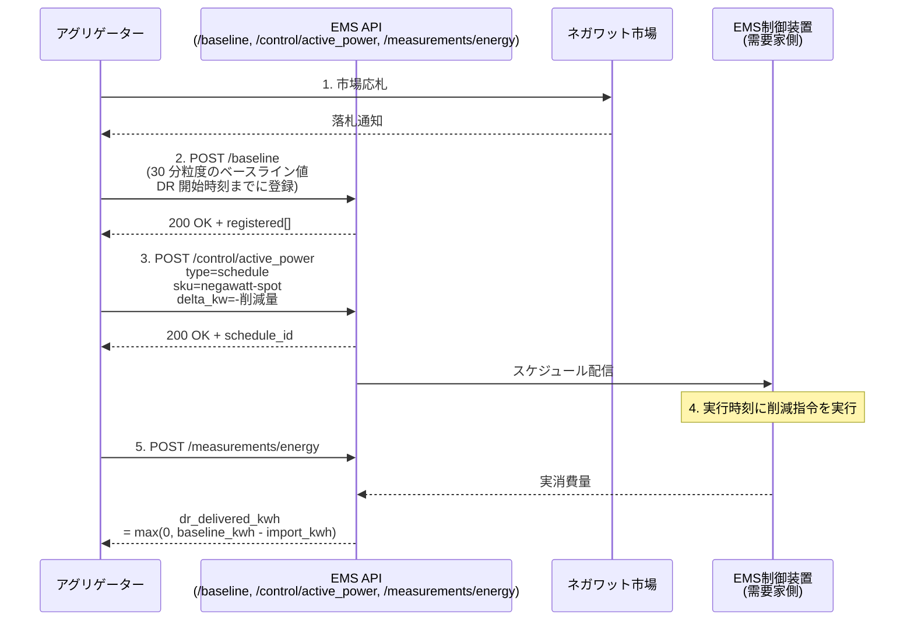
```mermaid
sequenceDiagram
    participant A as アグリゲーター
    participant API as EMS API<br/>(/baseline, /control/active_power, /measurements/energy)
    participant M as ネガワット市場
    participant EMS as EMS制御装置<br/>(需要家側)

    A->>M: 1. 市場応札
    M-->>A: 落札通知
    A->>API: 2. POST /baseline<br/>(30 分粒度のベースライン値<br/>DR 開始時刻までに登録)
    API-->>A: 200 OK + registered[]
    A->>API: 3. POST /control/active_power<br/>type=schedule<br/>sku=negawatt-spot<br/>delta_kw=-削減量
    API-->>A: 200 OK + schedule_id
    API->>EMS: スケジュール配信
    Note over EMS: 4. 実行時刻に削減指令を実行
    A->>API: 5. POST /measurements/energy
    EMS-->>API: 実消費量
    API-->>A: dr_delivered_kwh<br/>= max(0, baseline_kwh - import_kwh)
```

サンプル: [付録 B.4](ems-openapi-v2-samples.md#b4-controlactive_power)

---

### 9.5 有効電力スケジュール管理 `/control/active_power/schedules`

#### 9.5.1 スケジュール重複時の動作（後勝ちルール）

##### 適用範囲（重複判定の前提）

後勝ちルールは「**異なる市場応札 SKU 同士のみ**併存可能、それ以外はすべて上書き」で重複判定する（例外: `jepx-da` ⇄ `jepx-ttv` は**同一の kWh ディスパッチカテゴリ**として上書き対象）。**複合商品（`compound`）と単独 SKU（`fcr` / `s-frr` / `frr` / `rr`）の同時保有を成立させるため**、市場応札 SKU 同士に限り別 `schedule_id` で並列記録される。

| ケース | 動作 |
|------|------|
| 同一期間 + **異なる市場応札 SKU 同士**（`jepx-da` ⇄ `jepx-ttv` を除く。例: `frr` ⇄ `rr`、`compound` ⇄ `rr-fit`、`compound` ⇄ `frr`）| **併存可能**（別 `schedule_id` で並列記録）|
| 同一期間 + **`jepx-da` ⇄ `jepx-ttv`** | **後勝ちで上書き**（同一の kWh ディスパッチカテゴリとして扱う、5 ケース処理。[§10.3](#103-jepx-時間前市場jepx-ttv) 参照）|
| 同一期間 + **同一 SKU**（市場応札 SKU、`fcr` / `s-frr` / `frr` / `rr` / `rr-fit` / `jepx-da` / `jepx-ttv` / `negawatt-spot` / `compound`）| **後勝ちで上書き**（下記 5 ケース処理）|
| 同一期間 + **`sku: null` 同士**（市場応札なしの運用指令）| **後勝ちで上書き**（5 ケース処理）|
| 同一期間 + **`null` ⇄ 市場応札 SKU**（例: `null` ⇄ `frr`、`null` ⇄ `compound`）| **後勝ちで上書き**（5 ケース処理）|

> **`null` を独立カテゴリにしない理由**: `sku: null` を市場応札 SKU と並列保持できるようにすると、運用指令と市場応動が同時に走り、リソースが二重に駆動される事故を招く。同一期間内では「最後に登録されたものが意図」と解釈し、市場応札 SKU か `null` のいずれか一方のみが有効になる。

> **複合商品 (`compound`) との関係**: `compound` は単独 SKU（`fcr` / `s-frr` / `frr` / `rr`）と**異なる SKU**として扱われ、両者は別 `schedule_id` で**併存可能**。`compound` の `compound_breakdown` 内に同じ商品（例: `frr`）が含まれていても、単独 `frr` スケジュールと併存できる（リソース能力の上限内で）。これは取引規程別冊「複合約定」の「複合商品ΔkWの内数」運用と整合する。

##### 5 ケース処理（同一 SKU 内のみ）

5 つのケースはいずれも **同一の interval splitting アルゴリズム** の入力位相違いであり、独立した処理ではない。下記 gantt 図で時間軸上の関係を、flowchart でアルゴリズム本体を示す。

###### ケース別の時系列図


```mermaid
gantt
    title スケジュール重複時の 5 ケース（既存 → 新規 → 結果）
    dateFormat HH:mm
    axisFormat %H:%M

    section ケース1 完全一致
    既存 id=A 1000kW              :done, 14:00, 1h
    新規 1500kW                   :crit, 14:00, 1h
    結果 id=A 継承 1500kW         :active, 14:00, 1h

    section ケース2 中間部分重複
    既存 id=B 1000kW              :done, 14:00, 4h
    新規 1500kW                   :crit, 15:00, 2h
    結果1 id=B split 1000kW       :active, 14:00, 1h
    結果2 id=C 新規 1500kW        :active, 15:00, 2h
    結果3 id=B-2 新規 1000kW      :active, 17:00, 1h

    section ケース3 前半重複
    既存 id=D 1000kW              :done, 14:00, 4h
    新規 1500kW                   :crit, 13:00, 2h
    結果1 id=E 新規 1500kW        :active, 13:00, 2h
    結果2 id=D split 1000kW       :active, 15:00, 2h

    section ケース4 後半重複
    既存 id=F 1000kW              :done, 14:00, 4h
    新規 1500kW                   :crit, 17:00, 2h
    結果1 id=F split 1000kW       :active, 14:00, 3h
    結果2 id=G 新規 1500kW        :active, 17:00, 2h

    section ケース5 完全包含
    既存 id=H 1000kW              :done, 15:00, 1h
    新規 1500kW                   :crit, 14:00, 3h
    結果 id=I 新規 1500kW         :active, 14:00, 3h
```

色の意味: **グレー** = 操作前の既存 / **赤** = クライアントの新規 POST / **青** = 操作後 DB に残るスケジュール。

###### 処理アルゴリズム

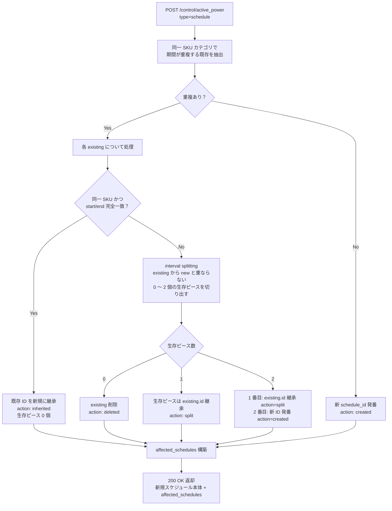
```mermaid
flowchart TD
    Start[POST /control/active_power<br/>type=schedule] --> Find[同一 SKU カテゴリで<br/>期間が重複する既存を抽出]
    Find --> Empty{重複あり？}
    Empty -->|No| CreateOnly[新 schedule_id 発番<br/>action: created]
    Empty -->|Yes| Loop[各 existing について処理]

    Loop --> SameKey{同一 SKU かつ<br/>start/end 完全一致？}
    SameKey -->|Yes| Inherit[既存 ID を新規に継承<br/>action: inherited<br/>生存ピース 0 個]
    SameKey -->|No| Split[interval splitting<br/>existing から new と重ならない<br/>0 〜 2 個の生存ピースを切り出す]
    Split --> SurvCount{生存ピース数}
    SurvCount -->|0| Deleted[existing 削除<br/>action: deleted]
    SurvCount -->|1| OneSurv[生存ピースは existing.id 継承<br/>action: split]
    SurvCount -->|2| TwoSurv[1 番目: existing.id 継承 action=split<br/>2 番目: 新 ID 発番 action=created]

    Inherit --> Resp[affected_schedules 構築]
    Deleted --> Resp
    OneSurv --> Resp
    TwoSurv --> Resp
    CreateOnly --> Resp
    Resp --> End[200 OK 返却<br/>新規スケジュール本体 + affected_schedules]
```

###### ケース別アクション対応

| ケース | 既存の生存ピース数 | `affected_schedules` の構成 | `schedule_id` の挙動 |
|--------|:-:|---|---|
| **1. 完全一致**（同 SKU）| 0（全置換）| `inherited`（既存 ID）+ 新規本体に同 ID 適用 | **既存 ID を継承**、新 ID 発番なし |
| **2. 中間部分重複** | 2（前後）| `split`（既存 ID、前ピース）+ `created`（新規本体）+ `created`（後ピース新 ID）| 前ピースは既存 ID 継承、後ピースと新規本体は新 ID |
| **3. 前半重複** | 1（後半残存）| `created`（新規本体）+ `split`（既存 ID、後半残存）| 後半残存は既存 ID 継承、新規本体は新 ID |
| **4. 後半重複** | 1（前半残存）| `split`（既存 ID、前半残存）+ `created`（新規本体）| 前半残存は既存 ID 継承、新規本体は新 ID |
| **5. 完全包含**（既存 ⊂ 新規）| 0 | `deleted`（既存 ID 破棄）+ `created`（新規本体に新 ID）| 既存 ID 破棄、新 ID 発番 |

###### 不変条件（実装テスト用）

```
∀ 同一 SKU カテゴリの schedule S1, S2 (S1 ≠ S2):
    [S1.start, S1.end) ∩ [S2.start, S2.end) = ∅          # 同 SKU の重複なし
∀ schedule S:
    S.start < S.end ∧ end - start ≥ 1 分                  # 0 時間禁止、最小粒度
```

> **生存ピース < 1 分の挙動**: interval splitting の結果、生存ピースの長さが `1 分未満`（最小粒度違反）になる場合は **400 エラー `schedule_split_too_narrow`** を返却し、新規 POST 自体を拒否する。クライアント側で start/end を 1 分単位で揃えて再 POST すること。

##### `/control/active_power` レスポンスでの schedule_id 伝達

`/control/active_power` のレスポンスには `schedule_id`（プライマリ）と `affected_schedules` 配列を返却する。複数 ID 発番ケース（中間部分重複・前半重複・後半重複）では、`affected_schedules` に**全ての**新規・既存・削除 schedule_id を含める。

| 項目名 | 型 | 説明 |
|--------|------|------|
| `schedule_id` | string | 今回の指令で**新規登録された区間**の代表 schedule_id（中間部分重複の場合は中間部分の新規 ID、完全一致の場合は引き継いだ既存 ID）|
| `affected_schedules` | array | 重複解決の影響を受けた全スケジュールの一覧 |
| `affected_schedules[].schedule_id` | string | 影響を受けた schedule_id |
| `affected_schedules[].action` | string | `created`（新規発番）/ `inherited`（既存ID継承）/ `split`（既存IDを分割で再利用）/ `deleted`（削除）|
| `affected_schedules[].start_time` | string | 当該スケジュールの開始時刻（action=deleted 時は削除前の値）|
| `affected_schedules[].end_time` | string | 当該スケジュールの終了時刻（action=deleted 時は削除前の値）|

**例：中間部分重複（既存 14:00-18:00 sch_001 に対し新規 15:00-17:00 を登録）**:

```json
{
  "schedule_id": "sch_010",
  "affected_schedules": [
    { "schedule_id": "sch_001", "action": "split",   "start_time": "2025-06-13T14:00:00Z", "end_time": "2025-06-13T15:00:00Z" },
    { "schedule_id": "sch_010", "action": "created", "start_time": "2025-06-13T15:00:00Z", "end_time": "2025-06-13T17:00:00Z" },
    { "schedule_id": "sch_011", "action": "created", "start_time": "2025-06-13T17:00:00Z", "end_time": "2025-06-13T18:00:00Z" }
  ],
  ...
}
```

> アグリゲーターは `affected_schedules` を確認することで、`GET /control/active_power/schedules` を追加で呼ばずに重複解決後の状態を把握できる。

##### 実行中スケジュールへの上書き POST

後勝ち上書きは**実行中のスケジュールにも適用可能**。新規 `start_time` は現在時刻+1分以降（[§8.2](#82-スケジュール登録パラメータ未来時刻)）のため、実行中スケジュールは interval splitting により**実行済み部分（既存 ID 継承、実績として保持）と置換部分**に分割される。削除制約（実行中・開始 1 分前以内・完了済みの DELETE 不可、409、[§9.5.3](#953-スケジュール削除-delete-controlactive_powerschedulesschedule_idschedule_id)）は **DELETE にのみ適用**され、上書き POST には適用されない（GC 指令の当日変更を可能にするため）。

#### 9.5.2 スケジュール取得 `GET /control/active_power/schedules`

##### 取得範囲

スケジュールの取得対象は **過去 30 日 〜 未来 90 日** の範囲（`start_time` 基準）。それ以外（30 日超過の過去・90 日超過の未来）は取得不可（レスポンスの `schedules` 配列に含まれない）。

| 範囲 | 値 | 備考 |
|------|----|----|
| 過去側 | 現在時刻 - 30 日 | 完了済みスケジュールも 30 日以内なら取得可。30 日以上前は履歴系 API（`/measurements/active_power` 60 日 / `/measurements/energy` 12 か月）で実績取得 |
| 未来側 | 現在時刻 + 90 日 | 登録可能範囲（§8.2、最大 90 日先）と一致 |

##### クエリパラメータ

| パラメータ | 必須 | 説明 |
|----------|:----:|------|
| `start_time_from` | 任意 | 取得対象スケジュールの最早 `start_time`（ISO 8601、現在時刻 - 30 日 以降）|
| `start_time_to` | 任意 | 取得対象スケジュールの最遅 `start_time`（ISO 8601、現在時刻 + 90 日 以前）|

> `start_time_from` / `start_time_to` を範囲外で指定した場合は 400 エラー（`schedule_query_out_of_range`）。省略時はデフォルト範囲（過去 30 日 〜 未来 90 日）全体を返却。
>
> **ページネーション非対応**: 本 API はページネーションをサポートしない。取得範囲は最大 120 日（過去30日 + 未来90日）に制限されており、その範囲内のすべてのスケジュールを単一レスポンスで返却する。1 EMS あたりのスケジュール件数は実運用上数百件以下を想定。

##### スケジュール要素の項目定義

| 項目名 | 適用 | 説明 |
|--------|------|------|
| `schedule_id` | 全 | スケジュール識別子（v2 で `id` から改名）|
| `scope` | `components.length ≥ 2` | `site` / `component`（サイトレベル / コンポーネント指定の区別、単機サイトでは省略可）|
| `component_id` | `scope=component` のとき | 対象コンポーネント識別子 |
| `component_type` | `scope=component` のとき | 対象コンポーネント種別（`battery` / `generator` / `consumer`）|
| `start_time` / `end_time` | 全 | 実行時間帯（ISO 8601 UTC）|
| `site_kw` | `scope=site` | サイトレベル目標電力（連系点絶対値）|
| `delta_kw` | `scope=component` または単機サイト | Δ 電力指令（連系点基準）。FCR 以外の SKU で値あり、`sku: "fcr"` のときは `null`。`sku: "compound"` 時は複合商品の合計容量 |
| `fcr_response_kw` | `scope=component`（fcr_capable component）または単機サイト（`fcr_capable: true`）| FCR 応動可能量（双方向幅、絶対値・正値）。`sku: "fcr"` または `sku: "compound"` で FCR を含むときに非null、それ以外は `null` |
| `compound_breakdown` | `scope=component` または単機サイト（参考情報、任意）| 複合商品の容量内訳（キー: `fcr_response_kw` / `s-frr` / `frr` / `rr` の組み合わせ、内数ロジック）。`sku: "compound"` のときのみ非null、それ以外は `null`。詳細は [§7.4](#74-複合商品-compound) 参照 |
| `baseline_kw` | 全 | スロットのベースライン電力（consumer 単機サイトでは `/baseline` 登録値、それ以外は本指令の `baseline_kw` 入力値、未指定なら 0）|
| `sku` | 全 | 応札商品 SKU |
| `created_at` | 全 | スケジュール登録時刻 |

#### 9.5.3 スケジュール削除 `DELETE /control/active_power/schedules?schedule_id={schedule_id}`

> **注意**: v1.x のクエリパラメータは `?id=` でしたが、v2 で **`?schedule_id=`** に変更（VPP API と整合）。

##### 削除制約条件

| 条件 | 削除可否 | エラーコード |
|------|:--------:|:-----------:|
| 実行中 | 不可 | 409 |
| 開始 1 分前以内 | 不可 | 409 |
| 完了済み | 不可 | 409 |
| 予定済み（開始 1 分前以上）| 可能 | 200 |
| 指定 schedule_id が存在しない | - | 404 |

サンプル: [付録 B.5](ems-openapi-v2-samples.md#b5-controlactive_powerschedules)

---

### 9.6 ベースライン管理 `/baseline`

DR 履行評価に用いる **consumer サイトの 30 分粒度ベースライン値（kW）** を登録・取得する。

#### 9.6.1 設計方針

本 API は **CBL（Customer Baseline Load）の算定ロジックを持たない**。アグリゲーターが業界ガイドラインに基づき算定した 30 分コマ単位のベースライン値を本 API に事前登録し、サーバー側は登録値を**そのまま精算に用いる**（値ストア型）。

> **スコープ**: 本 API は `consumer` component を含むサイトの **DR 履行評価用** ベースライン値のみを管理する。`generator` の計画発電量・`battery` の運転計画は `/control/active_power` のスケジュール（`baseline_kw` パラメータ）で指定するため、本 API の対象外（§9.4 参照）。`/status` `/serviceplan` `/measurements/active_power` の `baseline_kw` フィールドは、consumer の場合は本 API の登録値、それ以外は当該スロットを覆う `/control/active_power` schedule の `baseline_kw` を返す。

> **用語整理 — 「ベースライン」と「基準値」**: 需給調整市場（OCCTO/EPRX）の取引規程およびビジネスプロトコル標準規格における「**基準値**（基準値計画）」と、本仕様書の「**ベースライン**（`baseline_kw`）」は同根の概念。リソース性質により内部の算定根拠が異なる:
> - **消費リソース（DR / consumer）**: 基準値 = CBL（過去データ推計、`High 4 of 5（当日調整あり）` 等）→ 本 API（`/baseline`）の登録値
> - **発電リソース（generator）**: 基準値 = 計画発電量（事業者が決定、負値で送電方向）→ `/control/active_power` schedule の `baseline_kw`
> - **蓄電池（battery）**: 基準値 = 計画運転値（事業者が決定）→ `/control/active_power` schedule の `baseline_kw`
>
> 需給調整市場で消費リソースが応札する場合（`frr` / `rr` 等での DR 参加）、基準値計画として TSO に提出されるのは本 API の `/baseline` 登録値である。

| 項目 | 本仕様の扱い |
|------|--------------|
| 算定方式の選択（`High 4 of 5` / `同等日採用法` / `事前計測` / `Regression` 等）| **アグリゲーター責任**（API は受け付けない）|
| 当日調整（DR 実施時間の 5 時間前 〜 2 時間前の 6 コマで補正）| **アグリゲーター責任**（後勝ち再 POST で対応）|
| 算定根拠データの保存 | アグリゲーター側で管理（API では `/measurements/energy` で過去 12 か月分の `import_kwh` を提供）|
| 30 分粒度の値の保管・取得・精算評価 | **本 API の責任** |

> **公開ガイドラインとの整合**: ERAB ガイドライン（経産省）の標準ベースライン `High 4 of 5（当日調整あり）`、ネガワット取引ガイドラインの「ベースラインは 30 分コマ毎に設定」、需給調整市場の 30 分コマ精算と整合する設計。算定方式の選択をアグリゲーター側に委ねることで、業界制度改定（粒度変更・補正方式変更等）に EMS API の改修を伴わずに追従できる。

#### 9.6.2 共通制約

| 項目 | 値 | 備考 |
|------|----|----|
| 時間粒度 | **30 分固定** | `start_time` / `end_time` は UTC で `00 分` または `30 分` 境界に必須アライン（外れたら 400 `baseline_unaligned`）|
| `end_time - start_time` | **正確に 30 分** | 範囲指定の連続登録は配列要素を複数渡す |
| 対象 component | `consumer` component を含むサイトのみ | それ以外は 404 `baseline_not_applicable` |
| 登録単位 | サイトレベル `baseline_kw`（連系点基準）| `components.length ≥ 2` でも consumer 由来のベースラインのみ管理 |
| バルク上限 | **1 リクエストあたり最大 336 件**（1 週間分 = 48 × 7）| 超過時 400 `baseline_bulk_too_large` |
| 保管期間 | **過去 12 か月（365 日）**、未来 90 日 | `/measurements/energy` と一貫 |

#### 9.6.3 POST `/baseline` — 登録（一括）

```
POST /baseline
```

##### リクエスト

| 項目 | 必須 | 説明 |
|------|:----:|------|
| `ems_id` | ○ | 対象 EMS 識別子 |
| `baselines` | ○ | 30 分スロット配列（1 〜 336 件）|
| `baselines[].start_time` | ○ | スロット開始時刻（ISO 8601 UTC、30 分境界）|
| `baselines[].end_time` | ○ | スロット終了時刻（start_time + 30 分）|
| `baselines[].baseline_kw` | ○ | ベースライン電力（kW、小数第 1 位まで、`0 ≤ baseline_kw ≤ contract_kw`）|
| `baselines[].method_note` | 任意 | 算定方式の自由記述メモ（例: `"High 4 of 5 (adj)"`）、監査用、最大 64 文字、精算には用いない |

##### バリデーション

| 条件 | エラーコード | `error_type` |
|------|:-----------:|--------------|
| `start_time` / `end_time` が 30 分境界に未アライン | 400 | `baseline_unaligned` |
| `end_time - start_time ≠ 30 分` | 400 | `baseline_unaligned` |
| `baseline_kw < 0` または `> contract_kw` | 400 | `baseline_out_of_range` |
| `baselines[]` 件数 > 336 | 400 | `baseline_bulk_too_large` |
| 対象サイトに `consumer` component なし | 404 | `baseline_not_applicable` |
| **当該スロットを含む DR が実行完了済**（`/control/active_power/schedules` で `negawatt-spot` 等の完了済スケジュールが存在）| 422 | `baseline_locked_after_dr` |

> **遡及修正の禁止**: 当該スロットの DR が完了済の場合、精算根拠の改ざんを防ぐためベースライン値の修正を拒否する（422）。当日調整は **DR 開始時刻まで** の再 POST で対応する。

##### 重複登録（後勝ち）

同一スロットへの再登録は **後勝ちで上書き**（`/control/active_power` と一貫した規約）。アグリゲーターは当日調整時に「5 時間前 〜 2 時間前」の 6 コマだけを再 POST すればよい。

##### レスポンス

```json
{
  "ems_id": "...",
  "registered": [
    { "start_time": "...", "end_time": "...", "baseline_kw": 1500.0, "action": "created" },
    { "start_time": "...", "end_time": "...", "baseline_kw": 1480.0, "action": "overwritten" }
  ],
  "timestamp": "..."
}
```

| 項目 | 説明 |
|------|------|
| `registered[].action` | `created`（新規）/ `overwritten`（既存値を上書き）|

#### 9.6.4 GET `/baseline` — 取得

```
GET /baseline?start_time={ISO8601}&end_time={ISO8601}
```

##### クエリパラメータ

| パラメータ | 必須 | 説明 |
|----------|:----:|------|
| `start_time` | ○ | 取得対象スロットの最早開始時刻（30 分境界、UTC）|
| `end_time` | ○ | 取得対象スロットの最遅終了時刻（30 分境界、UTC、`start_time` より未来）|

##### 制約

| 条件 | エラーコード |
|------|:-----------:|
| `start_time` < 現在時刻 - 365 日 | 404（保管期間外）|
| `start_time` / `end_time` が 30 分境界に未アライン | 400 `baseline_unaligned` |
| `end_time - start_time > 7 日`（= 336 件超）| 410 `baseline_query_too_large` |

##### レスポンス

```json
{
  "ems_id": "...",
  "baselines": [
    { "start_time": "...", "end_time": "...", "baseline_kw": 1500.0, "method_note": "...", "registered_at": "..." }
  ],
  "timestamp": "..."
}
```

未登録スロットは `baselines` 配列に含めない（呼び出し側は欠損として扱う）。

> **削除 API は提供しない**: ベースライン値の誤登録は POST の後勝ち上書きで訂正する（DR 実行完了済スロットは 422 で拒否、訂正不可）。完全削除のニーズは想定しない（再登録すれば足りるため）。

#### 9.6.5 DR 履行評価への接続

DR 履行量の算定式（§10.6 と一貫）:

```
baseline_kwh = Σ_{30分コマ i ∈ [start, end]} baseline_kw_i × 0.5
dr_delivered_kwh = max(0, baseline_kwh - import_kwh)
```

DR 開始時刻にベースライン値が未登録の場合、`/control/active_power`（`sku=negawatt-spot`）配信時に **422 `baseline_not_configured`** を返却し、配信を中止する。クライアントはこのエラーを受けてベースライン登録 → 再 POST を実施する。

#### 9.6.6 運用フロー（参考）

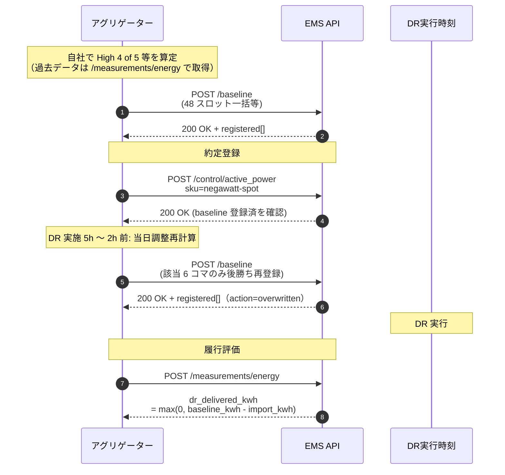
```mermaid
sequenceDiagram
    autonumber
    participant A as アグリゲーター
    participant API as EMS API
    participant DR as DR実行時刻

    Note over A: 自社で High 4 of 5 等を算定<br/>（過去データは /measurements/energy で取得）
    A->>API: POST /baseline<br/>(48 スロット一括等)
    API-->>A: 200 OK + registered[]

    Note over A,API: 約定登録
    A->>API: POST /control/active_power<br/>sku=negawatt-spot
    API-->>A: 200 OK (baseline 登録済を確認)

    Note over A: DR 実施 5h 〜 2h 前: 当日調整再計算
    A->>API: POST /baseline<br/>(該当 6 コマのみ後勝ち再登録)
    API-->>A: 200 OK + registered[]（action=overwritten）

    Note over DR: DR 実行
    Note over A,API: 履行評価
    A->>API: POST /measurements/energy
    API-->>A: dr_delivered_kwh<br/>= max(0, baseline_kwh - import_kwh)
```

> **VPP 経由運用の場合**: 上図の `POST /baseline` は本 EMS API 直接呼び出しのまま（VPP API はベースライン値を保管しない、[vpp-api-v1.md §6 baseline_kw について](vpp-api-v1.md#61-baseline_kw-について) 参照）。アグリゲーターは本 API で値を登録した後、`GET /baseline` で取得した 30 分スロット値を VPP `/control/active_power` の `member_baselines[]` に詰めて指令する。この場合、上図の `POST /control/active_power` は **VPP `/control/active_power`** に置き換わる。

サンプル: [付録 B.6](ems-openapi-v2-samples.md#b6-baseline)

---

### 9.7 瞬時電力履歴 `/measurements/active_power`

```
POST /measurements/active_power
```

電力値（kW）と系統周波数の時系列データを取得。種別ごとの返却有無は下表で確認。

#### 共通リクエスト項目

| 項目名 | 必須 | 説明 |
|--------|:----:|------|
| `request_id` | 任意 | リクエスト識別子（レスポンスに返却）|
| `start_time` | ○ | 取得開始時刻（ISO 8601、**過去 60 日以内**。それ以前は 404）|
| `end_time` | ○ | 取得終了時刻（ISO 8601）|
| `interval_seconds` | 任意 | サンプリング間隔（秒）。**`1`（高頻度サンプル）/ `60` / `1800`（30 分）/ `3600`（1 時間）/ `86400`（日次）の 5 値のみ**指定可（それ以外は 400 `invalid_parameter`）。**省略時は `60`**（60 秒間隔の時系列）。本 API は瞬時値の**サンプリング間隔**（[§9.8](#98-電力量履歴-measurementsenergy) の集計粒度とは意味が異なる。`1800` 以上は 30 分コマ・日次トレンドの参照用）|

#### data 要素フィールド対応表

凡例: 「適用」列は当該フィールドが返却されるサイト構成を示す。サイトレベル値は同一サイト内の component 集約として返却され、component 個別値は `components[]` 内に格納される（`components.length ≥ 2` のとき）。

| 項目名 | 単位 | 適用 | 説明 |
|--------|:----:|------|------|
| `current_kw` | kW | 全 | 連系点絶対電力（受電+/送電-、`components.length ≥ 2` のサイトはサイト連系点合計）|
| `delta_kw` | kW | 全 | **実測差分** = `current_kw - baseline_kw`（連系点単方向Δ）。`components.length ≥ 2` のサイト: サイトレベルおよび `components[]` 内 battery / generator / consumer に格納 |
| `dispatched_delta_kw` | kW\|null | 全 | **その時点で配信されていた指令Δ電力**（時系列達成度分析用）。指令未配信時刻 / FCR 時は `null`（FCR は `fcr_response_kw` で表現）。`delta_kw / dispatched_delta_kw` で時系列達成度を算出可能 |
| `fcr_response_kw` | kW\|null | 全（`active_sku: "fcr"` または `active_sku: "compound"` で FCR を含む場合に非null）| FCR 応動可能量（双方向幅、絶対値）。`/specifications.fcr_capable: true` のみ意味を持つ。`components.length ≥ 2` のサイト: サイトレベル合計 + `components[]` 内 fcr_capable component に格納 |
| `compound_breakdown` | object\|null | 全（`active_sku: "compound"` 時のみ非null）| 複合商品の容量内訳（キー: `fcr_response_kw` / `s-frr` / `frr` / `rr` の組み合わせ、内数ロジック）。それ以外は `null`（[§7.4](#74-複合商品-compound) 参照）|
| `baseline_kw` | kW | 全 | ベースライン電力（精算用、generator は計画発電量を負値で表現、未設定時は 0）|
| `soc` | % | battery component を含むサイト（サイトレベル）| SOC（`components.length ≥ 2` のサイトでは `components[]` 内 battery component に格納）|
| `irradiance_w_m2` | W/m² | generator (kind=pv) component を含むサイト | 日射強度（任意）。`components.length ≥ 2` のサイトでは `components[]` 内 generator component に格納 |
| `dr_active` | 0/1 | consumer component を含むサイト | DR 応動状態。`components.length ≥ 2` のサイトでは `components[]` 内 consumer component に格納 |
| `dr_target_reduction_kw` | kW\|null | consumer component を含むサイト（応動中のみ非null）| DR 指令削減量。`components.length ≥ 2` のサイトは同上 |
| `dr_actual_reduction_kw` | kW\|null | consumer component を含むサイト（応動中のみ非null）| DR 実履行量。`components.length ≥ 2` のサイトは同上 |
| `active_sku` | string\|null | 全 | 応動中 SKU（非応動時 `null`、**複合応動中は `"compound"`**、[§7.2](#72-sku-フィールドの命名規則) 参照）|
| `output_control_limit` | % | battery または generator component を含むサイト | EMS 制御装置が TSO から取得した出力制御指令値（参照のみ）。`components.length ≥ 2` のサイトは `components[]` 内 battery / generator component に格納 |
| `actual_frequency` | Hz | 全 | 系統周波数 |
| `components` | array | `components.length ≥ 2` | `components.length ≥ 2` のサイトでは必須返却。単機サイトはサイトレベル値と同値のため省略可。返却時、各 component の上記フィールドサブセット |
| `timestamp` | - | 全 | レコード時刻（ISO 8601 UTC）|

**取得最大時系列ポイント数**: **44,640 件**（`ceil((end_time - start_time) / interval_seconds)`）

> 44,640 = 31 日 × 24 時間 × 60 ポイント/時（60 秒間隔）を基準として設定。期間と `interval_seconds` の組み合わせで決まり、超過時は 410 エラー。VPP API [§8.1](vpp-api-v1.md#81-post-measurementsactive_power瞬時電力履歴) と同じ上限。

**主要な組み合わせ例**:

| 期間 | interval_seconds | 時系列ポイント数 | 可否 |
|------|-----------------|----------------|------|
| 31日 | 60（デフォルト）| 44,640 | ✅ |
| 31日 | 1800 | 1,488 | ✅ |
| 31日 | 86400 | 31 | ✅ |
| 12時間 | 1 | 43,200 | ✅ |
| 1日 | 1 | 86,400 | ❌ 410エラー |
| 31日 | 1 | 2,678,400 | ❌ 410エラー |

**期間制限**: 取得期間（`end_time - start_time`）は最大 **31 日**。超過時は 410 エラー（[§8.3.1](#831-measurementsactive_power瞬時電力履歴) 参照）。

**取得期間中の out_of_service 扱い**: 期間中に `status: 9` だった時刻のレコードは、計測値が存在する場合は含まれます。計測欠損時刻はレコードに含まれません（連続性保証なし、欠損補完はクライアント側で実施）。

サンプル: [付録 B.7](ems-openapi-v2-samples.md#b7-measurementsactive_power)

---

### 9.8 電力量履歴 `/measurements/energy`

```
POST /measurements/energy
```

期間内累積電力量（kWh）を取得。

#### 経路追跡フィールドの命名規約

サイト内のエネルギーフロー（PV → battery、battery → grid 等）は **各 component に配置された経路追跡フィールド**で表現します。命名規約は以下の通り:

| パターン | 意味 |
|---|---|
| `<component>.from_<src>_kwh` | **当該 component** が `<src>`（grid / generator 等）から受け取った量 |
| `<component>.to_<dst>_kwh` | **当該 component** が `<dst>`（grid / battery / load 等）へ送った量 |

> **v1.x → v2.0**: v1.x の battery 専用 `charge_from_<src>_kwh` / `discharge_to_<dst>_kwh` プレフィックスは v2.0 で廃止。全 component で `from_` / `to_` の 2 パターンに統一（[§12 #6](#v20-2026-05-12) 参照）。

> **送信元 / 送信先のもう一方は「当該 component 自身」**: フィールドの配置先 component が暗黙の起点。例: `generator.to_battery_kwh` は **「この generator component から battery component へ」** の送電量、`battery.from_generator_kwh` は **「battery component が generator component から受けた」** 充電量。同一フローを両側から記録（同値）。

> **対称性チェック**: 同一サイト内で `Σ generator[i].to_battery_kwh == Σ battery[j].from_generator_kwh`（複数 component がある場合も総和は一致）。同様に `generator.to_load_kwh + battery.to_load_kwh + grid_to_load_kwh = consumer.consumption_kwh`（エネルギー保存則）。

#### 共通リクエスト項目

| 項目名 | 必須 | 説明 |
|--------|:----:|------|
| `request_id` | 任意 | リクエスト識別子 |
| `start_time` | ○ | 取得開始時刻（ISO 8601、**過去 12 か月（365 日）以内**。それ以前は 404）|
| `end_time` | ○ | 取得終了時刻（ISO 8601、最大 31 日。`start_time` から **最小 60 秒以降**）|
| `interval_seconds` | 任意 | 集計粒度（秒）。**`1800`（30 分コマ）/ `3600`（1 時間）/ `86400`（日次）の 3 値のみ**指定可（それ以外は 400 `invalid_parameter`）。**省略時は期間全体を 1 レコードとして返却**。レスポンスは指定有無によらず常に `data[]` 形式（[後述](#レスポンス構造data-統一)）|

> **保管期間とサンプルレート**: 電力量履歴は精算・月次レポート用途のため**最小 60 秒間隔**で集計し、**12 か月**保管します（瞬時電力履歴 60 日と異なる長期保管）。

#### レスポンス構造（data[] 統一）

`/measurements/energy` のレスポンスは、`interval_seconds` の指定有無によらず**常に `data[]` 配列**で返却する（`/measurements/active_power` [§9.7](#97-瞬時電力履歴-measurementsactive_power) と同じ考え方。クライアントは常に `data[]` を読めばよい）:

| `interval_seconds` | `data[]` の内容 |
|---|---|
| 省略時 | **期間全体を 1 レコード**（レコードの `start_time` / `end_time` = リクエスト指定値）|
| `1800` / `3600` / `86400` | 期間を集計粒度ごとに区切った複数レコード（30 分コマ別 / 1 時間別 / 日次）|

> **v2.1 からの非互換変更**: v2.1 以前は kWh 系フィールドを top-level に直接配置していたが、v2.2 でレスポンス構造を `/measurements/active_power` と統一し、常に `data[]` 配列内に配置する形へ変更した（[§12 v2.2](#v22-2026-07-25) 参照）。

30 分コマ単位の精算検証（インバランス明細確認・JEPX コマ別約定量との突合・FIP プレミアム対象量の 30 分区分算定）や日次レポートは `interval_seconds` を指定して取得する。

**区切り方**: `start_time` を起点として `interval_seconds` ごとに区切る（任意時刻起点可）。最終レコードが `end_time` に満たない場合は端数期間で集計し `end_time` で打ち切る。

> **精算コマとの突合**: 30 分コマ精算と突合する場合は、`start_time` を 30 分境界（UTC 00 分 / 30 分）にアラインして指定することを推奨（API 側での強制アラインは行わない）。

**data[] 各レコードの構成**:

| 項目名 | 説明 |
|--------|------|
| `start_time` / `end_time` | 当該レコードの集計区間（ISO 8601 UTC。最終レコードのみ端数期間になり得る）|
| 電力量（kWh）系フィールド | 定義・適用条件は次項「レスポンス項目」のとおり（`import_kwh` / `export_kwh` / `baseline_kwh` / `self_consumed_kwh` / `grid_to_load_kwh` / `consumption_kwh` / `imbalance_kwh` / `fit_export_kwh` / `fip_export_kwh` / `non_subsidized_export_kwh` / `curtailed_kwh` 系 / `dr_delivered_kwh`）。値は**当該レコードの集計区間の集計値** |
| `components[]` | `components.length ≥ 2` のサイトでは各レコード内に返却（経路追跡フィールド含む）|

**イベント系フィールドの扱い**: `dr_dispatched_count` / `dr_total_dispatched_minutes` は**期間サマリとしてトップレベルのみ**に返却し、`data[]` 各レコードには含めない（発動がコマを跨いだ場合の計上ルールの曖昧さを持ち込まないため。`components[]` 内にも配置しない）。

**集計整合性**: 同一期間・同一条件において、省略時（期間全体 1 レコード）の各 kWh フィールド値 = `interval_seconds` 指定時の `Σ data[]` が成立する（イベント系フィールドを除く）。計測欠損・`out_of_service` 時間帯は 0 として集計されるため、`data[]` は欠損レコードのスキップなく全区間分を返却する（瞬時電力履歴の欠損スキップ方式とは異なる）。

**最大レコード数**: 1,488 件（期間上限 31 日 × `interval_seconds: 1800`。期間制限 410 の範囲内で自動的に収まる）。

サンプル: [付録 B.8](ems-openapi-v2-samples.md#b8-measurementsenergy)（全例が `data[]` 形式。コマ別は [B.8.10](ems-openapi-v2-samples.md#b810-コマ別時系列取得interval_seconds-1800)）

#### レスポンス項目

凡例: 「適用」列は当該フィールドが返却されるサイト構成を示す。`components.length ≥ 2` のサイトのサイトレベル値は同一サイト内の component 集約として返却され、component 個別値は `components[]` 内に格納される。

> **フィールドの配置**: 下表の kWh 系フィールドおよび `components[]` は、**`data[]` 各レコード内**に配置される（省略時は期間全体の 1 レコード）。top-level に配置されるのはイベント系（`dr_dispatched_count` / `dr_total_dispatched_minutes`、期間サマリ）と `timestamp`（API 応答時刻）・識別子系のみ（[前述](#レスポンス構造data-統一) 参照）。

| 項目名 | 単位 | 適用 | 説明 |
|--------|:----:|------|------|
| `import_kwh` | kWh | 全 | 期間内累積受電電力量（連系点で受電したエネルギー）。battery: PCS 損失込み。generator: 夜間補機電力等で通常 0 に近い。consumer: 連系点での消費総量。`components.length ≥ 2` のサイト: サイト連系点での受電累積（系統 → サイト方向）|
| `export_kwh` | kWh | 全 | 期間内累積送電電力量。consumer 単機は通常 0（自家発電併設時のみ非 0）。`components.length ≥ 2` のサイト: サイト連系点での送電累積（サイト → 系統方向、`= generator.fip_export_kwh + battery.to_grid_kwh`）|
| `baseline_kwh` | kWh | generator / consumer component を含むサイト | 期間内ベースライン累積（精算用、未設定なら 0）。consumer は CBL の積分、`components.length ≥ 2` のサイトは `site_kw` 制御時の精算用 |
| `self_consumed_kwh` | kWh | サイトレベル | **自家消費量** = `generator.to_load_kwh` + `battery.to_load_kwh`（generator 由来 + battery 由来両方を含む）|
| `grid_to_load_kwh` | kWh | サイトレベル | サイト連系点経由で系統から負荷へ直接供給された量。`import_kwh - battery.from_generator_kwh` の関係。consumer component を含まないサイトでは常に 0 |
| `consumption_kwh` | kWh | consumer component を含むサイト | 負荷部の総消費量 = `grid_to_load_kwh + generator.to_load_kwh + battery.to_load_kwh`。`components.length ≥ 2` のサイトでは `components[]` 内 consumer component に格納 |
| `imbalance_kwh` | kWh | `site_capability.balancing_responsible: true` のサイト | 計画値同時同量のインバランス（FIP / non_subsidized）|
| `fit_export_kwh` | kWh | FIT 区分の generator component を含むサイト | FIT 対象として系統に直接送電した量。battery 併設不可のため単機 FIT は `export_kwh` と一致 |
| `fip_export_kwh` | kWh | FIP 区分の generator component を含むサイト | FIP 対象として generator から連系点に直接送電した量（battery 経由は別計上）|
| `non_subsidized_export_kwh` | kWh | non_subsidized 区分の generator component を含むサイト | 助成なしで系統に直接送電した量 |
| `curtailed_kwh` | kWh | generator component を含むサイト | 出力制御により抑制された発電電力量の合計。`components.length ≥ 2` のサイトでは `components[]` 内 generator component に格納 |
| `fit_curtailed_kwh` | kWh | FIT 区分の generator component を含むサイト | FIT 制度に基づく抑制量 |
| `non_firm_curtailed_kwh` | kWh | `site_capability.non_firm_connection: true` のサイト | ノンファーム連系による系統混雑時の抑制量 |
| `manual_curtailed_kwh` | kWh | generator component を含むサイト | EMS 運用担当による手動制御の抑制量 |
| `dr_delivered_kwh` | kWh | consumer component を含むサイト | DR 履行量 = max(0, `baseline_kwh - import_kwh`)（DR 発動時間帯のみ集計）。`components.length ≥ 2` のサイトでは `components[]` 内 consumer component に格納 |
| `dr_dispatched_count` | integer | consumer component を含むサイト | 期間内 DR 発動回数 |
| `dr_total_dispatched_minutes` | integer | consumer component を含むサイト | 期間内 DR 発動の合計時間（分）|
| `components` | array | `components.length ≥ 2` | `components.length ≥ 2` のサイトでは必須返却。単機サイトはサイトレベル値と同値のため省略可。返却時、各 component の上記フィールドサブセット + `component_id` + `component_type`。さらに battery component には経路追跡フィールド（`from_generator_kwh` / `from_grid_kwh` / `to_grid_kwh` / `to_load_kwh`）、generator component には助成区分別送電量（`to_battery_kwh` / `to_load_kwh`）を含む（後述）|
| `timestamp` | string | 全 | API 応答時刻（ISO 8601 UTC）|

> **損失について（battery）**: 連系点基準のため、`import_kwh - export_kwh` は蓄電池内部のエネルギー収支とは一致しません（PCS 効率・自己放電・補機電力の分が損失として計上）。

> **制度区分の生値は返却しない**: v2.0 では `/measurements/energy` のレスポンスに制度区分の生値（旧 `incentive_type` / `connection_type` 相当）を含めない。サイト能力は `/specifications.site_capability`（特に `marketable` / `balancing_responsible` / `non_firm_connection`）で取得し、精算上の助成区分は `fit_export_kwh` / `fip_export_kwh` / `non_subsidized_export_kwh` の非ゼロ有無で事後判別する。

#### PV+battery+負荷サイトのエネルギーフロー

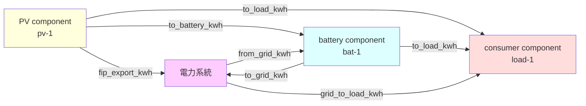
```mermaid
graph LR
    PV[PV component<br/>pv-1]
    BAT[battery component<br/>bat-1]
    LOAD[consumer component<br/>load-1]
    GRID[電力系統]
    
    PV -->|fip_export_kwh| GRID
    PV -->|to_battery_kwh| BAT
    PV -->|to_load_kwh| LOAD
    
    BAT -->|to_grid_kwh| GRID
    BAT -->|to_load_kwh| LOAD
    
    GRID -->|from_grid_kwh| BAT
    GRID -->|grid_to_load_kwh| LOAD
    
    style GRID fill:#fcf
    style PV fill:#ffd
    style BAT fill:#dff
    style LOAD fill:#fdd
```

##### battery component の経路追跡フィールド

| 項目名 | 単位 | 説明 |
|--------|:----:|------|
| `from_generator_kwh` | kWh | battery が同サイト内 generator から充電された量（PV / wind / biomass / hydro 等の全 generator_kind 合計）|
| `from_grid_kwh` | kWh | battery が系統から充電された量 |
| `to_grid_kwh` | kWh | battery から連系点経由で系統に送電された量 |
| `to_load_kwh` | kWh | battery から同サイト内 load に放電された量（自家消費の一部）|

##### generator component の助成区分別フィールド

> 下表の「出現条件」は EMS運用担当側の登録判定として参考記載。クライアントは出現したフィールドの非ゼロ値で実質的な助成区分を判別する。

| 項目名 | 単位 | 出現条件（登録時の助成区分）| 説明 |
|--------|:----:|:------------------:|------|
| `fit_export_kwh` | kWh | FIT のみ | FIT 対象として系統に直接送電した量。FIT サイトには battery 併設不可のため `to_battery_kwh` は出現しない |
| `fip_export_kwh` | kWh | FIP のみ | FIP 対象として generator から連系点に直接送電した量（battery 経由は別計上）|
| `non_subsidized_export_kwh` | kWh | non_subsidized のみ | 助成なしで系統に直接送電した量 |
| `to_battery_kwh` | kWh | FIP / non_subsidized | **当該 generator component から** 同サイト内 battery を充電した量（`battery.from_generator_kwh` と対称、同値）|
| `to_load_kwh` | kWh | 全 | **当該 generator component から** 同サイト内 load に直接供給した量 |
| `curtailed_kwh` | kWh | 全 | 出力制御により抑制された発電電力量 |
| `imbalance_kwh` | kWh | FIP / non_subsidized | 計画値同時同量のインバランス（`site_capability.balancing_responsible: true` のサイトのみ）|

> **二重計上回避**: `fip_export_kwh` / `non_subsidized_export_kwh` は **generator から連系点への直接送電のみ** を表します。battery が系統に送電した分は `battery.to_grid_kwh` で別計上されます。site レベルの送電量は `site.export_kwh = generator.fip_export_kwh + battery.to_grid_kwh` の合計として算出します。

##### 助成区分別の運用制約（参考）

EMS 運用台帳側の判定基準。出現するフィールドや `site_capability.balancing_responsible` で判別可能。

| 助成区分 | battery 併設 | `site_capability.balancing_responsible` | 主な応札 SKU |
|---------------|:-----------:|:--------------------:|---------|
| FIT | **不可** | `false` | （FIT 固定買取、市場応札 SKU は `marketable: []`）|
| FIP | 可能 | `true` | `jepx-da` / `jepx-ttv` / `rr-fit` 経由予測誤差吸収 / 需給調整 等 |
| non_subsidized | 可能 | `true`（または `false`、契約による）| `jepx-da` / `jepx-ttv` / 需給調整全般 |

#### 集計ルール

##### 助成区分別送電量（fit / fip / non_subsidized_export_kwh）

連系点での送電量 `export_kwh` を制度別に分解する。

**単機 generator の場合**:

| 助成区分（登録時判定）| 関係式 |
|-----------------|--------|
| FIT | `fit_export_kwh = export_kwh`（FIT は battery 併設不可のため、generator → 連系点のみ）|
| FIP | `fip_export_kwh = export_kwh` |
| non_subsidized | `non_subsidized_export_kwh = export_kwh` |

**generator + battery のサイトの場合**:

```
generator.{fit|fip|non_subsidized}_export_kwh
  = generator から連系点への「直接」送電量のみ
  ≠ generator.export_kwh

generator.export_kwh
  = generator.{fit|fip|non_subsidized}_export_kwh   （連系点直接送電）
  + generator.to_battery_kwh                          （サイト内 battery 充電供給）
  + generator.to_load_kwh                             （サイト内 load 直接供給）

site.export_kwh
  = generator.{fit|fip|non_subsidized}_export_kwh   （generator 直接送電）
  + battery.to_grid_kwh                     （battery 経由送電）
```

> **二重計上回避**: `fip_export_kwh` / `non_subsidized_export_kwh` は generator → 連系点の直接送電のみを示す。battery 経由は `battery.to_grid_kwh` で別計上（同サイト内 generator 由来分は `battery.from_generator_kwh` でトレース可能）。

##### 出力制御抑制量（curtailed_kwh、理由別内訳）

出力制御指令期間における「発電可能量 − 実発電量」の積分。

```
curtailed_kwh = ∫ max(0, potential_kw − |actual_kw|) dt    （出力制御適用期間のみ）

  potential_kw  = 当該時刻に発電可能だった電力（天候・燃料・水量等から算出）
                  PV: 日射強度 × パネル容量 × 効率
                  風力: 風速 × 風車特性カーブ
                  火力/バイオマス: 燃料投入量から導出
                  水力: 流入量・水位から導出
  actual_kw     = 実発電量の絶対値（連系点での送電量、`|current_kw|`）
```

**理由別内訳**: `output_control_reason` に基づき分類

| フィールド | 該当条件（抑制発生時の `output_control_reason`）|
|----------|:--------------------------------------------:|
| `fit_curtailed_kwh` | `fit_curtailment` |
| `non_firm_curtailed_kwh` | `non_firm_congestion` |
| `manual_curtailed_kwh` | `manual` |
| その他 | `other` 区分は `curtailed_kwh` 合計のみに反映、内訳には含まれない |

**整合関係**:

```
curtailed_kwh ≥ fit_curtailed_kwh + non_firm_curtailed_kwh + manual_curtailed_kwh
（差分は output_control_reason="other" の抑制量）
```

##### 計画値同時同量インバランス（imbalance_kwh）

30 分コマ単位で「実発電量 − 計画発電量」の符号付き積分。

```
imbalance_kwh = Σ_{30分コマ i} (actual_kwh_i − planned_kwh_i)

  actual_kwh_i  = 当該コマの実発電量（連系点送電量の絶対値、∫|current_kw| dt over slot i）
  planned_kwh_i = 当該コマの計画発電量
                = |/serviceplan の baseline_kw_i| × 0.5（時間積分）
                  （baseline_kw は generator では負値で計画発電量を表現）
```

**符号の意味**:

| 値 | 状態 | TSO 側の補正方向 |
|----|------|-----------------|
| `imbalance_kwh > 0` | 実発電が計画超過（過剰送電）| 抑制方向 |
| `imbalance_kwh = 0` | 計画通り | 補正不要 |
| `imbalance_kwh < 0` | 実発電が計画不足（不足送電）| 増発方向 |

**適用条件**: `balancing_responsible: true` のリソースのみ計上（FIP / non_subsidized）。FIT 電源は計画値同時同量責任がないため、`imbalance_kwh` は **返却されない**（フィールド自体が出現しない）。

**複数 component サイトの場合**: サイトレベル `site.imbalance_kwh` は generator component の集約値。具体的には:

```
site.imbalance_kwh = Σ generator_components.imbalance_kwh
（balancing_responsible: true の generator component のみ加算）
```

**レスポンス形式**: `/measurements/energy` は常に `data[]` 配列で返却します（省略時は期間全体の累積値 1 レコード）。`imbalance_kwh` は各レコードの集計区間単位で返却され、30 分コマ単位のインバランス明細確認は `interval_seconds: 1800` で取得できます（[レスポンス構造](#レスポンス構造data-統一) 参照）。期間制限は最大 31 日。

**取得期間中の out_of_service 扱い**: 期間中に `status: 9` だった時間帯の電力量は **0 として集計** されます（停止中は計測なしとみなす）。インバランスについても、out_of_service 期間は `actual_kwh_i = 0` として計算するため、計画があった場合は `planned_kwh_i` 分だけ負のインバランスが発生します。

サンプル: [付録 B.8](ems-openapi-v2-samples.md#b8-measurementsenergy)

---

### 9.9 運転計画 `/serviceplan`

```
GET /serviceplan
```

指定時刻を起点に 30 分刻みの in service / out of service 運転計画を **48 件固定**（30 分 × 48 = 24 時間分）取得。

#### クエリパラメータ

| パラメータ | 必須 | 形式 | 説明 |
|-----------|:----:|------|------|
| `start_time` | 任意 | ISO 8601 | 取得開始時刻（省略時は現在時刻）|

#### plans 配列要素フィールド対応表

| 項目名 | 適用 | 説明 |
|--------|------|------|
| `start_time` / `end_time` | 全 | 30 分スロットの開始/終了時刻 |
| `status` (0/9) | 全 | 運転計画状態 |
| `baseline_kw` | 全 | スロットのベースライン電力（generator は計画発電量を負値で表現、`components.length ≥ 2` のサイトはサイト連系点集約値）|
| `scheduled_delta_kw` | `component_id` 指令スケジュールが存在するスロット（または単機サイト）| 予定Δ電力（battery: 充放電指令、consumer: DR 負値削減指令、generator: 発電抑制指令、FCR 以外の SKU で値あり、未予定時 `null`）。`components.length ≥ 2` のサイトはサイト連系点集約値 |
| `scheduled_fcr_response_kw` | FCR 指令スケジュールが存在するスロット（または単機サイト、`fcr_capable`）| 予定 FCR 応動可能量（双方向幅、絶対値）。`scheduled_sku: "fcr"` または `scheduled_sku: "compound"` で FCR を含む場合に非 null。`components.length ≥ 2` のサイトは fcr_capable component の合計 |
| `scheduled_site_kw` | `site_kw` 指令スケジュールが存在するスロット | サイトレベル制御の予定 |
| `scheduled_sku` | 全 | 予定 SKU（未予定時 `null`）|

> **`scheduled_delta_kw` と `scheduled_fcr_response_kw` の使い分け**: §4.2 / §9.4 と整合。`scheduled_sku: "fcr"` のスロットでは `scheduled_fcr_response_kw` のみ非 null、`scheduled_sku: "compound"` で FCR を含む場合は **両方非 null**（複合 ΔkW 約定量 + FCR 双方向応動幅）、それ以外の単独 SKU では `scheduled_delta_kw` のみ非 null。

> **`components.length ≥ 2` のサイトの集約ルール**: component 個別予定（`component_id` 指令）は **30 分スロット単位でサイト連系点集約値に合算**して返却する（`scheduled_delta_kw` 等）。component 個別値は `/control/active_power/schedules` で取得すること。サイトレベル制御（`site_kw` 指令）は `scheduled_site_kw` に直接反映される。両者が同一スロットに併存する場合は §9.5.1 後勝ちルールで一方のみが有効。

サンプル: [付録 B.9](ems-openapi-v2-samples.md#b9-serviceplan)

---

## 10. 市場別利用フロー

各市場 SKU を用いた典型的な API 利用シーケンスを示します。応札・約定後にどの API をどのタイミングで呼び出すかを示します。

> **本仕様の例は全て `type: "schedule"` 形式**: 市場応札に基づく指令はスケジュール登録（`schedule`）が標準です。`type: "immediate"` は緊急時の運用者オーバーライドや試験用途で API として提供されますが、市場ワークフローでは使用しません。

### 10.0 アクター（主体）定義

本セクションの各シーケンス図で参照されるアクターと、その背景となる関係性を以下に示します。**「TSO」と「EMS制御装置」は別主体**である点に注意してください。

| アクター | 実体 | 役割 | 登場箇所 |
|---------|------|------|---------|
| **アグリゲーター** | VPPアグリゲーターのクライアントシステム（外部）| 市場応札・約定登録・実績収集 | 全シーケンス図 |
| **市場** | JEPX、OCCTO（需給調整市場運営機関）、ネガワット市場等 | 応札受付・約定通知 | §10.2〜10.6 |
| **TSO** | 一般送配電事業者の系統制御センター（東電PG・関電PG等の系統側設備）| GC 指令送信、出力制御指令、系統周波数維持 | **§10.5 のシーケンス図で明示的に登場**。他の SKU では API 経路外で関与（FCR の周波数信号、出力制御指令の配信元等） |
| **EMS API** | ENECloud EMS クラウドサーバー（本仕様の API 実装）| クライアント要求の受付、スケジュール管理、各リソースへ配信 | 全シーケンス図 |
| **EMS制御装置** | 蓄電所・発電所・需要家サイトの **現地 EMS コントローラー**（自設備内、PCS の上位制御）| EMS API からの指令実行、PCS への制御指令、計測値返却、**FCR 自立運転（周波数偏差検知 → PCS への充放電指令）** の実装 | 全シーケンス図 |
| **電力系統** | 物理的な電力網（周波数・電圧の場）| 周波数変動の発生場、エネルギーフローの場 | §10.4 FCR のシーケンス図で `GRID` として登場（EMS制御装置が周波数を直接検知するため）|

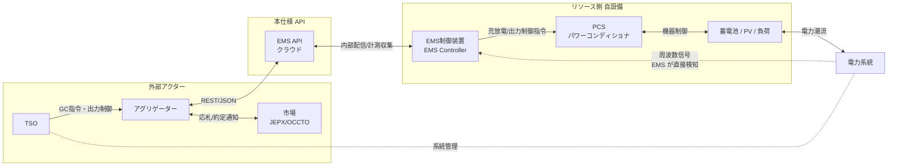
```mermaid
graph LR
    subgraph 外部["外部アクター"]
        AGG[アグリゲーター]
        MKT[市場<br/>JEPX/OCCTO]
        TSO[TSO]
    end

    subgraph 本仕様["本仕様 API"]
        API[EMS API<br/>クラウド]
    end

    subgraph リソース側["リソース側 自設備"]
        EMS[EMS制御装置<br/>EMS Controller]
        PCS[PCS<br/>パワーコンディショナ]
        RES[蓄電池 / PV / 負荷]
    end

    GRID[電力系統]

    AGG <-->|REST/JSON| API
    AGG <-->|応札/約定通知| MKT
    TSO -->|GC指令・出力制御| AGG
    API <-->|内部配信/計測収集| EMS
    EMS -->|充放電/出力制御指令| PCS
    PCS <-->|機器制御| RES
    RES <-->|電力潮流| GRID
    TSO -.系統管理.- GRID
    GRID -.周波数信号<br/>EMS が直接検知.-> EMS
```

> **重要**: TSO は **EMS API ではなくアグリゲーターに対して** 指令を送ります（GC指令等）。アグリゲーターがその指令を本 API 経由で各リソースに配信します。FCR の周波数応動は、EMS制御装置（リソース側）が **電力系統の周波数を直接検知して自動応動** します。


### 10.1 市場別フロー早見表

| SKU | 応動方式 | 応札タイミング | 約定後の登録 | 当日修正 | 主な指令フィールド | 約定量の表現 |
|-----|---------|--------------|-------------|---------|------------------|-------------|
| `jepx-da` | 計画ディスパッチ | 前日 10:00 | `schedule`（30分コマ単位）| × | `delta_kw` | 連系点Δ電力（負値=送電）|
| `jepx-ttv` | 計画ディスパッチ | 受渡 1 時間前まで | `schedule`（既存上書き or 新規）| ○ | `delta_kw` | 同上 |
| `fcr` | **自動応動**（周波数偏差検知）| 前日応札 | `schedule`（応動可能量）| × | `fcr_response_kw` + `sku: "fcr"` | 応動可能量（kW、双方向幅）|
| `s-frr` / `frr` | GC（給電指令）型 | 前日応札 → 当日 GC 確定 | `schedule`（暫定）→ `schedule` で上書き | ○（GC 後）| `delta_kw` | 落札量 → GC 後の最終指令量 |
| `rr` / `rr-fit` | GC 型 | 同上 | 同上 | ○（GC 後）| `delta_kw` | 同上 |
| `negawatt-spot` | DR 削減 | 前日 or 直前 | `schedule` | ○ | `delta_kw`（負値）| 削減量 |
| `null`（省略可）| 非市場運用指令 | （市場応札なし）| `schedule` | ○ | `delta_kw`（充電+/放電-/待機0）等 | アグリゲーター・需要家側 EMS / BAS / FEMS の運用指示、自家消費等 |

### 10.2 JEPX スポット市場（`jepx-da`、前日約定）

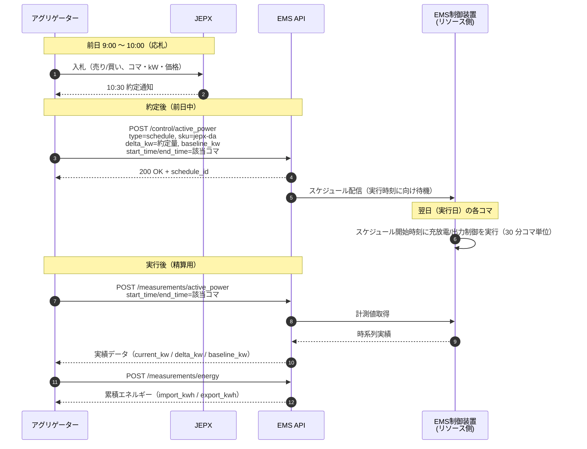
```mermaid
sequenceDiagram
    autonumber
    participant A as アグリゲーター
    participant J as JEPX
    participant API as EMS API
    participant EMS as EMS制御装置<br/>(リソース側)

    Note over A,J: 前日 9:00 〜 10:00（応札）
    A->>J: 入札（売り/買い、コマ・kW・価格）
    J-->>A: 10:30 約定通知

    Note over A,API: 約定後（前日中）
    A->>API: POST /control/active_power<br/>type=schedule, sku=jepx-da<br/>delta_kw=約定量, baseline_kw<br/>start_time/end_time=該当コマ
    API-->>A: 200 OK + schedule_id
    API->>EMS: スケジュール配信（実行時刻に向け待機）

    Note over EMS: 翌日（実行日）の各コマ
    EMS->>EMS: スケジュール開始時刻に充放電/出力制御を実行（30 分コマ単位）

    Note over A,API: 実行後（精算用）
    A->>API: POST /measurements/active_power<br/>start_time/end_time=該当コマ
    API->>EMS: 計測値取得
    EMS-->>API: 時系列実績
    API-->>A: 実績データ（current_kw / delta_kw / baseline_kw）
    A->>API: POST /measurements/energy
    API-->>A: 累積エネルギー（import_kwh / export_kwh）
```

#### API 呼び出しまとめ（`jepx-da`）

| ステップ | API | 主なパラメータ | 目的 |
|---------|-----|--------------|------|
| 1. 約定登録 | `POST /control/active_power` | `type=schedule`, `sku=jepx-da`, `delta_kw=約定量`, `baseline_kw`, `start_time`, `end_time` | 翌日コマのスケジュール登録 |
| 2. 状態確認 | `GET /status` | - | 実行直前の SOC・能力確認 |
| 3. 実行 | （EMS 自動）| - | スケジュール開始時刻に自動配信 |
| 4. 実績取得 | `POST /measurements/active_power` | `start_time`, `end_time`, `interval_seconds` | 時系列実績 |
| 5. エネルギー集計 | `POST /measurements/energy` | `start_time`, `end_time`（`interval_seconds: 1800` でコマ別）| 精算用累積値・コマ別 kWh（約定量との突合）|

> **30 分コマ単位**: JEPX スポットは 30 分コマ単位で約定するため、各コマごとに別 schedule を登録します（または連続コマを 1 つの schedule に統合）。

---

### 10.3 JEPX 時間前市場（`jepx-ttv`）

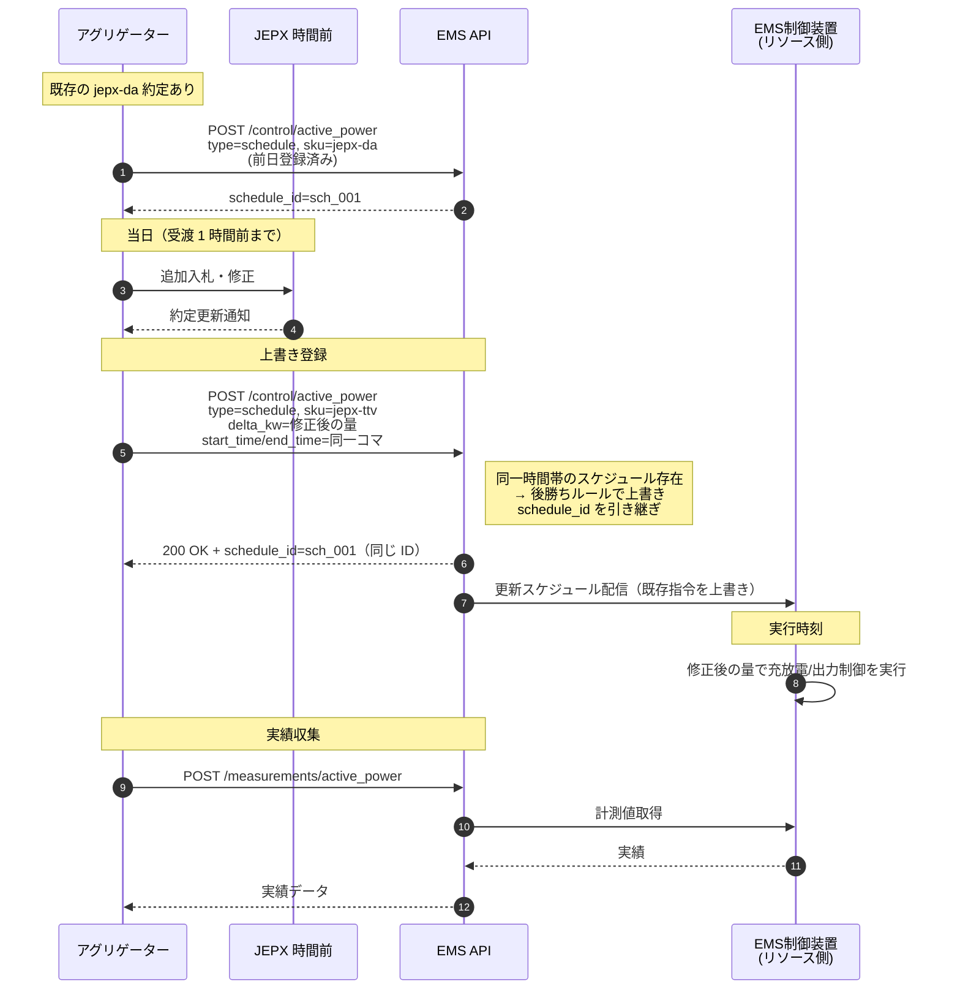
```mermaid
sequenceDiagram
    autonumber
    participant A as アグリゲーター
    participant J as JEPX 時間前
    participant API as EMS API
    participant EMS as EMS制御装置<br/>(リソース側)

    Note over A: 既存の jepx-da 約定あり
    A->>API: POST /control/active_power<br/>type=schedule, sku=jepx-da<br/>(前日登録済み)
    API-->>A: schedule_id=sch_001

    Note over A,J: 当日（受渡 1 時間前まで）
    A->>J: 追加入札・修正
    J-->>A: 約定更新通知

    Note over A,API: 上書き登録
    A->>API: POST /control/active_power<br/>type=schedule, sku=jepx-ttv<br/>delta_kw=修正後の量<br/>start_time/end_time=同一コマ
    Note right of API: 同一時間帯のスケジュール存在<br/>→ 後勝ちルールで上書き<br/>schedule_id を引き継ぎ
    API-->>A: 200 OK + schedule_id=sch_001（同じ ID）
    API->>EMS: 更新スケジュール配信（既存指令を上書き）

    Note over EMS: 実行時刻
    EMS->>EMS: 修正後の量で充放電/出力制御を実行

    Note over A,API: 実績収集
    A->>API: POST /measurements/active_power
    API->>EMS: 計測値取得
    EMS-->>API: 実績
    API-->>A: 実績データ
```

#### 同一コマでの SKU 切替

JEPX-DA 約定後に時間前で修正する場合、`sku` を `jepx-ttv` に変更して上書き登録します。後勝ちルールにより `schedule_id` は引き継がれ、修正履歴は `created_at` の更新で確認できます。

> **§9.5.1 重複ルールとの関係**: JEPX-DA と JEPX-TTV は**同一の kWh ディスパッチカテゴリ**であり、[§9.5.1](#951-スケジュール重複時の動作後勝ちルール) の後勝ちルールが適用される（同一期間への `jepx-ttv` 再 POST は既存 `jepx-da` スケジュールを上書きし、完全一致なら `schedule_id` を引き継ぐ）。同一コマに両者が併存することはなく、二重ディスパッチは発生しない。`compound` ⇄ 単独 SKU、調整力 ⇄ JEPX 等の異概念併存は §9.5.1 通り別 `schedule_id` で並列保持される。

---

### 10.4 一次調整力（FCR）

**最大の特徴**: 当日の応動は **EMS制御装置（リソース側）が電力系統の周波数を直接検知して自動応動** します。TSO からの個別指令やアグリゲーターからのリアルタイム指令は **不要** です。

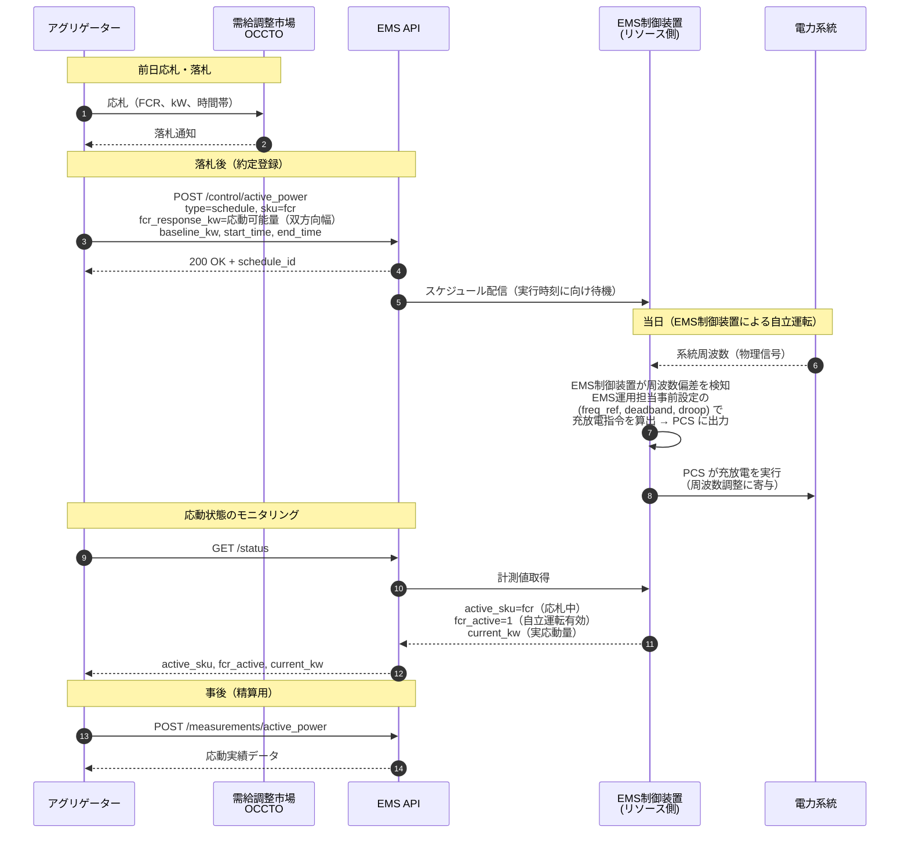
```mermaid
sequenceDiagram
    autonumber
    participant A as アグリゲーター
    participant M as 需給調整市場<br/>OCCTO
    participant API as EMS API
    participant EMS as EMS制御装置<br/>(リソース側)
    participant GRID as 電力系統

    Note over A,M: 前日応札・落札
    A->>M: 応札（FCR、kW、時間帯）
    M-->>A: 落札通知

    Note over A,API: 落札後（約定登録）
    A->>API: POST /control/active_power<br/>type=schedule, sku=fcr<br/>fcr_response_kw=応動可能量（双方向幅）<br/>baseline_kw, start_time, end_time
    API-->>A: 200 OK + schedule_id
    API->>EMS: スケジュール配信（実行時刻に向け待機）

    Note over EMS,GRID: 当日（EMS制御装置による自立運転）
    GRID-->>EMS: 系統周波数（物理信号）
    EMS->>EMS: EMS制御装置が周波数偏差を検知<br/>EMS運用担当事前設定の<br/>(freq_ref, deadband, droop) で<br/>充放電指令を算出 → PCS に出力
    EMS->>GRID: PCS が充放電を実行<br/>（周波数調整に寄与）

    Note over A,API: 応動状態のモニタリング
    A->>API: GET /status
    API->>EMS: 計測値取得
    EMS-->>API: active_sku=fcr（応札中）<br/>fcr_active=1（自立運転有効）<br/>current_kw（実応動量）
    API-->>A: active_sku, fcr_active, current_kw

    Note over A,API: 事後（精算用）
    A->>API: POST /measurements/active_power
    API-->>A: 応動実績データ
```

#### FCR 固有の注意点

| 項目 | 内容 |
|------|------|
| 応動パラメータ（`freq_ref` / `deadband` / `droop`）| **EMS運用担当による事前設定のみ**（`/fcr/config` は v2 で廃止）|
| アグリゲーターの当日操作 | 不要（自動応動）|
| 指令フィールド | **`fcr_response_kw`**（応動可能量、双方向幅、絶対値・正値）。`delta_kw` は使用しない |
| 応動レンジ | `[baseline_kw - fcr_response_kw, baseline_kw + fcr_response_kw]` の範囲で周波数偏差に応じて自動応動 |
| 状態確認 | `/status` の `active_sku`（応札状態）と `fcr_active`（自立運転モード有効化状態）の両方 |
| 応動実績 | `/measurements/active_power` の連続時系列で評価 |
| 対象リソース | `battery` component、`fcr_capable: true` の `consumer` component（高速応答 DR）、`generator` component（`thermal` / `pumped_storage` / 条件付きで `biomass`・`hydro`、[§7.3](#73-sku--generator_kind-対応表) 参照）、または上記を含む `components.length ≥ 2` のサイト |

> **fcr_capable: false で `sku: "fcr"` 指定** → `400 Bad Request` を返却。

#### consumer（高速応答 DR）での FCR 応動

`fcr_capable: true` の consumer は、需要応答（DR）を周波数偏差に追従させて高速応動させる「高速応答 DR」として FCR 市場に参入できます。応動の流れ・指令フィールドは battery / generator と同一です:

- 応札・約定・登録: 上記シーケンス図と共通（`POST /control/active_power` で `sku: "fcr"`、`fcr_response_kw` に応動可能量を指定）
- 当日: EMS制御装置が周波数偏差を検知し、自動的に消費電力を増減（受電方向 +/− `fcr_response_kw` の範囲）
- 状態確認: `/status` の `active_sku: "fcr"` および `fcr_active: 1`、加えて `dr_active` も `1` になる場合あり（実装依存）
- baseline_kw: `consumer` の通常消費（典型は `+contract_kw` 近傍の正値）

> 通常の DR（`negawatt-spot` 等）と異なり、**手動応動指令ではなく周波数による自動応動**である点が特徴。設備の応答速度要件（数秒以内）を満たす必要があるため、`fcr_capable: true` 認定が必須。

#### `active_sku` と `fcr_active` の関係

両フィールドは **異なるレイヤー** を表します:

| フィールド | レイヤー | 意味 |
|----------|---------|------|
| `active_sku: "fcr"` | 計画レイヤー | FCR 約定時間帯にあること（schedule 内）|
| `fcr_active: 1` | 装置動作レイヤー | FCR 自立運転モードが **EMS制御装置** で有効化されていること（周波数偏差検知ロジックが稼働中）|

**通常パターンと例外**:

| シナリオ | `active_sku` | `fcr_active` | 説明 |
|---------|:-----------:|:-----------:|------|
| 約定時間外 | `null` | `0` | FCR 応札なし |
| 約定時間内・自立運転正常 | `"fcr"` | **`1`** | 通常稼働、EMS制御装置が周波数偏差応動可能 |
| 約定時間内・EMS制御装置の自立運転 disabled | `"fcr"` | **`0`** | 例外: 設備異常・メンテで自立運転無効 |
| 約定時間外でテスト的に自立運転enabled | `null` | `1` | 試験運転（EMS運用担当マニュアル操作）|

両者は **論理的に独立**。約定中でも装置側で自立運転モードが無効になる例外シナリオがあるため、両方をモニタリングしてください。

---

### 10.5 二次〜三次調整力（`s-frr` / `frr` / `rr` / `rr-fit`）

**特徴**: GC（Gate Closure / 給電指令）型。落札後に**暫定スケジュール**を登録し、当日 GC 確定後に schedule を上書きして最終量を確定します。GC 指令は **TSO からアグリゲーター宛** に送られ、アグリゲーターが本 API 経由でリソースへ配信します。

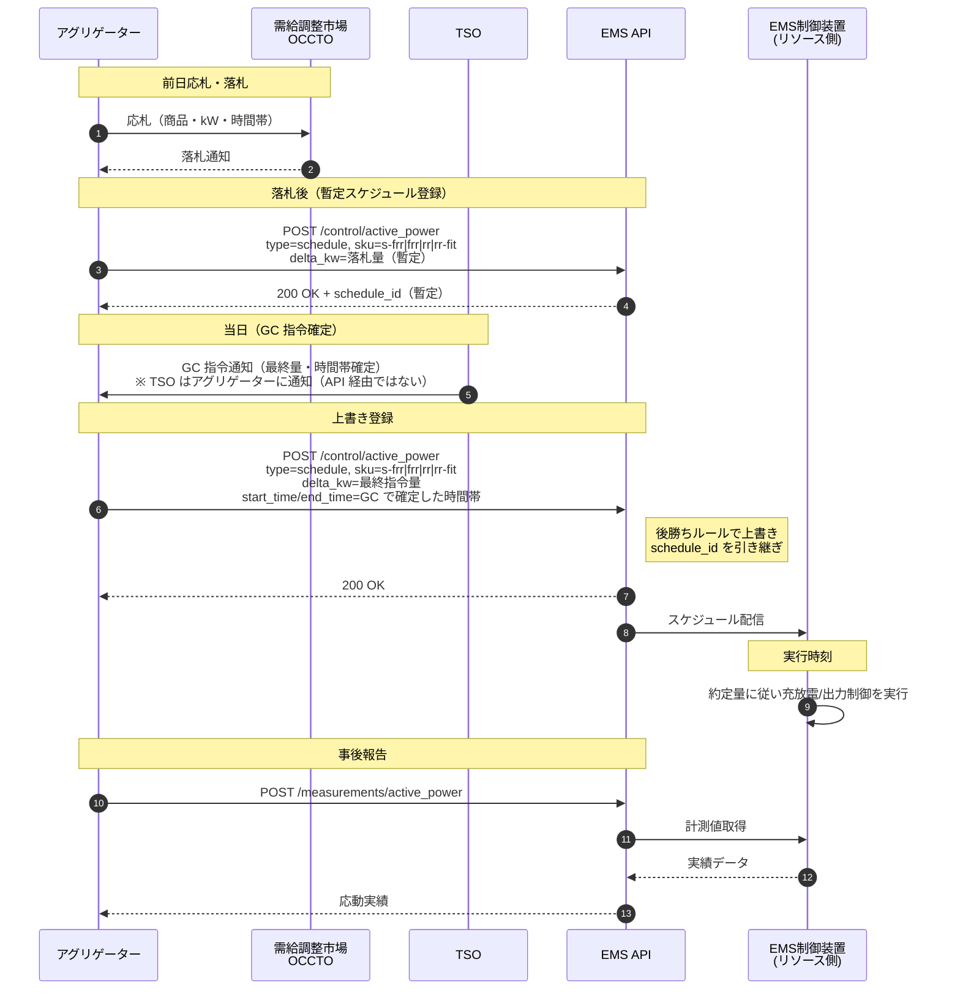
```mermaid
sequenceDiagram
    autonumber
    participant A as アグリゲーター
    participant M as 需給調整市場<br/>OCCTO
    participant TSO as TSO
    participant API as EMS API
    participant EMS as EMS制御装置<br/>(リソース側)

    Note over A,M: 前日応札・落札
    A->>M: 応札（商品・kW・時間帯）
    M-->>A: 落札通知

    Note over A,API: 落札後（暫定スケジュール登録）
    A->>API: POST /control/active_power<br/>type=schedule, sku=s-frr|frr|rr|rr-fit<br/>delta_kw=落札量（暫定）
    API-->>A: 200 OK + schedule_id（暫定）

    Note over TSO,A: 当日（GC 指令確定）
    TSO->>A: GC 指令通知（最終量・時間帯確定）<br/>※ TSO はアグリゲーターに通知（API 経由ではない）

    Note over A,API: 上書き登録
    A->>API: POST /control/active_power<br/>type=schedule, sku=s-frr|frr|rr|rr-fit<br/>delta_kw=最終指令量<br/>start_time/end_time=GC で確定した時間帯
    Note right of API: 後勝ちルールで上書き<br/>schedule_id を引き継ぎ
    API-->>A: 200 OK
    API->>EMS: スケジュール配信

    Note over EMS: 実行時刻
    EMS->>EMS: 約定量に従い充放電/出力制御を実行

    Note over A,API: 事後報告
    A->>API: POST /measurements/active_power
    API->>EMS: 計測値取得
    EMS-->>API: 実績データ
    API-->>A: 応動実績
```

#### 商品別の差異

| SKU | 対応リソース | 特記事項 |
|-----|------------|---------|
| `s-frr` | battery / generator（thermal / pumped_storage / biomass、調整可能型 hydro）/ consumer の component を含むサイト | 二次調整力①、応答時間中速 |
| `frr` | battery / generator（thermal / pumped_storage / biomass、調整可能型 hydro）/ consumer の component を含むサイト | 二次調整力②、応答時間遅め |
| `rr` | battery / generator（thermal / pumped_storage / biomass / hydro）/ consumer の component を含むサイト | 三次調整力① |
| `rr-fit` | battery / generator（thermal / pumped_storage / biomass / hydro）/ consumer の component を含むサイト | 三次調整力② |

> generator の参加可否は `generator_kind` × `incentive_type` で決定（[§7.3](#73-sku--generator_kind-対応表) 参照）。`incentive_type: "fit"` は全 SKU で参加不可。

---

### 10.6 ネガワット・スポット市場（`negawatt-spot`、DR）

**特徴**: 需要家（consumer component を含むサイト）の DR を市場応札する。事前に **30 分粒度のベースライン値** を `/baseline` に登録することが必須（[§9.6](#96-ベースライン管理-baseline) 参照）。CBL 算定アルゴリズム（`High 4 of 5（当日調整あり）` 等）はアグリゲーター側で実装する。

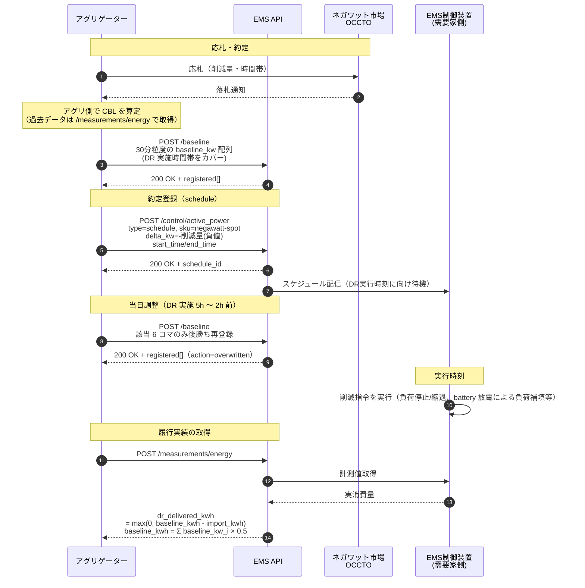
```mermaid
sequenceDiagram
    autonumber
    participant A as アグリゲーター
    participant API as EMS API
    participant M as ネガワット市場<br/>OCCTO
    participant EMS as EMS制御装置<br/>(需要家側)

    Note over A,M: 応札・約定
    A->>M: 応札（削減量・時間帯）
    M-->>A: 落札通知

    Note over A: アグリ側で CBL を算定<br/>（過去データは /measurements/energy で取得）
    A->>API: POST /baseline<br/>30分粒度の baseline_kw 配列<br/>(DR 実施時間帯をカバー)
    API-->>A: 200 OK + registered[]

    Note over A,API: 約定登録（schedule）
    A->>API: POST /control/active_power<br/>type=schedule, sku=negawatt-spot<br/>delta_kw=-削減量(負値)<br/>start_time/end_time
    API-->>A: 200 OK + schedule_id
    API->>EMS: スケジュール配信（DR実行時刻に向け待機）

    Note over A,API: 当日調整（DR 実施 5h 〜 2h 前）
    A->>API: POST /baseline<br/>該当 6 コマのみ後勝ち再登録
    API-->>A: 200 OK + registered[]（action=overwritten）

    Note over EMS: 実行時刻
    EMS->>EMS: 削減指令を実行（負荷停止/縮退、battery 放電による負荷補填等）

    Note over A,API: 履行実績の取得
    A->>API: POST /measurements/energy
    API->>EMS: 計測値取得
    EMS-->>API: 実消費量
    API-->>A: dr_delivered_kwh<br/>= max(0, baseline_kwh - import_kwh)<br/>baseline_kwh = Σ baseline_kw_i × 0.5
```

#### 連系区分による応札可否

| サイト構成 | `negawatt-spot` 応札 |
|-----------|:-------------------:|
| consumer 単機 | ○ |
| consumer + battery のサイト | ○（battery 充電で上げ調整も可能、双方向応動）|
| consumer + PV のサイト | ○ |
| consumer を含まないサイト | ✗（消費削減リソースなし）|

#### `active_sku` と `dr_active` / `dr_actual_reduction_kw` の関係

DR には 3 つのレイヤーがあります:

| レイヤー | フィールド | 意味 |
|---------|----------|------|
| 計画 | `active_sku` | DR 関連 SKU の応札時間帯（`"negawatt-spot"` / `"frr"` 等）|
| 装置動作 | `dr_active` | サイト/装置が削減モードを実行中か |
| 実履行 | `dr_actual_reduction_kw` | 実際の削減量（kW、リアルタイム）|

**通常パターンと例外**:

| シナリオ | `active_sku` | `dr_active` | `dr_actual_reduction_kw` | 説明 |
|---------|:-----------:|:----------:|:-----------------------:|------|
| 約定時間外 | `null` | `0` | `null` | DR 応札なし |
| 約定時間内・正常・削減成功 | `"negawatt-spot"` | `1` | `200` | 通常稼働、指令通り削減 |
| 約定時間内・正常・削減不足 | `"negawatt-spot"` | `1` | `120` | 削減モード ON だが履行不足（指令 200 / 実 120）|
| 約定時間内・装置故障 | `"negawatt-spot"` | `0` | `0` | 例外: 装置が削減モードに入らず |
| 約定時間外で試験削減 | `null` | `1` | `100` | EMS運用担当マニュアル試験 |

`active_sku` と `dr_active` は **論理的に独立**。両方をモニタリングして履行状態を判断してください。

---

### 10.7 非市場応札の運用指令（`sku: null`）

**`sku: null` は市場応札を伴わない全ての運用指令で使用**します。アグリゲーターが市場約定なしに充電・放電・待機等の動作を指示する場合や、自家消費・自家最適化、テスト運転などが含まれます。

#### 主な用途

| 用途 | 例 | 指令例 |
|------|----|----|
| **充電指令**（市場約定なし）| アグリゲーターが SOC 確保のため充電を指示 | `delta_kw: +500`（受電方向）|
| **放電指令**（市場約定なし）| アグリゲーターが緊急放電を指示 | `delta_kw: -500`（送電方向）|
| **待機指令** | 動作させない（baseline で運転）| `delta_kw: 0` |
| 自家消費・自家最適化 | 需要家側 EMS / BAS / FEMS による自家消費最適化 | `site_kw: ...` または `delta_kw: ...` |
| 試験運転 | EMS運用担当のマニュアル試験 | 任意の制御値 |
| 緊急対応 | 一時的な手動オーバーライド | 任意の制御値 |

#### シーケンス

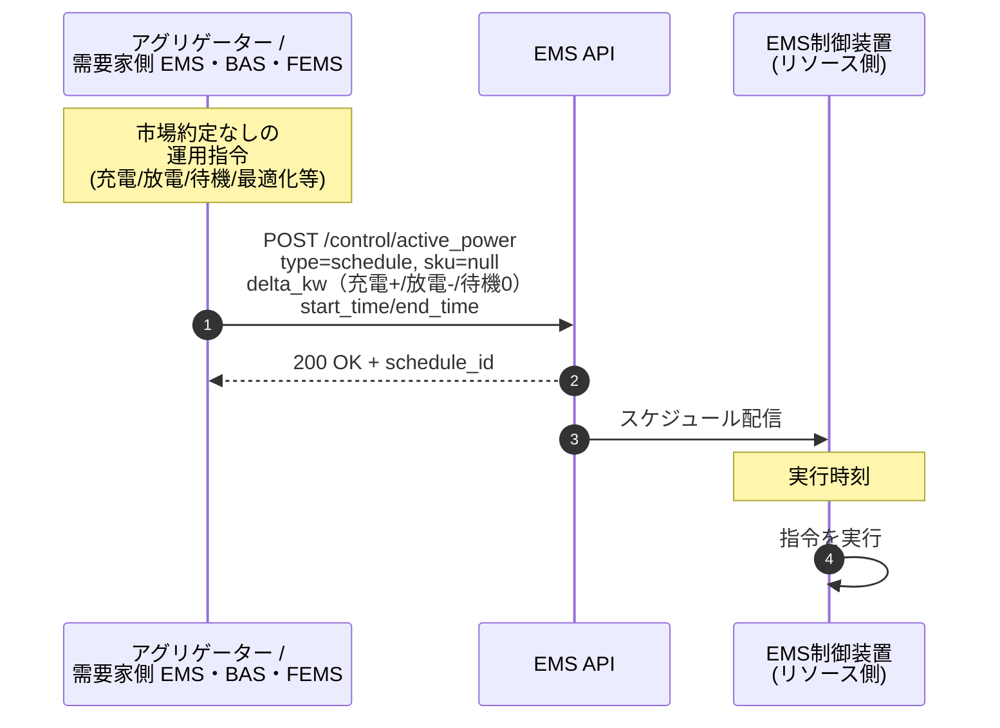
```mermaid
sequenceDiagram
    autonumber
    participant A as アグリゲーター /<br/>需要家側 EMS・BAS・FEMS
    participant API as EMS API
    participant EMS as EMS制御装置<br/>(リソース側)

    Note over A: 市場約定なしの<br/>運用指令<br/>(充電/放電/待機/最適化等)
    A->>API: POST /control/active_power<br/>type=schedule, sku=null<br/>delta_kw（充電+/放電-/待機0）<br/>start_time/end_time
    API-->>A: 200 OK + schedule_id
    API->>EMS: スケジュール配信

    Note over EMS: 実行時刻
    EMS->>EMS: 指令を実行
```

#### 待機指令の表現

「待機」を明示する場合は以下の表現が利用可能:

| 方法 | 指令内容 | 効果 |
|------|---------|------|
| 明示的な待機指令 | `type: schedule, sku: null, delta_kw: 0` | 期間内 baseline で運転 |
| 暗黙的な待機 | schedule 未登録 | 該当期間は何の指令も受けず、baseline で動作 |

> **明示的待機の用途**: 直前まで他の SKU で応動していた場合に、確実に「指令クリア → 待機」を保証したいときに使用。後勝ちルールで既存スケジュールを上書きします。

#### 用途例

| 用途 | パターン |
|------|---------|
| 自家消費型サイトの需要家側 EMS / BAS / FEMS 連携 | `components.length ≥ 2` のサイトで `site_kw` 指令、`sku=null` |
| EMS 内部最適化 | `sku=null` の連続スケジュール登録 |
| 試験運転 | `sku=null` でマニュアル運転 |

---

### 10.8 SKU 切替を伴う複合運用

実運用では複数 SKU を時間帯別に切り替えて運用します。例として 1 日のスケジュール構成:


```mermaid
gantt
    title 1日の SKU 切替例（蓄電所）
    dateFormat HH:mm
    axisFormat %H:%M

    section 早朝
    JEPX-DA (充電)         :a1, 02:00, 4h
    section 昼間
    PV併設なら待機/jepx-da (放電)   :a2, 11:00, 4h
    section 夕方ピーク
    rr (放電)              :a3, 17:00, 2h
    section 深夜
    fcr (応動可能)         :a4, 19:00, 7h
```

各時間帯で別 schedule を登録、または重複時間帯は後勝ちルールで上書きします。`/control/active_power/schedules` GET で全スケジュールを一覧取得可能。

---

## 11. エラーコード体系

| コード | 説明 | 対象 API | 具体例 |
|--------|------|---------|--------|
| **400** | リクエスト不正 | パラメータを持つ API | パラメータ不足、値が範囲外、種別×SKU 不整合 |
| **401** | 認証失敗 | 全般 | JWT 不正、Refresh Token 不正 |
| **403** | アクセス権限不足 | 全般 | リソースへのアクセス権なし |
| **404** | データなし／非対応／未登録 | 履歴系 API、`/baseline` 等 | 指定時刻のデータなし、未プロビジョン EMS ID、対象サイトに consumer component なし |
| **409** | 削除不可／重複応動／冪等キー競合 | `/control/active_power/schedules` DELETE、`/control/active_power` | 実行中・完了済みスケジュール、DR 重複応動、Idempotency-Key 内容不一致 |
| **410** | データ量制限超過 | 履歴系 API | 取得期間が長すぎる（>31 日）|
| **422** | 前提条件未満 | DR 系、逆潮流系、`/baseline` POST | ベースライン未登録で DR 指示、DR クールダウン期間中、逆潮流規制違反、DR 完了済スロットへのベースライン遡及修正 |
| **429** | レートリミット超過 | 全般 | 1 時間 1000 回超過 |
| **498** | 認証キー期限切れ | 全般（/auth/refresh 除く）| JWT 期限切れ |
| **503** | システム故障 | 全般 | システム異常、out of service 中の即座指示 |

### エラーオブジェクト共通項目

| 項目名 | 型 | 必須 | 説明 |
|--------|------|:----:|------|
| `code` | integer | ○ | HTTP エラーコード |
| `message` | string | ○ | エラーメッセージ（人間可読、英語）|
| `details` | string | ○ | 詳細情報（人間可読、英語）|
| `error_type` | string | 任意 | エラー種別識別子。下記「`error_type` 一覧」参照 |
| `parameter` | string | 任意 | エラー対象パラメータ名（バリデーションエラー時）|
| `received_value` | any | 任意 | 受信した値（バリデーションエラー時）|
| `valid_range` | string | 任意 | 有効範囲（バリデーションエラー時）|
| `required_action` | string | 任意 | 推奨対処（API URL や対処手順を記載）|

### コード別追加フィールド

| 項目名 | 型 | 適用コード | 説明 |
|--------|------|:---------:|------|
| `expires_at` | string | 401, 498 | トークン有効期限 |
| `limit` | integer | 429 | レートリミット上限値 |
| `remaining` | integer | 429 | 残りリクエスト数 |
| `reset_time` | string | 429 | レートリミットリセット時刻 |
| `retry_after` | integer | 429, 503 | 再試行までの推奨待機秒数 |
| `schedule_id` | string | 404, 409（スケジュール系）| 対象スケジュール識別子 |
| `start_time` / `end_time` / `current_time` | string | 409（スケジュール系）| 関連時刻 |
| `idempotency_key` | string | 409（冪等性競合）| 競合した冪等性キー |

### `error_type` 一覧

| `error_type` | HTTP | 適用箇所 | 説明 |
|--------------|:----:|---------|------|
| `invalid_parameter` | 400 | 全般 | パラメータ不正（形式・範囲・許容値外。例: `interval_seconds` が許容値以外）|
| `authentication_error` | 401 | 全般 | JWT 不正、Refresh Token 不正 |
| `token_expired` | 498 | 全般 | Access Token 期限切れ |
| `permission_denied` | 403 | 全般 | リソースへのアクセス権なし |
| `rate_limit_exceeded` | 429 | 全般 | レートリミット超過（1 時間 1000 回）|
| `precondition_missing` | 422 | DR 系 | 前提条件未満（汎用、より具体的なエラータイプがある場合はそちらを優先）|
| `not_supported` | 400 / 404 | 全般 | 対象リソースで非対応の操作 |
| `data_not_available` | 404 | 履歴系 API（`/measurements/*`）| 指定 `start_time` が保管期間外（`/measurements/active_power`: 60 日、`/measurements/energy`: 12 か月）|
| `period_too_long` | 410 | 履歴系 API（`/measurements/*`）| 取得期間（`end_time - start_time`）が 31 日を超過 |
| `data_points_exceeded` | 410 | `/measurements/active_power` | 時系列ポイント数が 44,640 を超過 |
| `baseline_not_configured` | 422 | `/control/active_power`（`sku=negawatt-spot`）| DR 開始時刻に対応する 30 分スロットのベースライン値が `/baseline` に未登録 |
| `baseline_unaligned` | 400 | `/baseline` POST/GET | `start_time` / `end_time` が 30 分境界に未アライン、または `end_time - start_time ≠ 30 分` |
| `baseline_out_of_range` | 400 | `/baseline` POST | `baseline_kw < 0` または `baseline_kw > contract_kw` |
| `baseline_bulk_too_large` | 400 | `/baseline` POST | 1 リクエストの `baselines[]` 件数が 336（1 週間分）を超過 |
| `baseline_not_applicable` | 404 | `/baseline` POST/GET | 対象サイトに `consumer` component が存在しない |
| `baseline_locked_after_dr` | 422 | `/baseline` POST | 当該スロットを含む DR が既に完了済（精算根拠の遡及修正は不可）|
| `baseline_query_too_large` | 410 | `/baseline` GET | `end_time - start_time > 7 日`（= 336 件超）|
| `reverse_power_flow_forbidden` | 422 | `/control/active_power`（`site_capability.reverse_flow_allowed: false`）| 需要家連系・孤立島運転型サイトでの逆潮流規制違反 |
| `idempotency_conflict` | 409 | `/control/active_power` | Idempotency-Key 内容不一致 |
| `fit_battery_coexistence_forbidden` | 400 | サイト登録時（`/specifications`）| FIT 認定 generator component + battery component の同一サイト登録禁止 |
| `sku_not_marketable` | 400 | `/control/active_power` | 指定 `sku` がサイトの `site_capability.marketable` 配列に含まれない（components 構成 / 制度区分 / 容量要件 / FCR 能力等を総合判定した結果、応札不可）。`generator_kind` × `sku` 不整合、FIT 電源の市場応札、`fcr_capable: false` リソースの FCR 指定等を 1 つに集約 |
| `fcr_response_kw_required` | 400 | `/control/active_power` | FCR では `fcr_response_kw` が必須 |
| `delta_kw_not_allowed_for_fcr` | 400 | `/control/active_power` | FCR では `delta_kw` を指定できない |
| `delta_kw_required` | 400 | `/control/active_power` | FCR以外では `delta_kw` が必須 |
| `fcr_response_kw_not_allowed` | 400 | `/control/active_power` | `sku != "fcr"` かつ `sku != "compound"` で `fcr_response_kw` を指定した（`compound` は複合に FCR を含む場合のみ指定可、[§7.4](#74-複合商品-compound) 参照）|
| `schedule_query_out_of_range` | 400 | `/control/active_power/schedules` GET | 取得範囲が過去 30 日 〜 未来 90 日 を超過 |
| `schedule_split_too_narrow` | 400 | `/control/active_power` | 後勝ちルールによる interval splitting で生存ピース < 1 分が発生（[§9.5.1](#951-スケジュール重複時の動作後勝ちルール) 不変条件違反、start/end を 1 分単位で揃えて再 POST）|
| `schedule_not_found` | 404 | `/control/active_power/schedules` DELETE | 指定した `schedule_id` が存在しない |
| `schedule_not_deletable` | 409 | `/control/active_power/schedules` DELETE | 実行中・開始 1 分前以内・完了済みスケジュールは削除不可 |
| `fcr_response_kw_must_be_positive` | 400 | `/control/active_power` | `fcr_response_kw` に負値指定 |
| `dr_reduction_below_minimum` | 400 | `/control/active_power` (DR) | `\|delta_kw\| < min_dr_reduction_kw` |
| `dr_reduction_exceeds_maximum` | 400 | `/control/active_power` (DR) | `\|delta_kw\| > max_dr_reduction_kw` |
| `dr_duration_below_minimum` | 400 | `/control/active_power` (DR) | `duration_minutes < min_dr_duration_minutes` |
| `dr_cooldown_active` | 422 | `/control/active_power` (DR) | 前回 DR 終了後 `min_dr_cooldown_minutes` 未経過 |
| `dr_duplicate_dispatch` | 409 | `/control/active_power` (DR) | 既に他 SKU で DR 応動中、重複応動不可 |
| `compound_breakdown_not_allowed` | 400 | `/control/active_power` | `sku != "compound"` で `compound_breakdown` 指定 |
| `compound_breakdown_max_mismatch` | 400 | `/control/active_power` | `compound_breakdown` の最大値（絶対値）が `\|delta_kw\|` と不一致（内数ルール違反）|
| `compound_breakdown_value_exceeds_total` | 400 | `/control/active_power` | `compound_breakdown` のいずれかの値の絶対値が `\|delta_kw\|` を超過 |
| `compound_breakdown_invalid_key` | 400 | `/control/active_power` | `compound_breakdown` のキーが `fcr_response_kw` / `s-frr` / `frr` / `rr` 以外、またはキー数 < 2 |
| `compound_breakdown_sign_mismatch` | 400 | `/control/active_power` | `compound_breakdown.fcr_response_kw` が負値、または `compound_breakdown.{s-frr, frr, rr}` の符号が `delta_kw` と不一致 |

エラーレスポンスサンプル: [付録 B.10](ems-openapi-v2-samples.md#b10-エラーレスポンス)

---

## 12. 変更履歴

### v2.2 (2026-07-25)

`/measurements/energy` のレスポンス構造統一とコマ別時系列対応（VPP API v1.3 と同時改版）。目的: (a) `/measurements/active_power` と同じ「**常に `data[]` 返却**」の考え方への統一（履歴 2 API でレスポンスの読み方を揃える） (b) 30 分コマ単位の精算検証（インバランス明細確認・JEPX コマ別約定量との突合・FIP プレミアム対象量の 30 分区分算定）を、コマごとの繰り返し呼び出し（レートリミット 1000 回/h と衝突）なしで実現。

#### 非互換変更（v2.1 → v2.2）

| # | 変更 | 影響 |
|---|------|------|
| 1 | §9.8: レスポンスを**常に `data[]` 配列**に統一。v2.1 以前の「kWh 系フィールド・`components[]` の top-level 直接配置」を廃止し、`interval_seconds` 省略時は期間全体を 1 レコードとして `data[]` に格納（レコードの `start_time` / `end_time` = リクエスト指定値）。イベント系（`dr_dispatched_count` / `dr_total_dispatched_minutes`）と `timestamp`・識別子系のみ top-level | **クライアント修正必要**（kWh フィールドの参照パスが top-level → `data[0].*` に変更）|
| 2 | §9.7: `interval_seconds` の許容値を **`1` / `60` / `1800` / `3600` / `86400` の 5 値に離散化**（v2.1 以前は 1〜3600 の自由値。デフォルト 60 は不変）。`86400`（日次）を新規許容、それ以外の中間値（120・15 等）は 400 `invalid_parameter` | **クライアント修正必要**（5 値以外を指定していた場合）|

#### 追加

| # | 変更 | 影響 |
|---|------|------|
| 3 | §9.8: `interval_seconds`（`1800` / `3600` / `86400` の 3 値、任意）を追加。指定時は集計粒度ごとの複数レコード（各レコード = 集計区間 + kWh 系フィールド + `components[]`）。省略時（期間全体 1 レコード）と `Σ data[]` の集計整合性を保証 | 追加 |
| 4 | §6 / §8.3.1 / §8.3.2: API 一覧・パラメータ範囲仕様に `interval_seconds` の許容値と最大レコード数（energy 1,488 件）を追記、§9.7 / §8.1（VPP）の組み合わせ例を許容 5 値ベースに更新 | 追随 |
| 5 | 付録 B.8: 全サンプルを `data[]` 形式に更新、B.8.10 コマ別時系列取得サンプルを追加 | 追随 |

#### 訂正

| # | 変更 |
|---|------|
| 6 | §11: `error_type` 一覧に `invalid_parameter`（400）を追記（本文では従来から使用していたが一覧に記載漏れ。VPP API §9 とも整合）|

---

### v2.1 (2026-06-11)

VPP API v1.2 との整合性レビューに基づく修正。

| # | 変更 | 影響 |
|---|------|------|
| 1 | §9.5.1: `jepx-da` ⇄ `jepx-ttv` を**同一の kWh ディスパッチカテゴリ**として後勝ち上書き対象に変更（従来規則では異 SKU として併存となり、同一コマ二重ディスパッチの恐れがあったため）。§10.3 の注記も整合修正 | スケジュール重複挙動の変更 |
| 2 | §9.5.1: 実行中スケジュールへの上書き POST を可能と明記（DELETE の 409 制約とは独立、GC 指令の当日変更に対応）| 明確化 |
| 3 | §9.5.2: スケジュール取得範囲の未来側を 30 日 → **90 日** に拡大（登録可能範囲 §8.2 と一致）| 取得範囲拡大（非破壊）|
| 4 | §11: `data_not_available`（404）/ `period_too_long`（410）/ `data_points_exceeded`（410）を error_type 一覧に追加（履歴系 API、VPP API と同名）| 追加 |
| 5 | §8.8: `dispatch_status` に VPP API 独自の追加値が存在する旨を注記 | 注記 |
| 6 | §3.6: VPP `/status.members[]` で `measurement_point` が返却されるとの記述を訂正（VPP は静的属性を返却しない、`/specifications` で取得・キャッシュ）| 訂正 |
| 7 | §7.2: `active_sku` の文脈を「`/status`（consumer component を含むサイト）」→「`/status/details`（全種別）」に訂正（battery の FCR 応動中等でも返却されるため）| 訂正 |

---

### v2.0 (2026-05-12)

v1.x（蓄電所のみ対応）からの差分を以下に示す。v2.0 は破壊的変更を含む。

#### 主要変更点（概要）

| 項目 | v1.x | v2.0 |
|------|------|------|
| 対象リソース | 蓄電所のみ | 蓄電所 + 発電所 + 需要家、およびそれらを組み合わせたサイト |
| 符号規則 | 充電(+) / 放電(-) | **連系点基準: 受電(+) / 送電(-)** |
| 用語 | 充電/放電・発電/消費 | **import/export に統一** |
| `/status` | 蓄電池固定スキーマ | **統一 `components[]` モデル**（`/status` 概要 + `/status/details` 詳細の 2 階層、`site_capability` で能力フラグ表現）|
| 電力量 | `charge_kwh` / `discharge_kwh` | `import_kwh` / `export_kwh`（全種別共通）|
| DR 制御 | なし | `/control/active_power` に DR 指令（`delta_kw` 負値で削減指示）、`/baseline` 新設（30 分粒度のベースライン値 GET/POST、[§9.6](#96-ベースライン管理-baseline)）|
| SKU | `fcr` のみ | `fcr` + `s-frr` / `frr` / `rr` / `rr-fit` / `compound` / `jepx-da` / `jepx-ttv` / `negawatt-spot` |
| 助成制度 | なし | サイト単位の応札可否を `site_capability.marketable` 配列で表現（FIT / FIP / non_subsidized の生区分は API スキーマに含めず、EMS運用台帳で管理）|
| ノンファーム連系 | なし | `site_capability.non_firm_connection` フラグ |
| `/fcr/config` | あり | **廃止**（EMS運用担当設定のみ）|

詳細は後段の各カテゴリ（#1 〜 #19）を参照。

#### 1. Base URL とバージョニング
- Base URL を `/v1/ems/{id}/` から **`/v2/ems/{id}/`** に変更
- `/auth/refresh` の URL は変更なし

#### 2. 対象リソースの拡張（蓄電所 → 全リソース統一モデル、2 階層分類）
- v1.x は蓄電所（battery）のみ対応。v2.0 で **発電所 / 需要家** に加え、これらを組み合わせた `components.length ≥ 2` のサイトを正式対応
- 全リソースを「**1 連系点 + 1 つ以上の component**」という統一モデル（`components[]` 配列）で表現
- リソースを **2 階層** で分類（[§3.1](#31-統一リソースモデルcomponents-ベース) 参照）:
  - **第 1 階層: 調整可否** — EMS API からの能動指令対象か否か
  - **第 2 階層: `component_type`**（潮流の方向）— `battery`（双方向）/ `generator`（送電）/ `consumer`（受電）
- サイト単位の指令は `site_kw`、component 単位の指令は `component_id` で指定

#### 3. サイト分類フラグの新設（`site_capability` / `site_constraints`）
- サイトレベルの能力・制約を 2 ブロックに集約（§9.3 `/specifications`）
  - **`site_capability`**: `fcr_capable` / `dr_capable` / `reverse_flow_allowed` / **`marketable`**（応札可能 SKU の string array）/ `balancing_responsible` / `non_firm_connection`
  - **`site_constraints`**: `voltage_class` / `measurement_point` / `site_import_max_kw` / `site_export_max_kw`
- 制度区分情報（FIT / FIP / non_subsidized、ファーム / ノンファーム）は EMS 運用担当の登録台帳で管理。クライアントは `site_capability.marketable` 配列に応札可能 SKU が含まれるかで応札可否を判定
- 逆潮流可否は **`site_capability.reverse_flow_allowed`** で表現（`consumer` component を含むサイト等は `false`、`site.export_kwh = 0` / `battery.to_grid_kwh = 0` を強制）

#### 4. エンドポイント体系の刷新
- `/status` を **概要 (`GET /status`) + 詳細 (`GET /status/details`)** の 2 階層に分割
  - 概要: 一覧監視・ダッシュボード向けの最小フィールド集合（フラット構造）
  - 詳細: **`active_power` / `reactive_power`（将来枠）/ `tso_dispatch_detail`（将来枠）/ `capacity` / `resource_state`** の意味グループ別階層構造
- **`/specifications`** を新設（静的属性専用エンドポイント、`effective_from` 付き）
- 静的属性（`fcr_capable` / `dr_capable` / `voltage_class` / `measurement_point` / `contract_kw` / `site_import_max_kw` / `site_export_max_kw` / `generator_kind` 等）は `/status` `/status/details` から除外し `/specifications` に集約
- 命名統一: `/control/power` → **`/control/active_power`**、`/control/schedules` → **`/control/active_power/schedules`**、`/measurements/power` → **`/measurements/active_power`**（将来の無効電力系 `/control/reactive_power` 等に備えた対称命名）
- 表示名: 「電力値履歴」→ **「瞬時電力履歴」**（kW = 瞬時電力、kWh = 電力量との対比を明確化）

#### 5. 廃止エンドポイント・廃止フィールド
- **`/fcr/config` 廃止**: FCR 応動パラメータはEMS運用担当による事前設定のみ（`fcr_capable` フラグ・`fcr_active` フィールド・SKU `fcr` の機能は維持）
- `generation_limit_kw` 廃止: `delta_kw` または `output_control_limit`%（0〜100）で代替
- `charge_kwh` / `discharge_kwh` / `generation_kwh` / `consumption_kwh` / `chg_pwr_max` / `dis_pwr_max` / `generation_kw` / `consumption_kw` / `generation_capacity_available_kw` を廃止

#### 6. フィールド命名統一
- **`power_kw` → `delta_kw`**（命名一貫性: `current_kw`：絶対値 / `delta_kw`：差分 / `baseline_kw`：基準値）。VPP API も同一フィールド名を採用（VPP v1.1 で `total_*` プレフィックスを廃止）し、両 API で命名・JSON 構造が完全統一
- `delta_kw` を battery 限定から **全種別（battery / consumer / generator / `components.length ≥ 2` のサイト）の市場約定指令フィールド**（連系点基準のΔ電力）に拡張
- `/serviceplan` の `scheduled_power_kw` → `scheduled_delta_kw`
- 蓄電池の `charge_*` / `discharge_*` を **`import_*` / `export_*`** に統一（連系点基準、VPP API と整合）
- エネルギーフロー経路追跡は **`<component>.from_<src>_kwh` / `<component>.to_<dst>_kwh`** の 2 パターンに統一（例: `battery.from_generator_kwh` / `battery.from_grid_kwh` / `battery.to_grid_kwh` / `battery.to_load_kwh` / `generator.to_battery_kwh` / `generator.to_grid_kwh` / `generator.to_load_kwh`）

#### 7. 新フィールド
- **`fcr_response_kw`**: FCR の双方向応動可能量（絶対値・正値、`delta_kw` と排他）。応動レンジ = `[baseline_kw - fcr_response_kw, baseline_kw + fcr_response_kw]`
- **`dispatched_delta_kw`**: 直近の `/control/active_power` から配信された指令Δ電力。`/status` / `/measurements/active_power` の両方で返却し、実測 `delta_kw` との並列比較で達成度モニタリングを実現
- **`has_warning`**（0/1）: EMS制御装置が検知した運用警告フラグ（SOC運用範囲外、計測欠損、応動失敗等）
- **`output_control_limit`**（%）/ **`output_control_reason`**（`fit_curtailment` / `non_firm_congestion` / `manual` / `other`）: 出力制御の上限とその理由区分
- **`compound_breakdown`**: 複合商品の容量内訳（参考情報、例: `{ "fcr_response_kw": 5000, "s-frr": -8000, "frr": -10000, "rr": -15000 }`）。応動制御はトップレベル `delta_kw` / `fcr_response_kw` が担い、本フィールドは全 SKU 内訳の記録用。`/control/active_power` / `/control/active_power/schedules` / `/measurements/active_power` で扱う
- **`affected_schedules`**: `/control/active_power` レスポンスで、重複解決に伴う複数 schedule_id を `created` / `inherited` / `split` / `deleted` のアクション付きで返却
- **`grid_to_load_kwh`**（サイトレベル）: 系統 → 負荷の直接供給量。`import_kwh - battery.from_grid_kwh` の関係でエネルギー保存則検証が容易
- **`consumer.consumption_kwh`**: 負荷部の総消費量 = `grid_to_load_kwh + generator.to_load_kwh + battery.to_load_kwh`
- **`fit_export_kwh` / `fip_export_kwh` / `non_subsidized_export_kwh`**: 助成制度別の売電量内訳
- **`fit_curtailed_kwh` / `non_firm_curtailed_kwh` / `manual_curtailed_kwh`**: 抑制量の理由別内訳
- **`imbalance_kwh`**: FIP 計画値同時同量のインバランス量
- DR 集計フィールド: `dr_delivered_kwh` / `dr_dispatched_count` / `dr_total_dispatched_minutes`

#### 8. SKU 拡張
- v1.x の `fcr` 単独から、需給調整市場 4 商品＋ FIT 専用市場＋ JEPX 系＋ DR ＋複合商品まで拡張
- 新 SKU: **`s-frr`**（二次調整力①）/ **`frr`**（二次調整力②）/ **`rr`**（三次調整力①）/ **`rr-fit`**（三次調整力②、FIT 電源予測誤差吸収用 TSO 側商品、FIT 発電所は応札しない）/ **`compound`**（複合約定、内数ロジック）/ **`jepx-da`**（スポット）/ **`jepx-ttv`**（時間前）/ **`negawatt-spot`**（ネガワット）
- `sku: null` = 市場応札を伴わない運用指令（充電・放電・待機・自家消費・テスト運転等）として明示

#### 9. 複合商品（`compound`）対応（取引規程別冊「複合約定」/ 取引規程 第7章 第35条 準拠）
- 一次調整力 / 二次調整力① / 二次調整力② / 三次調整力① のうち 2 商品以上を 1 約定で兼ねる前日商品
- 内数ロジック: 複合ΔkW約定量 = max(各商品約定量)、各値 ≤ `|delta_kw|`、キーは `fcr` / `s-frr` / `frr` / `rr` 限定、キー数 2 以上、符号一致
- 関連 error_type: `compound_breakdown_not_allowed` / `compound_breakdown_max_mismatch` / `compound_breakdown_value_exceeds_total` / `compound_breakdown_invalid_key` / `compound_breakdown_sign_mismatch`

#### 10. 発電所種別（`generator_kind`）と需給調整市場対応
- `generator_kind` enum: **`pv` / `wind` / `biomass` / `hydro` / `thermal`（火力）/ `pumped_storage`（揚水）**
- §7.3「SKU × generator_kind 対応表」を新設
- generator の specifications に種別固有項目を追加: `rated_output_kw` / `min_output_kw` / `ramp_rate_kw_per_min` / `fuel_type` / `upper_reservoir_capacity_kwh` / `pump_input_max_kw`
- generator 単位の `fcr_capable`: thermal / pumped_storage / hydro 等のディスパッチ可能電源は `true` 候補、pv / wind / biomass は基本 `false`

#### 11. DR（デマンドレスポンス）対応
- `/control/active_power` で DR 指令（`delta_kw` 負値で削減指示、DR 削減量 = `-delta_kw`）
- `/status` `/status/details` に `dr_active` / `dr_target_reduction_kw` / `dr_actual_reduction_kw` / `active_sku`
- 関連 error_type: `dr_reduction_below_minimum` / `dr_reduction_exceeds_maximum` / `dr_duration_below_minimum` / `dr_cooldown_active` / `dr_duplicate_dispatch`

#### 12. 電圧階級・連系区分
- `voltage_class`: `low` / `high` / `extra_high` の 3 区分（voltage_class 自体による SKU 直接制約は設けない方針）
- ノンファーム連系: `site_capability.non_firm_connection` フラグ
- FIP 計画値同時同量: `site_capability.balancing_responsible` フラグ

#### 13. スケジュール重複ルール（後勝ち上書き＋市場応札 SKU 並列）
- 方針: **異なる市場応札 SKU 同士のみ別 `schedule_id` で併存可能、それ以外はすべて後勝ち上書き**
  - 同一 SKU 同士（市場応札 SKU、`null` 同士いずれも）→ 後勝ち上書き
  - `null` ⇄ 市場応札 SKU → 後勝ち上書き（運用指令と市場応動の同時走行による二重駆動を防止）
  - 異なる市場応札 SKU 同士（`compound` ⇄ 単独 SKU 含む）→ 別 `schedule_id` で併存
- 重複ケース 5 種類（完全一致／中間部分重複／前半重複／後半重複／完全包含）を明記、`affected_schedules` 配列で結果を返却
- `schedule_id` 継承時は新 ID を発番せず既存 ID を引き継ぐ

#### 14. 履歴 API の保管期間・サンプルレート
- `/measurements/active_power`: 保管期間 **60 日**、`interval_seconds` 最小 **1 秒**、最大時系列ポイント数 **44,640 件**、取得期間 最大 **31 日**
- `/measurements/energy`: 保管期間 **12 か月（365 日）**、最小取得期間 **60 秒**、レスポンスは期間内累積値の単一返却（v2.2 で常に `data[]` 形式に統一、[§12 v2.2](#v22-2026-07-25) 参照）
- `GET /control/active_power/schedules`: 取得範囲を **過去 30 日 〜 未来 30 日**（`start_time` 基準）に制限、範囲超過時は `schedule_query_out_of_range`（ページネーション非対応）

#### 15. 運用品質
- **`Idempotency-Key`** ヘッダーによる冪等性保証（24 時間保持、`/control/active_power` POST に適用）
- 全日時 **UTC 統一**（ISO 8601 `Z` サフィックス）
- 計測値の鮮度判定: `measure_timestamp` と現在時刻の差分でクライアント側が実施
- `duration_minutes` 終了後の挙動明示
- HTTP ヘッダー規約セクション新設
- **Refresh Token のライフサイクル管理**: 最終使用時刻 (`last_used_at`) を記録し、**90 日間未使用で自動無効化**（紛失・流出時の長期残存リスク低減）。明示的な無効化時は登録メールへ通知（Webhook は将来対応）

#### 16. 電力種別の明示（有効電力ベース）
- 本仕様の電力・電力量フィールドはすべて **有効電力 (Active Power, kW) ベース**
- 無効電力 (kvar) / 皮相電力 (kVA) / 力率は本 API のスコープ外。`/status/details` に `reactive_power` / `tso_dispatch_detail` ブロックの将来枠を設置（[§9.2.2](#922-statusdetails-詳細) 参照、`/specifications.site_capability.reactive_power_capable` / `tso_dispatch_capable` の登場とともに有効化予定）

#### 17. エラーコード体系
- `422 Unprocessable Entity` 新設（業務ルール違反）
- `error_type` 識別子を網羅整備:
  - SKU 応札不可: **`sku_not_marketable`**（資源種別・`generator_kind`・FIT/FIP/non_subsidized 区分・FCR 能力等の組み合わせ不適合を 1 つに集約。判定根拠は `site_capability.marketable` 配列）
  - スケジュール系: `schedule_not_found` / `schedule_not_deletable` / `schedule_query_out_of_range` / `schedule_split_too_narrow`
  - 複合商品系: §9 参照
  - DR 系: §11 参照
  - FCR 系: `fcr_response_kw_required` / `delta_kw_not_allowed_for_fcr` / `delta_kw_required` / `fcr_response_kw_not_allowed` / `fcr_response_kw_must_be_positive`

#### 18. リソース種別別マトリクス表
- §9.2.1 / §9.2.2 / §9.3 / §9.4 / §9.7 / §9.8 の各フィールド表を **種別を列にした統合マトリクス**で記述
- 凡例: **✓** = 必ず返却 / **–** = 返却しない / **△** = 条件付き返却

#### 19. 将来枠
- **`/baseline`**: v2.0 で **30 分粒度のベースライン値 GET/POST** として確定（[§9.6](#96-ベースライン管理-baseline)）。CBL 算定アルゴリズムはアグリゲーター側責任、API は値ストア。consumer サイト限定（generator / battery の計画値は `/control/active_power` のスケジュールで指定）
- **`/status/details` の `reactive_power` ブロック**: 無効電力系（`current_kvar` / `baseline_kvar` / `delta_kvar` / `dispatched_delta_kvar` / `voltage_at_pcc_kv` / `power_factor` / `voltage_control_active` / `voltage_response_kvar` / `output_control_limit_kvar` 等）は将来追加
- **`/status/details` の `tso_dispatch_detail` ブロック**: 出力制御以外の TSO 指令詳細（`voltage_dispatch` Q/V/PF、`sync_dispatch` 並列・解列、`other_dispatch` 拡張枠）は将来追加

### v1.11 (2026-04-04)
- v1 系最終版（蓄電所のみ対応）

---

## 付録 A: 移行ガイド

### A.1 Base URL 移行

| v1.x | v2.0 |
|------|------|
| `/v1/ems/{id}/...` | `/v2/ems/{id}/...` |

`/auth/refresh` の URL は変更なし。

### A.2 既存蓄電所クライアントの差分（破壊的変更含む）

#### 必須対応（破壊的変更）

| # | 内容 | v1.x | v2.0 |
|---|------|------|------|
| 1 | URL バージョン | `/v1/ems/{id}/` | `/v2/ems/{id}/` |
| 2 | スケジュール削除のクエリパラメータ | `?id={schedule_id}` | **`?schedule_id={schedule_id}`** |
| 3 | SKU 整合チェックの厳格化 | 任意 SKU 指定可 | `fcr_capable: false` で `fcr` 指定 → 400 |
| 4 | `/fcr/config` 廃止 | GET/POST 可能 | API 提供なし |
| 5 | フィールド名の import/export 統一 | `charge_*` / `discharge_*` / `chg_*` / `dis_*` | `import_*` / `export_*` |
| 6 | 電力量履歴のフィールド統一 | `charge_kwh` / `discharge_kwh` | `import_kwh` / `export_kwh` |
| 7 | FCR 応動量フィールドの分離 | `power_kw`（FCR時は応動可能量を流用）| **`fcr_response_kw`**（双方向幅専用、`sku: "fcr"` で必須） |
| 7-2 | **電力指令フィールド名の改名** | `power_kw` / `scheduled_power_kw`（v1.x の battery 限定フィールド）| **`delta_kw` / `scheduled_delta_kw`**（v2.0 で全種別に拡張、命名一貫性のため改名）|
| 7-3 | **error_type 名の改名** | `power_kw_required` / `power_kw_not_allowed_for_fcr` | **`delta_kw_required` / `delta_kw_not_allowed_for_fcr`** |
| 8 | `generation_limit_kw` 廃止 | `/control/active_power` で `generation_limit_kw` 指定可、`/status` `/measurements/active_power` `/serviceplan` で返却 | **削除**。`delta_kw`（Δ表現）または `output_control_limit`（%）で代替 |
| 9 | スケジュール重複時の動作 | 単純上書き | 後勝ちルール（5 ケース）+ `affected_schedules` レスポンス |
| 10 | `/measurements/active_power` 保管期間 | 仕様未定 | **60 日**（それ以前は 404）、`interval_seconds` 最小 **1 秒** |
| 11 | `/measurements/energy` 保管期間 | 仕様未定 | **12 か月（365 日）**、最小取得期間 **60 秒**。レスポンスは常に `data[]` 形式（v2.2 で `/measurements/active_power` と統一。省略時は期間全体 1 レコード、`interval_seconds` 指定でコマ別・日次）|
| 12 | `/control/active_power/schedules` GET 取得範囲 | 仕様未定 | **過去 30 日 〜 未来 90 日**（`start_time` 基準）、超過は 400 |

#### 互換対応（追加フィールドあり、無視可）

| # | 内容 | 対応 |
|---|------|------|
| 1 | `/status` に `components[]` 配列追加 | v1.x の battery 固定スキーマは `components: [{ component_type: "battery", ... }]` の 1 component 構造に置換される。既存フィールド（`current_kw`、`soc` 等）は `components[0]` 内 + `active_power` / `capacity` / `resource_state` ブロックに配置 |
| 2 | `/specifications` に `site_capability` / `site_constraints` ブロック追加 | 能力フラグ・物理制約・市場応札適格性（`marketable[]`）を集約 |
| 3 | `delta_kw`（v1.x の `power_kw` をリネーム）/ `soc` の意味・単位 | フィールド名のみ変更（v1.x の `power_kw` → v2.0 の `delta_kw`、§A.2 #7-2 参照）。値の符号方向・単位・意味は変更なし |
| 4 | エラーレスポンスに `required_action` 追加 | 無視可 |

### A.3 新規対応クライアント

発電所・需要家、または `components.length ≥ 2` のサイトを扱うクライアントは、以下を実装してください:

1. レスポンスから `components[]` を走査し、各 `component_type`（`battery` / `generator` / `consumer`）に応じた処理を実装
2. `/specifications.site_capability.marketable` 配列で当該サイトの応札可能 SKU を取得し、指令前にチェック（含まれない SKU を指定すると `sku_not_marketable` エラー）
3. consumer component を含むサイト（`site_capability.dr_capable: true`）の **DR 履行評価**: アグリゲーター側で `High 4 of 5（当日調整あり）` 等の CBL 算定を実装し、30 分粒度のベースライン値を `/baseline` に登録（[§9.6](#96-ベースライン管理-baseline)）。DR 開始時刻までに未登録だと `baseline_not_configured` (422) で配信拒否
4. 符号規則（連系点基準: 受電+/送電-）に従って表示・集計を実装
5. **市場約定指令の使い分け**: FCR では `fcr_response_kw`（双方向幅、絶対値）が必須で `delta_kw` は指定不可。FCR以外では `delta_kw`（単方向Δ）が必須で `fcr_response_kw` は指定不可
6. **generator の発電抑制指令**: `baseline_kw` に計画発電量を負値で指定し、`delta_kw` に正値の抑制量を指定（v1.x の `generation_limit_kw` は v2 で廃止）
7. **FIT 電源の制限**: FIT 単独 PV は `site_capability.marketable` が空配列のため全市場 SKU で応札不可
8. 不安定なネットワーク環境では `Idempotency-Key` ヘッダー付与を推奨
9. 計測値の鮮度確認には `measure_timestamp` と現在時刻の差分を計算（典型的には 30 秒超を計測欠損とみなす）
10. 複数 component サイトでは、サイトレベル制御（`site_kw`）とコンポーネント制御（`component_id`）を用途に応じて使い分け
11. `/control/active_power` レスポンスの `affected_schedules` を確認してスケジュール重複解決後の状態を把握

---

## 付録 B: サンプル集

リクエスト／レスポンスのサンプルは、分量が大きいため別ファイルに分離しています。

→ **[EMS OpenAPI v2 サンプル集](ems-openapi-v2-samples.md)**

| 節 | 内容 |
|---|---|
| [B.1](ems-openapi-v2-samples.md#b1-認証) | 認証 |
| [B.2](ems-openapi-v2-samples.md#b2-status-statusdetails) | `/status` `/status/details` |
| [B.3](ems-openapi-v2-samples.md#b3-specifications) | `/specifications` |
| [B.4](ems-openapi-v2-samples.md#b4-controlactive_power) | `/control/active_power` |
| [B.5](ems-openapi-v2-samples.md#b5-controlactive_powerschedules) | `/control/active_power/schedules` |
| [B.6](ems-openapi-v2-samples.md#b6-baseline) | `/baseline` |
| [B.7](ems-openapi-v2-samples.md#b7-measurementsactive_power) | `/measurements/active_power` |
| [B.8](ems-openapi-v2-samples.md#b8-measurementsenergy) | `/measurements/energy` |
| [B.9](ems-openapi-v2-samples.md#b9-serviceplan) | `/serviceplan` |
| [B.10](ems-openapi-v2-samples.md#b10-エラーレスポンス) | エラーレスポンス |
