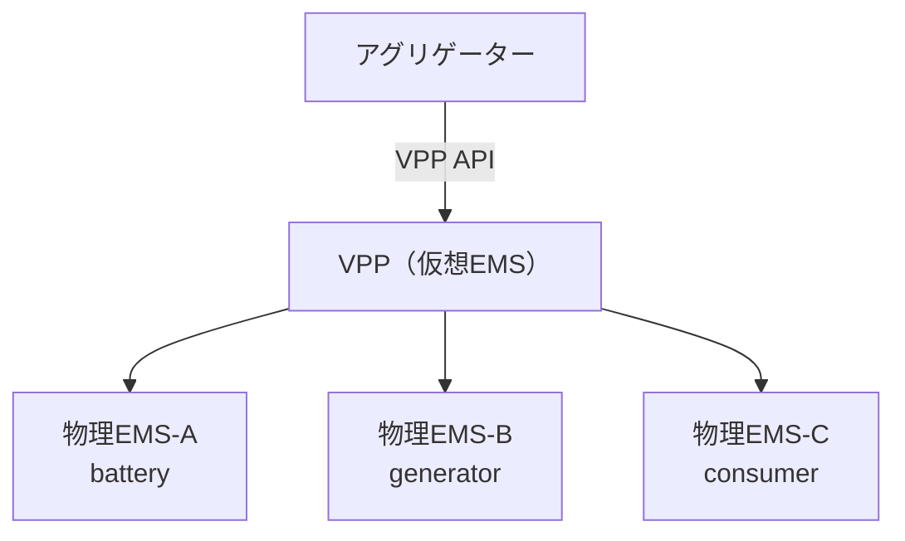
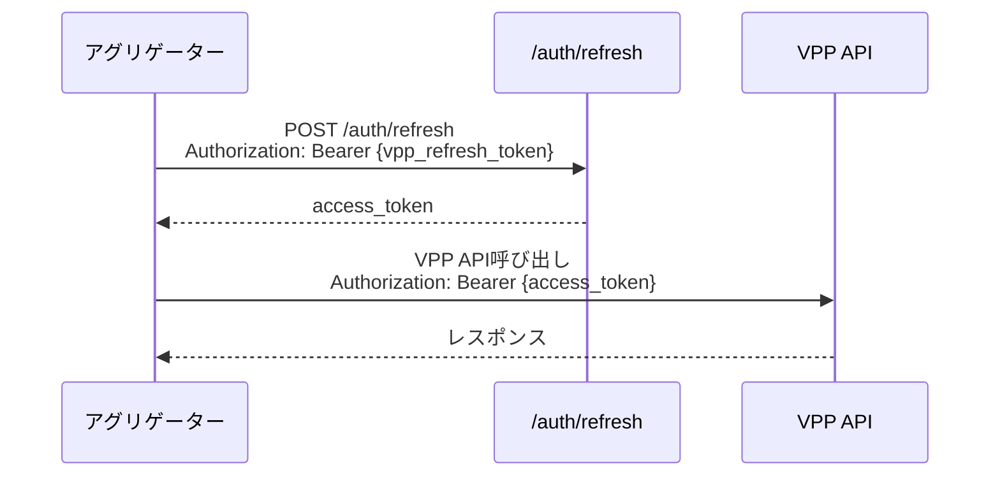
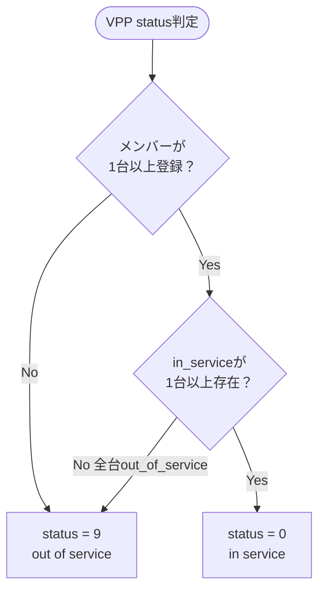
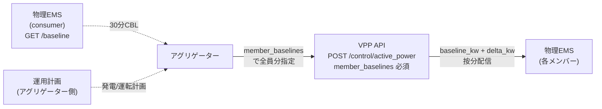
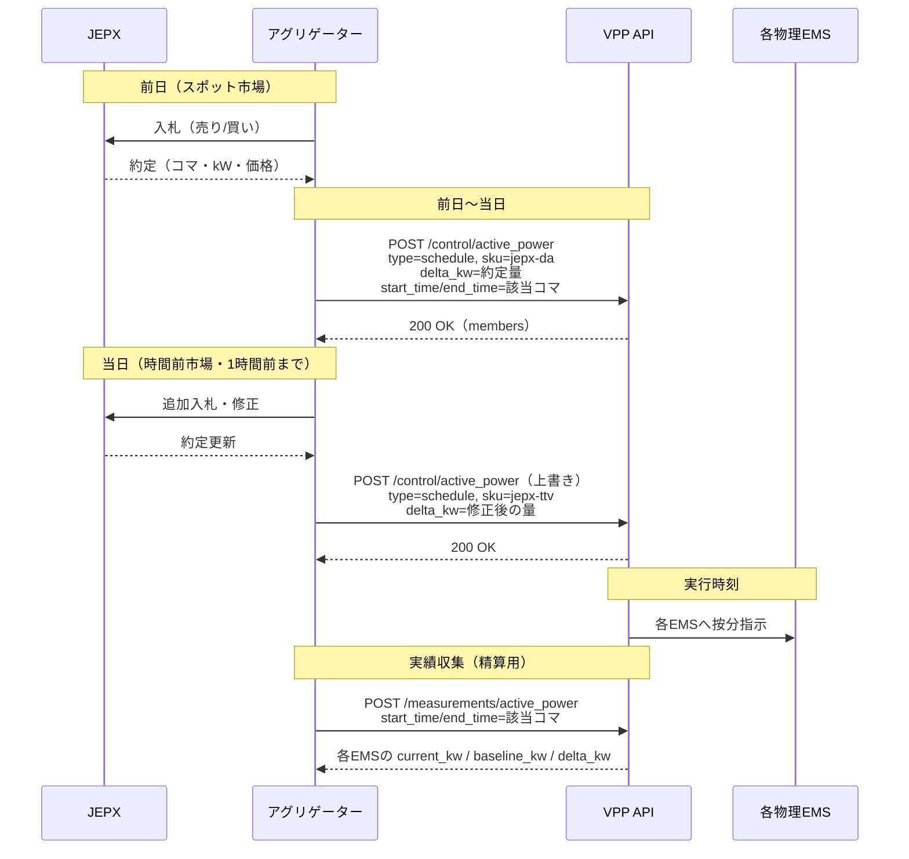
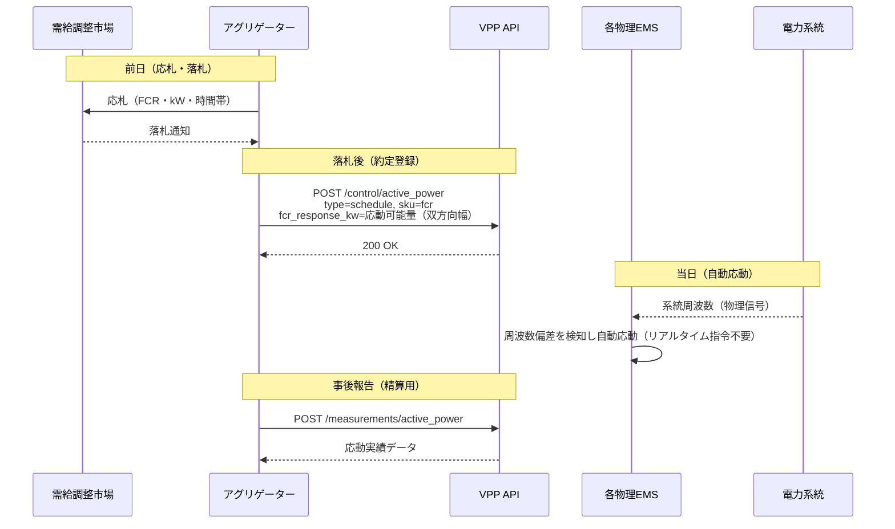
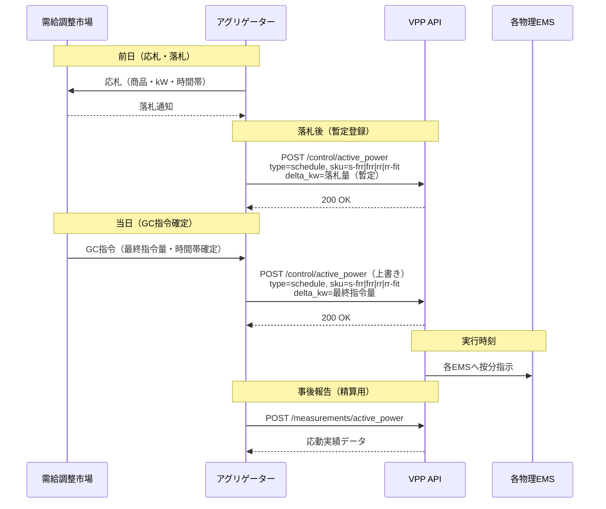

# ENECloud EMS VPP API 仕様説明書

**バージョン**: 1.3
**ステータス**: **正式版（Released）**
**最終更新日**: 2026年7月25日
**提供**: 株式会社ナピル
**ライセンス**: [CC BY 4.0](https://creativecommons.org/licenses/by/4.0/) — 出典表示のもと、引用・再配布・本仕様に準拠した実装が可能です。
**OpenAPI 定義**: [`openapi/vpp-openapi-v1.yaml`](../openapi/vpp-openapi-v1.yaml)

> ### 本書の位置づけ
>
> 本書は **VPP API v1**（パスプレフィックス `/v1/vpp/{vpp_id}/`）の仕様です。複数の物理 EMS（最大 100 メンバー）を仮想 EMS として束ねます。
> 物理 EMS API [v2](ems-openapi-v2.md) と一体で運用する前提です（**VPP v1.3 ↔ 物理EMS v2.2**）。
>
> アグリゲーターのデータ取得（監視・精算）は **VPP API のみで完結** します（v1.3 原則）。

---

## 目次

1. [概要](#1-概要)
   - 1.1 [VPP（Virtual Power Plant）の目的](#11-vppvirtual-power-plantの目的)
   - 1.2 [アグリゲーター向け推奨パターン](#12-アグリゲーター向け推奨パターン)
   - 1.3 [電力分配の基本動作](#13-電力分配の基本動作)
   - 1.4 [用語・フィールド対応表（VPP API ⇔ 物理EMS API）](#14-用語フィールド対応表vpp-api--物理ems-api)
2. [基本情報](#2-基本情報)
   - 2.1 [Base URL](#21-base-url)
   - 2.2 [認証](#22-認証)
   - 2.3 [電力種別](#23-電力種別)
   - 2.4 [レートリミット](#24-レートリミット)
3. [API 一覧](#3-api-一覧)
4. [メンバー管理 API](#4-メンバー管理-api)
   - 4.1 [GET `/members`（一覧取得）](#41-get-members一覧取得)
   - 4.2 [POST `/members`（登録）](#42-post-members登録)
   - 4.3 [POST `/members/{ems_id}`（パラメータ更新）](#43-post-membersems_idパラメータ更新)
   - 4.4 [DELETE `/members/{ems_id}`（削除）](#44-delete-membersems_id削除)
5. [リアルタイム状態取得 `/status` `/status/details`](#5-リアルタイム状態取得-status-statusdetails)
6. [有効電力制御 `/control/active_power`](#6-有効電力制御-controlactive_power)
   - 6.1 [baseline_kw について](#61-baseline_kw-について)
7. [スケジュール管理 API](#7-スケジュール管理-api)
   - 7.1 [GET `/control/active_power/schedules`（一覧取得）](#71-get-controlactive_powerschedules一覧取得)
   - 7.2 [DELETE `/control/active_power/schedules`（削除）](#72-delete-controlactive_powerschedules削除)
8. [履歴 API](#8-履歴-api)
   - 8.1 [POST `/measurements/active_power`（瞬時電力履歴）](#81-post-measurementsactive_power瞬時電力履歴)
   - 8.2 [POST `/measurements/energy`（電力量履歴）](#82-post-measurementsenergy電力量履歴)
9. [エラーコード体系](#9-エラーコード体系)
10. [パラメータ範囲仕様](#10-パラメータ範囲仕様)
11. [市場別利用フロー（参考）](#11-市場別利用フロー参考)
12. [変更履歴](#12-変更履歴)

---

## 1. 概要

### 1.1 VPP（Virtual Power Plant）の目的

本 API は、複数の物理 EMS（蓄電池・発電所など）を **VPP（仮想 EMS）** として束ね、  
VPP アグリゲーターが単一インターフェースで一括制御できる API です。



### 1.2 アグリゲーター向け推奨パターン

> **アグリゲーターは VPP API を唯一のインターフェースとして使用することを推奨**。物理 EMS が 1 台のみの場合も、VPP に 1 メンバーとして登録することで以下のメリットが得られる:
> - **API 表面の統一**: VPP API は EMS API と**同じ JSON 構造・同じフィールド名**を採用し、差分は **members 関連フィールド**（`vpp_id` / `members[]` / `member_baselines[]` / `uncovered_kw`）の有無のみ。電力系の値フィールド（`current_kw` / `baseline_kw` / `delta_kw` / `dispatched_delta_kw` / `fcr_response_kw` / `compound_breakdown` / `import_*_available` / `export_*_available` 等）は両 API で完全同名（[§1.4 用語・フィールド対応表](#14-用語フィールド対応表vpp-api--物理ems-api)参照）
> - **将来の拡張性**: 1 台 → 複数台への移行時、クライアント実装の変更不要（VPP にメンバー追加するのみ）
> - **役割分離の明確化**: VPP = アグリゲーターの境界 / 物理 EMS = 個別リソースの境界
>
> 物理 EMS API（[`ems-openapi-v2.md`](ems-openapi-v2.md)）はリソース側（EMS 制御装置）から見たインターフェースで、**EMS 運用担当が直接保守・診断する場合**、および **`consumer` メンバーの DR ベースライン値（30 分粒度 CBL）を `/baseline` で登録・取得する場合**（[EMS §9.6](ems-openapi-v2.md#96-ベースライン管理-baseline)）にアグリゲーターが直接呼び出す。市場応動・運用指令は VPP API 経由を推奨。
>
> **VPP 配下メンバーへの直接指令の制限**: VPP 配下メンバーの物理 EMS API へ直接 `/control/active_power` を POST すると、VPP 配信済みスケジュールが後勝ちルールで上書きされ、**VPP はこれを検知しない**（`uncovered_kw` にも反映されない）。VPP 配下メンバーへの直接呼び出しは `/baseline` 登録・`/specifications` 参照・保守診断に限定すること。整合性確認は VPP `/status/details` の `members[].active_power.dispatched_delta_kw` と指令値の照合で行う。

**EMS が 1 台のみの場合の VPP 登録例**:

```json
// EMS 運用担当が事前登録（VPP に 1 メンバー）
{
  "vpp_id": "vpp_abc123...",
  "members": [{
    "ems_id": "a1b2c3d4e5f6789012345678901234ab",
    "label": "蓄電所1号",
    "resource_type": "battery",
    "allocation_weight": 100.0
  }]
}
```

アグリゲーターはこの VPP を介して FCR・調整力・JEPX 応動を実施。`allocation_weight: 100.0` で唯一のメンバーに全量配分される。

### 1.3 電力分配の基本動作

VPPは登録された全メンバーを常時分配対象とする。

```
各EMSへの delta_kw(i) = delta_kw × (weight_i / Σweight_in_service_weight_gt0)
```

- `in_service` かつ `allocation_weight>0` のメンバーを `allocation_weight` に従って自動按分
- メンバーが `out_of_service` になった場合、残りの `in_service` かつ `weight>0` のメンバーで自動再按分
- 60秒周期で各EMS の運転計画（物理EMS APIで管理）を参照し再按分

> 運転計画（30分刻みのin/out_of_service・baseline）は物理EMS APIで1台ずつ管理する。VPP APIは運転計画エンドポイントを持たない。
>
> **60秒周期再按分の適用範囲**: 再按分の対象は**メンバーの `status`（in/out_of_service）変化のみ**。`allocation_weight`・`label` の変更およびメンバー削除は実行中の指令には反映されない（次回指令から、[§6 注意事項](#6-有効電力制御-controlactive_power) 参照）。実行中の再按分結果は `/status/details` の `members[].active_power.dispatched_delta_kw` で確認する（指令レスポンスの `uncovered_kw` は配信時点のスナップショットであり更新されない）。

### 1.4 用語・フィールド対応表（VPP API ⇔ 物理EMS API）

**設計原則**: VPP API は物理 EMS API と**同じ JSON 構造・同じフィールド名**を採用する。差分は members 関連フィールド（`vpp_id` / `members[]` / `member_baselines[]` / `uncovered_kw`）の有無のみ。同一フィールド名でも出現場所により意味が変わる点を下表で一覧化する。

凡例:
- **集計**: 配下 `in_service` メンバーの稼働中合算（VPP 内に保管せず、要求時に物理 EMS から引き当てる派生値）
- **指令**: VPP 全体への指令値（`allocation_weight` で按分配信）
- **個別**: 当該物理 EMS の値（EMS top-level と同形式）
- **OR集約**: 配下メンバーのいずれかが 1 なら 1
- **–**: 当該箇所に出現しない

| フィールド | EMS top-level | VPP top-level | VPP `members[].`内 | VPP 固有・特殊用途 |
|---|:---:|:---:|:---:|---|
| `ems_id` | ✓ 識別子 | – | ✓ メンバー識別子 | – |
| `vpp_id` | – | ✓ 識別子 | – | – |
| `current_kw` | 単機実測 | 集計 | 個別 | – |
| `baseline_kw` | 単機基準 | 集計 | 個別 | リクエスト `member_baselines[].baseline_kw` で必須指定（[§6.1](#61-baseline_kw-について)）|
| `delta_kw` | 単機 Δ | リクエスト = 指令 / レスポンス = 集計 | 個別 | – |
| `dispatched_delta_kw` | 単機配信値 | 集計 | 個別 | – |
| `fcr_response_kw` | 単機応動量 | リクエスト = 指令 / レスポンス = 集計 | 個別 | – |
| `compound_breakdown` | 単機内訳 | リクエスト = 指令 / レスポンス = 集計 | 按分結果 | – |
| `import_power_available` / `export_power_available` | 単機能力 | 集計 | 個別 | – |
| `import_energy_available` / `export_energy_available` | 単機能力（battery）| 集計 | 個別（battery）| – |
| `output_control_limit` | 単機 % | – | 個別 | – |
| `output_control_reason` | 単機理由 | – | 個別 | – |
| `fcr_active` | 単機 0/1 | OR集約 | 個別 | – |
| `dr_active` | 単機 0/1 | OR集約 | 個別 | – |
| `dr_target_reduction_kw` / `dr_actual_reduction_kw` | 単機 kW | – | 個別（consumer）| – |
| `active_sku` | 単機 SKU | 集約 | 個別 | – |
| `has_warning` | 単機 0/1 | OR集約 | 個別 | – |
| `soc` | 単機 % | – | 個別（battery）| – |
| `irradiance_w_m2` | 単機 W/m² | – | 個別（PV）| – |
| `actual_frequency` | 単機 Hz | – | 個別（メンバー間で同一）| 系統周波数は合算対象外。クライアントは任意メンバーの値を参照 |
| `members[]` | – | ✓ | – | `/status` / `/status/details` / `/measurements/*` / `/control/*` レスポンス共通、配下メンバー個別データ配列 |
| `members[].label` | – | – | ✓ | メンバー登録時のラベル |
| `members[].allocation_weight` | – | – | ✓ | 按分重み（[§4 メンバー管理 API](#4-メンバー管理-api) 由来）|
| `members[].dispatch_status` | (EMS の `dispatch_status` の拡張。VPP 独自値 `skipped_weight_zero` / `skipped_baseline_missing` / `failed` を追加) | – | ✓（`/control/*` のみ）| 指令配信結果（`dispatched` / `skipped_*` / `failed` / `pending`）|
| `members[].last_dispatch_status` | – | – | ✓（`/status` 系のみ）| 直近指令結果（`skipped_weight_zero` 等 VPP 独自値を含む）|
| `member_baselines[]` | – | – | – | VPP `/control/active_power` **リクエスト必須**。全 `in_service` メンバーの `baseline_kw` を指定 |
| `uncovered_kw` | – | – | – | VPP `/control/active_power` レスポンス、能力超過等で配分できなかった残量 |

> **符号規則**: 両 API とも連系点基準（受電 = 正、送電 = 負）。物理EMS API [§4.1](ems-openapi-v2.md#41-連系点基準の符号規則) と完全一致。

---

## 2. 基本情報

### 2.1 Base URL

> **Base URL について**: 本番／テスト環境のホスト名は公開仕様には含めません。ご契約時に個別提供します。
> 以下ではパスプレフィックス以降を記述します。

パスプレフィックス: `/v1/vpp/{vpp_id}/`

- `{vpp_id}`: VPP ID（16バイトUUID = 32文字hex（ハイフン無し）、物理EMS IDと同形式）
- VPP IDはEMS運用担当が払い出し
- **VPP API のパスプレフィックスは `/v1/vpp/`**（物理EMS API は `/v2/ems/`）。両 API は独立したバージョン体系を持つが、運用時は **VPP v1.3 ↔ 物理EMS v2.2** の組み合わせで使用する前提

### 2.2 認証

既存の`/auth/refresh`を使用。Refresh TokenはVPP IDに紐付いたものを使用。



### VPP ID仕様

既存の物理EMS ID（[EMS §2 Base URL](ems-openapi-v2.md#base-url) 参照）と同形式:
- **形式**: **16 バイト UUID（32 文字 hex、ハイフン無し）**
- **例**: `f1b2c3d4e5f6789012345678901234ab`（32 文字 hex）
- **文字種**: `0-9`, `a-f`（小文字）

### 2.3 電力種別

**本仕様の電力・電力量フィールドはすべて有効電力 (Active Power, kW) ベース**。物理EMS API [§5.1 データ形式](ems-openapi-v2.md#51-データ形式) と整合。無効電力 (kvar)・皮相電力 (kVA)・力率は本 API のスコープ外（EMS制御装置側で自律管理）。

### HTTP ヘッダー規約

物理EMS API [§2 HTTP ヘッダー規約](ems-openapi-v2.md#http-ヘッダー規約) と同形式。

#### リクエストヘッダー

| ヘッダー | 必須 | 説明 |
|---------|:----:|------|
| `Authorization` | ○ | `Bearer {access_token}` 形式（VPP用 Refresh Token から取得した Access Token）|
| `Content-Type` | POST/DELETE 時（本文あり）| `application/json; charset=utf-8` |
| `Accept` | 任意 | `application/json`（デフォルト）|
| `Idempotency-Key` | 任意 | `/control/active_power` での冪等性担保（最大 128 文字、24 時間保持、VPP ID 単位）|
| `X-Request-Id` | 任意 | クライアント側追跡用 ID（レスポンスにも返却）|

#### レスポンスヘッダー（共通）

| ヘッダー | 説明 |
|---------|------|
| `Content-Type` | `application/json; charset=utf-8` |
| `X-RateLimit-Limit` / `X-RateLimit-Remaining` / `X-RateLimit-Reset` / `X-RateLimit-Reset-After` | レートリミット情報（[§2.4 レートリミット](#24-レートリミット) 参照）|
| `X-Request-Id` | リクエスト時指定があれば返却 |

### 2.4 レートリミット

物理EMS APIと同様の制限を基本としつつ、**参照系と制御系を独立したバケット**で管理する（参照ポーリングの消費が市場応動時の制御を阻害しないため）。

| 項目 | 値 |
|------|-----|
| 参照系上限 | 1000回 / 1時間（VPP ID単位）。対象: `/members` GET・`/status`・`/status/details`・`/control/active_power/schedules` GET・`/measurements/active_power`・`/measurements/energy`（計 6 エンドポイント）|
| 制御系上限 | 200回 / 1時間（VPP ID単位、参照系とは**独立したバケット**）。対象: `/members` POST・`/members/{ems_id}` POST・`/members/{ems_id}` DELETE・`/control/active_power` POST・`/control/active_power/schedules` DELETE（計 5 エンドポイント）|
| リセット周期 | 1時間（スライディングウィンドウ） |

> `X-RateLimit-*` レスポンスヘッダーは、呼び出したエンドポイントが属するバケットの値を返す。

> `/auth/refresh` は VPP ID に紐付く Refresh Token単位で別途レートリミットが適用される（物理EMS API と共通の制限）。詳細は [ems-openapi-v2.md §5.2](ems-openapi-v2.md#52-レートリミット) 参照。

**レスポンスヘッダー**:

| ヘッダー | 説明 |
|---------|------|
| `X-RateLimit-Limit` | 上限リクエスト数（呼び出したエンドポイントのバケット上限: 参照系 1000 / 制御系 200） |
| `X-RateLimit-Remaining` | 残りリクエスト数 |
| `X-RateLimit-Reset` | カウントリセット時刻（Unix時刻、秒） |
| `X-RateLimit-Reset-After` | リセットまでの残り秒数 |

**超過時エラー（429 Too Many Requests）**:

```json
{
  "vpp_id": "f1b2c3d4e5f6789012345678901234ab",
  "error": {
    "code": 429,
    "message": "Rate limit exceeded",
    "details": "Request limit of 1000 per hour exceeded. Try again after 2026-04-04T11:00:00Z.",
    "error_type": "rate_limit_exceeded",
    "limit": 1000,
    "remaining": 0,
    "reset_time": "2026-04-04T11:00:00Z",
    "retry_after": 900
  },
  "timestamp": "2026-04-04T10:45:00Z"
}
```

---

## 3. API 一覧

> **認証エンドポイント** `/auth/refresh` は物理EMS API と共通（[ems-openapi-v2.md §9.1](ems-openapi-v2.md#91-認証-authrefresh) 参照）。VPP用 Refresh Token を使用して Access Token を取得し、本表のVPPエンドポイント呼び出しに `Authorization: Bearer {access_token}` で付与する。

| 章 | カテゴリ | エンドポイント | メソッド | 概要 |
|---|----------|---------------|----------|------|
| 4.1 | **メンバー管理** | `/members` | GET | 物理EMS一覧取得 |
| 4.2 | **メンバー管理** | `/members` | POST | 物理EMS登録 |
| 4.3 | **メンバー管理** | `/members/{ems_id}` | POST | 物理EMSパラメータ更新 |
| 4.4 | **メンバー管理** | `/members/{ems_id}` | DELETE | 物理EMS削除 |
| 5 | **リアルタイム状態（概要）** | `/status` | GET | 配下EMS集計状態の**概要**（一覧監視用、最小フィールド）|
| 5 | **リアルタイム状態（詳細）** | `/status/details` | GET | 配下EMS集計状態の**詳細**（ドリルダウン用、全フィールド + 各メンバーの詳細）。`?include_components=true` で `multi_component` メンバーの component 個別状態も返却可 |
| 6 | **有効電力制御** | `/control/active_power` | POST | 有効電力指令（即座指示・スケジュール登録、kW 系）。`member_baselines[]` を**全メンバー分必須指定**（VPP は baseline を保管しない）。無効電力指令は将来 `/control/reactive_power` で別途追加予定 |
| 7.1 | **スケジュール管理** | `/control/active_power/schedules` | GET | スケジュール一覧取得（kW 系、無効電力スケジュールは将来 `/control/reactive_power/schedules` で別途）|
| 7.2 | **スケジュール管理** | `/control/active_power/schedules` | DELETE | スケジュール削除 |
| 8.1 | **履歴** | `/measurements/active_power` | POST | VPP電力値（kW）履歴データ取得（メンバー別 + VPP集計）。**保管 60 日 / サンプリング間隔 `1` / `60` / `1800` / `3600` / `86400` 秒の 5 値（デフォルト 60）/ 取得期間 最大 31 日 / 最大時系列ポイント数 44,640 件 / 複合上限 ポイント数 × 取得対象メンバー数 ≤ 446,400**。`include_components: true` で `multi_component` メンバーの component 個別値も返却可 |
| 8.2 | **履歴** | `/measurements/energy` | POST | VPP電力量（kWh）累積データ取得（メンバー別 + VPP集計）。**保管 12 か月（365 日）/ 最小集計単位 60 秒 / 取得期間 最大 31 日 / レスポンスは常に `data[]` 形式（省略時は期間全体 1 レコード）**。`interval_seconds`（`1800` / `3600` / `86400`、任意）指定でコマ別・日次の時系列返却（複合上限 レコード数 × 取得対象メンバー数 ≤ 44,640）、`ems_ids` 絞り込み、`include_components: true` で component 内訳（経路追跡フィールド）返却可 |

---

## 4. メンバー管理 API

VPP 配下の物理 EMS（メンバー）の登録・更新・削除・参照を行う API 群。

### 4.1 GET `/members`（一覧取得）

```
GET /v1/vpp/{vpp_id}/members
```

**概要**: VPPに登録されている物理EMS一覧を確認

### レスポンス例

**メンバーが登録済みの場合**:

```json
{
  "vpp_id": "f1b2c3d4e5f6789012345678901234ab",
  "members": [
    {
      "ems_id": "a1b2c3d4e5f6789012345678901234ab",
      "label": "蓄電所A",
      "resource_type": "battery",
      "allocation_weight": 100,
      "registered_at": "2026-03-01T09:00:00Z"
    },
    {
      "ems_id": "b2c3d4e5f6789012345678901234abcd",
      "label": "需要家B",
      "resource_type": "consumer",
      "allocation_weight": 100,
      "registered_at": "2026-03-05T12:00:00Z"
    },
    {
      "ems_id": "c3d4e5f6789012345678901234abcdef",
      "label": "蓄電所C",
      "resource_type": "battery",
      "allocation_weight": 100,
      "registered_at": "2026-03-10T09:00:00Z"
    }
  ],
  "total_count": 3,
  "timestamp": "2026-04-04T10:00:00Z"
}
```

**メンバーが0台の場合（VPP作成直後など）**:

```json
{
  "vpp_id": "f1b2c3d4e5f6789012345678901234ab",
  "members": [],
  "total_count": 0,
  "timestamp": "2026-04-04T10:00:00Z"
}
```

> メンバーが0台でも200 OKを返す。VPP IDが存在しない場合は404エラー。

### レスポンス項目定義

| 項目名 | 型 | 単位 | 説明 |
|--------|------|------|------|
| `vpp_id` | string | - | VPP識別子 |
| `members` | array | - | 物理EMS一覧 |
| `total_count` | integer | - | 登録済み物理EMS数 |
| `timestamp` | string | - | API応答時刻（ISO 8601形式） |

**members配列要素**:

| 項目名 | 型 | 説明 |
|--------|------|------|
| `ems_id` | string | 物理EMS識別子（16バイトUUID = 32文字hex（ハイフン無し）） |
| `label` | string | 識別用ラベル（登録時に設定） |
| `resource_type` | string | リソース種別（`battery`: 蓄電池、`generator`: 発電所、`consumer`: 需要家、`multi_component`: `components.length ≥ 2` のサイト） |
| `allocation_weight` | number | 分配重み（デフォルト 100）。実分配比率 = weight_i / Σweight（in_service かつ weight>0 のメンバー合計）で計算 |
| `registered_at` | string | 登録時刻（ISO 8601形式） |

> **ベースラインは VPP に保管しない**: 各メンバーのベースライン値は指令時に `member_baselines[]` で必須指定する（[§6.1 baseline_kw について](#61-baseline_kw-について) 参照）。これにより VPP と物理 EMS の二重保管による不整合を排除し、`consumer` メンバーの 30 分粒度 CBL（物理 EMS `/baseline`）と整合させる。

---

### 4.2 POST `/members`（登録）

```
POST /v1/vpp/{vpp_id}/members
```

**概要**: VPPに物理EMSを追加登録

### リクエストパラメータ

```json
{
  "ems_id": "a1b2c3d4e5f6789012345678901234ab",
  "label": "蓄電所A",
  "resource_type": "battery",
  "allocation_weight": 100
}
```

| パラメータ | 型 | 必須 | 説明 |
|-----------|------|------|------|
| `ems_id` | string | 必須 | 登録する物理EMS ID（16バイトUUID = 32文字hex（ハイフン無し）） |
| `label` | string | 任意 | 識別用ラベル（最大64文字） |
| `resource_type` | string | 必須 | リソース種別（`battery` / `generator` / `consumer` / `multi_component`）。物理 EMS API（[ems-openapi-v2.md §3.1](ems-openapi-v2.md#31-統一リソースモデルcomponents-ベース)）の `components[]` 構成と整合: 単機サイトは `component_type` 値（battery / generator / consumer）、`components.length ≥ 2` のサイトは `multi_component`。登録時、VPP は当該 `ems_id` の物理 EMS `/specifications` と突合し、`components` 構成と不一致の場合は 400（`resource_type_mismatch`）|
| `allocation_weight` | number | 任意 | 分配重み（0〜999999.9）。省略時は100。合計制約なし。**`0`を設定すると登録を維持したまま分配から除外**（一時停止用途）。実分配比率 = weight_i / Σweight（in_serviceかつweight>0） |

> **ベースラインは VPP に保管しない**: 登録時にもパラメータ更新時にもベースライン値は指定できない。VPP `/control/active_power` 指令時に `member_baselines[]` で必須指定する（[§6.1 baseline_kw について](#61-baseline_kw-について) 参照）。

> **`measurement_point` は登録時に指定不可**。物理EMS API `/specifications` で **EMS運用担当が制度・運用ルールに基づき審査・管理する静的属性**であり、VPP 側は読み取り専用（物理EMS API [`/specifications`](ems-openapi-v2.md#93-仕様情報-specifications) で参照）。計測点（`grid` = 受電点 / `device` = 機器点）の変更が必要な場合は、物理EMS API `/specifications` 側で EMS運用担当に申請すること。詳細は [ems-openapi-v2.md §3.6](ems-openapi-v2.md#36-計測点受電点--機器点) 参照。

**resource_type の値**:

| 値 | 説明 | 上げ指令 | 下げ指令 | SOC | FCR |
|----|------|---------|------------|-----|-----|
| `battery` | 蓄電池 | 可（受電） | 可（送電） | あり | `fcr_capable: true` で参加可 |
| `generator` | 発電所 | 火力/揚水/バイオマス可、PV/風力不可 | 可（発電） | なし（揚水のみ上池容量あり）| `thermal`/`pumped_storage`/`biomass` 等のディスパッチ可能電源で `fcr_capable: true` で参加可 |
| `consumer` | 需要家（需要応答） | battery 併設時のみ可 | 可（消費削減） | なし | 高速応答 DR（`fcr_capable: true`）で参加可 |
| `multi_component` | 複数 component サイト（同一連系点に 2 つ以上の component、`components.length ≥ 2`）| component 構成に依存 | component 構成に依存 | battery component あれば | `fcr_capable` component を含む場合参加可 |

> 各メンバーの `fcr_capable` / `dr_capable` / `voltage_class` / `measurement_point` / `contract_kw` / `site_*_max_kw` / `generator_kind` / `marketable` 等の**静的仕様属性**は物理 EMS API（[`/specifications`](ems-openapi-v2.md#93-仕様情報-specifications)）で参照。VPP API は **メンバー登録情報**（`ems_id` / `resource_type` / `label` / `allocation_weight`）のみを保持し、運用時はクライアントが `ems_id` で物理 EMS API の静的属性とキャッシュ突合する設計。

**allocation_weight について**:
- 合計制約なし。0以上の数を設定する
- **`weight=0` の意味**: 分配から除外されるが、メンバー登録は維持される（一時的な分配停止用途）。`out_of_service` とは独立した概念
- 実分配比率はサーバーが自動計算: `実分配比率(i) = weight_i / Σweight（in_serviceかつweight>0のメンバー合計）`
- 例: 3台を weight=100/100/100 で登録 → 各33.3%ずつ自動按分
- 例: 3台を weight=60/30/10 で登録 → 60%/30%/10%で按分
- 例: 25台を weight=100（デフォルト）で登録 → 等分。1台停止→残り24台で自動再按分
- 例: weight=0 に設定 → 停止せずに分配対象から除外（`out_of_service` にせず一時除外したい場合）
- 台数変動（追加・削除・停止）時も他メンバーの`allocation_weight`変更不要

**登録上限**:
- 1VPPに登録できる物理EMS数は**最大100台**
- 上限超過時は400エラー

**複数 VPP への重複登録の禁止**:
- 1 つの物理 EMS は同時に 1 つの VPP にのみ登録できる。他 VPP に登録済みの `ems_id` を指定した場合は 409 エラー（`ems_registered_to_other_vpp`）
- 需給調整市場・容量市場におけるリソース二重カウント（kW の重複計上）を防止するためのシステム制約

### レスポンス例

**成功時（200 OK）**:

```json
{
  "vpp_id": "f1b2c3d4e5f6789012345678901234ab",
  "message": "EMS registered successfully",
  "ems_id": "a1b2c3d4e5f6789012345678901234ab",
  "label": "蓄電所A",
  "resource_type": "battery",
  "allocation_weight": 100,
  "registered_at": "2026-04-04T10:00:00Z",
  "timestamp": "2026-04-04T10:00:00Z"
}
```

### エラーレスポンス

| コード | 説明 |
|--------|------|
| **400** | `ems_id`の形式不正 |
| **400** | `resource_type`の値不正 |
| **400** | `resource_type`が物理EMSの`components`構成と不一致（`resource_type_mismatch`）|
| **400** | 登録上限（100台）を超過 |
| **400** | 指定した`ems_id`の物理EMSが存在しない（`ems_not_found`）|
| **409** | 指定した`ems_id`は既に登録済み |
| **409** | 指定した`ems_id`は他のVPPに登録済み（`ems_registered_to_other_vpp`）|

**409エラー例**:

```json
{
  "vpp_id": "f1b2c3d4e5f6789012345678901234ab",
  "error": {
    "code": 409,
    "message": "EMS already registered",
    "details": "ems_id a1b2c3d4e5f6789012345678901234ab is already a member of this virtual EMS",
    "ems_id": "a1b2c3d4e5f6789012345678901234ab"
  },
  "timestamp": "2026-04-04T10:00:00Z"
}
```

---

### 4.3 POST `/members/{ems_id}`（パラメータ更新）

```
POST /v1/vpp/{vpp_id}/members/{ems_id}
```

**概要**: 登録済み物理EMSの`allocation_weight`・`label`を更新する。`ems_id`・`resource_type`は変更不可。ベースライン値はメンバー単位では保持しない（指令時に `member_baselines[]` で指定）。

### リクエストパラメータ

変更したい項目のみ指定（省略した項目は変更しない）。

```json
{
  "allocation_weight": 150,
  "label": "蓄電所A（更新）"
}
```

| パラメータ | 型 | 必須 | 説明 |
|-----------|------|------|------|
| `allocation_weight` | number | 任意 | 新しい分配重み（0〜999999.9）。合計制約なし。**`0`を設定すると登録を維持したまま分配から除外**（一時停止用途） |
| `label` | string | 任意 | 新しいラベル（最大64文字） |

### レスポンス例

**成功時（200 OK）**:

```json
{
  "vpp_id": "f1b2c3d4e5f6789012345678901234ab",
  "message": "Member updated successfully",
  "ems_id": "a1b2c3d4e5f6789012345678901234ab",
  "label": "蓄電所A（更新）",
  "resource_type": "battery",
  "allocation_weight": 150,
  "timestamp": "2026-04-04T11:00:00Z"
}
```

### エラーレスポンス

| コード | 説明 |
|--------|------|
| **400** | 変更不可フィールド（`ems_id`・`resource_type`）または **廃止フィールド**（`default_baseline_kw` 等、[§12 変更履歴](#12-変更履歴)参照）を指定 |
| **404** | 指定した`ems_id`はこのVPPに登録されていない |

---

### 4.4 DELETE `/members/{ems_id}`（削除）

```
DELETE /v1/vpp/{vpp_id}/members/{ems_id}
```

**概要**: VPPから物理EMSを削除（物理EMSそのものは削除しない）

### パスパラメータ

| パラメータ | 説明 |
|-----------|------|
| `vpp_id` | VPP ID |
| `ems_id` | 削除する物理EMS ID |

### レスポンス例

**成功時（200 OK）**:

```json
{
  "vpp_id": "f1b2c3d4e5f6789012345678901234ab",
  "message": "EMS removed successfully",
  "ems_id": "a1b2c3d4e5f6789012345678901234ab",
  "timestamp": "2026-04-04T10:00:00Z"
}
```

### エラーレスポンス

| コード | 説明 |
|--------|------|
| **404** | 指定した`ems_id`はこのVPPに登録されていない |

---

## 5. リアルタイム状態取得 `/status` `/status/details`

VPP状態取得は **2 階層構成**（物理EMS API [§9.2](ems-openapi-v2.md#92-リアルタイム状態取得-status-statusdetails) と整合）:

| エンドポイント | 用途 | レスポンス |
|---|---|---|
| **`GET /v1/vpp/{vpp_id}/status`**（概要）| 一覧監視・ダッシュボード | 集計値の概要 + 各メンバーの概要 |
| **`GET /v1/vpp/{vpp_id}/status/details`**（詳細）| ドリルダウン分析 | 集計値の詳細 + 各メンバーの詳細（`multi_component` メンバーのサイトレベル集約値含む）|

> 既存クライアントは `/status/details` を呼ぶことで全情報を取得可能。`/status` は v1.1 で**概要レベルに絞り込まれた**設計。

```
GET /v1/vpp/{vpp_id}/status
GET /v1/vpp/{vpp_id}/status/details
```

**概要 (`/status`)**: 配下の物理EMS全体の集計状態の最小フィールドを返却（一覧監視用）
**詳細 (`/status/details`)**: 集計値の全フィールド + 各メンバーの詳細（精算・履行評価用）

> **`resource_type` は `/status` `/status/details` のいずれでも返却しない**（静的属性のため [VPP §4.1 GET `/members`](#41-get-members一覧取得) または物理EMS API [`/specifications`](ems-openapi-v2.md#93-仕様情報-specifications) で取得）。VPPメンバー一覧の解釈には EMS 登録時に取得した値を保持して利用する（物理EMS API §9.2 と同方針）。

### レスポンス例（概要 `/status`）

```json
{
  "vpp_id": "f1b2c3d4e5f6789012345678901234ab",
  "status": 0,                           // 0: in service, 9: out of service
  "fcr_active": 0,                       // 配下に FCR 自立運転中の EMS が1台以上存在
  "dr_active": 0,                        // 配下に DR 削減モード実行中の EMS が1台以上存在
  "import_energy_available": 5690,   // [kWh] battery かつ稼働中のみ合算
  "export_energy_available": 8198,   // [kWh] battery かつ稼働中のみ合算
  "import_power_available": 75.0,    // [kW] 稼働中のみ合算
  "export_power_available": 90.0,    // [kW] 稼働中のみ合算
  "current_kw": -29.4,             // [kW] 全体現在電力
  "baseline_kw": 0.0,              // [kW] 全体ベースライン（稼働中合算）
  "delta_kw": -29.4,               // [kW] 全体実測差分 = current_kw - baseline_kw
  "dispatched_delta_kw": -49.0,    // [kW] VPP全体の直近指令Δ電力合計
  "has_warning": 1,                      // 配下に1台でも警告メンバーが存在
  "members": [
    {
      "ems_id": "a1b2c3d4e5f6789012345678901234ab",
      "status": 0,
      "fcr_active": 0,
      "current_kw": -29.4,
      "baseline_kw": 0.0,
      "delta_kw": -29.4,
      "dispatched_delta_kw": -24.5,
      "import_energy_available": 2090,
      "export_energy_available": 4598,
      "import_power_available": 30.0,
      "export_power_available": 45.0,
      "output_control_limit": 100,
      "has_warning": 0,
      "measure_timestamp": "2026-04-04T10:29:55Z"
    },
    {
      "ems_id": "b2c3d4e5f6789012345678901234abcd",
      "status": 9,
      "fcr_active": 0,
      "dr_active": 0,
      "current_kw": 0.0,
      "baseline_kw": 30.0,
      "delta_kw": -30.0,
      "dispatched_delta_kw": null,
      "import_power_available": 0.0,
      "export_power_available": 0.0,
      "has_warning": 1,
      "measure_timestamp": "2026-04-04T10:29:58Z"
    },
    {
      "ems_id": "c3d4e5f6789012345678901234abcdef",
      "status": 0,
      "fcr_active": 0,
      "current_kw": 0.0,
      "baseline_kw": 0.0,
      "delta_kw": 0.0,
      "dispatched_delta_kw": -24.5,
      "import_energy_available": 3600,
      "export_energy_available": 3600,
      "import_power_available": 45.0,
      "export_power_available": 45.0,
      "output_control_limit": 100,
      "has_warning": 0,
      "measure_timestamp": "2026-04-04T10:29:56Z"
    }
  ],
  "timestamp": "2026-04-04T10:30:00Z"
}
```

> 概要は `resource_type` を返却しないため、種別固有項目（`import_*` / `export_*` / `dr_active` 等）の有無はメンバーごとに変動する（クライアントは事前取得した `resource_type` で解釈）。

### `/status/details` 詳細

#### 概要

精算・履行評価・ドリルダウン分析用途で、VPP 全体の集計値と配下メンバーの**運用状態の全フィールド**を意味別ブロックに整理して返却する（物理EMS API [§9.2.2](ems-openapi-v2.md#922-statusdetails-詳細) と同形式）。

**クエリパラメータ**:

| パラメータ | 型 | 必須 | 説明 |
|-----------|------|------|------|
| `include_components` | boolean | 任意 | `true`（`?include_components=true`）指定時、`multi_component` メンバーの `members[]` 要素に `components[]`（component 個別の現在状態）を含めて返却。各要素は物理 EMS API [§9.2.2](ems-openapi-v2.md#922-statusdetails-詳細) の `components[]` と同一定義（`component_id` / `component_type` / `status` + `active_power` / `capacity` / `resource_state` ブロックのサブセット）。デフォルト `false`（従来動作）。概要 `/status` では指定不可（無視される）|

**用途例**:
- VPP 全体の市場応動達成度分析（`active_power.delta_kw` ÷ `dispatched_delta_kw`）
- 配下メンバー別の応動状況・乖離分析（按分結果と実測の対比）
- 各メンバーの SOC・DR 履行量・出力制御理由・日射強度等の精密確認
- TSO 指令受信状況（電圧維持・並列継続等、将来枠）

#### 概要 (`/status`) との違い

| 観点 | `/status` 概要 | `/status/details` 詳細 |
|---|---|---|
| 構造 | **フラット**（top-level に直接フィールド）| **意味グループ別の階層**（VPP 集計値・各メンバーとも 5 ブロック）|
| 集計値返却項目 | 概要レベル（`current_kw` / `baseline_kw` / `delta_kw` / `dispatched_delta_kw` / `import_*_available` / `export_*_available` / `fcr_active` / `dr_active` / `has_warning` 等）| 全フィールド（`fcr_response_kw` / `active_sku` 等を追加）|
| メンバー返却項目 | 概要レベル（`current_kw` / `baseline_kw` / `delta_kw` / `dispatched_delta_kw` / `output_control_limit` / `has_warning` 等）| 全フィールド（`label` / `allocation_weight` / `active_sku` / `last_dispatch_status` / `fcr_response_kw` / `soc` / `dr_target/actual_reduction_kw` / `output_control_reason` / `irradiance_w_m2` 等を追加）|
| 用途 | ダッシュボード・一覧監視 | VPP 全体および個別メンバーの精密分析 |

#### レスポンス全体構造

VPP 集計値（top-level）も配下メンバー（`members[]` 各要素）も、**同じ 5 ブロック構造**で返却:

```json
{
  // ── ① top-level（識別・運用状態）──
  "vpp_id": "...", "status": 0,
  "active_sku": "...", "has_warning": 0, "timestamp": "...",

  // ── ② 有効電力（kW 系、VPP 集計）── 本仕様で返却
  "active_power":        { current_kw, baseline_kw, delta_kw,
                           dispatched_delta_kw,
                           fcr_active, fcr_response_kw },

  // ── ③ 無効電力（kvar 系）── 将来枠、本仕様では未返却
  "reactive_power":      { current_kvar, ..., voltage_control_active, ... },

  // ── ④ TSO 指令詳細（出力制御以外）── 将来枠、本仕様では未返却
  "tso_dispatch_detail": { voltage_dispatch: {...},
                           sync_dispatch: {...},
                           other_dispatch: [...] },

  // ── ⑤ 容量・可用量（VPP 集計）──
  "capacity":            { import_energy_available, export_energy_available,
                           import_power_available,  export_power_available },

  // ── ⑥ リソース種別固有 ──
  "resource_state":      { dr_active },

  // ── 配下メンバー一覧（各要素は上記 ①〜⑥ と同形式の階層構造）──
  "members": [
    {
      "ems_id": "...", "label": "...", "allocation_weight": 100,
      "status": 0, "has_warning": 0,
      "active_sku": "...", "last_dispatch_status": "...",
      "measure_timestamp": "...",
      "active_power":   { current_kw, baseline_kw, delta_kw, dispatched_delta_kw,
                          fcr_active, fcr_response_kw,
                          output_control_limit, output_control_reason },
      "reactive_power": { ... },          // 将来枠
      "tso_dispatch_detail": { ... },     // 将来枠
      "capacity":       { import_energy_available, export_energy_available,
                          import_power_available,  export_power_available },
      "resource_state": { soc,                              // battery
                          irradiance_w_m2,                  // generator
                          dr_active, dr_target/actual_reduction_kw }  // consumer
    }
  ]
}
```

> **VPP 集計値とメンバーの対称構造**: 集計値（top-level）もメンバー（`members[]` 各要素）も**完全に同じフィールド名・同じ 5 ブロック構造**で返却する。集計値の意味は「配下 `in_service` メンバーの稼働中合算」、メンバーの意味は「当該物理 EMS の値」と文脈で区別する。同名・同構造によりクライアントは集計値・メンバーを共通パーサーで処理可能。

> **将来枠の扱い**: `reactive_power` / `tso_dispatch_detail` ブロックは本仕様では **キー自体が存在しない**（`null` ではなく**ブロック非存在**）。物理EMS API `/specifications` の `reactive_power_capable: true` / `tso_dispatch_capable: true` のリソースで実装完了後に返却対象となる。

> **静的属性は本 API では返却しない**: `resource_type` は VPP `/members` 取得（[§4.1](#41-get-members一覧取得)）で、`fcr_capable` / `dr_capable` / `voltage_class` / `measurement_point` / `contract_kw` / `site_*_max_kw` / `generator_kind` / `marketable` 等の `/specifications` 由来の静的属性は物理 EMS API [`/specifications`](ems-openapi-v2.md#93-仕様情報-specifications) で取得。クライアントは登録時に取得した静的属性をキャッシュし、`/status/details` 応答の解釈に利用する設計。

---

### レスポンス例（詳細 `/status/details`）

```json
{
  "vpp_id": "f1b2c3d4e5f6789012345678901234ab",
  "status": 0,                           // 0: in service, 9: out of service
  "active_sku": null,
  "has_warning": 1,
  "active_power": {
    "current_kw": -29.4,           // [kW] 全体現在電力（全resource_type・稼働中のみ合算）
    "baseline_kw": 0.0,            // [kW] 全体ベースライン（稼働中のみ）
    "delta_kw": -29.4,             // [kW] 全体実測差分 = current_kw - baseline_kw
    "dispatched_delta_kw": -49.0,  // [kW] VPP全体の直近指令Δ電力合計
    "fcr_active": 0,                     // 配下に FCR 自立運転中の EMS が1台以上存在
    "fcr_response_kw": null              // [kW] VPP 全体の FCR 応動可能量、active_sku=fcr または active_sku=compound で FCR を含む場合に非null
  },
  "capacity": {
    "import_energy_available": 5690,   // [kWh] battery かつ稼働中のみ合算
    "export_energy_available": 8198,   // [kWh] battery かつ稼働中のみ合算
    "import_power_available": 75.0,    // [kW] 稼働中のみ合算
    "export_power_available": 90.0     // [kW] 稼働中のみ合算
  },
  "resource_state": {
    "dr_active": 0                       // 配下に DR 削減モード実行中の EMS が1台以上存在
  },
  "members": [
    {
      "ems_id": "a1b2c3d4e5f6789012345678901234ab",
      "label": "蓄電所A",
      "allocation_weight": 100,
      "status": 0,
      "has_warning": 0,
      "active_sku": null,
      "last_dispatch_status": "dispatched",
      "measure_timestamp": "2026-04-04T10:29:55Z",
      "active_power": {
        "current_kw": -29.4,
        "baseline_kw": 0.0,
        "delta_kw": -29.4,
        "dispatched_delta_kw": -24.5,
        "fcr_active": 0,
        "fcr_response_kw": null,
        "output_control_limit": 100,
        "output_control_reason": null
      },
      "capacity": {
        "import_energy_available": 2090,
        "export_energy_available": 4598,
        "import_power_available": 30.0,
        "export_power_available": 45.0
      },
      "resource_state": {
        "soc": 65
      }
    },
    {
      "ems_id": "b2c3d4e5f6789012345678901234abcd",
      "label": "需要家B",
      "allocation_weight": 100,
      "status": 9,
      "has_warning": 1,
      "active_sku": null,
      "last_dispatch_status": "skipped_out_of_service",
      "measure_timestamp": "2026-04-04T10:29:58Z",
      "active_power": {
        "current_kw": 0.0,
        "baseline_kw": 30.0,
        "delta_kw": -30.0,
        "dispatched_delta_kw": null,
        "fcr_active": 0,
        "fcr_response_kw": null,
        "output_control_limit": null,
        "output_control_reason": null
      },
      "capacity": {
        "import_power_available": 0.0
      },
      "resource_state": {
        "dr_active": 0,
        "dr_target_reduction_kw": null,
        "dr_actual_reduction_kw": null
      }
    },
    {
      "ems_id": "c3d4e5f6789012345678901234abcdef",
      "label": "蓄電所C",
      "allocation_weight": 100,
      "status": 0,
      "has_warning": 0,
      "active_sku": null,
      "last_dispatch_status": "dispatched",
      "measure_timestamp": "2026-04-04T10:29:56Z",
      "active_power": {
        "current_kw": 0.0,
        "baseline_kw": 0.0,
        "delta_kw": 0.0,
        "dispatched_delta_kw": -24.5,
        "fcr_active": 0,
        "fcr_response_kw": null,
        "output_control_limit": 100,
        "output_control_reason": null
      },
      "capacity": {
        "import_energy_available": 3600,
        "export_energy_available": 3600,
        "import_power_available": 45.0,
        "export_power_available": 45.0
      },
      "resource_state": {
        "soc": 80
      }
    }
  ],
  "timestamp": "2026-04-04T10:30:00Z"   // API応答時刻（ISO 8601形式）
}
```

### レスポンス項目定義

**集計値（VPP全体）**:

凡例: 階層列の **概要** = `/status` と `/status/details` の両方で返却 / **詳細** = `/status/details` のみ返却。**詳細階層は意味グループ別ブロック**（`active_power` / `capacity` / `resource_state` / 将来 `reactive_power` / `tso_dispatch_detail`）に分割（物理EMS API §9.2.2 と整合）。

| 項目名 | 型 | 単位 | 階層 | グループ | 説明 |
|--------|------|------|:----:|:----:|------|
| `vpp_id` | string | - | 概要 | top | VPP識別子 |
| `status` | integer | - | 概要 | top | VPP状態（0: in service, 9: out of service）|
| `has_warning` | integer | - | 概要 | top | 配下に1台でも警告メンバー（`has_warning=1`）が存在すると 1（OR 集約）|
| `active_sku` | string\|null | - | 詳細 | top | VPP レベルで現在応動中の SKU。全 `in_service` メンバーで一致する場合のみ当該値、不一致時は `"mixed"`（複数 SKU 並行応動中）、全メンバー `null` なら `null`（**複合応動中は `"compound"`**、[ems-openapi-v2.md §7.2](ems-openapi-v2.md#72-sku-フィールドの命名規則) 参照）|
| `members` | array | - | 概要 | top | 物理EMS個別状態一覧（下記 members 配列要素表参照）|
| `timestamp` | string | - | 概要 | top | API応答時刻（ISO 8601形式） |
| `active_power.current_kw` | number | kW | 概要 | active_power | 全体現在電力（全resource_type・稼働中のみ合算、受電+/送電-）|
| `active_power.fcr_active` | integer | - | 概要 | active_power | 配下に `fcr_capable: true` かつ有効化中の EMS が 1 台以上存在（OR 集約）|
| `active_power.baseline_kw` | number | kW | 概要 | active_power | 全体ベースライン電力（稼働中メンバーの物理 EMS `/status` から引き当てた `baseline_kw` を合算した派生値、VPP 内には保管しない）。**用途**: 市場応札基準値合計の確認、FCR 応動レンジ `[baseline_kw ± fcr_response_kw]` の算出。**`consumer` メンバーの DR 履行精算には使用しない**（精算は物理 EMS 側で `consumer` 個別の `/baseline` 30 分粒度値を用いて行われる）|
| `active_power.delta_kw` | number | kW | 概要 | active_power | 全体実測差分 = `current_kw - baseline_kw`（稼働中合算）|
| `active_power.dispatched_delta_kw` | number\|null | kW | 概要 | active_power | VPP全体の直近指令Δ電力合計（稼働中メンバーの `active_power.dispatched_delta_kw` 合算）。**集計ルール**: `null` メンバーは合算から除外、ただし**全稼働中メンバーが `null` の場合は本フィールドも `null`**。FCR 時・`duration_minutes` 終了後は `null`。指令達成度 = `delta_kw / dispatched_delta_kw` |
| `active_power.fcr_response_kw` | number\|null | kW | 詳細 | active_power | VPP 全体の現在約定中 FCR 応動可能量（双方向幅、絶対値）。`active_sku: "fcr"` または `active_sku: "compound"` で FCR を含む場合に非null、配下 `fcr_capable: true` メンバーの応動可能量合計 |
| `capacity.import_energy_available` | number | kWh | 概要 | capacity | 全体受電可能エネルギー（battery かつ稼働中のみ合算）|
| `capacity.export_energy_available` | number | kWh | 概要 | capacity | 全体送電可能エネルギー（battery かつ稼働中のみ合算）|
| `capacity.import_power_available` | number | kW | 概要 | capacity | 全体受電可能電力（稼働中のみ合算。generator / consumer は受電不可のため実質 battery のみ）|
| `capacity.export_power_available` | number | kW | 概要 | capacity | 全体送電可能電力（稼働中のみ合算。全 resource_type 含む）|
| `resource_state.dr_active` | integer | - | 概要 | resource_state | 配下に DR 削減モード実行中の consumer / `multi_component` メンバーが 1 台以上存在（OR 集約）|

> **注**: 概要 `/status` ではブロック構造を取らず**フラット返却**（`current_kw` / `baseline_kw` / `delta_kw` / `dispatched_delta_kw` / `fcr_active` / `dr_active` / `import_*_available` / `export_*_available` / `has_warning` を top-level に直接返却）。詳細 `/status/details` のみ上記の階層構造で返却する（物理EMS API §9.2.2 の方針と整合）。

**VPP status 判定仕様**:



- `/control/active_power` 実行時に `dispatchable = 0`（全員 `out_of_service` または `allocation_weight=0`）の場合は 503 エラー。`status = 0` でも全員 weight=0 なら 503 になる点に注意

**members 配列要素**:

凡例: 階層列の **概要** = `/status` と `/status/details` の両方で返却 / **詳細** = `/status/details` のみ返却。**詳細階層では意味グループ別ブロック**（`active_power` / `capacity` / `resource_state` / 将来 `reactive_power` / `tso_dispatch_detail`）に分割（物理EMS API §9.2.2 と整合）。

| 項目名 | 型 | 単位 | 適用 resource_type | 階層 | グループ | 説明 |
|--------|------|------|:-----------------:|:----:|:----:|------|
| `ems_id` | string | - | 全 | 概要 | top | 物理EMS識別子 |
| `label` | string | - | 全 | 詳細 | top | 識別用ラベル |
| `allocation_weight` | number | - | 全 | 詳細 | top | 分配重み（VPPメンバー登録時の値）。実分配比率 = weight_i / Σweight（in_service かつ weight>0）|
| `status` | integer | - | 全 | 概要 | top | 状態（0: in service, 9: out of service）|
| `has_warning` | integer | - | 全 | 概要 | top | 警告フラグ（0: なし、1: あり）。物理EMS API `/status` の `has_warning` のパススルー値 |
| `active_sku` | string\|null | - | 全 | 詳細 | top | 当該メンバーが現在応動中の SKU（非応動時 `null`、**複合応動中は `"compound"`**）|
| `last_dispatch_status` | string\|null | - | 全 | 詳細 | top | 直近の指令結果（`dispatched` / `skipped_out_of_service` / `skipped_incompatible` / `skipped_weight_zero` / `skipped_baseline_missing` / `failed` / `pending` / `null`）|
| `measure_timestamp` | string | - | 全 | 概要 | top | 計測時刻（ISO 8601 形式）|
| `active_power.current_kw` | number | kW | 全 | 概要 | active_power | 現在有効電力（正: 受電, 負: 送電）|
| `active_power.fcr_active` | integer | - | 全 | 概要 | active_power | FCR 自立運転モード有効化フラグ（0/1）|
| `active_power.output_control_limit` | integer\|null | % | battery / generator / `multi_component` | 概要 | active_power | 出力制御上限（0〜100）。consumer は `null` |
| `active_power.baseline_kw` | number | kW | 全 | 詳細 | active_power | ベースライン電力（物理 EMS の `/status` から引き当てた値: `consumer` は `/baseline` 登録値、その他は直近 schedule の `baseline_kw`）|
| `active_power.delta_kw` | number\|null | kW | 全 | 詳細 | active_power | 実測差分 = `current_kw - baseline_kw`、`current_kw: null` 時は `null` |
| `active_power.dispatched_delta_kw` | number\|null | kW | 全 | 詳細 | active_power | 直近 `/control/active_power` から配信された指令Δ電力。指令未配信時・`duration_minutes` 終了後・FCR 時は `null`。達成度 = `delta_kw / dispatched_delta_kw` |
| `active_power.fcr_response_kw` | number\|null | kW | 全 | 詳細 | active_power | 当該メンバーへ配分された FCR 応動可能量。`active_sku: "fcr"` または `active_sku: "compound"` で FCR を含む場合に非null |
| `active_power.output_control_reason` | string\|null | - | generator / `multi_component`（generator component を含む）| 詳細 | active_power | 出力制御の理由（`fit_curtailment` / `non_firm_congestion` / `manual` / `other` / `null`）|
| `capacity.import_energy_available` | number\|null | kWh | battery / `multi_component` | 概要 | capacity | 受電可能エネルギー（battery のみ非 null、`multi_component` は battery component を含む場合）|
| `capacity.export_energy_available` | number\|null | kWh | battery / `multi_component` | 概要 | capacity | 送電可能エネルギー（同上）|
| `capacity.import_power_available` | number | kW | 全 | 概要 | capacity | 受電可能電力（generator / consumer は常に 0）|
| `capacity.export_power_available` | number | kW | 全 | 概要 | capacity | 送電可能電力（consumer は常に 0）|
| `resource_state.soc` | number\|null | % | battery のみ | 詳細 | resource_state | 現在 SOC。その他は `null` |
| `resource_state.dr_active` | integer\|null | - | consumer / `multi_component`（consumer component を含む）| 概要 | resource_state | DR 削減モード実行状態（0/1）。他種別は `null` |
| `resource_state.dr_target_reduction_kw` | number\|null | kW | consumer / `multi_component`（consumer component を含む）| 詳細 | resource_state | DR 指令削減量。非応動時 `null`、他種別は `null` |
| `resource_state.dr_actual_reduction_kw` | number\|null | kW | consumer / `multi_component`（consumer component を含む）| 詳細 | resource_state | DR 実履行量 = `baseline_kw - current_kw`。非応動時 `null` |
| `resource_state.irradiance_w_m2` | number\|null | W/m² | generator (PV) のみ | 詳細 | resource_state | 日射強度（任意、日射計を備える場合のみ非null）|
| `components` | array | - | `multi_component` のみ | 詳細（`?include_components=true` 指定時のみ）| top | component 個別の現在状態配列。各要素は物理 EMS API [§9.2.2](ems-openapi-v2.md#922-statusdetails-詳細) の `components[]` と同一定義（`component_id` / `component_type` / `status` + `active_power` / `capacity` / `resource_state` ブロックのサブセット）。蓄電池の充放電電力・PV の発電電力・component 別 `soc` はここで取得 |

> **概要 `/status` では members 要素もフラット返却**（`active_power.*` / `capacity.*` / `resource_state.*` を `current_kw` / `fcr_active` / `import_*_available` / `dr_active` 等として top-level に直接返却）。詳細 `/status/details` のみ上記の階層構造で返却（物理EMS API §9.2.2 の方針と整合）。

> **詳細属性の参照先**: 各メンバーの **`fcr_capable` / `dr_capable` / `generator_kind` / `voltage_class` / `measurement_point` / `contract_kw` / `site_import_max_kw` / `site_export_max_kw` / `marketable`** 等の**静的仕様属性**は物理 EMS API `/specifications`（`site_capability` / `site_constraints` / `components[]`）で参照すること（VPP メンバー登録時に取得・キャッシュする運用を推奨）。VPP `/status` `/status/details` では運用状態（active 系・量的フィールド）のみ返却する。`resource_type` / `label` / `allocation_weight` 等の VPP メンバー登録情報は VPP メンバー管理 API（[§4 メンバー管理 API](#4-メンバー管理-api)）で参照。

> **`multi_component` メンバーの扱い**: VPP `/status` `/status/details` の `members[]` は **メンバー（物理 EMS）単位** で返却する。`resource_type: "multi_component"` のメンバーであってもデフォルトでは**サイトレベルの値のみ**返却する（`current_kw` は連系点合計、他フィールドはサイト全体の集約値）。サイト内 component 個別の状態（battery component の `soc` / 充放電電力、generator component の発電電力・`irradiance_w_m2` 等）が必要な場合は、詳細 `/status/details` で **`?include_components=true`** を指定すると `members[].components[]` に格納して返却される（フィールド定義は [ems-openapi-v2.md §9.2.2 詳細](ems-openapi-v2.md#922-statusdetails-詳細) の `components[]` と同一。概要 `/status` は component 個別値非対応）。

---

## 6. 有効電力制御 `/control/active_power`

```
POST /v1/vpp/{vpp_id}/control/active_power
```

**概要**: VPP全体への**有効電力指令**（kW 系）。`in_service` かつ `allocation_weight>0` のメンバーへ`allocation_weight`に従って自動按分する。無効電力指令は将来 `/control/reactive_power` で別エンドポイント提供予定。  
既存の`/v1/ems/{id}/control/active_power`をベースに、パラメータ名を`delta_kw`に変更し`member_baselines`を追加した形式。

### 6.1 baseline_kw について

#### 設計方針: VPP に baseline を保管しない

VPP API は配下メンバーの **ベースライン値を一切保管しない**。指令時にアグリゲーターが `member_baselines[]` で全メンバー分を必須指定し、VPP は受け取った値をそのまま各物理 EMS API の `/control/active_power` リクエストの `baseline_kw` として渡す。

**この設計を選んだ理由**:

| 観点 | VPP に保管した場合の問題 | 本設計での解決 |
|---|---|---|
| **二重保管リスク** | 物理 EMS `/baseline` を更新しても VPP `default_baseline_kw` は古いまま、精算で乖離 | VPP に保管しない → 物理 EMS が唯一の権威ある値 |
| **30 分粒度との不整合** | VPP `default_baseline_kw` は単一固定値、`consumer` の 30 分毎に変動する CBL を表現できない | 指令時パラメータなので時系列に対応可能 |
| **責務分離** | データの源泉まで VPP が持つとレイヤー分離が崩れる | VPP は配信・按分・集計に専念、保管は物理 EMS |

#### 値の取得経路（アグリゲーター実装）

VPP 指令前に、アグリゲーターは各メンバーの `baseline_kw` を以下の経路で取得し、`member_baselines[]` を組み立てる:

| メンバー種別 | 取得経路 | 値の性質 |
|---|---|---|
| `consumer` | 物理 EMS API `GET /baseline?start_time=...&end_time=...`（[ems-openapi-v2.md §9.6](ems-openapi-v2.md#96-ベースライン管理-baseline)）| 30 分粒度の CBL。指令期間内の該当スロットの値を使用 |
| `battery` | アグリゲーターが運用計画から決定 | 計画運転値（待機: 0、充電方向: 正、放電方向: 負）|
| `generator` | アグリゲーターが計画発電量から決定 | 計画発電量を**負値**で表現（例: 1500 kW 発電なら -1500）|
| `multi_component` | アグリゲーターがサイト合計を決定 | サイト連系点での合算値 |

#### 指令フロー



**ベースライン関係式**:
```
dispatched_kw = baseline_kw + ΔkW
ΔkW = dispatched_kw - baseline_kw  （ベースラインからの変化量）
```

> **注**: 上式の `ΔkW` は数学記号表記。JSONレスポンスのフィールド名は `delta_kw`（同義、メンバー個別Δ）。VPP合計のΔ電力指令は `delta_kw`（リクエストパラメータ）で指定する。

#### 集計値の扱い

VPP `/status` / `/status/details` の `baseline_kw` や `members[].baseline_kw` は、**VPP 内に保管された値ではなく、リクエスト時に各メンバーの物理 EMS `/status` から取得して合算する派生値**。物理 EMS 側のベースラインは:
- `consumer`: `/baseline` 登録値（30 分スロット該当値）
- `battery` / `generator` / `multi_component`: 直近の `/control/active_power` schedule の `baseline_kw` 入力値

`/serviceplan.baseline_kw`（物理EMS API）は VPP 配下でも参照可能（運転計画の確認用）。

#### 例: ベースライン活用（蓄電所A・需要家B）

```
指令時の member_baselines[] 構築:
  蓄電所A: 物理EMSの schedule baseline = 0.0 kW（充放電なし）
  需要家B: 物理EMSの GET /baseline 該当 30分スロット = +30.0 kW（通常消費）

指令値: delta_kw = -49.0 kW（VPP全体、2台均等）
member_baselines = [
  { ems_id: "A", baseline_kw: 0.0 },
  { ems_id: "B", baseline_kw: 30.0 }
]
  → 蓄電所A dispatched_kw = -24.5、baseline_kw = 0.0、delta_kw = -24.5（24.5kW 送電）
  → 需要家B dispatched_kw = +5.5、baseline_kw = +30.0、delta_kw = -24.5（消費を 30→5.5 kW へ削減）
```

#### 例: ベースライン活用（generator）

```
指令時の member_baselines[]:
  発電所X: アグリ計画発電量 1500 kW → baseline_kw = -1500.0

指令値: delta_kw = +700 kW（700kW 抑制方向）
member_baselines = [{ ems_id: "X", baseline_kw: -1500.0 }]
  → 発電所X dispatched_kw = -800、baseline_kw = -1500、delta_kw = +700（発電を 1500→800 kW へ抑制）
```

### 即座指示パラメータ

`member_baselines[]` は **全 `in_service` メンバー分を必須指定**（VPP は baseline を保管しない）。

```json
{
  "type": "immediate",
  "delta_kw": -49.0,
  "duration_minutes": 30,
  "sku": "frr",
  "member_baselines": [
    { "ems_id": "a1b2c3d4e5f6789012345678901234ab", "baseline_kw": 0.0 },
    { "ems_id": "b2c3d4e5f6789012345678901234abcd", "baseline_kw": 30.0 },
    { "ems_id": "c3d4e5f6789012345678901234abcdef", "baseline_kw": 0.0 }
  ]
}
```

### FCR スケジュール設定パラメータ（`fcr_response_kw` 使用）

```json
{
  "type": "schedule",
  "fcr_response_kw": 3000,
  "start_time": "2026-04-04T14:00:00Z",
  "end_time": "2026-04-04T20:00:00Z",
  "sku": "fcr",
  "member_baselines": [
    { "ems_id": "a1b2c3d4e5f6789012345678901234ab", "baseline_kw": 0.0 },
    { "ems_id": "b2c3d4e5f6789012345678901234abcd", "baseline_kw": 30.0 },
    { "ems_id": "c3d4e5f6789012345678901234abcdef", "baseline_kw": 0.0 }
  ]
}
```

> FCR の場合、`fcr_response_kw` は **VPP全体の応動可能量（双方向幅、絶対値・正値）**。応動レンジ = `[baseline_kw - 3000, baseline_kw + 3000]` の範囲で配下メンバーが自動応動。`delta_kw` は指定不可（400 エラー）。VPP 配下の `fcr_capable: true` メンバーへ `allocation_weight` に従って按分される。

### スケジュール設定パラメータ

```json
{
  "type": "schedule",
  "delta_kw": -49.0,
  "start_time": "2026-04-04T14:00:00Z",
  "end_time": "2026-04-04T16:00:00Z",
  "sku": "rr",
  "member_baselines": [
    { "ems_id": "a1b2c3d4e5f6789012345678901234ab", "baseline_kw": 0.0 },
    { "ems_id": "b2c3d4e5f6789012345678901234abcd", "baseline_kw": 25.0 },
    { "ems_id": "c3d4e5f6789012345678901234abcdef", "baseline_kw": 0.0 }
  ]
}
```

> **`consumer` メンバーを含む場合**: 指令前に物理 EMS API `GET /baseline` で該当時間帯の 30 分粒度 CBL を取得し、`member_baselines[]` に反映する。スケジュール期間が複数 30 分スロットを跨ぐ場合、`baseline_kw` は当該期間の代表値（例: 平均値）または期間最初のスロット値を指定する。
>
> **`member_baselines[].baseline_kw` の用途と精算の関係**: 本フィールドは**指令時の按分計算（`baseline_kw + delta_kw` = 連系点目標電力）と各メンバーの schedule 記録用**であり、**DR 履行精算には使用されない**。`consumer` メンバーの DR 履行は物理 EMS 側で `dr_delivered_kwh = max(0, baseline_kwh - import_kwh)` として算出され、ここでの `baseline_kwh` は物理 EMS `/baseline` の 30 分粒度登録値の積分（[EMS §9.6.5](ems-openapi-v2.md#965-dr-履行評価への接続) 参照）。つまり、`member_baselines[].baseline_kw` が CBL と若干乖離していても精算結果は影響を受けない（指令時の按分配分にのみ影響する）。

### リクエストパラメータ定義

| パラメータ | 型 | 必須 | 説明 |
|-----------|------|------|------|
| `type` | string | 必須 | `immediate`（即座指示）または`schedule`（スケジュール） |
| `delta_kw` | number | `sku: "fcr"` 以外で必須（compound 含む）、`sku: "fcr"` では指定不可 | VPP 全体への電力変化量（kW）（-999999.9〜999999.9）。正: 上げ, 負: 下げ。単方向 Δ 電力。`sku: "compound"` 時は複合 ΔkW 約定量（FCR 以外の最大値）|
| `fcr_response_kw` | number | `sku: "fcr"` で必須 / `sku: "compound"` かつ FCR を含む場合に指定 / それ以外は指定不可 | VPP 全体の FCR 応動可能量（kW）（0〜999999.9、双方向幅、絶対値・正値）。応動レンジ = `[baseline_kw - fcr_response_kw, baseline_kw + fcr_response_kw]`。compound に含まれる場合も同フィールドで FCR 部分を表現 |
| `compound_breakdown` | object | **任意**（`sku: "compound"` 時の参考情報、`sku != "compound"` では指定不可）| VPP 全体の複合商品容量内訳（参考情報）。キーは `fcr_response_kw` / `s-frr` / `frr` / `rr` の 2 つ以上の組み合わせ。例: `{ "fcr_response_kw": 5000, "s-frr": -8000, "frr": -10000, "rr": -15000 }`。`fcr_response_kw` を含む場合はトップレベル `fcr_response_kw` と一致、`s-frr` / `frr` / `rr` は `delta_kw` 同符号。指定された場合は**最大値（絶対値）が `\|delta_kw\|` と一致**（内数ロジック）。応動制御はトップレベル `delta_kw` / `fcr_response_kw` が担い、本フィールドは応札内訳の記録・監査用（[ems-openapi-v2.md §7.4](ems-openapi-v2.md#74-複合商品-compound) 参照）|
| `duration_minutes` | integer | immediateのみ必須 | 継続時間（1〜1440分） |
| `start_time` | string | scheduleのみ必須 | 開始時刻（ISO 8601形式） |
| `end_time` | string | scheduleのみ必須 | 終了時刻（ISO 8601形式） |
| `sku` | string | 条件付き必須 | 応札商品SKU。下記SKU一覧参照。`fcr`の場合は必須、それ以外は任意。省略時は `null`（市場応札を伴わない運用指令）|
| `member_baselines` | array | **必須** | **全 `in_service` メンバー分**の baseline_kw を指定（VPP は baseline を保管しない）。`out_of_service` メンバーは省略可だが、`type: schedule` では実行時刻までに `in_service` へ復帰しうるメンバーを含め**全登録メンバー分の指定を推奨**（実行時に baseline 未指定のまま `in_service` となったメンバーは `skipped_baseline_missing`）。不足時 400 `member_baselines_incomplete`、未登録 ems_id 混入時 400 `member_baselines_unknown_ems` |

> **`multi_component` メンバーの扱い**: VPP `/control/active_power` は **メンバー（物理 EMS）単位** で按分・配信する。`resource_type: "multi_component"` のメンバーに対しては**サイトレベル制御**（物理 EMS API の `site_kw` 相当）のみで、VPP リクエストに `component_id` フィールドはない。サイト内 component 個別指令（battery component のみ放電させる等）が必要な場合は、当該メンバーの物理 EMS API を直接呼び出すこと（[ems-openapi-v2.md §9.4](ems-openapi-v2.md#94-有効電力制御-controlactive_power) 参照）。VPP 配下メンバーへの按分はサイト合計 `current_kw` ベースで行われる。

**市場応札SKU一覧**:

| SKU | 正式名称 | 日本語名 |
|-----|----------|----------|
| `fcr` | Frequency Containment Reserve | 一次調整力 |
| `s-frr` | Slow Frequency Restoration Reserve | 二次調整力① |
| `frr` | Frequency Restoration Reserve | 二次調整力② |
| `rr` | Replacement Reserve | 三次調整力① |
| `rr-fit` | Replacement Reserve FIT | 三次調整力② |
| `compound` | Compound Balancing Product | **複合商品**（一次調整力 / 二次調整力① / 二次調整力② / 三次調整力① のうち 2 商品以上を 1 約定で兼ねる前日商品。**内数ロジック**で運用、三次調整力② (`rr-fit`) は対象外。詳細は [ems-openapi-v2.md §7.4](ems-openapi-v2.md#74-複合商品-compound) 参照）|
| `jepx-da` | JEPX Day Ahead | JEPXスポット |
| `jepx-ttv` | JEPX TTV | JEPX時間前 |
| `negawatt-spot` | Negawatt Spot | ネガワット・スポット |
| `null`（省略可）| なし | 市場応札を伴わない運用指令（充電・放電・待機・自家消費・テスト運転等）|

> **`delta_kw` と `fcr_response_kw` の使い分け**:
> - **`sku: "fcr"`**: `fcr_response_kw` が必須、`delta_kw` は指定不可
> - **`sku: "compound"` で FCR を含む**: `delta_kw`（複合 ΔkW 約定量）と `fcr_response_kw`（FCR 部分双方向応動幅）の**両方を指定**
> - **`sku: "compound"` で FCR を含まない、または単独 SKU（FCR 以外）**: `delta_kw` が必須、`fcr_response_kw` は指定不可
>
> FCR は VPP 配下の `fcr_capable: true` メンバーへ `fcr_response_kw` を `allocation_weight` に従って按分し、各メンバーに `fcr_response_kw` として配信する。compound 時もこの動作は同じ。

**member_baselines配列要素**:

| パラメータ | 型 | 必須 | 説明 |
|-----------|------|------|------|
| `ems_id` | string | 必須 | 対象の物理EMS ID（VPP登録済み、`in_service` メンバー）|
| `baseline_kw` | number | 必須 | ベースライン電力値（kW）（-999999.9〜999999.9）。`consumer` メンバーは物理 EMS `/baseline` の該当 30 分スロット値、`generator` / `battery` はアグリの運転計画値 |

#### バリデーション一覧

物理EMS API [§9.4 バリデーション](ems-openapi-v2.md#94-有効電力制御-controlactive_power) と整合する形で、VPP レベルの整合性チェックは以下の通り実施。

| 条件 | エラーコード | error_type | 対処 |
|------|:----:|------------|------|
| `sku: "fcr"` で `fcr_response_kw` 未指定 | 400 | `fcr_response_kw_required` | FCR 時は必須 |
| `sku: "fcr"` で `delta_kw` 指定 | 400 | `delta_kw_not_allowed_for_fcr` | FCR では `delta_kw` 指定不可 |
| `sku: "compound"` で `delta_kw` 未指定 | 400 | `delta_kw_required` | 複合商品では複合 ΔkW 約定量が必須 |
| `sku != "fcr"` かつ `sku != "compound"` で `delta_kw` 未指定 | 400 | `delta_kw_required` | 単独 SKU（FCR 以外）では必須 |
| `sku != "fcr"` かつ `sku != "compound"` で `fcr_response_kw` 指定 | 400 | `fcr_response_kw_not_allowed` | スタンドアロン SKU（FCR / compound 以外）では指定不可 |
| `fcr_response_kw < 0` | 400 | `fcr_response_kw_must_be_positive` | 双方向幅は正値のみ |
| `delta_kw` が VPP合計利用可能電力を超過（**`type: immediate` のみ**）| 400 | `invalid_parameter` | 上限値 = 現在の合計 `import/export_power_available`。`type: schedule` では登録時チェックなし（将来時点の能力は変動するため。実行時に超過分はクリップし `uncovered_kw` に積算）|
| `member_baselines` 未指定または空配列 | 400 | `member_baselines_required` | 全 `in_service` メンバー分の baseline_kw を必須指定 |
| `member_baselines[]` に `in_service` メンバーの一部が欠落 | 400 | `member_baselines_incomplete` | 全 `in_service` メンバー分を漏れなく指定 |
| `member_baselines[].ems_id` がVPPに未登録 | 400 | `member_baselines_unknown_ems` | メンバー登録を先に実施 |
| `member_baselines[]` に同一 `ems_id` が重複 | 400 | `member_baselines_duplicate` | 各メンバーは 1 件のみ指定可 |
| 配下 `dispatchable` メンバー = 0（全員 out_of_service / weight=0）| 503 | `no_dispatchable_members` | `/status` で稼働状況を確認 |
| FCR で `fcr_capable: true` メンバー = 0 | 503 | `no_dispatchable_members` | FCR応動可能なメンバー登録 |

**メンバー単位の整合性チェック（VPP は配信時に skipped_* で扱う）**:

VPP は配下メンバーの種別不一致を **エラーではなく、各メンバーの `dispatch_status` で表現**する。VPP全体の指令は受理し、不適合メンバーは按分対象から除外する設計。

| 条件 | dispatch_status | 説明 |
|------|----------------|------|
| メンバーが `status: 9`（out_of_service）| `skipped_out_of_service` | 残メンバーで自動再按分 |
| メンバーの `allocation_weight: 0` | `skipped_weight_zero` | 一時除外 |
| FCR で `fcr_capable: false` メンバー | `skipped_incompatible` | 残 fcr_capable メンバーで按分 |
| 上げ指令で `generator` / `consumer` メンバー（受電不可）| `skipped_incompatible` | battery メンバーで再按分 |
| 上げ指令で `site_export_max_kw=0` の `multi_component` メンバー（受電不可）| `skipped_incompatible` | 同上 |
| FIT 区分の generator メンバーへ市場応札 SKU | `skipped_incompatible` | FIT 電源は市場応札不可（`site_capability.marketable: []`、物理 EMS [§9.4](ems-openapi-v2.md#94-有効電力制御-controlactive_power) と整合）|
| `consumer` 単機メンバーへ `jepx-da` / `jepx-ttv` 等の送電系SKU | `skipped_incompatible` | 逆潮流不可（物理EMS [§9.4 逆潮流規制](ems-openapi-v2.md#94-有効電力制御-controlactive_power) と整合）|

> **配下メンバー単位の物理EMS API バリデーション結果**: 各メンバーへの配信時、物理EMS API の `/control/active_power` 側のバリデーション（`sku_not_marketable`、`reverse_power_flow_forbidden` 等）に該当した場合、VPP は当該メンバーを `skipped_incompatible` として扱い、`skip_reason` に物理EMS側の `error_type` を格納した上で `uncovered_kw` に積算する。VPP リクエスト全体は 200 OK で受理される。

**物理EMS側エラーのVPPでの扱い**:

| 物理EMS応答 | VPP側の扱い |
|---|---|
| 400 / 409 / 422 系バリデーション（`sku_not_marketable` / `dr_cooldown_active` / `dr_duplicate_dispatch` / `baseline_not_configured` / `reverse_power_flow_forbidden` 等）| `dispatch_status: skipped_incompatible` + `skip_reason` に当該 `error_type` を格納、`uncovered_kw` に積算 |
| 通信断・タイムアウト・5xx | 派生 `Idempotency-Key` で最大 3 回再試行 → 失敗確定で `dispatch_status: failed` + `skip_reason` に `delivery_failed` を格納、`uncovered_kw` に積算 |

**按分計算式**:

```
// delta_kw: リクエストパラメータ（VPP全体）、delta_kw(i): 各メンバーへの分配値
delta_kw(i)        = delta_kw × (weight_i / Σweight_in_service_weight_gt0)
dispatched_kw(i)   = baseline_kw(i) + delta_kw(i)
```

**按分例：3台構成、需要家B停止の場合（delta_kw=-49.0）**:

| EMS | resource_type | weight | 状態 | 実分配比率 | 指令値 |
|-----|--------------|--------|------|----------|--------|
| 蓄電所A | battery | 100 | in_service | 100/200=50% | **-24.5 kW** |
| 需要家B | consumer | 100 | out_of_service | スキップ | **指令なし** |
| 蓄電所C | battery | 100 | in_service | 100/200=50% | **-24.5 kW** |

> in_service Σweight = 100+100 = 200  
> 蓄電所A: -49.0×(100/200) = -24.5 kW  
> 蓄電所C: -49.0×(100/200) = -24.5 kW  
> uncovered_kw = 0.0

**上げ指令時の generator・consumer・`multi_component` の扱い**:

| `delta_kw` の符号 | `generator` / `consumer` への扱い | `multi_component` への扱い | `dispatch_status` |
|------------------|----------------------------------|-------------------|-------------------|
| 負（下げ/発電/削減） | 通常通り分配 | 通常通り分配（サイト合計として処理） | `dispatched` または `skipped_*` |
| 正（上げ） | 分配スキップ（受電不可）。残余を `battery` および受電可 `multi_component` で再按分 | `site_export_max_kw>0` の場合は受電可として扱う。`site_import_max_kw=0` のサイトは分配スキップ | generator/consumer: `skipped_incompatible`、受電不可 `multi_component`: `skipped_incompatible` |

> **`multi_component` の上げ指令対応**: `multi_component` メンバーに battery component が含まれている場合、サイトレベルで受電可能（site_kw > 0 の方向）。consumer のみで構成された逆潮流不可サイトは、上げ指令時もサイト内 battery component で受電できる場合のみ参加可能。詳細は物理 EMS API（[ems-openapi-v2.md §3.1](ems-openapi-v2.md#31-統一リソースモデルcomponents-ベース)）参照。

**上げ指令時のbattery再按分式**:

generator/consumer をスキップした後、`battery` かつ `in_service` かつ `weight>0` のメンバーのみで再按分する。

```
battery再按分比率(i) = weight_i / Σweight（in_serviceかつweight>0なbatteryのみ）
各battery delta_kw(i) = delta_kw × battery再按分比率(i)
```

例: battery 2台（weight=100, 100）、consumer 1台（weight=100）で上げ指令の場合
```
consumer をスキップ → battery 2台のΣweight = 100 + 100 = 200
battery A delta_kw(i) = delta_kw × (100 / 200) = delta_kw × 50%
battery B delta_kw(i) = delta_kw × (100 / 200) = delta_kw × 50%
```

**FCR応動量の按分と能力超過時の挙動**:

`fcr_response_kw` を `fcr_capable: true` メンバーへ `allocation_weight` で按分する際、各メンバーの能力上限（双方向応動可能幅）を超える場合のクリップ・補完ロジックは以下の通り。

```
按分初期値:
fcr_response_kw(i) = fcr_response_kw × (weight_i / Σweight_fcr_capable_in_service)

メンバーiの能力上限:
fcr_capacity_max(i) = min(
  baseline_kw(i) - max_export_floor(i),    // 下方向応動可能幅（送電側上限まで）
  max_import_ceiling(i) - baseline_kw(i)   // 上方向応動可能幅（受電側上限まで）
)
  ※ battery: max_import_ceiling = baseline_kw + import_power_available
            max_export_floor   = baseline_kw - export_power_available
  ※ generator (thermal/pumped_storage 等): rated_output_kw / min_output_kw との差
  ※ consumer (高速応答DR): contract_kw / max_dr_reduction_kw との差

クリップ判定:
if fcr_response_kw(i) > fcr_capacity_max(i):
    overflow(i)        = fcr_response_kw(i) - fcr_capacity_max(i)
    fcr_response_kw(i) = fcr_capacity_max(i)
    残余を他の余裕メンバーで再按分（上限到達まで反復）
    最終残余は uncovered_kw に積算
```

**例: 3台構成、能力超過ケース（fcr_response_kw=3000）**:

| EMS | weight | 初期按分 | 能力上限 | クリップ後 | 備考 |
|-----|:------:|:--------:|:--------:|:----------:|------|
| 蓄電所A | 100 | 1000 | 800 | **800** | 200 オーバー → 残余按分対象 |
| 蓄電所B | 100 | 1000 | 1500 | **1100** | 余裕 500。A の超過 200 のうち weight 比で 100 を吸収 |
| 蓄電所C | 100 | 1000 | 1100 | **1100** | 余裕 100。A の超過 200 のうち weight 比で 100 を吸収（ちょうど上限到達）|

```
uncovered_kw = 3000 - (800 + 1100 + 1100) = 0  // 完全補完
※ もし全メンバーが上限到達した場合、uncovered_kw に正値として積算
```

**注意事項**:
- 未補完の電力量はレスポンスの`uncovered_kw`に返す（0.0の場合は完全補完）。`uncovered_kw`は`delta_kw`と同じ符号（下げ指令なら負値）で返す
- **FCR の場合の `uncovered_kw`**: FCR は双方向幅（絶対値・正値）のため、`uncovered_kw` も常に正値で返す（不足量の絶対値）
- **分配可能メンバーが存在しない場合（全員`out_of_service`または`allocation_weight=0`、FCR時は `fcr_capable: true` メンバーが0台）は503エラー**
- 指令値が各EMSの定格を超えた場合はクリップし`uncovered_kw`に積算
- スケジュール実行中に`/members/{ems_id}`でパラメータ変更・削除を行っても、**実行中スケジュールへの影響はない**（変更は次回指令から反映）。削除の場合、実行中スケジュール完了後にメンバーが除外される
- **`immediate` の `duration_minutes` 終了後**: 各物理EMSは待機状態（`delta_kw = 0`）に移行する。VPP APIからの明示的な待機指令は不要
- **`immediate` と `schedule` の競合（同一時刻に両者が存在する場合）**: **schedule 優先**。`immediate` 実行中に `schedule` の開始時刻が到来した場合は `schedule` へ自動遷移する（物理EMS API [§9.4 即座指示の `duration_minutes` 終了後の挙動](ems-openapi-v2.md#94-有効電力制御-controlactive_power) と同方針）。下記の後勝ちルール（schedule 同士の重複解決）とは別概念
- **`type: schedule` 実行時の baseline 欠落**: 実行時再評価で `in_service` となったメンバーに `member_baselines[]` の該当エントリが無い場合、当該メンバーは **`skipped_baseline_missing`** としてスキップし、残メンバーで自動再按分する（VPP は baseline を保管・補完しない）
- **同一時間帯のスケジュール重複**: `type: schedule` を再登録した場合、後勝ちルールで上書き。完全一致時は `schedule_id` を引き継ぐ（新ID発番なし）。中間部分重複・前半重複・後半重複・完全包含のケースでは複数 `schedule_id` が発番される。レスポンスの `affected_schedules` 配列で全 ID と動作（`created` / `inherited` / `split` / `deleted`）を返却する
- **実行中スケジュールへの上書き POST**: 後勝ち上書きは実行中のスケジュールにも適用可能。新規 `start_time` は現在時刻+1分以降（物理EMS API §8.2）のため、実行中スケジュールは interval splitting により**実行済み部分（既存 ID 継承、実績として保持）と置換部分**に分割される。削除制約（実行中・開始 1 分前以内・完了済みの DELETE 不可、409）は **DELETE にのみ適用**され、上書き POST には適用されない（GC 指令の当日変更を可能にするため）
- **後勝ちルールの適用範囲**（「異なる市場応札 SKU 同士のみ併存、それ以外は上書き」）:
  - 同一期間 + **異なる市場応札 SKU 同士**（**`jepx-da` ⇄ `jepx-ttv` を除く**。例: `frr` ⇄ `rr`、`compound` ⇄ `rr-fit`、`compound` ⇄ `frr`）→ **併存可能**（別 `schedule_id` で並列記録、複合商品 `compound` と単独 SKU の同時保有を成立させるため）
  - 同一期間 + **`jepx-da` ⇄ `jepx-ttv`** → **上書き**（同一の kWh ディスパッチカテゴリとして扱う、5 ケース処理。物理EMS API [§9.5.1](ems-openapi-v2.md#951-スケジュール重複時の動作後勝ちルール) / [§10.3](ems-openapi-v2.md#103-jepx-時間前市場jepx-ttv) と整合）
  - 同一期間 + **同一 SKU**（`fcr` / `s-frr` / `frr` / `rr` / `rr-fit` / `jepx-da` / `jepx-ttv` / `negawatt-spot` / `compound`）→ **上書き**（5 ケース処理）
  - 同一期間 + **`sku: null` 同士** → **上書き**（5 ケース処理）
  - 同一期間 + **`null` ⇄ 市場応札 SKU** → **上書き**（運用指令と市場応動の同時走行による二重駆動を防ぐため）
  - 詳細は物理EMS API [§9.5.1](ems-openapi-v2.md#951-スケジュール重複時の動作後勝ちルール) 参照

**`uncovered_kw != 0.0` 時の処理方針**:

`uncovered_kw != 0.0` の場合、VPP APIは部分補完を受理した上で200 OKを返す。残余分の処理はアグリゲーター側の責務とする。

| 発生原因 | 説明 |
|---------|------|
| 残メンバーの能力上限到達 | 再按分後の指令値が各EMSの `import/export_power_available` を超え、クリップされた |
| 再按分先の不足 | `out_of_service`・`skipped_*`・`failed` メンバー除外後の再按分で、残メンバー全員が能力上限に到達した |

> 自動再按分により、メンバー除外**そのもの**では未補完は発生しない（残メンバーに十分な能力がある限り `uncovered_kw = 0.0`）。

アグリゲーター側の対応例（VPP APIは関与しない）:
- `uncovered_kw` を計量・精算システムへ記録
- 別途VPP外リソース（他アグリゲーター等）で補完
- 上位システムへ補完不足をアラート通知

### 冪等性（Idempotency-Key）

物理EMS API [§9.4 冪等性](ems-openapi-v2.md#94-有効電力制御-controlactive_power) と同形式で `Idempotency-Key` ヘッダーをサポート。クライアント側のリトライ処理によって同一指令が重複配信されることを防ぐ。

#### スコープ
- **VPP ID 単位** で管理（同一キーでも別 VPP なら独立）
- **24 時間** で自動失効（同一キーが期限後再利用可能）
- 最大 **128 文字**（ASCII 印刷可能文字、`-` `_` `.` を含む）

#### 動作

| 条件 | 動作 |
|------|------|
| 初回リクエスト | 通常処理し、配下メンバーへ配信、レスポンスをキャッシュ |
| 同一キー＋同一リクエスト本文の再送 | キャッシュ済レスポンスを返却（**配下メンバーへの再配信は行われない**）|
| 同一キー＋**異なる**リクエスト本文 | **409 Conflict**（`error_type: idempotency_conflict`）|
| 24 時間経過後の再送 | 新規リクエストとして処理（再配信される）|

> **VPP配下メンバーへの伝播**: VPP `/control/active_power` の冪等性キーは VPP API レイヤーで管理される。物理EMS API への配信時、VPP は各メンバーにも独立した `Idempotency-Key`（VPPキーから派生した値）を付与し、メンバー側の重複配信も防ぐ。アグリゲーターがこのキー設計を意識する必要はない。

### レスポンス例

**成功時（即座指示）**:

```json
{
  "vpp_id": "f1b2c3d4e5f6789012345678901234ab",
  "message": "Power control accepted. 1 member(s) out of service. Auto-redistributed.",
  "control_type": "immediate",
  "delta_kw": -49.0,
  "sku": "frr",
  "duration_minutes": 30,
  "uncovered_kw": 0.0,
  "members": [
    {
      "ems_id": "a1b2c3d4e5f6789012345678901234ab",
      "label": "蓄電所A",
      "allocation_weight": 100,
      "baseline_kw": 0.0,
      "delta_kw": -24.5,
      "dispatch_status": "dispatched"
    },
    {
      "ems_id": "b2c3d4e5f6789012345678901234abcd",
      "label": "需要家B",
      "allocation_weight": 100,
      "baseline_kw": 30.0,          // 決済・計量用途のため返す
      "delta_kw": null,             // スキップのためnull
      "dispatch_status": "skipped_out_of_service"
    },
    {
      "ems_id": "c3d4e5f6789012345678901234abcdef",
      "label": "蓄電所C",
      "allocation_weight": 100,
      "baseline_kw": 0.0,
      "delta_kw": -24.5,
      "dispatch_status": "dispatched"
    }
  ],
  "timestamp": "2026-04-04T10:30:00Z"
}
```

**成功時（スケジュール登録）**:

```json
{
  "vpp_id": "f1b2c3d4e5f6789012345678901234ab",
  "message": "Schedule registered successfully.",
  "control_type": "schedule",
  "delta_kw": -49.0,
  "sku": "rr",
  "schedule_id": "vsch_001",
  "start_time": "2026-04-04T14:00:00Z",
  "end_time": "2026-04-04T16:00:00Z",
  "uncovered_kw": 0.0,
  "members": [
    {
      "ems_id": "a1b2c3d4e5f6789012345678901234ab",
      "label": "蓄電所A",
      "allocation_weight": 100,
      "baseline_kw": 0.0,
      "delta_kw": -24.5,
      "dispatch_status": "pending"
    },
    {
      "ems_id": "b2c3d4e5f6789012345678901234abcd",
      "label": "需要家B",
      "allocation_weight": 100,
      "baseline_kw": 25.0,
      "delta_kw": null,
      "dispatch_status": "skipped_out_of_service"
    },
    {
      "ems_id": "c3d4e5f6789012345678901234abcdef",
      "label": "蓄電所C",
      "allocation_weight": 100,
      "baseline_kw": 0.0,
      "delta_kw": -24.5,
      "dispatch_status": "pending"
    }
  ],
  "timestamp": "2026-04-04T10:30:00Z"
}
```

> `dispatch_status: pending` のメンバーへの `delta_kw` および `uncovered_kw` は登録時点の計算値（予定値）。実行時に `in_service` 状態・`allocation_weight` を再評価して確定する。連系点目標電力（概念値）は `baseline_kw + delta_kw` でクライアント側が派生算出する。

**成功時（FCR スケジュール登録）**:

```json
{
  "vpp_id": "f1b2c3d4e5f6789012345678901234ab",
  "message": "FCR schedule registered successfully.",
  "control_type": "schedule",
  "delta_kw": null,
  "fcr_response_kw": 3000,
  "sku": "fcr",
  "schedule_id": "vsch_fcr_001",
  "start_time": "2026-04-04T14:00:00Z",
  "end_time": "2026-04-04T20:00:00Z",
  "uncovered_kw": 0.0,
  "members": [
    {
      "ems_id": "a1b2c3d4e5f6789012345678901234ab",
      "label": "蓄電所A",
      "allocation_weight": 100,
      "fcr_response_kw": 1500,
      "baseline_kw": 0.0,
      "delta_kw": null,
      "dispatch_status": "pending"
    },
    {
      "ems_id": "b2c3d4e5f6789012345678901234abcd",
      "label": "需要家B（fcr_capable: false）",
      "allocation_weight": 100,
      "fcr_response_kw": null,
      "baseline_kw": 30.0,
      "delta_kw": null,
      "dispatch_status": "skipped_incompatible"
    },
    {
      "ems_id": "c3d4e5f6789012345678901234abcdef",
      "label": "蓄電所C",
      "allocation_weight": 100,
      "fcr_response_kw": 1500,
      "baseline_kw": 0.0,
      "delta_kw": null,
      "dispatch_status": "pending"
    }
  ],
  "timestamp": "2026-04-04T10:30:00Z"
}
```

> **FCR の按分**: `fcr_response_kw: 3000` が `fcr_capable: true` の蓄電所A・蓄電所C（weight 100/100）に均等按分され、各 `fcr_response_kw: 1500`。`fcr_capable: false` の需要家Bは `skipped_incompatible`（FCR 応動不可）。

### レスポンス項目定義

| 項目名 | 型 | 単位 | 説明 |
|--------|------|------|------|
| `vpp_id` | string | - | VPP識別子 |
| `message` | string | - | 処理結果メッセージ |
| `control_type` | string | - | `immediate` または `schedule` |
| `delta_kw` | number\|null | kW | 指示したVPP全体の電力変化量（FCR以外）。正: 上げ, 負: 下げ。FCR 時は `null` |
| `fcr_response_kw` | number\|null | kW | VPP全体の FCR 応動可能量（双方向幅、絶対値）。`sku: "fcr"` または `sku: "compound"` で FCR を含む場合に非null |
| `compound_breakdown` | object\|null | kW | VPP 全体の複合商品容量内訳（参考情報）。`sku: "compound"` でクライアントが指定した場合のみ非 null。キー: `fcr_response_kw` / `s-frr` / `frr` / `rr`（[§6 リクエストパラメータ](#リクエストパラメータ定義) と同形式）|
| `uncovered_kw` | number | kW | 能力超過等で配分できなかった電力量。`delta_kw`と同じ符号。0.0 = 完全補完。**scheduleの場合は登録時計算値（予定値）** |
| `sku` | string | - | 応札商品SKU |
| `duration_minutes` | integer | 分 | 継続時間（immediateのみ） |
| `schedule_id` | string | - | VPPスケジュール識別子（scheduleのみ）。§7.2 の削除・§7.1 の一覧で使用する |
| `start_time` | string | - | 開始時刻（scheduleのみ） |
| `end_time` | string | - | 終了時刻（scheduleのみ） |
| `affected_schedules` | array | - | スケジュール重複解決の影響を受けた全スケジュール一覧。`schedule_id` / `action`（`created`/`inherited`/`split`/`deleted`）/ `start_time` / `end_time` を返却（scheduleのみ、後勝ちルール適用時）|
| `members` | array | - | 各物理EMSへの分配結果 |
| `timestamp` | string | - | API応答時刻（ISO 8601形式） |

**members配列要素**:

| 項目名 | 型 | 単位 | 説明 |
|--------|------|------|------|
| `ems_id` | string | - | 物理EMS識別子 |
| `label` | string | - | 識別用ラベル |
| `allocation_weight` | number | - | 指令時点の分配重み（監査証跡用） |
| `fcr_response_kw` | number\|null | kW | その物理 EMS への FCR 応動可能量配分（双方向幅、絶対値）。**`sku: "fcr"` または `sku: "compound"` で FCR を含む場合に非 null、それ以外は `null`**。`fcr_capable: false` メンバーは `null`（`skipped_incompatible`）|
| `baseline_kw` | number | kW | 今回の指令で使用したベースライン電力値。**スキップ時も返す**（決済・計量用途のため）|
| `delta_kw` | number\|null | kW | ベースラインからの変化量（ΔkW、連系点目標電力 = `baseline_kw + delta_kw` で派生）。正: 上げ, 負: 下げ。**FCR 以外で値あり**。**スキップ時は `null`**（指令なし）。**`pending` の場合は登録時計算値（予定値）**。`sku: "compound"` 時は複合 ΔkW 約定量の配分 |
| `compound_breakdown` | object\|null | kW | 当該メンバーへの複合商品容量内訳（**リクエストの top-level `compound_breakdown` を `allocation_weight` で按分した結果**、参考情報）。**`sku: "compound"` でクライアント指定時のみ非 null、それ以外およびスキップ時は `null`**。キー: `fcr_response_kw` / `s-frr` / `frr` / `rr`（[ems-openapi-v2.md §7.4](ems-openapi-v2.md#74-複合商品-compound) 参照）|
| `dispatch_status` | string | - | `dispatched`（配信済）/ `skipped_out_of_service`（停止中のためスキップ）/ `skipped_incompatible`（指令種別非対応でスキップ、FCR で `fcr_capable: false` のメンバー含む）/ `skipped_weight_zero`（`allocation_weight=0`のためスキップ）/ `skipped_baseline_missing`（schedule 実行時再評価で baseline 未指定）/ `failed`（物理EMSへの配信失敗: 通信断・5xx・リトライ上限到達。失敗分は `uncovered_kw` に積算）/ `pending`（スケジュール登録済み・未実行、scheduleのみ） |
| `skip_reason` | string\|null | - | `skipped_incompatible` / `failed` 時の詳細。物理EMS API の `error_type`（`sku_not_marketable` / `dr_cooldown_active` / `baseline_not_configured` / `reverse_power_flow_forbidden` 等）または `delivery_failed` を格納。それ以外は `null` |

### エラーレスポンス

| コード | 説明 |
|--------|------|
| **400** | パラメータ不正（範囲外、必須項目欠落など） |
| **400** | `delta_kw`が全体利用可能電力を超過 |
| **404** | 指定した`vpp_id`が存在しない |
| **503** | 分配可能メンバーなし（全員`out_of_service`または`allocation_weight=0`） |

> `type: schedule` で同一時間帯のスケジュールが既に存在する場合は**上書き**（DELETE不要）。`schedule_id` は既存のものを引き継ぐ（新IDは払い出されない）。

**利用可能電力超過エラー例（400）**:

```json
{
  "vpp_id": "f1b2c3d4e5f6789012345678901234ab",
  "error": {
    "code": 400,
    "message": "Requested power exceeds total available",
    "details": "Requested -100.0 kW exceeds total discharge available 90.0 kW across 2 members",
    "parameter": "delta_kw",
    "received_value": -100.0,
    "valid_range": "-90.0 to 75.0"
  },
  "timestamp": "2026-04-04T10:30:00Z"
}
```

**全台停止エラー（503）**:

```json
{
  "vpp_id": "f1b2c3d4e5f6789012345678901234ab",
  "error": {
    "code": 503,
    "message": "No dispatchable members available",
    "details": "Cannot dispatch power control. All 3 member(s) are out of service or have allocation_weight=0."
  },
  "timestamp": "2026-04-04T10:30:00Z"
}
```

---

## 7. スケジュール管理 API

VPP スケジュールの一覧取得・削除を行う API 群。

### 7.1 GET `/control/active_power/schedules`（一覧取得）

```
GET /v1/vpp/{vpp_id}/control/active_power/schedules
```

**概要**: VPP全体（配下の物理EMS含む）のスケジュール一覧を取得

### 取得範囲

スケジュールの取得対象は **過去 30 日 〜 未来 90 日**（`start_time` 基準）。それ以外（30 日超過の過去・90 日超過の未来）は取得不可。

| 範囲 | 値 | 備考 |
|------|----|----|
| 過去側 | 現在時刻 - 30 日 | 完了済みスケジュールも 30 日以内なら取得可。30 日以上前は履歴系 API（§8.1 / §8.2）で実績取得 |
| 未来側 | 現在時刻 + 90 日 | 登録可能範囲（最大 90 日先）と一致 |

### クエリパラメータ

| パラメータ | 型 | 必須 | 説明 |
|-----------|------|------|------|
| `start_time_from` | string | 任意 | 取得対象スケジュールの最早 `start_time`（ISO 8601、現在時刻 - 30 日 以降）|
| `start_time_to` | string | 任意 | 取得対象スケジュールの最遅 `start_time`（ISO 8601、現在時刻 + 90 日 以前）|

> 取得範囲外を指定した場合は 400 エラー（`schedule_query_out_of_range`）。
>
> **ページネーション非対応**: 物理EMS API [§9.5.2](ems-openapi-v2.md#952-スケジュール取得-get-controlactive_powerschedules) と同じく、本 API もページネーションをサポートしない。取得範囲を最大 120 日（過去30日 + 未来90日）に制限することで、単一レスポンスで完結する設計。1 VPP あたりのスケジュール件数は実運用上数百件以下を想定。

### レスポンス例

```json
{
  "vpp_id": "f1b2c3d4e5f6789012345678901234ab",
  "schedules": [
    {
      "schedule_id": "vsch_001",
      "control_type": "schedule",
      "delta_kw": -49.0,
      "sku": "rr",
      "start_time": "2026-04-04T14:00:00Z",
      "end_time": "2026-04-04T16:00:00Z",
      "created_at": "2026-04-04T10:30:00Z",
      "uncovered_kw": 0.0,
      "members": [
        {
          "ems_id": "a1b2c3d4e5f6789012345678901234ab",
          "label": "蓄電所A",
          "allocation_weight": 100,
          "baseline_kw": 0.0,
          "delta_kw": -24.5,
          "dispatch_status": "pending"
        },
        {
          "ems_id": "b2c3d4e5f6789012345678901234abcd",
          "label": "需要家B",
          "allocation_weight": 100,
          "baseline_kw": 25.0,
          "delta_kw": null,
          "dispatch_status": "skipped_out_of_service"
        },
        {
          "ems_id": "c3d4e5f6789012345678901234abcdef",
          "label": "蓄電所C",
          "allocation_weight": 100,
          "baseline_kw": 0.0,
          "delta_kw": -24.5,
          "dispatch_status": "pending"
        }
      ]
    }
  ],
  "timestamp": "2026-04-04T10:30:00Z"
}
```

### レスポンス項目定義

| 項目名 | 型 | 説明 |
|--------|------|------|
| `vpp_id` | string | VPP識別子 |
| `schedules` | array | VPP単位スケジュール一覧 |
| `timestamp` | string | API応答時刻（ISO 8601形式） |

**schedules配列要素**:

| 項目名 | 型 | 単位 | 説明 |
|--------|------|------|------|
| `schedule_id` | string | - | VPPスケジュール識別子 |
| `control_type` | string | - | `schedule`（固定） |
| `delta_kw` | number\|null | kW | VPP全体への電力変化量（FCR以外）。正: 上げ, 負: 下げ。FCR 時は `null` |
| `fcr_response_kw` | number\|null | kW | VPP全体の FCR 応動可能量（双方向幅、絶対値）。`sku: "fcr"` または `sku: "compound"` で FCR を含む場合に非null |
| `compound_breakdown` | object\|null | kW | VPP 全体の複合商品容量内訳（参考情報、クライアント指定時のみ非 null）。キー: `fcr_response_kw` / `s-frr` / `frr` / `rr` |
| `sku` | string | - | 応札商品SKU |
| `start_time` | string | - | 開始時刻（ISO 8601形式） |
| `end_time` | string | - | 終了時刻（ISO 8601形式） |
| `created_at` | string | - | 登録時刻（ISO 8601形式） |
| `uncovered_kw` | number | kW | 能力超過等で配分できなかった電力量。`delta_kw`と同じ符号。0.0 = 完全補完。**`pending`の場合は登録時計算値（予定値）** |
| `members` | array | - | 各物理EMSへの分配情報 |

**members配列要素**:

| 項目名 | 型 | 単位 | 説明 |
|--------|------|------|------|
| `ems_id` | string | - | 物理EMS識別子 |
| `label` | string | - | 識別用ラベル |
| `allocation_weight` | number | - | 指令時点の分配重み（監査証跡用） |
| `fcr_response_kw` | number\|null | kW | その物理 EMS への FCR 応動可能量配分（双方向幅、絶対値）。**`sku: "fcr"` または `sku: "compound"` で FCR を含む場合に非 null、それ以外は `null`**。`fcr_capable: false` メンバーは `null`（`skipped_incompatible`）|
| `baseline_kw` | number | kW | 今回の指令で使用したベースライン電力値。**スキップ時も返す**（決済・計量用途のため） |
| `delta_kw` | number\|null | kW | ベースラインからの変化量（ΔkW、連系点目標電力 = `baseline_kw + delta_kw` で派生）。正: 上げ, 負: 下げ。**FCR 以外で値あり、FCR 時は `null`**。**スキップ時は `null`**（指令なし）。**`pending` の場合は登録時計算値（予定値）**。`sku: "compound"` 時は複合 ΔkW 約定量 |
| `compound_breakdown` | object\|null | kW | 当該メンバーへの複合商品容量内訳（参考情報）。**`sku: "compound"` でクライアント指定時のみ非 null**、それ以外およびスキップ時は `null`。キー: `fcr_response_kw` / `s-frr` / `frr` / `rr`（[ems-openapi-v2.md §7.4](ems-openapi-v2.md#74-複合商品-compound) 参照）|
| `dispatch_status` | string | - | `dispatched`（配信済）/ `skipped_out_of_service`（停止中のためスキップ）/ `skipped_incompatible`（指令種別非対応でスキップ、FCR で `fcr_capable: false` のメンバー含む）/ `skipped_weight_zero`（`allocation_weight=0`のためスキップ）/ `skipped_baseline_missing`（schedule 実行時再評価で baseline 未指定）/ `failed`（物理EMSへの配信失敗）/ `pending`（スケジュール登録済み・未実行） |
| `skip_reason` | string\|null | - | `skipped_incompatible` / `failed` 時の詳細（物理EMS API の `error_type` または `delivery_failed`）。それ以外は `null` |

---

### 7.2 DELETE `/control/active_power/schedules`（削除）

```
DELETE /v1/vpp/{vpp_id}/control/active_power/schedules?schedule_id={schedule_id}
```

**概要**: VPPスケジュールを削除（配下の全物理EMSに対応する個別スケジュールも連動削除）

### クエリパラメータ

| パラメータ | 型 | 必須 | 説明 |
|-----------|------|------|------|
| `schedule_id` | string | 必須 | VPPスケジュール識別子 |

### レスポンス例

**成功時（200 OK）**:

```json
{
  "vpp_id": "f1b2c3d4e5f6789012345678901234ab",
  "message": "Schedule deleted successfully",
  "schedule_id": "vsch_001",
  "timestamp": "2026-04-04T10:30:00Z"
}
```

### エラーレスポンス

| コード | 説明 |
|--------|------|
| **404** | 指定したスケジュールIDが存在しない |
| **409** | 実行中・開始1分前以内・完了済みスケジュールは削除不可（過去データは削除不可） |

---

## 8. 履歴 API

VPP 配下メンバーの時系列データ・累積電力量を取得する API 群。

### 8.1 POST `/measurements/active_power`（瞬時電力履歴）

```
POST /v1/vpp/{vpp_id}/measurements/active_power
```

**概要**: VPP配下の各物理EMSの電力値（kW）時系列データをメンバー別に一括取得する。

**保管期間**: **60 日**（それ以前のデータは取得不可、404）。**サンプリング間隔**: `1` / `60` / `1800` / `3600` / `86400` 秒の 5 値。

### リクエストパラメータ

```json
{
  "request_id": "vpp_report_req_001",
  "start_time": "2026-04-04T00:00:00Z",
  "end_time": "2026-04-05T00:00:00Z",
  "interval_seconds": 60
}
```

| パラメータ | 型 | 必須 | 説明 |
|-----------|------|------|------|
| `request_id` | string | 任意 | リクエスト識別子（レスポンスにそのまま返す） |
| `start_time` | string | 必須 | 取得開始時刻（ISO 8601形式、**過去 60 日以内**。それ以前は 404） |
| `end_time` | string | 必須 | 取得終了時刻（ISO 8601形式）。取得期間は最大31日 |
| `interval_seconds` | integer | 任意 | サンプリング間隔（秒）。**`1`（高頻度）/ `60` / `1800` / `3600` / `86400` の 5 値のみ**指定可（それ以外は 400 `invalid_parameter`）。省略時は 60。期間との組み合わせで時系列ポイント数が44,640以下になること。物理 EMS API [§9.7](ems-openapi-v2.md#97-瞬時電力履歴-measurementsactive_power) と同一 |
| `ems_ids` | array | 任意 | 取得対象メンバー（物理EMS ID）の絞り込み。省略時は全登録メンバー。複合上限（下記）の評価も指定メンバー数で行う |
| `include_components` | boolean | 任意 | `true` 指定時、`multi_component` メンバーの `members[]` 要素に `components[]`（component 個別値）を含めて返却。デフォルト `false`（従来動作）。レスポンスサイズが component 数に比例して増加するため、`ems_ids` での絞り込み併用を推奨 |

### レスポンス例

```json
{
  "vpp_id": "f1b2c3d4e5f6789012345678901234ab",
  "request_id": "vpp_report_req_001",
  "start_time": "2026-04-04T00:00:00Z",
  "end_time": "2026-04-05T00:00:00Z",
  "interval_seconds": 60,
  "data": [
    {
      "timestamp": "2026-04-04T00:00:00Z",
      "current_kw": -49.0,
      "baseline_kw": 30.0,
      "delta_kw": -79.0,
      "dispatched_delta_kw": -73.5,
      "fcr_response_kw": null,
      "active_sku": "frr",
      "members": [
        {
          "ems_id": "a1b2c3d4e5f6789012345678901234ab",
          "current_kw": -24.5,
          "baseline_kw": 0.0,
          "delta_kw": -24.5,
          "dispatched_delta_kw": -24.5,
          "fcr_response_kw": null,
          "output_control_limit": 100,
          "soc": 65,
          "active_sku": "frr",
          "dr_active": null,
          "dr_target_reduction_kw": null,
          "dr_actual_reduction_kw": null,
          "irradiance_w_m2": null,
          "actual_frequency": 50.0
        },
        {
          "ems_id": "b2c3d4e5f6789012345678901234abcd",
          "current_kw": 5.5,
          "baseline_kw": 30.0,
          "delta_kw": -24.5,
          "dispatched_delta_kw": -24.5,
          "fcr_response_kw": null,
          "output_control_limit": null,
          "soc": null,
          "active_sku": "frr",
          "dr_active": 1,
          "dr_target_reduction_kw": 24.5,
          "dr_actual_reduction_kw": 24.5,
          "irradiance_w_m2": null,
          "actual_frequency": 50.0
        },
        {
          "ems_id": "c3d4e5f6789012345678901234abcdef",
          "current_kw": -30.0,
          "baseline_kw": 0.0,
          "delta_kw": -30.0,
          "dispatched_delta_kw": -24.5,
          "fcr_response_kw": null,
          "output_control_limit": 100,
          "soc": 72,
          "active_sku": "frr",
          "dr_active": null,
          "dr_target_reduction_kw": null,
          "dr_actual_reduction_kw": null,
          "irradiance_w_m2": null,
          "actual_frequency": 50.0
        }
      ]
    }
  ],
  "timestamp": "2026-04-05T10:30:00Z"
}
```

> **`data[]` 要素の top-level 集計値**: 各時刻における配下 `in_service` メンバーの `members[].current_kw` / `baseline_kw` / `delta_kw` / `dispatched_delta_kw` / `fcr_response_kw` の合算（`null` は除外）。`active_sku` は VPP レベルで応動中の SKU（全 `in_service` メンバーで一致する場合のみ当該値、不一致時は `"mixed"`、全メンバー `null` なら `null`）。
>
> **`actual_frequency` は VPP top-level に含まれない**: 系統周波数は合算が意味を成さないため、メンバー側（`members[].actual_frequency`）のみで返却する。同一系統上のメンバーは同じ値を観測するため、クライアントは任意メンバーの値を参照すればよい。物理 EMS API `/measurements/active_power` の `data[]` 要素と**同じフィールド構成** + `members[]` の追加（および `actual_frequency` のメンバー側のみ）が差分。

> **`current_kw` / `delta_kw` / `baseline_kw` の関係**: `current_kw` は連系点での実測絶対電力（受電+/送電-）、`baseline_kw` は基準電力、`delta_kw` は両者の差分（市場約定量＝連系点単方向Δ電力 = `current_kw - baseline_kw`、FCR以外で値あり、FCR時は `null`）。物理EMS API [§4.2](ems-openapi-v2.md#42-電力フィールドの関係式) と同義。

### レスポンス項目定義

| 項目名 | 型 | 単位 | 説明 |
|--------|------|------|------|
| `vpp_id` | string | - | VPP識別子 |
| `request_id` | string | - | リクエスト識別子（リクエストで省略時はnull） |
| `start_time` | string | - | 取得開始時刻（ISO 8601形式） |
| `end_time` | string | - | 取得終了時刻（ISO 8601形式） |
| `interval_seconds` | integer | 秒 | データ間隔 |
| `data` | array | - | 履歴データ配列 |
| `timestamp` | string | - | API応答時刻（ISO 8601形式） |

**data配列要素**（top-level 集計値 + `members[]` 構造、物理 EMS API [§9.7](ems-openapi-v2.md#97-瞬時電力履歴-measurementsactive_power) と同一フィールド名）:

| 項目名 | 型 | 単位 | 説明 |
|--------|------|------|------|
| `timestamp` | string | - | レコード時刻（ISO 8601形式） |
| `current_kw` | number | kW | 配下 `in_service` メンバーの `current_kw` 稼働中合算 |
| `baseline_kw` | number | kW | 配下 `in_service` メンバーの `baseline_kw` 稼働中合算 |
| `delta_kw` | number\|null | kW | 配下 `in_service` メンバーの `delta_kw` 稼働中合算（FCR時は `null`）|
| `dispatched_delta_kw` | number\|null | kW | 配下 `in_service` メンバーの `dispatched_delta_kw` 合算（`null` は除外、全 `null` なら本フィールドも `null`、FCR 時 / `duration_minutes` 終了後は `null`）|
| `fcr_response_kw` | number\|null | kW | 配下 `fcr_capable: true` メンバーの `fcr_response_kw` 合算（`active_sku: "fcr"` または `active_sku: "compound"` で FCR を含む時のみ非null）|
| `compound_breakdown` | object\|null | kW | VPP レベルの複合商品容量内訳（メンバーの `compound_breakdown` 合算、`active_sku: "compound"` 時のみ非null、参考情報）|
| `active_sku` | string\|null | - | VPP レベル応動 SKU（全 `in_service` メンバーで一致時のみ当該値、不一致時は `"mixed"`、非応動時 `null`、**複合応動中は `"compound"`**）|
| `members` | array | - | メンバー別データ（`actual_frequency` 等の系統状態フィールドはメンバー側のみ）|

**data[].members配列要素**:

凡例: **✓** = 必ず返却 / **–** = 返却しない（または常に `null`）/ **△** = 条件付き返却（説明欄参照）。`multi_component` 列はサイトレベル値（component 個別値はデフォルトでは返却せず、リクエストで `include_components: true` を指定した場合のみ `members[].components[]` に格納して返却）

| 項目名 | 型 | 単位 | battery | generator | consumer | multi_component | 説明 |
|--------|------|------|:-:|:-:|:-:|:-:|------|
| `ems_id` | string | - | ✓ | ✓ | ✓ | ✓ | 物理EMS識別子 |
| `current_kw` | number | kW | ✓ | ✓ | ✓ | ✓ | **連系点絶対電力**（実測、受電+/送電-）。物理EMS API の `current_kw` と同義 |
| `baseline_kw` | number | kW | ✓ | ✓ | ✓ | ✓ | ベースライン電力値（存在しない場合は0.0として扱う）|
| `delta_kw` | number\|null | kW | ✓ | ✓ | ✓ | ✓ | **実測差分** = `current_kw - baseline_kw`。FCR時は `null`。物理EMS API [§4.2](ems-openapi-v2.md#42-電力フィールドの関係式) の `delta_kw` と同義 |
| `dispatched_delta_kw` | number\|null | kW | ✓ | ✓ | ✓ | ✓ | **その時点で配信されていた指令Δ電力**（時系列達成度分析用）。指令未配信時刻・FCR時は `null`。`delta_kw / dispatched_delta_kw` で時系列達成度を算出可能。物理EMS API [§9.7](ems-openapi-v2.md#97-瞬時電力履歴-measurementsactive_power) と同値 |
| `fcr_response_kw` | number\|null | kW | △ | △ | △ | △ | FCR 応動可能量（双方向幅、絶対値）。`active_sku: "fcr"` または `active_sku: "compound"` で FCR を含む場合に非null、`/specifications.fcr_capable: true` のみ意味を持つ |
| `compound_breakdown` | object\|null | kW | △ | △ | △ | △ | その時点で当該メンバーに配信されていた複合商品容量内訳（参考情報、登録時にクライアント指定があった場合のみ）。キー: `fcr_response_kw` / `s-frr` / `frr` / `rr`。`active_sku: "compound"` 時のみ非 null（[ems-openapi-v2.md §7.4](ems-openapi-v2.md#74-複合商品-compound) 参照）|
| `output_control_limit` | integer\|null | % | ✓ | ✓ | – | ✓ | 出力制御上限。consumer は `null` |
| `soc` | number\|null | % | ✓ | – | – | – | 現在 SOC（`multi_component` サイトレベルでは集約値を返さず、必要なら `include_components: true` で battery component の `soc` を取得）|
| `active_sku` | string\|null | - | ✓ | ✓ | ✓ | ✓ | 応動中SKU。非応動時 `null`、**複合応動中は `"compound"`** |
| `dr_active` | integer\|null | - | – | – | ✓ | △ | DR削減モード実行状態（0/1）。`multi_component`: consumer component を含む場合のみ意味を持つ |
| `dr_target_reduction_kw` | number\|null | kW | – | – | △ | △ | DR指令削減量。非応動時 `null`、`multi_component`: 同上 |
| `dr_actual_reduction_kw` | number\|null | kW | – | – | △ | △ | DR実履行量 = `baseline_kw - current_kw`。非応動時 `null`、`multi_component`: 同上 |
| `irradiance_w_m2` | number\|null | W/m² | – | △ | – | △ | 日射強度（PV のみ、任意。`multi_component` では generator component が PV の場合に集約値）|
| `actual_frequency` | number | Hz | ✓ | ✓ | ✓ | ✓ | 系統周波数 |
| `components` | array | - | – | – | – | △ | **`include_components: true` 指定時のみ**返却。各要素は物理 EMS API [§9.7](ems-openapi-v2.md#97-瞬時電力履歴-measurementsactive_power) の `components[]` と同一定義（`component_id` / `component_type` / `current_kw` / `delta_kw` / `baseline_kw` / `soc` / `irradiance_w_m2` / `output_control_limit` 等のサブセット）。蓄電池の充放電電力・PV の発電電力の監視は本フィールドの `current_kw`（受電+/送電-）で取得できる |

> **静的属性は本 API で返却しない**: `resource_type` / `label` 等のメンバー登録情報や `/specifications` 由来の静的属性（`fcr_capable` / `dr_capable` / `voltage_class` / `measurement_point` 等）はメンバーごとの**履歴サンプル**には含めない（時系列の各サンプルで同じ値を繰り返さないため）。クライアントは VPP `/members` または物理 EMS API [`/specifications`](ems-openapi-v2.md#93-仕様情報-specifications) で取得・キャッシュし、`ems_id` で突合する運用前提。

**データ取得ルール**:

- データが存在しないタイムスタンプは `data[]` に含まれない（null 埋め・0 埋めなし）
- 当該時間帯にVPPに未登録だったEMSは `members` に含まれない
- 計測欠損（通信断等）のタイムスタンプも `data[]` に含まれない
- `out_of_service` だったメンバーも、計測値が存在する場合は `members` に含まれる

> **アグリゲーター側の実装注意**: `data[]` のタイムスタンプは連続することが保証されない。返却されたタイムスタンプが `interval_seconds` 間隔で飛んでいる場合は、その区間のデータが欠損していると判断すること。欠損補完（前値保持・線形補間など）が必要な場合はアグリゲーター側で実施する。

**時系列ポイント数上限**: 44,640（`data[]` の長さ = `ceil((end_time - start_time) / interval_seconds)`）

> 44,640 = 31日 × 24時間 × 60ポイント/時（60秒間隔）を基準として設定。

**複合上限（レスポンスサイズ抑制）**: 時系列ポイント数 × 取得対象メンバー数 ≤ **446,400**。超過時は 410 エラー（`data_points_exceeded`）。例: 100 メンバーの VPP ではポイント数 4,464 まで（31 日取得なら `interval_seconds: 1800` 以上）。`ems_ids` で取得対象を絞り込むことで上限内に収められる。`include_components: true` 指定時も上限評価は同一（component 数は乗算しない）だが、レスポンスサイズは component 数に比例して増加するため `ems_ids` 絞り込みの併用を推奨。

**主要な組み合わせ例**:

| 期間 | interval_seconds | 時系列ポイント数 | 可否 |
|------|-----------------|----------------|------|
| 31日 | 60（デフォルト） | 44,640 | ✅ |
| 31日 | 1800 | 1,488 | ✅ |
| 31日 | 86400 | 31 | ✅ |
| 12時間 | 1 | 43,200 | ✅ |
| 1日 | 1 | 86,400 | ❌ 410エラー |
| 31日 | 1 | 2,678,400 | ❌ 410エラー |

### エラーレスポンス

| コード | 説明 |
|--------|------|
| **400** | パラメータ不正（`start_time` > `end_time`、`interval_seconds` が `1` / `60` / `1800` / `3600` / `86400` 以外 等） |
| **410** | 取得期間が31日を超過 |
| **410** | 時系列ポイント数が44,640を超過、または複合上限（ポイント数 × 取得対象メンバー数 > 446,400）を超過 |
| **404** | 指定した`vpp_id`が存在しない |
| **404** | 指定した`start_time`以前のデータが保管期間（60日）外で存在しない |

---

### 8.2 POST `/measurements/energy`（電力量履歴）

```
POST /v1/vpp/{vpp_id}/measurements/energy
```

**概要**: VPP配下の各物理EMSの期間内累積電力量（kWh）をメンバー別に取得し、VPP全体の合計値も併せて返却する。精算・履行評価・運用レポート用途。

**保管期間**: **12 か月（365 日）**（それ以前のデータは取得不可、404）。**最小取得期間**: 60 秒。

### リクエストパラメータ

```json
{
  "request_id": "vpp_energy_req_001",
  "start_time": "2026-04-01T00:00:00Z",
  "end_time": "2026-04-30T23:59:59Z"
}
```

| パラメータ | 型 | 必須 | 説明 |
|-----------|------|------|------|
| `request_id` | string | 任意 | リクエスト識別子（レスポンスにそのまま返す） |
| `start_time` | string | 必須 | 取得開始時刻（ISO 8601形式、**過去 12 か月（365 日）以内**。それ以前は 404） |
| `end_time` | string | 必須 | 取得終了時刻（ISO 8601形式）。取得期間は最大31日。`start_time` から **最小 60 秒以降** |
| `interval_seconds` | integer | 任意 | 集計粒度（秒）。**`1800`（30 分コマ）/ `3600`（1 時間）/ `86400`（日次）の 3 値のみ**指定可（それ以外は 400 `invalid_parameter`）。**省略時は期間全体を 1 レコードとして返却**。レスポンスは指定有無によらず常に `data[]` 形式（[後述](#レスポンス構造data-統一)）。物理 EMS API [§9.8 レスポンス構造](ems-openapi-v2.md#レスポンス構造data-統一) と同一の区切り方（`start_time` 起点、最終レコードは `end_time` 打ち切り。精算コマ突合時は 30 分境界起点を推奨）|
| `ems_ids` | array | 任意 | 取得対象メンバー（物理EMS ID）の絞り込み。省略時は全登録メンバー。複合上限（下記）の評価も指定メンバー数で行う（§8.1 と同仕様）|
| `include_components` | boolean | 任意 | `true` 指定時、`multi_component` メンバーの `members[]` 要素に `components[]`（経路追跡フィールドを含む component 個別値）を含めて返却。デフォルト `false`（従来動作）|

### レスポンス例

```json
{
  "vpp_id": "f1b2c3d4e5f6789012345678901234ab",
  "request_id": "vpp_energy_req_001",
  "start_time": "2026-04-01T00:00:00Z",
  "end_time": "2026-04-30T23:59:59Z",
  "dr_dispatched_count": 12,
  "dr_total_dispatched_minutes": 720,
  "data": [
    {
      "start_time": "2026-04-01T00:00:00Z",
      "end_time": "2026-04-30T23:59:59Z",
      "import_kwh": 177300.5,
      "export_kwh": 112150.3,
      "self_consumed_kwh": 24580.8,
      "dr_delivered_kwh": 1820.0,
      "curtailed_kwh": 480.0,
      "imbalance_kwh": -239.7,
      "members": [
        {
          "ems_id": "a1b2c3d4e5f6789012345678901234ab",
          "import_kwh": 35200.0,
          "export_kwh": 31840.0
        },
        {
          "ems_id": "b2c3d4e5f6789012345678901234abcd",
          "import_kwh": 92140.5,
          "export_kwh": 0.0,
          "baseline_kwh": 93960.5,
          "dr_delivered_kwh": 1820.0
        },
        {
          "ems_id": "c3d4e5f6789012345678901234abcdef",
          "import_kwh": 24960.0,
          "export_kwh": 22940.0
        },
        {
          "ems_id": "e5f6789012345678901234abcdef0123",
          "import_kwh": 0.0,
          "export_kwh": 57370.3,
          "baseline_kwh": -57610.0,
          "fip_export_kwh": 57370.3,
          "curtailed_kwh": 480.0,
          "imbalance_kwh": -239.7
        },
        {
          "ems_id": "d4e5f6789012345678901234abcdef01",
          "import_kwh": 25000.0,
          "export_kwh": 0.0,
          "baseline_kwh": 0.0,
          "self_consumed_kwh": 24580.8
        }
      ]
    }
  ],
  "timestamp": "2026-05-01T10:30:00Z"
}
```

> 上記は `interval_seconds` 省略時の例（**期間全体を 1 レコード**として `data[]` に格納）。

### レスポンス構造（data[] 統一）

`/measurements/energy` のレスポンスは、`interval_seconds` の指定有無によらず**常に `data[]` 配列**で返却する（`/measurements/active_power` §8.1・物理 EMS API [§9.8](ems-openapi-v2.md#レスポンス構造data-統一) と同じ考え方。クライアントは常に `data[]` を読めばよい）:

| `interval_seconds` | `data[]` の内容 |
|---|---|
| 省略時 | **期間全体を 1 レコード**（レコードの `start_time` / `end_time` = リクエスト指定値）|
| `1800` / `3600` / `86400` | 期間を集計粒度ごとに区切った複数レコード（30 分コマ別 / 1 時間別 / 日次）|

> **v1.2 からの非互換変更**: v1.2 以前は kWh 系集計値と `members[]` を top-level に直接配置していたが、v1.3 で常に `data[]` 配列内に統一した（[§12 変更履歴](#12-変更履歴) v1.3 参照）。

30 分コマ単位の精算検証（インバランス明細確認・JEPX コマ別約定量との突合・FIP プレミアム対象量の 30 分区分算定）や日次レポートを、**VPP API のみで完結**して行える（物理 EMS API の直接呼び出しは不要）。

**data[] 各レコードの構成**（§8.1 と同型の「集計区間 + 集計値 + `members[]`」構造）:

| 項目名 | 説明 |
|--------|------|
| `start_time` / `end_time` | 当該レコードの集計区間（ISO 8601 UTC。最終レコードのみ端数期間になり得る）|
| 集計値 | kWh 系フィールド（`import_kwh` / `export_kwh` / `self_consumed_kwh` / `dr_delivered_kwh` / `curtailed_kwh` / `imbalance_kwh`）。値は**当該区間の配下メンバー合算** |
| `members[]` | メンバー別の当該区間集計値（後述の members 配列要素表と同一フィールド定義。`include_components: true` 時は `components[]` を含む）|

**イベント系フィールドの扱い**: `dr_dispatched_count` / `dr_total_dispatched_minutes` は**期間サマリとしてトップレベルのみ**に返却し、`data[]` 各レコード・`members[]` には含めない（発動がコマを跨いだ場合の計上ルールの曖昧さを持ち込まないため。物理 EMS API §9.8 と同方針）。

**集計整合性**: 省略時（期間全体 1 レコード）の各 kWh フィールド値 = `interval_seconds` 指定時の `Σ data[]`（イベント系を除く）。計測欠損・`out_of_service` 時間帯は 0 として集計されるため、`data[]` は欠損レコードのスキップなく全区間分を返却する（§8.1 の欠損スキップ方式とは異なる）。

**複合上限（レスポンスサイズ抑制）**: 時系列レコード数（`ceil(期間 / interval_seconds)`）× 取得対象メンバー数 ≤ **44,640**。超過時は 410 エラー（`data_points_exceeded`）。`include_components: true` 時も上限評価は同一（component 数は乗算しない）。

**主要な組み合わせ例**:

| 期間 | interval_seconds | レコード数 | メンバー数 | レコード数 × メンバー数 | 可否 |
|------|-----------------|----------|----------|---------------------|------|
| 31日 | 1800（30分コマ）| 1,488 | 30 | 44,640 | ✅ |
| 31日 | 1800 | 1,488 | 100 | 148,800 | ❌ 410（`ems_ids` で 30 台以下に分割）|
| 31日 | 86400（日次）| 31 | 100 | 3,100 | ✅ |
| 7日 | 1800 | 336 | 100 | 33,600 | ✅ |

**`interval_seconds` 指定時のレスポンス例**（`interval_seconds: 1800`、`ems_ids` で 2 メンバーに絞り込み）:

```json
{
  "vpp_id": "f1b2c3d4e5f6789012345678901234ab",
  "request_id": "vpp_energy_req_002",
  "start_time": "2026-04-01T00:00:00Z",
  "end_time": "2026-04-01T01:00:00Z",
  "interval_seconds": 1800,
  "dr_dispatched_count": 0,
  "dr_total_dispatched_minutes": 0,
  "data": [
    {
      "start_time": "2026-04-01T00:00:00Z",
      "end_time": "2026-04-01T00:30:00Z",
      "import_kwh": 25.0,
      "export_kwh": 60.5,
      "curtailed_kwh": 0.0,
      "imbalance_kwh": -1.2,
      "members": [
        {
          "ems_id": "a1b2c3d4e5f6789012345678901234ab",
          "import_kwh": 25.0,
          "export_kwh": 0.0
        },
        {
          "ems_id": "e5f6789012345678901234abcdef0123",
          "import_kwh": 0.0,
          "export_kwh": 60.5,
          "baseline_kwh": -61.0,
          "fip_export_kwh": 60.5,
          "curtailed_kwh": 0.0,
          "imbalance_kwh": -1.2
        }
      ]
    },
    {
      "start_time": "2026-04-01T00:30:00Z",
      "end_time": "2026-04-01T01:00:00Z",
      "import_kwh": 18.5,
      "export_kwh": 72.0,
      "curtailed_kwh": 0.0,
      "imbalance_kwh": 0.8,
      "members": [
        {
          "ems_id": "a1b2c3d4e5f6789012345678901234ab",
          "import_kwh": 18.5,
          "export_kwh": 0.0
        },
        {
          "ems_id": "e5f6789012345678901234abcdef0123",
          "import_kwh": 0.0,
          "export_kwh": 72.0,
          "baseline_kwh": -71.5,
          "fip_export_kwh": 72.0,
          "curtailed_kwh": 0.0,
          "imbalance_kwh": 0.8
        }
      ]
    }
  ],
  "timestamp": "2026-05-01T10:30:00Z"
}
```

### レスポンス項目定義

| 項目名 | 型 | 単位 | 説明 |
|--------|------|------|------|
| `vpp_id` | string | - | VPP識別子 |
| `request_id` | string | - | リクエスト識別子（リクエストで省略時はnull） |
| `start_time` | string | - | 取得開始時刻（ISO 8601形式） |
| `end_time` | string | - | 取得終了時刻（ISO 8601形式） |
| `interval_seconds` | integer | 秒 | リクエストで指定した場合のみ返却（指定値のエコーバック。省略時は非返却）|
| イベント系サマリ | - | - | `dr_dispatched_count` / `dr_total_dispatched_minutes` を top-level に直接配置（期間サマリ、下表参照）|
| `data` | array | - | **常に返却**。省略時は期間全体 1 レコード、`interval_seconds` 指定時は集計粒度別の複数レコード（各要素 = 集計区間 + kWh 系集計値 + `members[]`、[前述](#レスポンス構造data-統一) 参照）|
| `members` | array | - | `data[]` 各レコード内に配置（メンバー別の当該区間集計値）|
| `timestamp` | string | - | API応答時刻（ISO 8601形式） |

**集計値フィールド**（配下メンバーの稼働中合算、物理 EMS API [§9.8](ems-openapi-v2.md#98-電力量履歴-measurementsenergy) と同一フィールド名。kWh 系は `data[]` 各レコード内、イベント系 2 フィールド（`dr_dispatched_count` / `dr_total_dispatched_minutes`）のみ top-level に配置）:

| 項目名 | 型 | 単位 | 説明 |
|--------|------|------|------|
| `import_kwh` | number | kWh | 全メンバーの受電量合計 |
| `export_kwh` | number | kWh | 全メンバーの送電量合計 |
| `self_consumed_kwh` | number | kWh | 全メンバーの自家消費量合計（`multi_component` メンバーの値を加算）|
| `dr_delivered_kwh` | number | kWh | 全メンバーの DR 履行量合計（consumer / consumer component を含む `multi_component` のみ加算）|
| `dr_dispatched_count` | integer | - | VPP全体の DR 発動回数（メンバー別の和ではなく、**VPP指令の発動回数**）|
| `dr_total_dispatched_minutes` | integer | 分 | 全メンバーの DR 発動合計時間の合計（consumer / consumer component を含む `multi_component` のみ加算。複数メンバー同時応動時はそれぞれ加算）|
| `curtailed_kwh` | number | kWh | 全メンバーの出力制御抑制量合計（generator / generator component を含む `multi_component` のみ加算）|
| `imbalance_kwh` | number | kWh | 計画値同時同量のVPP全体インバランス（FIP / non_subsidized メンバーのみ加算）|

**members 配列要素**:

`data[]` 各レコード内に、メンバーごとに種別に応じたフィールドを返却（[ems-openapi-v2.md §9.8](ems-openapi-v2.md#98-電力量履歴-measurementsenergy) のフィールド定義に準拠）。凡例: **✓** = 必ず返却 / **–** = 返却しない / **△** = 条件付き返却（説明欄参照）。

> **メンバー別のイベント系フィールドは返却しない**: v1.2 以前は members に `dr_dispatched_count` / `dr_total_dispatched_minutes` を含めていたが、v1.3 のレスポンス構造統一（イベント系は期間サマリとして top-level のみ）に伴い廃止。VPP 全体の発動回数・合計時間は top-level で返却する。メンバー別の発動統計が必要な場合は、アグリゲーター自身の指令履歴（`/control/active_power` の発行記録）から導出する。

| 項目名 | 型 | 単位 | battery | generator | consumer | multi_component | 説明 |
|--------|------|------|:-:|:-:|:-:|:-:|------|
| `ems_id` | string | - | ✓ | ✓ | ✓ | ✓ | 物理EMS識別子 |
| `import_kwh` | number | kWh | ✓ | ✓ | ✓ | ✓ | 連系点での受電累積 |
| `export_kwh` | number | kWh | ✓ | ✓ | ✓ | ✓ | 連系点での送電累積 |
| `baseline_kwh` | number | kWh | – | ✓ | ✓ | ✓ | 期間内ベースライン累積（精算用、未設定なら 0）|
| `self_consumed_kwh` | number | kWh | – | – | – | ✓ | 自家消費量（PV 由来 + battery 由来）|
| `imbalance_kwh` | number | kWh | – | △ | – | △ | 計画値同時同量のインバランス（generator: `/specifications.balancing_responsible: true` のみ。`multi_component`: FIP / non_subsidized サイトのみ）|
| `fit_export_kwh` | number | kWh | – | △ | – | △ | FIT 対象の送電量（FIT 区分の generator / FIT 区分 generator component を含むサイトのみ。サイトレベル値、物理 EMS API §9.8 と同一定義）|
| `fip_export_kwh` | number | kWh | – | △ | – | △ | FIP 対象の送電量（FIP 区分の generator / FIP 区分 generator component を含むサイトのみ。generator → 連系点直接送電分。battery 経由送電と合わせた FIP 精算の内訳が必要な場合は `include_components: true` で経路追跡フィールドを取得）|
| `non_subsidized_export_kwh` | number | kWh | – | △ | – | △ | 助成なしの送電量（non_subsidized 区分の generator / 同区分 generator component を含むサイトのみ）|
| `curtailed_kwh` | number | kWh | – | ✓ | – | △ | 出力制御抑制量合計。`multi_component`: generator component を含む場合のみ |
| `fit_curtailed_kwh` | number | kWh | – | △ | – | △ | FIT 制度抑制量（FIT 区分の generator / FIT 区分 generator component を含むサイトのみ）|
| `non_firm_curtailed_kwh` | number | kWh | – | △ | – | △ | ノンファーム抑制量（`site_capability.non_firm_connection: true` のサイトのみ）|
| `manual_curtailed_kwh` | number | kWh | – | ✓ | – | △ | EMS運用担当による手動制御の抑制量。`multi_component`: generator component を含む場合のみ |
| `dr_delivered_kwh` | number | kWh | – | – | ✓ | △ | DR 履行量。`multi_component`: consumer component を含む場合のみ |
| `components` | array | - | – | – | – | △ | **`include_components: true` 指定時のみ**返却。各要素は物理 EMS API [§9.8](ems-openapi-v2.md#98-電力量履歴-measurementsenergy) の `components[]` と同一定義（`component_id` / `component_type` + kWh 系フィールドサブセット + battery の経路追跡フィールド `from_generator_kwh` / `from_grid_kwh` / `to_grid_kwh` / `to_load_kwh` + generator の `to_battery_kwh` / `to_load_kwh` / 助成区分別送電量）|

> **静的属性は本 API で返却しない**: `resource_type` / `label` 等のメンバー登録情報や `/specifications` 由来の静的属性（`site_capability` / `site_constraints` / `components[]` 仕様）は履歴レスポンスには含めない（精算期間ごとに同じ値を繰り返さないため）。クライアントは VPP `/members` または物理 EMS API [`/specifications`](ems-openapi-v2.md#93-仕様情報-specifications) で取得・キャッシュし、`ems_id` で突合する運用前提。

> **components 詳細**: `multi_component` メンバーの component レベル内訳（経路追跡フィールド：`from_generator_kwh` / `to_battery_kwh` / `to_load_kwh` 等）は、リクエストで **`include_components: true`** を指定した場合のみ `members[].components[]` に格納して返却します（フィールド定義は物理 EMS API [§9.8](ems-openapi-v2.md#98-電力量履歴-measurementsenergy) と同一）。省略時（デフォルト）は従来どおり返却しません。

**データ取得ルール**:

- 取得期間中に VPP に登録されていなかったメンバーは `members[]` に含まれない
- 期間内一部だけ登録されていたメンバーも、その期間内の累積値のみ返却（途中加入後の累積、または途中退出までの累積）
- 期間中に `status: 9`（out_of_service）だった時間帯の電力量は **0 として集計**（停止中は計測なしとみなす）
- `data[]` レコード内集計値・top-level イベント系サマリの各フィールドは当該フィールドが存在するメンバーのみを合算（例：`dr_delivered_kwh` は consumer / consumer component を含む `multi_component` のみ）

### エラーレスポンス

| コード | 説明 |
|--------|------|
| **400** | パラメータ不正（`start_time` > `end_time`、`interval_seconds` が `1800` / `3600` / `86400` 以外 等）|
| **410** | 取得期間が31日を超過 |
| **410** | 複合上限超過（時系列レコード数 × 取得対象メンバー数 > 44,640。省略時はレコード数 1 のため実質 `interval_seconds` 指定時のみ発生）|
| **404** | 指定した`vpp_id`が存在しない |
| **404** | 指定した`start_time`以前のデータが保管期間（12か月）外で存在しない |

---

## 9. エラーコード体系

> `type: schedule` で同一時間帯のスケジュールが既に存在する場合は**上書き**（200 OK。エラーにならない）。`schedule_id` は既存のものを引き継ぐ（§6）

> **VPP / 物理 EMS の error_type 統一**: VPP API の error_type は物理 EMS API ([EMS §11](ems-openapi-v2.md#11-エラーコード体系)) と完全に同じ名前を使用する（例: `delta_kw_required` / `fcr_response_kw_required` / `compound_breakdown_max_mismatch` 等）。**呼び出した URL の `/v1/vpp/...` か `/v2/ems/...` でコンテキストを判別**すること（VPP 由来エラーは VPP リクエストパラメータに対する違反、EMS 由来エラーは個別 EMS への配信時違反）。クライアントは両 API のエラーハンドラを共通化できる。

### HTTPコード一覧

| コード | 説明 | 対象API | error_type |
|--------|------|---------|-----------|
| **400** | パラメータ不正（形式・範囲・バリデーション） | 4.2, 4.3, 6, 7.1, 8.1, 8.2 | `invalid_parameter` |
| **400** | 登録上限（100台）を超過 | 4.2 | `member_limit_exceeded` |
| **410** | 取得期間が31日を超過 | 8.1, 8.2 | `period_too_long` |
| **410** | 時系列ポイント数が44,640を超過、または複合上限（ポイント数 × 取得対象メンバー数 > 446,400）を超過 | 8.1 | `data_points_exceeded` |
| **410** | 複合上限（時系列レコード数 × 取得対象メンバー数 > 44,640）を超過 | 8.2 | `data_points_exceeded` |
| **400** | スケジュール取得範囲超過（過去30日〜未来90日） | 7.1 | `schedule_query_out_of_range` |
| **400** | `sku: "fcr"` で `fcr_response_kw` 未指定 | 6 | `fcr_response_kw_required` |
| **400** | `sku: "fcr"` で `delta_kw` 指定 | 6 | `delta_kw_not_allowed_for_fcr` |
| **400** | `sku: "compound"` で `delta_kw` 未指定 / `sku != "fcr"` かつ `sku != "compound"` で `delta_kw` 未指定 | 6 | `delta_kw_required` |
| **400** | `sku != "fcr"` かつ `sku != "compound"` で `fcr_response_kw` 指定 | 6 | `fcr_response_kw_not_allowed` |
| **400** | `fcr_response_kw < 0` | 6 | `fcr_response_kw_must_be_positive` |
| **400** | `sku != "compound"` で `compound_breakdown` 指定 | 6 | `compound_breakdown_not_allowed` |
| **400** | `compound_breakdown` の最大値（絶対値）が `\|delta_kw\|` と不一致 | 6 | `compound_breakdown_max_mismatch` |
| **400** | `compound_breakdown` のいずれかの値の絶対値が `\|delta_kw\|` を超過 | 6 | `compound_breakdown_value_exceeds_total` |
| **400** | `compound_breakdown` のキーが `fcr_response_kw` / `s-frr` / `frr` / `rr` 以外、またはキー数 < 2 | 6 | `compound_breakdown_invalid_key` |
| **400** | `compound_breakdown.fcr_response_kw` が負値、または `compound_breakdown.{s-frr, frr, rr}` の符号が `delta_kw` と不一致 | 6 | `compound_breakdown_sign_mismatch` |
| **400** | `compound_breakdown.fcr_response_kw` がトップレベル `fcr_response_kw` と不一致 | 6 | `compound_breakdown_max_mismatch` |
| **400** | `sku: "compound"` かつ FCR を含み `fcr_response_kw > \|delta_kw\|` | 6 | `compound_breakdown_value_exceeds_total` |
| **400** | 指定した `ems_id` の物理EMSが存在しない（VPP登録時） | 4.2 | `ems_not_found` |
| **400** | `resource_type` の値不正 | 4.2 | `invalid_resource_type` |
| **400** | `resource_type` が物理EMSの `components` 構成と不一致 | 4.2 | `resource_type_mismatch` |
| **400** | `member_baselines[].ems_id` がVPPに未登録 | 6 | `member_baselines_unknown_ems` |
| **400** | VPP リクエストの按分・interval splitting 結果、いずれかのメンバーで生存ピース < 1 分が発生 | 6 | `schedule_split_too_narrow`（物理 EMS [§9.5.1](ems-openapi-v2.md#951-スケジュール重複時の動作後勝ちルール) 参照）|
| **401** | 認証失敗（Refresh Token 不正、JWT 不正） | 全般 | `authentication_error` |
| **403** | アクセス権限不足（VPP IDへのアクセス権なし） | 全般 | `permission_denied` |
| **404** | VPP IDが存在しない | 全般 | `vpp_not_found` |
| **404** | 指定 `ems_id` がこのVPPに登録されていない | 4.3, 4.4 | `member_not_found` |
| **404** | 指定したスケジュールIDが存在しない | 7.2 | `schedule_not_found` |
| **404** | 指定 `start_time` 以前のデータが保管期間外で存在しない | 8.1, 8.2 | `data_not_available` |
| **409** | 既登録EMS（同一 `ems_id` 重複登録） | 4.2 | `ems_already_registered` |
| **409** | 他のVPPに登録済みの `ems_id` を指定 | 4.2 | `ems_registered_to_other_vpp` |
| **409** | 実行中・開始1分前以内・完了済みスケジュールは削除不可 | 7.2 | `schedule_not_deletable` |
| **409** | `Idempotency-Key` 内容不一致（同一キー＋異なるリクエスト本文）| 6 | `idempotency_conflict` |
| **429** | レートリミット超過（参照系 1000回 / 制御系 200回 / 時間） | 全般 | `rate_limit_exceeded` |
| **498** | Access Token 期限切れ | 全般（/auth/refresh 除く） | `token_expired` |
| **503** | 分配可能メンバーなし（全員`out_of_service`または`allocation_weight=0`、FCR時は `fcr_capable: true` メンバーが0台） | 6 | `no_dispatchable_members` |

### エラーオブジェクト共通項目

物理EMS API [§11 エラーオブジェクト共通項目](ems-openapi-v2.md#11-エラーコード体系) と同形式。`ems_id` の代わりに `vpp_id` を使用。

| 項目名 | 型 | 必須 | 説明 |
|--------|------|:----:|------|
| `code` | integer | ○ | HTTP エラーコード |
| `message` | string | ○ | エラーメッセージ（人間可読、英語）|
| `details` | string | ○ | 詳細情報（人間可読、英語）|
| `error_type` | string | 任意 | エラー種別識別子（上記 HTTP コード一覧の `error_type` 列参照）|
| `parameter` | string | 任意 | エラー対象パラメータ名（バリデーションエラー時、例: `delta_kw`）|
| `received_value` | any | 任意 | 受信した値（バリデーションエラー時）|
| `valid_range` | string | 任意 | 有効範囲（バリデーションエラー時）|
| `required_action` | string | 任意 | 推奨対処（API URL や対処手順を記載）|

### コード別追加フィールド

| 項目名 | 型 | 適用コード | 説明 |
|--------|------|:---------:|------|
| `ems_id` | string | 400, 404, 409（メンバー系）| 対象物理EMS識別子 |
| `schedule_id` | string | 404, 409（スケジュール系）| 対象スケジュール識別子 |
| `idempotency_key` | string | 409（冪等性競合）| 競合した冪等性キー |
| `expires_at` | string | 401, 498 | トークン有効期限 |
| `limit` | integer | 429 | レートリミット上限値（参照系 1000 / 制御系 200）|
| `remaining` | integer | 429 | 残りリクエスト数 |
| `reset_time` | string | 429 | レートリミットリセット時刻（ISO 8601）|
| `retry_after` | integer | 429, 503 | 再試行までの推奨待機秒数 |

### VPP共通エラーレスポンス形式

物理EMS APIと同形式。`ems_id`の代わりに`vpp_id`を使用:

```json
{
  "vpp_id": "f1b2c3d4e5f6789012345678901234ab",
  "error": {
    "code": 404,
    "message": "VPP not found",
    "details": "vpp_id f1b2c3d4e5f6789012345678901234ab does not exist",
    "error_type": "vpp_not_found"
  },
  "timestamp": "2026-04-04T10:30:00Z"
}
```

### バリデーションエラー例（パラメータ範囲外）

```json
{
  "vpp_id": "f1b2c3d4e5f6789012345678901234ab",
  "error": {
    "code": 400,
    "message": "Requested power exceeds total available",
    "details": "Requested -100.0 kW exceeds total discharge available 90.0 kW across 2 members",
    "error_type": "invalid_parameter",
    "parameter": "delta_kw",
    "received_value": -100.0,
    "valid_range": "-90.0 to 75.0"
  },
  "timestamp": "2026-04-04T10:30:00Z"
}
```

### レートリミット超過例（429）

```json
{
  "vpp_id": "f1b2c3d4e5f6789012345678901234ab",
  "error": {
    "code": 429,
    "message": "Rate limit exceeded",
    "details": "Request limit of 1000 per hour exceeded. Try again after 2026-04-04T11:00:00Z.",
    "error_type": "rate_limit_exceeded",
    "limit": 1000,
    "remaining": 0,
    "reset_time": "2026-04-04T11:00:00Z",
    "retry_after": 900
  },
  "timestamp": "2026-04-04T10:45:00Z"
}
```

---

## 10. パラメータ範囲仕様

### 有効電力制御パラメータ（§6）

| パラメータ | 最小値 | 最大値 | 単位 | 備考 |
|-----------|-------|-------|------|------|
| `delta_kw` | -999999.9 | 999999.9 | kW | `type: immediate` では配下 EMS 合計の利用可能電力以内（超過時 400）。`type: schedule` では登録時チェックなし（実行時にクリップし `uncovered_kw` に積算）。**小数第 1 位まで指定可** |
| `fcr_response_kw` | 0 | 999999.9 | kW | 双方向幅、絶対値・正値。配下 `fcr_capable: true` メンバー合計の応動可能量を超過した分はクリップされ `uncovered_kw`（正値）に積算（`fcr_capable: true` メンバーが 0 台の場合のみ 503）。**小数第 1 位まで指定可** |
| `compound_breakdown` | - | - | - | 任意（参考情報、`sku: "compound"` 時のみ）。オブジェクト、キーは `fcr_response_kw` / `s-frr` / `frr` / `rr` の 2 つ以上の組み合わせ。`fcr_response_kw` は正値、その他は `delta_kw` 同符号、最大値（絶対値） = `\|delta_kw\|`（内数ロジック）|
| `duration_minutes` | 1 | 1440 | 分 | 即座指示の継続時間 |
| `member_baselines[].baseline_kw` | -999999.9 | 999999.9 | kW | **指令時必須**（全 `in_service` メンバー分）。`consumer` は物理 EMS `/baseline` の該当 30 分スロット値、`generator` / `battery` はアグリの運転計画値。**小数第 1 位まで指定可** |

### 瞬時電力履歴パラメータ（§8.1）

| パラメータ | 最小値 | 最大値 | 単位 | 備考 |
|-----------|-------|-------|------|------|
| `interval_seconds` | 1 | 86400 | 秒 | **`1` / `60` / `1800` / `3600` / `86400` の 5 値のみ**（それ以外は 400 `invalid_parameter`）。省略時は60 |
| 取得期間（`end_time - start_time`） | - | 31日 | - | 超過時は410エラー（`period_too_long`）|
| 時系列ポイント数（`ceil(期間 / interval_seconds)`） | - | 44,640 | - | 超過時は410エラー（`data_points_exceeded`）|
| 複合上限（時系列ポイント数 × 取得対象メンバー数） | - | 446,400 | - | 超過時は410エラー（`data_points_exceeded`）。`ems_ids` 絞り込みで上限内に収める |
| `include_components` | - | - | - | boolean、省略時 `false`。`true` で `multi_component` メンバーの `components[]` を返却（複合上限の評価に component 数は乗算しない）|

### 電力量履歴パラメータ（§8.2）

| パラメータ | 最小値 | 最大値 | 単位 | 備考 |
|-----------|-------|-------|------|------|
| 取得期間（`end_time - start_time`） | 60秒 | 31日 | - | 超過時は410エラー（`period_too_long`）|
| `interval_seconds` | 1800 | 86400 | 秒 | 任意。**`1800` / `3600` / `86400` の 3 値のみ**（それ以外は 400 `invalid_parameter`）。省略時は期間全体 1 レコード（レスポンスは常に `data[]` 形式）|
| 複合上限（時系列レコード数 × 取得対象メンバー数） | - | 44,640 | - | 超過時は410エラー（`data_points_exceeded`）。省略時はレコード数 1 のため実質 `interval_seconds` 指定時のみ発生。`ems_ids` 絞り込みで上限内に収める |
| `include_components` | - | - | - | boolean、省略時 `false`。`true` で `multi_component` メンバーの `components[]`（経路追跡フィールド含む）を返却（複合上限の評価に component 数は乗算しない）|

### メンバー登録・更新パラメータ（§4.2・§4.3）

| パラメータ | 最小値 | 最大値 | 単位 | 備考 |
|-----------|-------|-------|------|------|
| `ems_id` | - | - | - | 16バイトUUID = 32文字hex（ハイフン無し）形式 |
| `label` | - | - | - | 最大64文字 |
| `resource_type` | - | - | - | `battery` / `generator` / `consumer` / `multi_component` |
| `allocation_weight` | 0 | 999999.9 | - | 合計制約なし。`0` = 登録維持のまま分配除外（一時停止）。実分配比率はサーバーが自動計算 |
| メンバー数（VPP全体） | 1 | 100 | 台 | 上限 |

---

## 11. 市場別利用フロー（参考）

### A. JEPX利用フロー（スポット市場・時間前市場）



**API対応まとめ**:

| フェーズ | API | `sku` | 備考 |
|---------|-----|-------|------|
| スポット約定登録 | `POST /control/active_power` | `jepx-da` | 翌日コマをスケジュール登録 |
| 時間前修正 | `POST /control/active_power`（上書き） | `jepx-ttv` | 同一時間帯を再POSTで上書き |
| 時系列実績収集 | `POST /measurements/active_power` | - | コマ別 kW 実績、応動評価用 |
| 累積実績収集 | `POST /measurements/energy` | - | 期間累積 kWh（`interval_seconds: 1800` でコマ別）、月次精算・インバランス検証・レポート用 |

---

### B. 需給調整市場利用フロー

#### B-1. 一次調整力（FCR）

落札後、約定結果をVPP APIへ登録する必要がある。  
当日の応動は周波数偏差に対する**自動応動**のため、リアルタイム指令は不要。



#### B-2. 二次〜三次調整力（s-frr / frr / rr / rr-fit）

GC（給電指令）に基づく**計画調整型**。落札後に暫定スケジュールを登録し、  
当日GC指令確定後にschedule上書きして最終量を確定する。



**商品別API対応まとめ**:

| 商品 | `sku` | `type` | 当日更新 |
|------|-------|--------|---------|
| 一次調整力 | `fcr` | `schedule` | 落札後に約定量を schedule 登録。当日応動は自動（リアルタイム指令不要）|
| 二次調整力① | `s-frr` | `schedule` | 当日 GC 指令確定後に schedule 上書き |
| 二次調整力② | `frr` | `schedule` | 当日 GC 指令確定後に schedule 上書き |
| 三次調整力① | `rr` | `schedule` | 当日 GC 指令確定後に schedule 上書き |
| 三次調整力② | `rr-fit` | `schedule` | 当日 GC 指令確定後に schedule 上書き |
| **複合商品**（一次〜三次① の 2 商品以上を 1 約定で兼ねる前日商品）| `compound` | `schedule` | 落札後に複合 ΔkW 約定量（`delta_kw`）+ FCR 双方向幅（`fcr_response_kw`）+ 内訳（`compound_breakdown`）を schedule 登録。**`rr-fit` は対象外**。各商品の応動タイミングは内数ロジックで自律処理（[EMS §7.4](ems-openapi-v2.md#74-複合商品-compound) 参照）|

---

## 12. 変更履歴

> **互換性方針**: クライアント実装は常に最新版（現行 **v1.3**）ベースで開発すること。物理 EMS API **v2.2** と一体で運用する前提。

### v1.3 (2026-07-25) — 正式版

**「アグリゲーターは VPP API のみでデータ取得が完結する（物理 EMS API の直接呼び出しを不要とする）」** を設計原則として履歴 API を拡張し、`/measurements/energy` のレスポンス構造を `/measurements/active_power` と統一（物理 EMS API v2.2 と同時改版）。

#### 非互換変更（v1.2 → v1.3）

| # | 変更 | 影響 |
|---|------|------|
| 1 | §8.2: レスポンスを**常に `data[]` 配列**に統一（§8.1・物理 EMS API §9.8 と同じ考え方）。v1.2 以前の「kWh 系集計値と `members[]` の top-level 直接配置」を廃止し、`interval_seconds` 省略時は期間全体を 1 レコードとして `data[]` に格納。イベント系（`dr_dispatched_count` / `dr_total_dispatched_minutes`）と `timestamp`・識別子系のみ top-level | **クライアント修正必要**（集計値・members の参照パスが top-level → `data[0].*` に変更）|
| 2 | §8.2: members のメンバー別イベント系フィールド（`dr_dispatched_count` / `dr_total_dispatched_minutes`）を**廃止**（イベント系は期間サマリとして top-level のみの原則に統一）。VPP 全体の発動回数・合計時間は top-level で引き続き返却。メンバー別の発動統計はアグリゲーター自身の指令履歴から導出する | **クライアント修正必要**（参照していた場合）|
| 3 | §8.1: `interval_seconds` の許容値を **`1` / `60` / `1800` / `3600` / `86400` の 5 値に離散化**（v1.2 以前は 1〜3600 の自由値。デフォルト 60 は不変）。`86400`（日次）を新規許容、それ以外の中間値（120・15 等）は 400 `invalid_parameter`。物理 EMS API §9.7 と同時変更 | **クライアント修正必要**（5 値以外を指定していた場合）|

#### 追加

| # | 変更 | 影響 |
|---|------|------|
| 4 | §8.2: `interval_seconds`（`1800` / `3600` / `86400` の 3 値、任意）を追加。指定時は集計粒度別の複数レコード（各レコード = 集計区間 + 集計値 + `members[]`）。30 分コマ単位の精算検証（インバランス明細・JEPX 突合・FIP プレミアム算定）が VPP API 単独で可能に。省略時（期間全体 1 レコード）と `Σ data[]` の集計整合性を保証 | 追加 |
| 5 | §8.2: `ems_ids` フィルタを追加（§8.1 と同仕様、従来は §8.2 のみ非対応の非対称）| 追加 |
| 6 | §5（`/status/details`）/ §8.1 / §8.2: `include_components`（デフォルト `false`）を追加。`true` 指定時、`multi_component` メンバーの `members[]` 要素に `components[]`（component 個別値）を返却。`/status/details` は現在状態ブロックのサブセット（リアルタイム監視用）、§8.1 は kW 系サブセット（PV 発電電力・蓄電池充放電電力の時系列監視用）、§8.2 は経路追跡フィールド含む kWh 系サブセット。フィールド定義は物理 EMS API §9.2.2 / §9.7 / §9.8 と同一 | 追加（省略時は非返却）|
| 7 | §8.2: `multi_component` メンバーのサイトレベル精算フィールド（`fit_export_kwh` / `fip_export_kwh` / `non_subsidized_export_kwh` / `fit_curtailed_kwh`）を返却対象に追加（従来「–」で、FIP 併設サイトの精算量が VPP API から取得不可だったギャップを解消）| 追加フィールド（無視可）|
| 8 | §8.2: 複合上限（レコード数 × 取得対象メンバー数 ≤ 44,640、410 `data_points_exceeded`）を新設 | 省略時はレコード数 1 のため実質 `interval_seconds` 指定時のみ |

#### 訂正

| # | 変更 |
|---|------|
| 9 | §10: 瞬時電力履歴パラメータ表の「超過時は 400 エラー」を **410** に訂正（v1.2 #1 の 410 統一時の修正漏れ）。複合上限行・`include_components` 行を追記、電力量履歴パラメータ表（§8.2）を新設 |
| 10 | §8.2: components 詳細注記の残存旧フィールド名 `discharge_to_load_kwh` を `to_load_kwh` に訂正（v2.0 命名規約）|

---

### v1.2 (2026-06-11) — 正式版

整合性レビュー（物理 EMS API v2.1 と同期）に基づく修正版。

#### 非互換変更（v1.1 → v1.2）

| # | 変更 | 影響 |
|---|------|------|
| 1 | 履歴 API の期間超過・ポイント数超過エラーを 400 → **410** に変更（物理 EMS API と統一）。保管期間外エラーは 404 `data_not_available` に一本化（400 `start_time_out_of_retention` 廃止）| エラーハンドラ修正 |
| 2 | メンバー登録時の存在しない `ems_id` を 404 → **400 `ems_not_found`** に統一 | 同上 |
| 3 | `member_baselines[].ems_id` 未登録時の error_type を `member_not_found` → **`member_baselines_unknown_ems`** に改名（404 `member_not_found` は §4.3 / §4.4 専用）| 同上 |
| 4 | `/status` 概要 top-level に `baseline_kw` / `delta_kw` / `dispatched_delta_kw` を追加（物理 EMS API `/status` 概要と整合）| 追加フィールド（無視可）|
| 5 | `active_sku` の VPP 集約規則を「最頻値」から決定的規則（全 `in_service` メンバー一致時のみ当該値、不一致時 `"mixed"`）に変更 | `"mixed"` の処理追加 |
| 6 | `delta_kw` の合計利用可能電力超過チェック（400）を `type: immediate` のみに限定（schedule は実行時クリップ + `uncovered_kw` 積算）。FCR の合計超過もクリップ + `uncovered_kw`（正値）に統一 | バリデーション挙動変更 |
| 7 | レートリミットを参照系（1000回/h）・制御系（200回/h）の独立バケットに分離 | 制御系の上限変更 |
| 8 | `/measurements/active_power` に複合上限（ポイント数 × 取得対象メンバー数 ≤ 446,400）と `ems_ids` フィルタを追加 | 大規模 VPP では取得分割が必要 |
| 9 | `jepx-da` ⇄ `jepx-ttv` を同一 kWh ディスパッチカテゴリとして後勝ち上書き対象に変更（物理 EMS API §9.5.1 / §10.3 と同期、二重ディスパッチ防止）| スケジュール重複挙動変更 |

#### 追加・明確化（非破壊）

| # | 変更 |
|---|------|
| 10 | `dispatch_status` に `skipped_baseline_missing`（schedule 実行時再評価で baseline 未指定）/ `failed`（配信失敗）を追加、`skip_reason` フィールド新設。物理 EMS 側エラーの写像規則（バリデーション → `skipped_incompatible`、通信障害 → リトライ後 `failed`）を §6 に明文化 |
| 11 | 同一 `ems_id` の複数 VPP 重複登録を禁止（409 `ems_registered_to_other_vpp`）。登録時に `resource_type` を物理 EMS `/specifications` と突合（400 `resource_type_mismatch`）|
| 12 | 実行中スケジュールへの上書き POST を可能と明記（DELETE の 409 制約とは独立）。`immediate` ⇄ `schedule` 競合を「schedule 優先」に訂正（旧記載「あと勝ち」は誤り）|
| 13 | スケジュール取得範囲の未来側を 30 日 → 90 日に拡大（登録可能範囲と一致）|
| 14 | 60 秒周期再按分の適用範囲（`status` 変化のみ）を明確化、VPP 配下メンバーへの直接指令の制限を明記、`uncovered_kw` 発生原因表・FCR クリップ例の訂正、`measurement_point` 参照先の訂正、`/measurements/energy` 例の `imbalance_kwh` 符号訂正、各種誤記・アンカー修正 |

---

### v1.1 (2026-05-14) — 正式版

物理 EMS API v2.0 との整合性確保および設計原則統一を目的とした初の正式版リリース。

**設計原則**: VPP API は物理 EMS API と**同じ JSON 構造・同じフィールド名**を採用する。差分は members 関連フィールド（`vpp_id` / `members[]` / `member_baselines[]` / `uncovered_kw`）の有無のみ。

#### 主要変更点

| # | 変更 | 影響 |
|---|------|------|
| 1 | **物理 EMS API v2.0 と同期**: `/control/power` → `/control/active_power`、`/control/schedules` → `/control/active_power/schedules`、`/measurements/power` → `/measurements/active_power`、`power_kw` → `delta_kw` 等 | 全エンドポイント名・主要フィールド名を v2.0 EMS と統一 |
| 2 | **`/status` を 2 階層化**: 概要 (`/status`) と詳細 (`/status/details`) に分離。詳細レスポンスは `active_power` / `capacity` / `resource_state` ブロック構造 | EMS v2.0 §9.2 と整合 |
| 3 | **`total_*` プレフィックス全廃**: VPP top-level の集計値フィールドは EMS top-level と同名（`current_kw` / `baseline_kw` / `delta_kw` / `dispatched_delta_kw` / `fcr_response_kw` / `compound_breakdown` / `import_*_available` / `export_*_available`）| `total_*` 表記の旧クライアントは破壊的変更 |
| 4 | **ベースライン保管の全廃**: `default_baseline_kw` 削除、`/control/active_power` の `member_baselines[]` を**全 `in_service` メンバー分必須**指定。VPP はベースライン値を一切保管せず、物理 EMS `/baseline`（[EMS §9.6](ems-openapi-v2.md#96-ベースライン管理-baseline) の 30 分粒度値ストア）を権威ある源泉とする | DR 履行精算は物理 EMS 側で完結 |
| 5 | **メンバー配列名統一**: `dispatched_members[]` → `members[]`、`vpp_total` ラッパー解消、`member_summary` 削除。VPP / EMS 全 API でメンバー配列名は `members[]` 統一 | レスポンス構造の破壊的変更 |
| 6 | **集計値の派生値化**: `/measurements/active_power.data[]` に top-level 集計値追加、`/measurements/energy` の集計を top-level に平坦化（energy の top-level 平坦化は v1.3 の `data[]` 統一により廃止）。VPP は集計値を保管せず、要求時に物理 EMS から引き当てて合算 | `actual_frequency` は合算対象外（メンバー側のみ）|
| 7 | **複合商品（`compound`）対応**: `compound_breakdown` フィールド追加、内数ロジックバリデーション（取引規程別冊「複合約定」準拠）| EMS v2.0 §7.4 と整合 |
| 8 | **エラーコード EMS と同名化**: `delta_kw_required` / `fcr_response_kw_required` / `compound_breakdown_*` 等、両 API で同じ `error_type` 名を使用。新規 `member_baselines_required` / `member_baselines_incomplete` / `member_baselines_duplicate` 追加 | クライアントのエラーハンドラ共通化可能 |
| 9 | **冪等性（`Idempotency-Key`）サポート**: VPP `/control/active_power` で 24 時間保持・最大 128 文字、競合時 409 `idempotency_conflict` | EMS §9.4 と同形式 |

#### 互換性

（当時の記述）クライアント実装は v1.1 ベース、物理 EMS API v2.0 と一体で運用する前提。現行の互換性方針は [§12 冒頭](#12-変更履歴) を参照。

